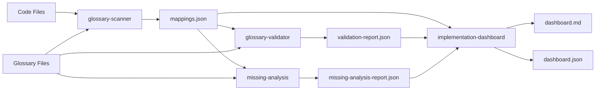

# Glossary Tools

Context-Action 프로젝트의 용어집 매핑 시스템을 위한 분석 및 관리 도구 모음입니다.

## 🎯 목적

이 도구들은 **코드와 용어집 간의 일관성**을 자동으로 검증하고 관리하기 위해 설계되었습니다:

- **코드 스캔**: JSDoc 태그에서 용어집 매핑 정보 추출
- **일관성 검증**: 코드와 용어집 정의 간 불일치 탐지
- **진행 추적**: 구현 현황 및 미구현 항목 분석
- **시각화**: 전체 진행 상황을 대시보드로 제공

## 🔄 워크플로우



### 실행 순서

1. **스캔**: `pnpm glossary:scan` - 코드에서 매핑 추출
2. **검증**: `pnpm glossary:validate` - 매핑 유효성 확인
3. **분석**: `pnpm glossary:missing` - 미구현 항목 찾기
4. **대시보드**: `pnpm glossary:dashboard` - 종합 현황 생성

**통합 실행**: `pnpm glossary:update` (위 4단계 순차 실행)

## 🛠️ 도구 목록

| 도구 | 목적 | 입력 | 출력 | 실행 명령어 |
|------|------|------|------|-------------|
| **glossary-scanner** | 코드 스캔 및 매핑 추출 | 소스 코드 | `mappings.json` | `pnpm glossary:scan` |
| **glossary-validator** | 매핑 유효성 검증 | 매핑 + 용어집 | `validation-report.json` | `pnpm glossary:validate` |
| **missing-analysis** | 미구현 양방향 분석 | 매핑 + 용어집 | `missing-analysis-report.json` | `pnpm glossary:missing` |
| **implementation-dashboard** | 현황 대시보드 생성 | 위 3개 결과 | `dashboard.md/json` | `pnpm glossary:dashboard` |
| **link-validator** | 링크 유효성 검증 | 마크다운 파일 | 콘솔 출력 | 직접 실행 |
| **mapping-generator** | 매핑 템플릿 생성 | 용어집 정의 | 마크다운 템플릿 | 직접 실행 |

## 📁 파일 구조

```
glossary/tools/
├── README.md                    # 이 파일
├── config.js                    # 공통 설정
├── package.json                 # 의존성 관리
├── glossary-scanner.js          # 코드 스캔 도구
├── glossary-validator.js        # 검증 도구
├── missing-analysis.js          # 미구현 분석 도구
├── implementation-dashboard.js  # 대시보드 생성 도구
├── link-validator.js            # 링크 검증 도구
├── mapping-generator.js         # 매핑 생성 도구
└── templates/                   # 템플릿 파일들
    ├── dashboard.md
    └── implementation.md
```

## 📊 출력 데이터

모든 데이터는 `glossary/implementations/_data/` 디렉토리에 저장됩니다:

```
glossary/implementations/_data/
├── mappings.json                # 코드-용어집 매핑 데이터
├── validation-report.json       # 검증 결과
├── missing-analysis-report.json # 미구현 분석 결과
├── dashboard.json              # 대시보드 데이터
└── translation-status.json     # 번역 상태 (docs:translation 도구)
```

## 🔧 설정 및 커스터마이징

### config.js 주요 설정

```javascript
export const config = {
  // 스캔 대상 경로
  scanPaths: [
    'example/src/**/*.{ts,tsx,js,jsx}',
    'packages/*/src/**/*.{ts,tsx,js,jsx}'
  ],
  
  // 용어집 파일 경로
  glossaryPaths: {
    'core-concepts': 'glossary/core-concepts.md',
    'architecture-terms': 'glossary/architecture-terms.md',
    'api-terms': 'glossary/api-terms.md',
    'naming-conventions': 'glossary/naming-conventions.md'
  },
  
  // JSDoc 태그 패턴
  tagPatterns: {
    jsdoc: /@glossary\s+([^\n\r*]+)/g,
    simple: /@glossary:\s*([^\n\r]+)/g,
    category: /@category[:\s]+([^\n\r*]+)/g,
    pattern: /@pattern[:\s]+([^\n\r*]+)/g,
    related: /@related[:\s]+([^\n\r*]+)/g
  }
};
```

### JSDoc 태그 사용법

코드에서 용어집 매핑을 위해 다음 태그들을 사용할 수 있습니다:

```typescript
/**
 * Action handler implementation
 * @glossary action-handler, pipeline-controller
 * @category core-concepts
 * @pattern observer-pattern
 * @related event-emitter, action-dispatcher
 */
export class ActionHandler {
  // implementation
}
```

## 🚀 빠른 시작

### 1. 전체 시스템 업데이트
```bash
# 모든 도구를 순차적으로 실행
pnpm glossary:update
```

### 2. 개별 도구 실행
```bash
# 코드 스캔
pnpm glossary:scan

# 검증 실행
pnpm glossary:validate

# 미구현 분석
pnpm glossary:missing

# 대시보드 생성
pnpm glossary:dashboard
```

### 3. 결과 확인
```bash
# 대시보드 확인
cat glossary/implementations/dashboard.md

# JSON 데이터 확인
ls -la glossary/implementations/_data/
```

## 📈 사용 사례

### 개발 워크플로우 통합

**PR 체크리스트에 포함**:
```markdown
- [ ] `pnpm glossary:update` 실행하여 용어집 일관성 확인
- [ ] 새로운 개념에 대해 JSDoc 태그 추가
- [ ] 대시보드에서 구현 진행률 확인
```

**CI/CD 파이프라인 통합**:
```yaml
- name: Check Glossary Consistency
  run: |
    pnpm glossary:update
    # 검증 실패 시 빌드 중단
    if grep -q "ERROR" glossary/implementations/_data/validation-report.json; then
      exit 1
    fi
```

### 정기 리뷰

**주간 리뷰**:
1. `pnpm glossary:update` 실행
2. `dashboard.md` 검토
3. 미구현 우선순위 논의
4. 용어집 업데이트 계획 수립

**릴리스 전 체크**:
1. 모든 핵심 용어 구현 완료 확인
2. 용어집-코드 일관성 검증
3. 문서 번역 상태 확인 (`pnpm docs:translation`)

## 🔍 트러블슈팅

### 자주 발생하는 문제들

**Q: 패키지 빌드 오류**
```bash
# 해결: glossary 패키지 먼저 빌드
pnpm build:glossary
```

**Q: 매핑 데이터 없음**
```bash
# 해결: 스캔부터 다시 실행
pnpm glossary:scan
```

**Q: 용어집 파일 찾을 수 없음**
```bash
# 해결: config.js의 glossaryPaths 확인
cat glossary/tools/config.js
```

### 디버그 모드

```bash
# 상세 로그 출력
DEBUG=true pnpm glossary:update
```

## 🤝 기여 가이드

### 새로운 도구 추가

1. **`glossary/tools/` 디렉토리에 추가**하되, **단순한 분석 도구**인 경우
2. **`packages/glossary/`에 추가**하되, **재사용 가능한 라이브러리**인 경우

### 도구 수정 시 고려사항

- 기존 데이터 형식 호환성 유지
- 에러 핸들링 및 사용자 친화적 메시지
- 성능 최적화 (대용량 코드베이스 고려)
- CLI 인터페이스 일관성

## 📚 관련 문서

- [시스템 개발 워크플로우](../../system/DEVELOPMENT_WORKFLOW.md)
- [용어집 시스템 가이드](../../system/GLOSSARY_GUIDE.md)
- [용어집 설정 가이드](../../system/GLOSSARY_CONFIGURATION_GUIDE.md)
- [API 문서 생성 시스템](../../system/API_DOCUMENTATION_GENERATION.md)

---

💡 **팁**: 이 도구들은 Context-Action 프로젝트의 코드 품질과 문서 일관성을 유지하는 핵심 인프라입니다. 정기적인 실행을 통해 프로젝트의 개념적 무결성을 보장하세요.