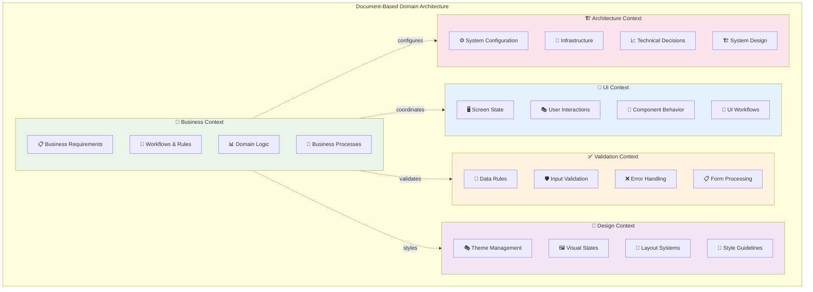
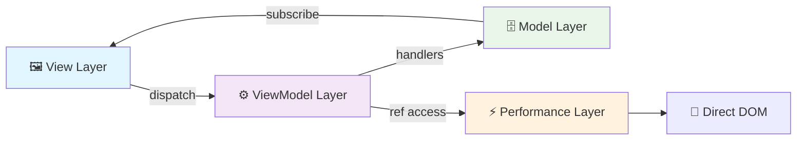

# Combined Documentation: architecture-guide

Generated: 2025-08-28
Pattern: standard
Total References: 9

## Source Document

# Context-Action Store Integration Architecture

## 1. Overview & Core Concepts

### What is Context-Action Architecture?

The Context-Action framework is a **revolutionary state management system** designed to overcome the fundamental limitations of existing libraries through document-centric context separation and effective artifact management.

#### Project Philosophy

The Context-Action framework addresses critical issues in modern state management:

**Problems with Existing Libraries:**
- **High React Coupling**: Tight integration makes component modularization and props handling difficult
- **Binary State Approach**: Simple global/local state dichotomy fails to handle specific scope-based separation  
- **Inadequate Handler/Trigger Management**: Poor support for complex interactions and business logic processing

**Context-Action's Solution:**
- **Document-Artifact Centered Design**: Context separation based on document themes and deliverable management
- **Perfect Separation of Concerns**: 
  - View design in isolation → Design Context
  - Development architecture in isolation → Architecture Context
  - Business logic in isolation → Business Context  
  - Data validation in isolation → Validation Context
- **Clear Boundaries**: Implementation results maintain distinct, well-defined domain boundaries
- **Effective Document-Artifact Management**: State management library that actively supports the relationship between documentation and deliverables

### Architecture Implementation

The framework implements a clean separation of concerns through an MVVM-inspired pattern with **three core patterns** for complete domain isolation:

- **Actions** handle business logic and coordination (ViewModel layer) via `createActionContext`
- **Declarative Store Pattern** manages state with domain isolation (Model layer) via `createStoreContext`
- **RefContext** provides direct DOM manipulation with zero re-renders (Performance layer) via `createRefContext`
- **Components** render UI (View layer)
- **Context Boundaries** isolate functional domains
- **Type-Safe Integration** through domain-specific hooks

### Core Architecture Flow

```
[Component] → dispatch → [Action Pipeline] → handlers → [Store] → subscribe → [Component]
```

### Context Separation Strategy

#### Domain-Based Context Architecture
- **Business Context**: Business logic, data processing, and domain rules (Actions + Stores)
- **UI Context**: Screen state, user interactions, and component behavior (Stores + RefContext)
- **Performance Context**: High-performance DOM manipulation and animations (RefContext)
- **Validation Context**: Data validation, form processing, and error handling (Actions + Stores)
- **Design Context**: Theme management, styling, layout, and visual states (Stores + RefContext)
- **Architecture Context**: System configuration, infrastructure, and technical decisions (Actions + Stores)

#### Document-Based Context Design
Each context is designed to manage its corresponding documentation and deliverables:
- **Design Documentation** → Design Context (themes, component specifications, style guides) → Stores + RefContext
- **Business Requirements** → Business Context (workflows, rules, domain logic) → Actions + Stores
- **Performance Specifications** → Performance Context (animations, interactions) → RefContext
- **Architecture Documents** → Architecture Context (system design, technical decisions) → Actions + Stores
- **Validation Specifications** → Validation Context (rules, schemas, error handling) → Actions + Stores
- **UI Specifications** → UI Context (interactions, state management, user flows) → All three patterns

### Advanced Handler & Trigger Management

Context-Action provides sophisticated handler and trigger management that existing libraries lack:

#### Priority-Based Handler Execution
- **Sequential Processing**: Handlers execute in priority order with proper async handling
- **Domain Isolation**: Each context maintains its own handler registry
- **Cross-Context Coordination**: Controlled communication between domain contexts
- **Result Collection**: Aggregate results from multiple handlers for complex workflows

#### Intelligent Trigger System
- **State-Change Triggers**: Automatic triggers based on store value changes
- **Cross-Context Triggers**: Domain boundaries can trigger actions in other contexts
- **Conditional Triggers**: Smart triggers based on business rules and conditions
- **Trigger Cleanup**: Automatic cleanup prevents memory leaks and stale references

### Key Benefits

1. **Document-Artifact Management**: Direct relationship between documentation and implementation
2. **Domain Isolation**: Each context maintains complete independence
3. **Type Safety**: Full TypeScript support with domain-specific hooks
4. **Performance**: Zero React re-renders with RefContext, selective updates with Stores
5. **Scalability**: Easy to add new domains without affecting existing ones
6. **Team Collaboration**: Different teams can work on different domains without conflicts
7. **Clear Boundaries**: Perfect separation of concerns based on document domains
8. **Hardware Acceleration**: Direct DOM manipulation with `translate3d()` for 60fps performance

## Implementation Documentation

**Note**: Detailed implementation patterns and examples have been moved to the [Patterns section](../guide/patterns/index.md) for better organization.

### Core Patterns
- **[🎯 Action Only Pattern](../guide/patterns/action/basic-usage.md)** - Pure action dispatching without state management
- **[🏪 Store Only Pattern](../guide/patterns/store/basic-usage.md)** - Type-safe state management without actions
- **[🔧 Ref Context Pattern](../guide/patterns/ref/basic-usage.md)** - Direct DOM manipulation with zero re-renders

### Architecture Patterns
- **[Pattern Composition](../guide/patterns/architecture/composition.md)** - Combining patterns for complex applications
- **[Domain Context Architecture](../guide/patterns/architecture/domain-context.md)** - Document-centric context separation
- **[MVVM Architecture](../guide/patterns/architecture/mvvm.md)** - Complete Model-View-ViewModel implementation

### Implementation Guides
- **[Real-time State Access](../guide/patterns/async/real-time-state-access.md)** - Avoiding closure traps in handlers
- **[Provider Composition Setup](../guide/patterns/setup/provider-composition-setup.md)** - Advanced provider composition patterns

## RefContext Performance Architecture

### Zero Re-render Philosophy

The RefContext pattern introduces a **performance-first layer** that bypasses React's rendering cycle entirely for DOM manipulation:

```
[User Interaction] → [Direct DOM Manipulation] → [Hardware Acceleration] → [60fps Updates]
                               ↓
                         [No React Re-renders]
```

#### Core Performance Principles

1. **Direct DOM Access**: Manipulate DOM elements directly without triggering React reconciliation
2. **Hardware Acceleration**: Use `transform3d()` for GPU-accelerated animations
3. **Separation of Concerns**: Visual updates separated from business logic updates
4. **Memory Efficiency**: Automatic cleanup and lifecycle management
5. **Type Safety**: Full TypeScript support for DOM element types

#### Performance Characteristics

RefContext is specifically designed for **high-performance scenarios** requiring direct DOM control:

| Approach | Use Case | React Re-renders | DOM Access |
|----------|----------|------------------|------------|
| **useState** | Standard UI interactions | Triggers reconciliation | React-managed |
| **useRef** | Basic DOM manipulation | Manual control required | Direct reference |
| **RefContext** | **High-performance graphics, animations** | Zero re-renders | Direct manipulation |

**RefContext advantages:**
- **Zero React Re-renders**: Direct DOM manipulation without reconciliation
- **Hardware Acceleration**: Enables GPU-optimized animations

**Primary targets for RefContext:**
- ✅ Canvas animations and Three.js graphics
- ✅ WebGL rendering and game engines
- ✅ High-frequency DOM updates

**Note**: For data management, use **Store contexts** instead of useState for better scalability and type safety.

## Best Practices Summary

### Architecture Design
1. **One domain = One context boundary**
2. **Separate business and UI concerns**
3. **Use document-driven context separation**
4. **Prefer domain isolation, use cross-domain communication when necessary**

### Pattern Selection
5. **Start with Store Only** for simple state management
6. **Add Action Only** when you need side effects or complex workflows
7. **Add RefContext** when you need high-performance DOM manipulation
8. **Compose all patterns** for full-featured applications

### Implementation
9. **Always use domain-specific hooks** for type safety and clarity
10. **Use lazy evaluation** in handlers to avoid stale state
11. **Follow provider composition** patterns for proper nesting
12. **Document domain boundaries** clearly for team collaboration

## Getting Started

For detailed implementation examples and step-by-step guides, see:

- **[Pattern Guide Index](../guide/patterns/index.md)** - Complete pattern documentation
- **[Action Only Pattern](../guide/patterns/action/basic-usage.md)** - Start with pure actions
- **[Store Only Pattern](../guide/patterns/store/basic-usage.md)** - Recommended starting point
- **[Pattern Composition](../guide/patterns/architecture/composition.md)** - Combining patterns

For more information and updates, visit the project repository.

## Referenced Documents

### 1. Patterns section

**Source**: `../guide/patterns/index.md`

# Patterns

This section contains comprehensive code patterns and implementation guides for the Context-Action framework.

## Core Framework Patterns

### Action Patterns
- **[Action Patterns](./action/)** - Pure action dispatching with memory management and performance optimization
  - [Basic Usage](./action/basic-usage.md) - Fundamental Action Only pattern implementation
  - [Register Patterns](./action/register-patterns.md) - Advanced handler registration and memory management
  - [Register Delegation](./action/register-delegation.md) - Advanced pattern for modular handler organization

### Store Patterns  
- **[Store Patterns](./store/)** - Type-safe state management (Recommended)
  - [Basic Usage](./store/basic-usage.md) - Fundamental Store Only pattern with type inference
  - [HOC Pattern](./store/hoc-pattern.md) - Higher-Order Component pattern for automatic Provider wrapping
  - [Advanced Config](./store/advanced-config.md) - Performance optimization and custom comparison strategies

### Ref Patterns
- **[Ref Patterns](./ref/)** - Direct DOM manipulation with zero re-renders and context singleton management
  - [Basic Usage](./ref/basic-usage.md) - Fundamental RefContext pattern with type-safe ref management
  - [Context Singleton Handling](./ref/singleton-handling.md) - Managing context singletons and external resources with lazy evaluation
  - [Multi-Context](./ref/multi-context.md) - Multiple RefContext composition for complex applications
  - [Performance](./ref/performance.md) - Hardware acceleration and performance optimization

### Architecture Patterns
- **[Architecture Patterns](./architecture/)** - System architecture and design patterns
  - [MVVM Pattern](./architecture/mvvm.md) - Model-View-ViewModel architecture with perfect layer separation
  - [Domain Context Pattern](./architecture/domain-context.md) - Document-centric domain separation for multi-domain apps
  - [Composition Strategies](./architecture/composition.md) - Advanced pattern composition for complex applications
  - [Context Splitting Patterns](./architecture/context-splitting.md) - Managing and splitting large contexts for scalability

### Async Patterns
- **[Async Patterns](./async/)** - Asynchronous operation patterns and control flow
  - [Real-time State Access](./async/real-time-state-access.md) - Avoiding closure traps with store.getValue()
  - [Wait-Then-Execute](./async/wait-then-execute.md) - Safe DOM operations after element availability
  - [Conditional Await](./async/conditional-await.md) - Smart waiting based on conditions
  - [Timeout Protection](./async/timeout-protection.md) - Preventing infinite waits with fallback strategies

### Performance Patterns
- **[Performance Patterns](./performance/)** - Performance optimization techniques and strategies
  - [Optimization Techniques](./performance/optimization-techniques.md) - Store optimization, memoization, and RefContext performance
  - Handler memory management and limits (see [Action Register Patterns](./action/register-patterns.md#memory-management-and-handler-limits))

### Debug Patterns
- **[Debug Patterns](./debug/)** - Production debugging and troubleshooting patterns
  - [Production Debugging](./debug/production-debugging.md) - Critical issues, state monitoring, error recovery, and stress testing

## Quick Start Guide

| Pattern | Use Case | Import | Best For |
|---------|----------|--------|----------|
| **🎯 Action Only** | Action dispatching with memory management | `createActionContext` | Event systems, command patterns, large applications |
| **🏪 Store Only** | State management without actions | `createStoreContext` | Pure state management, data layers |
| **🔧 Ref Context** | Direct DOM manipulation and singleton object management | `createRefContext` | High-performance UI, animations, external services |

**Note**: For complex applications, compose patterns together for maximum flexibility and separation of concerns.

## Usage Guidelines

Each pattern includes:
- ✅ **Best practices** with working examples
- ❌ **Common pitfalls** to avoid
- 🎯 **Use cases** for when to apply the pattern
- ⚡ **Performance considerations** and optimization tips

## Architecture Decision Guide

### Single Domain Applications
1. **Simple Apps**: Start with **Store Only Pattern**
2. **Interactive Apps**: Add **Action Only Pattern** for business logic
3. **High-Performance Apps**: Add **RefContext Pattern** for animations
4. **Complex Apps**: Use **MVVM Architecture** for perfect layer separation

### Multi-Domain Applications
1. **Team Boundaries**: Use **Domain Context Architecture** for business separation
2. **Combined Approach**: Apply **MVVM Architecture** within each business domain
3. **Enterprise Scale**: Combine all patterns with proper domain isolation

## Pattern Integration

These patterns can be combined for complex scenarios:
- **Action Only** + **Store Only** for complete business logic separation
- **RefContext** + **Store Only** for high-performance state-driven animations
- **All Three Patterns** + **Domain Architecture** for enterprise applications
- **MVVM Architecture** for perfect architectural layer separation

### 2. 🎯 Action Only Pattern

**Source**: `../guide/patterns/action/basic-usage.md`

# Action Basic Usage

Fundamental Action Only pattern with type-safe dispatching and handler registration.

## Import
```typescript
import { createActionContext } from '@context-action/react';
```

## Features
- ✅ Type-safe action dispatching
- ✅ Action handler registration
- ✅ Abort support
- ✅ Result handling
- ✅ Lightweight (no store overhead)

## Prerequisites

**Required Setup**: Complete the following setup before using this pattern:

1. **Type Definitions** - Define your action interfaces using the standard patterns
2. **Context Creation** - Create typed action contexts with proper hook renaming
3. **Provider Configuration** - Set up action providers in your app structure

For detailed setup instructions, see **[Basic Action Setup](../../setup/basic-action-setup.md)**.

### Required Action Types
This document uses the `EventActions` specification from the setup guide:

```typescript
// From: Basic Action Setup → Common Action Patterns
interface EventActions {
  userClick: { x: number; y: number };
  userHover: { elementId: string };
  analytics: { event: string; data: any };
  trackInteraction: { type: string; metadata?: Record<string, any> };
}
```

### Required Context Setup
This document assumes you have created the Event action context:

```typescript
// From: Basic Action Setup → Single Domain Context
const {
  Provider: EventActionProvider,
  useActionDispatch: useEventAction,              // ← Renamed hook used in examples
  useActionHandler: useEventActionHandler,        // ← Renamed hook used in examples  
  useActionDispatchWithResult: useEventActionWithResult  // ← For advanced features
} = createActionContext<EventActions>('Events');
```

### Required Provider Setup
This document assumes your app is wrapped with the Event action provider:

```typescript
// From: Basic Action Setup → Single Provider Setup
function App() {
  return (
    <EventActionProvider>
      <AppContent />
    </EventActionProvider>
  );
}
```

> **Setup Reference**: [Basic Action Setup Guide](../../setup/basic-action-setup.md#event-actions-ui-interactions)

## Basic Usage
```tsx
// Component implementation using the configured context
function InteractiveComponent() {
  const dispatch = useEventAction();
  
  // Register action handlers (properly memoized)
  const userClickHandler = useCallback((payload, controller) => {
    console.log('User clicked at:', payload.x, payload.y);
    // Pure side effects, no state management
  }, []);

  const analyticsHandler = useCallback(async (payload) => {
    await fetch('/analytics', {
      method: 'POST',
      body: JSON.stringify(payload)
    });
  }, []);
  
  useEventActionHandler('userClick', userClickHandler);
  useEventActionHandler('analytics', analyticsHandler);
  
  const handleClick = (e: MouseEvent) => {
    dispatch('userClick', { x: e.clientX, y: e.clientY });
    dispatch('analytics', { event: 'click', data: { timestamp: Date.now() } });
  };
  
  return <button onClick={handleClick}>Click Me</button>;
}
```

## Advanced Features
```tsx
// Using the pre-configured context from Prerequisites setup
function AdvancedComponent() {
  const { 
    dispatch, 
    dispatchWithResult, 
    abortAll 
  } = useEventActionWithResult();
  
  const handleAsyncAction = async () => {
    try {
      const result = await dispatchWithResult('analytics', {
        event: 'complex-operation',
        data: { userId: 123 }
      });
      console.log('Action result:', result);
    } catch (error) {
      console.error('Action failed:', error);
    }
  };
  
  const handleAbortAll = () => {
    abortAll(); // Abort all pending actions
  };
  
  return (
    <div>
      <button onClick={handleAsyncAction}>Async Action</button>
      <button onClick={handleAbortAll}>Abort All</button>
    </div>
  );
}
```

## Available Hooks

### From Prerequisites Setup
- `useEventAction()` - Basic action dispatcher (renamed from useActionDispatch)
- `useEventActionHandler()` - Register action handlers (renamed from useActionHandler)  
- `useEventActionWithResult()` - Advanced dispatcher with results/abort (renamed from useActionDispatchWithResult)

### Generic Pattern (before renaming)
- `useActionDispatch()` - Basic action dispatcher
- `useActionHandler(action, handler, config?)` - Register action handlers
- `useActionDispatchWithResult()` - Advanced dispatcher with results/abort
- `useActionRegister()` - Access raw ActionRegister for delegation
- `useActionContext()` - Access raw context

## Real-World Examples

### Live Examples in Codebase
- **[Todo List Demo](https://github.com/mineclover/context-action/blob/main/example/src/pages/demos/store-scenarios/components/TodoListDemo.tsx)** - UI Actions for form interactions
- **[Chat Demo](https://github.com/mineclover/context-action/blob/main/example/src/pages/demos/store-scenarios/components/ChatDemo.tsx)** - Real-time message handling
- **[User Profile Demo](https://github.com/mineclover/context-action/blob/main/example/src/pages/demos/store-scenarios/components/UserProfileDemo.tsx)** - User action management
- **[Mouse Events Page](https://github.com/mineclover/context-action/blob/main/example/src/pages/actionguard/MouseEventsPage.tsx)** - High-frequency event handling
- **[Search Page](https://github.com/mineclover/context-action/blob/main/example/src/pages/actionguard/SearchPage.tsx)** - Abortable search actions
- **[API Blocking Page](https://github.com/mineclover/context-action/blob/main/example/src/pages/actionguard/ApiBlockingPage.tsx)** - Blocking action patterns

## Error Handling Best Practices

### Centralized Error Handling

```tsx
// ✅ CORRECT: Use framework's centralized error handling
function ErrorHandlingComponent() {
  const dispatch = useEventAction();
  
  // Error-prone handler with proper error handling
  const riskyOperationHandler = useCallback(async (payload, controller) => {
    try {
      // Perform risky operation
      const result = await performRiskyAPICall(payload);
      
      // Success case
      console.log('Operation successful:', result);
      
    } catch (error) {
      // Framework provides centralized error handling
      // No need for manual console.error - it's handled automatically
      
      // Use controller to abort with context
      controller.abort('Risky operation failed', error);
    }
  }, []);

  // Event handler with error prevention  
  const safeEventHandler = useCallback(async (payload, controller) => {
    // Never store DOM events or React synthetic events
    const { clientX, clientY, timestamp } = payload;
    
    // Extract only needed data, never store the event object itself
    const eventData = {
      position: { x: clientX, y: clientY },
      timestamp,
      action: 'user-interaction'
    };
    
    // Safe to process extracted data
    await processEventData(eventData);
  }, []);
  
  useEventActionHandler('riskyOperation', riskyOperationHandler);
  useEventActionHandler('safeEvent', safeEventHandler);
  
  const handleClick = (event: MouseEvent) => {
    // Extract event data before dispatching
    dispatch('safeEvent', {
      clientX: event.clientX,
      clientY: event.clientY,
      timestamp: Date.now()
      // Don't pass the event object itself!
    });
  };
  
  return <button onClick={handleClick}>Safe Click Handler</button>;
}
```

### Async Error Recovery

```tsx
// ✅ CORRECT: Robust async error handling with retry logic
function AsyncErrorRecoveryComponent() {
  const dispatch = useEventAction();
  
  const retryableOperationHandler = useCallback(async (payload, controller) => {
    const maxRetries = 3;
    let attempt = 0;
    
    while (attempt < maxRetries) {
      try {
        const result = await performAsyncOperation(payload);
        
        // Success - break retry loop
        console.log(`Operation succeeded on attempt ${attempt + 1}`);
        return result;
        
      } catch (error) {
        attempt++;
        
        if (attempt >= maxRetries) {
          // Final failure - let framework handle error centrally
          controller.abort(`Operation failed after ${maxRetries} attempts`, error);
          return;
        }
        
        // Wait before retry
        await new Promise(resolve => setTimeout(resolve, 1000 * attempt));
        console.log(`Retrying operation, attempt ${attempt + 1}/${maxRetries}`);
      }
    }
  }, []);
  
  useEventActionHandler('retryableOperation', retryableOperationHandler);
  
  return (
    <button onClick={() => dispatch('retryableOperation', { data: 'test' })}>
      Retry Operation
    </button>
  );
}
```

## Best Practices

### ✅ Best Practices
1. **Always Use useCallback**: Wrap all handler functions with `useCallback` to prevent infinite re-registration
2. **Handle Side Effects**: Perfect for analytics, logging, API calls
3. **Keep Lightweight**: No state management overhead
4. **Centralized Error Handling**: Let framework handle errors automatically instead of manual console.error
5. **Event Data Extraction**: Extract needed data from DOM events, never store event objects
6. **Async Error Recovery**: Implement retry logic with proper error boundaries
7. **Controller Usage**: Use controller.abort() for error cases with context

### ❌ Avoid
- Storing DOM events or React synthetic events in state or dispatching them
- Using direct console.error instead of letting framework handle errors centrally
- Blocking the main thread with heavy computations in handlers
- Missing cleanup for async operations or timers

> **Important**: For detailed handler registration patterns, see the [Handler Registration Guide](../../conventions.md#handler-registration)

### 3. 🏪 Store Only Pattern

**Source**: `../guide/patterns/store/basic-usage.md`

# Store Basic Usage

Fundamental Store Only pattern with excellent type inference and simplified API.

## Import
```typescript
import { useStoreValue } from '@context-action/react';
import { useUserStore, useUserStoreManager } from '../setup/stores'; // From setup guide
```

## Key Features
- ✅ Excellent type inference without manual type annotations
- ✅ Simplified API focused on store management
- ✅ Direct value or configuration object support
- ✅ No need for separate `createStore` calls

## Prerequisites

For complete setup instructions including store definitions, context creation, and provider configuration, see **[Basic Store Setup](../setup/basic-store-setup.md)**.

This document demonstrates usage patterns using the store setup:
- Store definitions → [Type Inference Configurations](../setup/basic-store-setup.md#type-inference-configurations)
- Context creation → [Single Domain Store Context](../setup/basic-store-setup.md#single-domain-store-context)
- Provider setup → [Single Provider Setup](../setup/basic-store-setup.md#single-provider-setup)

## Usage Patterns

### Basic Store Access Pattern
```tsx
// Component implementation using configured stores from setup guide
function UserProfile() {
  const profileStore = useUserStore('profile');
  const preferencesStore = useUserStore('preferences');
  
  const profile = useStoreValue(profileStore);
  const preferences = useStoreValue(preferencesStore);
  
  const updateProfile = () => {
    profileStore.setValue({ id: '1', name: 'John', email: 'john@example.com', role: 'user' });
  };
  
  const toggleTheme = () => {
    preferencesStore.update(prefs => ({
      ...prefs,
      theme: prefs.theme === 'light' ? 'dark' : 'light'
    }));
  };
  
  return (
    <div data-theme={preferences.theme}>
      <h2>{profile.name || 'Guest'}</h2>
      <p>Theme: {preferences.theme}</p>
      <button onClick={updateProfile}>Update Profile</button>
      <button onClick={toggleTheme}>Toggle Theme</button>
    </div>
  );
}
```

### Explicit Generic Types Pattern
```tsx
// Using UserStores interface from setup guide for type validation
import type { UserStores } from '../setup/basic-store-setup';

// Create stores with explicit type control using UserStores specification
const {
  Provider: UserStoreProvider,
  useStore: useUserStore,
  useStoreManager: useUserStoreManager
} = createStoreContext<UserStores>('User', {
  // Types validated against UserStores interface
  profile: {
    initialValue: { id: '', name: '', email: '', role: 'guest' },
    strategy: 'shallow'
  },
  preferences: {
    initialValue: { theme: 'light', language: 'en', notifications: true },
    strategy: 'shallow'
  },
  session: {
    initialValue: { isAuthenticated: false, permissions: [], lastActivity: 0 },
    strategy: 'shallow'
  }
});
```

## Provider Setup

```tsx
// Using UserStoreProvider from setup guide
import { UserStoreProvider } from '../setup/stores';

function App() {
  return (
    <UserStoreProvider>
      <UserProfile />
      <Settings />
    </UserStoreProvider>
  );
}
```

## Component Usage

```tsx
function UserProfile() {
  // Perfect type inference - no manual type annotations needed!
  // Using renamed hooks from setup guide
  const profileStore = useUserStore('profile');      // Store<UserProfile>
  const preferencesStore = useUserStore('preferences'); // Store<UserPreferences>
  const sessionStore = useUserStore('session');      // Store<UserSession>
  
  // Subscribe to values
  const profile = useStoreValue(profileStore);
  const preferences = useStoreValue(preferencesStore);
  const session = useStoreValue(sessionStore);
  
  const updateProfile = () => {
    profileStore.setValue({
      ...profile,
      name: 'John Doe',
      email: 'john@example.com'
    });
  };
  
  const toggleTheme = () => {
    preferencesStore.setValue({
      ...preferences,
      theme: preferences.theme === 'light' ? 'dark' : 'light'
    });
  };
  
  const logout = () => {
    sessionStore.setValue({
      isAuthenticated: false,
      permissions: [],
      lastActivity: Date.now()
    });
  };
  
  return (
    <div data-theme={preferences.theme}>
      <div>User: {profile.name} ({profile.email})</div>
      <div>Role: {profile.role}</div>
      <div>Theme: {preferences.theme}</div>
      <div>Language: {preferences.language}</div>
      <div>Authenticated: {session.isAuthenticated ? 'Yes' : 'No'}</div>
      
      <button onClick={updateProfile}>Update Profile</button>
      <button onClick={toggleTheme}>Toggle Theme</button>
      <button onClick={logout}>Logout</button>
    </div>
  );
}
```

## Available Hooks
- `useUserStore(name)` - Get typed user domain store by name (primary API)
- `useUserStoreManager()` - Access user store manager (advanced use)
- `useStoreInfo()` - Get registry information (from setup context)
- `useStoreClear()` - Clear all stores (from setup context)

## Real-World Examples

### Live Examples in Codebase
- **[Todo List Demo](https://github.com/mineclover/context-action/blob/main/example/src/pages/demos/store-scenarios/components/TodoListDemo.tsx)** - Complete CRUD with filtering and sorting
- **[Chat Demo](https://github.com/mineclover/context-action/blob/main/example/src/pages/demos/store-scenarios/components/ChatDemo.tsx)** - Real-time message state management
- **[User Profile Demo](https://github.com/mineclover/context-action/blob/main/example/src/pages/demos/store-scenarios/components/UserProfileDemo.tsx)** - Profile data management
- **[Store Basics Page](https://github.com/mineclover/context-action/blob/main/example/src/pages/store/StoreBasicsPage.tsx)** - Basic store operations
- **[React Provider Page](https://github.com/mineclover/context-action/blob/main/example/src/pages/react/ReactProviderPage.tsx)** - Provider composition patterns
- **[Store Scenarios Index](https://github.com/mineclover/context-action/blob/main/example/src/pages/demos/store-scenarios/stores/index.ts)** - Central store configuration

## Best Practices

1. **Use Type Inference**: Let TypeScript infer types automatically
2. **Direct Values**: Use direct values for simple types
3. **Configuration Objects**: Use configuration objects for complex types
4. **Domain Naming**: Use descriptive domain names for contexts
5. **Subscription Management**: Only subscribe to stores you actually need to prevent unnecessary re-renders

```typescript
// ✅ Good - Functional update pattern with renamed hooks
const updateProfile = useCallback(() => {
  const profileStore = useUserStore('profile');
  profileStore.update(prev => ({
    ...prev,
    name: 'Updated Name',
    email: 'updated@example.com'
  }));
}, []);

// ✅ Good - Only subscribe to needed stores using renamed hooks
const profileName = useStoreValue(useUserStore('profile')).name; // Only subscribes to profile changes
const currentTheme = useStoreValue(useUserStore('preferences')).theme; // Only theme updates
// Don't subscribe to all stores if you only need specific values
```

### 4. 🔧 Ref Context Pattern

**Source**: `../guide/patterns/ref/basic-usage.md`

# Ref Basic Usage

Fundamental RefContext pattern with type-safe ref management and zero re-renders.

## Import
```typescript
import { createRefContext } from '@context-action/react';
```

## Features
- ✅ Zero React re-renders for DOM manipulation
- ✅ Hardware-accelerated transforms
- ✅ Type-safe ref management
- ✅ Automatic lifecycle management
- ✅ Perfect separation of concerns
- ✅ Memory efficient with automatic cleanup

## Prerequisites

**Required Reading**: **[RefContext Setup Guide](../setup/ref-context-setup.md)**

This document demonstrates usage patterns using standardized setup patterns:
- **Type definitions** → [DOM Element Refs](../setup/ref-context-setup.md#dom-element-refs)
- **Context creation** → [Basic RefContext Setup](../setup/ref-context-setup.md#basic-refcontext-setup)
- **Provider setup** → [Single RefContext Provider](../setup/ref-context-setup.md#single-refcontext-provider)
- **Initialization patterns** → [Lazy Initialization](../setup/ref-context-setup.md#lazy-initialization)

## Setup Pattern

### Basic Setup

```typescript
import { createRefContext } from '@context-action/react';

// Using the UIRefs pattern from setup guide
const {
  Provider: UIRefProvider,
  useRefHandler: useUIRef,
  useWaitForRefs
} = createRefContext<UIRefs>('UI');
```

### Provider Integration

```typescript
function App() {
  return (
    <UIRefProvider>
      <YourComponents />
    </UIRefProvider>
  );
}
```

### Ref Registration

```typescript
function MyComponent() {
  const modalRef = useUIRef('modal');
  const dropdownRef = useUIRef('dropdown');
  
  return <div ref={modalRef.setRef}>Modal Element</div>;
}
```

## Basic Usage Example

```tsx
// 1. Import UIRefs from setup guide
import { createRefContext } from '@context-action/react';

// UIRefs from setup specification
interface UIRefs {
  modal: HTMLDialogElement;
  dropdown: HTMLDivElement;
  tooltip: HTMLSpanElement;
  sidebar: HTMLElement;
}

// 2. Create RefContext with renaming pattern
const {
  Provider: UIRefProvider,
  useRefHandler: useUIRef
} = createRefContext<UIRefs>('UI');

// 3. Provider setup
function App() {
  return (
    <UIRefProvider>
      <InteractiveUI />
    </UIRefProvider>
  );
}

// 4. Component with direct DOM manipulation
function InteractiveUI() {
  const modal = useUIRef('modal');
  const dropdown = useUIRef('dropdown');
  const tooltip = useUIRef('tooltip');
  
  // Direct DOM manipulation - zero React re-renders!
  const handleMouseMove = useCallback((e: React.MouseEvent) => {
    if (!tooltip.target) return;
    
    const x = e.clientX;
    const y = e.clientY;
    
    // Hardware accelerated transforms
    tooltip.target.style.transform = `translate3d(${x + 10}px, ${y - 10}px, 0)`;
    tooltip.target.style.opacity = '1';
  }, [tooltip]);
  
  const handleMouseLeave = useCallback(() => {
    if (!tooltip.target) return;
    tooltip.target.style.opacity = '0';
  }, [tooltip]);
  
  const toggleDropdown = useCallback(() => {
    if (!dropdown.target) return;
    
    // Direct DOM manipulation without re-renders
    const isOpen = dropdown.target.classList.contains('open');
    if (isOpen) {
      dropdown.target.style.transform = 'translateY(-10px)';
      dropdown.target.style.opacity = '0';
      setTimeout(() => dropdown.target?.classList.remove('open'), 150);
    } else {
      dropdown.target.classList.add('open');
      dropdown.target.style.transform = 'translateY(0)';
      dropdown.target.style.opacity = '1';
    }
  }, [dropdown]);
  
  return (
    <div
      onMouseMove={handleMouseMove}
      onMouseLeave={handleMouseLeave}
      className="relative w-full h-96 bg-gray-100 p-4"
    >
      <button
        onClick={toggleDropdown}
        className="px-4 py-2 bg-blue-500 text-white rounded hover:bg-blue-600"
      >
        Toggle Dropdown
      </button>
      
      <div
        ref={dropdown.setRef}
        className="absolute top-12 left-0 bg-white shadow-lg rounded-md p-4 opacity-0 transform -translate-y-2 transition-all duration-150"
        style={{ transform: 'translateY(-10px)', opacity: 0 }}
      >
        <div className="space-y-2">
          <div className="px-3 py-2 hover:bg-gray-100 cursor-pointer">Option 1</div>
          <div className="px-3 py-2 hover:bg-gray-100 cursor-pointer">Option 2</div>
          <div className="px-3 py-2 hover:bg-gray-100 cursor-pointer">Option 3</div>
        </div>
      </div>
      
      <span
        ref={tooltip.setRef}
        className="fixed bg-black text-white px-2 py-1 rounded text-sm pointer-events-none opacity-0 transition-opacity z-50"
        style={{ transform: 'translate3d(0, 0, 0)' }}
      >
        Interactive Tooltip
      </span>
    </div>
  );
}
```

## Custom Hooks Pattern

```tsx
// Custom hook for UI interaction business logic
function useUIInteractionManager() {
  const modal = useUIRef('modal');
  const tooltip = useUIRef('tooltip');
  const sidebar = useUIRef('sidebar');
  const interactionHistory = useRef<Array<{type: string, timestamp: number}>>([]);
  
  const showModal = useCallback((content: string) => {
    if (!modal.target) return;
    
    // Direct DOM manipulation without re-renders
    modal.target.innerHTML = content;
    modal.target.style.transform = 'scale(0.9)';
    modal.target.style.opacity = '0';
    modal.target.showModal();
    
    // Animate in
    setTimeout(() => {
      if (modal.target) {
        modal.target.style.transform = 'scale(1)';
        modal.target.style.opacity = '1';
        modal.target.style.transition = 'all 0.3s ease-out';
      }
    }, 10);
    
    // Track interaction
    interactionHistory.current.push({ type: 'modal_opened', timestamp: Date.now() });
  }, [modal]);
  
  const hideModal = useCallback(() => {
    if (!modal.target) return;
    
    modal.target.style.transform = 'scale(0.9)';
    modal.target.style.opacity = '0';
    
    setTimeout(() => {
      modal.target?.close();
    }, 300);
    
    interactionHistory.current.push({ type: 'modal_closed', timestamp: Date.now() });
  }, [modal]);
  
  const updateTooltip = useCallback((text: string, x: number, y: number) => {
    if (!tooltip.target) return;
    
    tooltip.target.textContent = text;
    tooltip.target.style.transform = `translate3d(${x + 10}px, ${y - 10}px, 0)`;
    tooltip.target.style.opacity = '1';
  }, [tooltip]);
  
  const toggleSidebar = useCallback((isOpen: boolean) => {
    if (!sidebar.target) return;
    
    sidebar.target.style.transform = isOpen 
      ? 'translateX(0)' 
      : 'translateX(-100%)';
    sidebar.target.style.transition = 'transform 0.3s ease-in-out';
    
    interactionHistory.current.push({ 
      type: isOpen ? 'sidebar_opened' : 'sidebar_closed', 
      timestamp: Date.now() 
    });
  }, [sidebar]);
  
  const getInteractionStats = useCallback(() => {
    const recent = interactionHistory.current.filter(
      interaction => Date.now() - interaction.timestamp < 60000 // Last minute
    );
    return {
      total: interactionHistory.current.length,
      recent: recent.length,
      types: [...new Set(recent.map(i => i.type))]
    };
  }, []);
  
  return { 
    showModal, 
    hideModal, 
    updateTooltip, 
    toggleSidebar, 
    getInteractionStats 
  };
}

// Usage in component
function AdvancedUIManager() {
  const { showModal, hideModal, updateTooltip, toggleSidebar, getInteractionStats } = useUIInteractionManager();
  const [sidebarOpen, setSidebarOpen] = useState(false);
  
  const handleShowModal = useCallback(() => {
    showModal('<h2>Dynamic Content</h2><p>This modal was populated without React re-renders!</p>');
  }, [showModal]);
  
  const handleToggleSidebar = useCallback(() => {
    const newState = !sidebarOpen;
    setSidebarOpen(newState);
    toggleSidebar(newState);
  }, [sidebarOpen, toggleSidebar]);
  
  const handleMouseMove = useCallback((e: React.MouseEvent) => {
    updateTooltip('Hover tooltip updated via direct DOM manipulation', e.clientX, e.clientY);
  }, [updateTooltip]);
  
  useEffect(() => {
    const interval = setInterval(() => {
      const stats = getInteractionStats();
      console.log('UI Interaction Stats:', stats);
    }, 5000);
    
    return () => clearInterval(interval);
  }, [getInteractionStats]);
  
  return (
    <div 
      onMouseMove={handleMouseMove}
      className="w-full h-96 bg-gradient-to-br from-blue-50 to-purple-50 p-4"
    >
      <div className="space-x-4">
        <button 
          onClick={handleShowModal}
          className="px-4 py-2 bg-green-500 text-white rounded hover:bg-green-600"
        >
          Show Modal
        </button>
        <button 
          onClick={handleToggleSidebar}
          className="px-4 py-2 bg-purple-500 text-white rounded hover:bg-purple-600"
        >
          Toggle Sidebar
        </button>
      </div>
    </div>
  );
}
```

## Available Hooks
- `useRefHandler(name)` - Get typed ref handler by name
- `useWaitForRefs()` - Wait for multiple refs to mount
- `useGetAllRefs()` - Access all mounted refs
- `refHandler.setRef` - Set ref callback
- `refHandler.target` - Access current ref value
- `refHandler.isMounted` - Check mount status
- `refHandler.waitForMount()` - Async ref waiting
- `refHandler.withTarget()` - Safe operations

## Real-World Examples

### Live Examples in Codebase
- **[RefContext Mouse Events Page](https://github.com/mineclover/context-action/blob/main/example/src/pages/mouse-events/ref-context/RefContextMouseEventsPage.tsx)** - Complete mouse tracking with RefContext
- **[Canvas Demo](https://github.com/mineclover/context-action/blob/main/example/src/pages/refs/CanvasRefDemoPage.tsx)** - Canvas drawing with direct DOM manipulation
- **[Form Builder Demo](https://github.com/mineclover/context-action/blob/main/example/src/pages/refs/FormBuilderRefDemoPage.tsx)** - Dynamic form builder with refs
- **[Element Management Page](https://github.com/mineclover/context-action/blob/main/example/src/pages/examples/ElementManagementPage.tsx)** - Complex element management
- **[Visual Effects Context](https://github.com/mineclover/context-action/blob/main/example/src/pages/mouse-events/ref-context/contexts/VisualEffectsRefContext.tsx)** - Visual effects with RefContext
- **[Performance Context](https://github.com/mineclover/context-action/blob/main/example/src/pages/mouse-events/ref-context/contexts/PerformanceRefContext.tsx)** - Performance monitoring with refs

## Best Practices

1. **Hardware Acceleration**: Use `translate3d()` for GPU-accelerated animations
2. **Avoid React Re-renders**: Keep DOM manipulation outside React's render cycle
3. **Separation of Concerns**: Use custom hooks for business logic
4. **Type Safety**: Define clear ref type interfaces with proper HTML element types
5. **Performance First**: Prioritize 60fps performance over convenience

### 5. Pattern Composition

**Source**: `../guide/patterns/architecture/composition.md`

# Pattern Composition Strategies

Advanced pattern composition techniques for building complex, scalable applications with the Context-Action framework.

## Prerequisites

Before implementing composition strategies, ensure you have completed the foundational setup:

- **[Multi-Context Setup](../setup/multi-context-setup.md)** - Complete MVVM and Domain Context architecture setup patterns
- **[Provider Composition Setup](../setup/provider-composition-setup.md)** - Advanced provider composition utilities and patterns
- **[Basic Action Setup](../setup/basic-action-setup.md)** - Single action context patterns  
- **[Basic Store Setup](../setup/basic-store-setup.md)** - Single store context patterns

These setup guides provide the context definitions, provider configurations, and composition utilities used throughout this document.

## Composition Overview

Pattern composition allows you to combine different architectural approaches based on your application's specific needs:

- **Single Domain Composition**: Action + Store + Ref patterns within one domain
- **Multi-Domain Composition**: Domain contexts with layered patterns
- **Enterprise Composition**: Combined MVVM and Domain architectures
- **Hybrid Composition**: Mixed approaches for different application areas

## Composition Strategies

### Strategy 1: Single Domain Composition

Perfect for complex single-domain applications requiring all three core patterns.

```typescript
// Complete single domain setup using Multi-Context Setup patterns
// Reference: multi-context-setup.md - UserModelProvider, UserViewModelProvider, UserPerformanceProvider

import { 
  UserModelProvider,
  UserViewModelProvider as UserActionProvider,
  UserPerformanceProvider
} from '../setup/contexts/UserDomain';

function SingleDomainApp() {
  return (
    {/* State Management Layer - from Multi-Context Setup */}
    <UserModelProvider>
      
      {/* Business Logic Layer - from Multi-Context Setup */}
      <UserActionProvider>
        
        {/* Performance Layer - from Multi-Context Setup */}
        <UserPerformanceProvider>
          
          {/* Application Components */}
          <UserDashboard />
          <UserProfile />
          <UserSettings />
          
        </UserPerformanceProvider>
      </UserActionProvider>
    </UserModelProvider>
  );
}
```

**Use Cases:**
- E-commerce product management
- Financial dashboard applications
- Content management systems
- Gaming applications

### Strategy 2: Multi-Domain Composition

Ideal for applications with distinct business domains, each requiring different pattern combinations.

```typescript
// Multi-domain with selective pattern usage
// Reference: multi-context-setup.md - Domain-specific provider patterns

import {
  UserModelProvider,
  UserViewModelProvider as UserActionProvider,
  UserPerformanceProvider,
  ProductModelProvider,
  ProductViewModelProvider as ProductActionProvider,
  // Order domain uses Store Only Pattern - reference: basic-store-setup.md
  OrderModelProvider,
  // Analytics uses Action Only Pattern - reference: basic-action-setup.md
  AnalyticsActionProvider
} from '../setup/contexts';

function MultiDomainApp() {
  return (
    {/* User Domain - Full MVVM from Multi-Context Setup */}
    <UserModelProvider>
      <UserActionProvider>
        <UserPerformanceProvider>
          
          {/* Product Domain - Store + Action from Multi-Context Setup */}
          <ProductModelProvider>
            <ProductActionProvider>
              
              {/* Order Domain - Store Only Pattern */}
              <OrderModelProvider>
                
                {/* Analytics Domain - Action Only Pattern */}
                <AnalyticsActionProvider>
                  
                  <ECommerceApp />
                  
                </AnalyticsActionProvider>
              </OrderModelProvider>
            </ProductActionProvider>
          </ProductModelProvider>
        </UserPerformanceProvider>
      </UserActionProvider>
    </UserModelProvider>
  );
}
```

**Domain-Specific Pattern Selection:**

| Domain | Patterns Used | Rationale |
|--------|---------------|-----------|
| User | Store + Action + Ref | Complex interactions, animations needed |
| Product | Store + Action | Business logic with data management |
| Order | Store Only | Simple data management, no complex logic |
| Analytics | Action Only | Event tracking, no persistent state |

### Strategy 3: Enterprise Composition

Large-scale applications combining MVVM layers with Domain contexts.

```typescript
// Enterprise-scale composition using Domain Context Architecture Setup
// Reference: multi-context-setup.md - Domain Context Architecture Setup

import {
  // Business Domain from Domain Context Architecture Setup
  BusinessModelProvider,
  BusinessViewModelProvider as BusinessActionProvider,
  // UI Domain from MVVM Architecture Setup
  UIModelProvider,
  UIViewModelProvider as UIActionProvider,
  UserPerformanceProvider as UIPerformanceProvider,
  // Validation Domain from Domain Context Architecture Setup
  ValidationModelProvider,
  ValidationViewModelProvider as ValidationActionProvider,
  // Design System Context from Domain Context Architecture Setup
  DesignModelProvider
} from '../setup/contexts';

function EnterpriseApp() {
  return (
    {/* Business Domain MVVM - from Domain Context Architecture Setup */}
    <BusinessModelProvider>
      <BusinessActionProvider>
        <BusinessPerformanceProvider>
          
          {/* UI Domain MVVM - from MVVM Architecture Setup */}
          <UIModelProvider>
            <UIActionProvider>
              <UIPerformanceProvider>
                
                {/* Validation Domain - from Domain Context Architecture Setup */}
                <ValidationModelProvider>
                  <ValidationActionProvider>
                    
                    {/* Design Domain - from Design System Context Setup */}
                    <DesignModelProvider>
                      
                      <EnterpriseApplication />
                      
                    </DesignModelProvider>
                  </ValidationActionProvider>
                </ValidationModelProvider>
              </UIPerformanceProvider>
            </UIActionProvider>
          </UIModelProvider>
        </BusinessPerformanceProvider>
      </BusinessActionProvider>
    </BusinessModelProvider>
  );
}
```

### Strategy 4: Hybrid Composition

Different areas of the application use different architectural approaches.

```typescript
// Hybrid approach with area-specific patterns
function HybridApp() {
  return (
    <AppRouter>
      {/* Admin Area - Full MVVM */}
      <Route path="/admin/*">
        <AdminModelProvider>
          <AdminActionProvider>
            <AdminPerformanceProvider>
              <AdminDashboard />
            </AdminPerformanceProvider>
          </AdminActionProvider>
        </AdminModelProvider>
      </Route>
      
      {/* Customer Area - Domain Context */}
      <Route path="/customer/*">
        <CustomerBusinessProvider>
          <CustomerUIProvider>
            <CustomerValidationProvider>
              <CustomerPortal />
            </CustomerValidationProvider>
          </CustomerUIProvider>
        </CustomerBusinessProvider>
      </Route>
      
      {/* Public Area - Simple Store Only */}
      <Route path="/public/*">
        <PublicModelProvider>
          <PublicWebsite />
        </PublicModelProvider>
      </Route>
    </AppRouter>
  );
}
```

## Advanced Composition Patterns

### Cross-Domain Integration

```typescript
// Integration layer for cross-domain communication
// Reference: multi-context-setup.md - Cross-Context Communication Setup

import {
  useBusinessStoreManager,
  useUIStoreManager,
  useValidationStoreManager,
  useBusinessActionHandler,
  useContextBridge  // Cross-context communication utility
} from '../setup/contexts';

export function useIntegrationLayer() {
  // Using Context Bridge pattern from Multi-Context Setup
  const contextBridge = useContextBridge();
  
  // Alternative: Direct manager access
  const businessManager = useBusinessStoreManager();
  const uiManager = useUIStoreManager();
  const validationManager = useValidationStoreManager();
  
  const integratedWorkflow = useCallback(async (payload, controller) => {
    // Coordinate across multiple domains using Context Bridge
    const validationResult = await contextBridge.validation.actions('validateAcrossDomains', payload);
    const businessResult = await contextBridge.business.actions('processBusinessLogic', payload);
    const uiUpdate = await contextBridge.ui.actions('updateUserInterface', businessResult);
    
    return { validationResult, businessResult, uiUpdate };
  }, [contextBridge, businessManager, uiManager, validationManager]);
  
  // Register in appropriate action context
  useBusinessActionHandler('integratedWorkflow', integratedWorkflow);
}
```

### Selective Provider Usage

```typescript
// Conditional provider composition based on features
// Reference: multi-context-setup.md - Conditional Multi-Context Setup

import {
  ValidationModelProvider,
  ValidationViewModelProvider as ValidationActionProvider,
  UserPerformanceProvider as PerformanceProvider,
  EventBusProvider as IntegrationActionProvider  // from Cross-Context Communication Setup
} from '../setup/contexts';

interface AppConfig {
  enablePerformanceOptimizations: boolean;
  enableAdvancedValidation: boolean;
  enableCrossDomainFeatures: boolean;
}

// Following Enterprise Configuration pattern from Multi-Context Setup
function ConfigurableApp({ config }: { config: AppConfig }) {
  let app = <CoreApp />;
  
  // Wrap with performance layer if enabled - from Multi-Context Setup RefContext patterns
  if (config.enablePerformanceOptimizations) {
    app = (
      <PerformanceProvider>
        {app}
      </PerformanceProvider>
    );
  }
  
  // Add validation layer if enabled - from Domain Context Architecture Setup
  if (config.enableAdvancedValidation) {
    app = (
      <ValidationModelProvider>
        <ValidationActionProvider>
          {app}
        </ValidationActionProvider>
      </ValidationModelProvider>
    );
  }
  
  // Add cross-domain features if enabled - from Cross-Context Communication Setup
  if (config.enableCrossDomainFeatures) {
    app = (
      <IntegrationActionProvider>
        {app}
      </IntegrationActionProvider>
    );
  }
  
  return app;
}
```

### Dynamic Composition

```typescript
// Runtime composition based on user roles or features
// Reference: provider-composition-setup.md - Dynamic Provider Composition

import { composeProviders } from '@context-action/react';  // from Provider Composition Setup
import {
  UIModelProvider as CoreModelProvider,
  UIViewModelProvider as CoreActionProvider,
  // Admin providers would be defined in Multi-Context Setup
  AdminModelProvider,
  AdminActionProvider,
  UserPerformanceProvider as PerformanceProvider,
  ValidationModelProvider,
  ValidationViewModelProvider as ValidationActionProvider
} from '../setup/contexts';

function DynamicApp({ userRole, features }: { 
  userRole: 'admin' | 'user' | 'guest';
  features: string[];
}) {
  const providers: React.ComponentType<any>[] = [];
  
  // Base providers for all users - from Multi-Context Setup
  providers.push(CoreModelProvider, CoreActionProvider);
  
  // Add admin-specific providers - from Multi-Context Setup Enterprise Config
  if (userRole === 'admin') {
    providers.push(AdminModelProvider, AdminActionProvider);
  }
  
  // Add performance providers for specific features - from Multi-Context Setup Performance Layer
  if (features.includes('animations')) {
    providers.push(PerformanceProvider);
  }
  
  // Add validation providers for forms - from Domain Context Architecture Setup
  if (features.includes('forms')) {
    providers.push(ValidationModelProvider, ValidationActionProvider);
  }
  
  // Use composeProviders utility from Provider Composition Setup
  const DynamicProviders = composeProviders(providers);
  
  return (
    <DynamicProviders>
      <AppContent />
    </DynamicProviders>
  );
}
```

## Composition Guidelines

### ✅ Best Practices

1. **Layer Ordering**
   - Model providers at the outermost level
   - Action providers wrap Model providers
   - Performance providers wrap Action providers
   - Ref providers at the innermost level

2. **Domain Isolation**
   - Keep domain contexts separate
   - Use explicit cross-domain communication
   - Avoid deep provider nesting
   - Document domain boundaries

3. **Performance Considerations**
   - Only include necessary providers
   - Use selective composition for features
   - Monitor provider tree depth
   - Implement lazy loading for complex domains

4. **Type Safety**
   - Maintain type safety across compositions
   - Use typed integration patterns
   - Document cross-domain interfaces
   - Validate composition at build time

### ❌ Common Pitfalls

1. **Over-Composition**
   - Don't include every pattern by default
   - Avoid unnecessary provider nesting
   - Don't create circular dependencies
   - Don't mix incompatible patterns

2. **Performance Issues**
   - Deep provider nesting affects performance
   - Too many contexts create overhead
   - Unnecessary re-renders from poor composition
   - Memory leaks from improper cleanup

3. **Maintenance Problems**
   - Complex compositions are hard to debug
   - Unclear data flow between domains
   - Difficult to test in isolation
   - Hard to refactor when requirements change

## Composition Decision Matrix

| Application Type | Recommended Composition | Rationale |
|------------------|-------------------------|-----------|
| **Simple Apps** | Store Only | Minimal overhead, easy to understand |
| **Interactive Apps** | Store + Action | Business logic separation needed |
| **Performance Apps** | Store + Action + Ref | Animations and real-time interactions |
| **Complex Single Domain** | MVVM Architecture | Clear layer separation for complex logic |
| **Multi-Domain Apps** | Domain Context Architecture | Business domain separation |
| **Enterprise Apps** | Combined MVVM + Domain | Both technical and business separation |

## Migration Strategies

### From Simple to Complex

```typescript
// Stage 1: Start with Store Only
<StoreProvider>
  <SimpleApp />
</StoreProvider>

// Stage 2: Add Actions when business logic grows
<StoreProvider>
  <ActionProvider>
    <SimpleApp />
  </ActionProvider>
</StoreProvider>

// Stage 3: Add Performance for animations
<StoreProvider>
  <ActionProvider>
    <PerformanceProvider>
      <SimpleApp />
    </PerformanceProvider>
  </ActionProvider>
</StoreProvider>

// Stage 4: Split into domains when complexity increases
<BusinessProvider>
  <UIProvider>
    <ValidationProvider>
      <ComplexApp />
    </ValidationProvider>
  </UIProvider>
</BusinessProvider>
```

### Refactoring Guidelines

1. **Incremental Migration**
   - Add patterns gradually
   - Test each composition stage
   - Maintain backward compatibility
   - Document migration steps

2. **Pattern Extraction**
   - Extract common patterns into reusable compositions
   - Create composition utilities
   - Build composition templates
   - Establish composition standards

3. **Performance Monitoring**
   - Monitor render performance
   - Track provider tree depth
   - Measure memory usage
   - Profile complex compositions

## Integration with Setup Guides

This composition guide builds upon several setup documents:

### Foundation Setup Guides
- **[Multi-Context Setup](../setup/multi-context-setup.md)** - Complete MVVM and Domain Context setup patterns used in all examples
- **[Provider Composition Setup](../setup/provider-composition-setup.md)** - `composeProviders` utility and composition patterns
- **[Basic Action Setup](../setup/basic-action-setup.md)** - Single action context setup for Action Only domains
- **[Basic Store Setup](../setup/basic-store-setup.md)** - Single store context setup for Store Only domains

### Architecture Integration
- **[MVVM Architecture](./mvvm.md)** - Uses complete MVVM setup from Multi-Context Setup
- **[Domain Context Architecture](./domain-context.md)** - Uses domain separation from Multi-Context Setup
- **[Context Splitting Patterns](./context-splitting.md)** - Uses provider composition from Provider Composition Setup

## Related Patterns

- **[MVVM Architecture](./mvvm.md)** - Structured layer-based composition
- **[Domain Context Architecture](./domain-context.md)** - Business domain-based composition
- **[Store Only Pattern](../store/basic-usage.md)** - Foundation for data-centric compositions
- **[Action Only Pattern](../action/basic-usage.md)** - Foundation for logic-centric compositions
- **[RefContext Pattern](../ref/basic-usage.md)** - Foundation for performance-centric compositions

### 6. Domain Context Architecture

**Source**: `../guide/patterns/architecture/domain-context.md`

# Domain Context Architecture Pattern

Document-centric domain separation architecture for multi-domain applications using the Context-Action framework.

## Pattern Overview

Domain Context Architecture organizes application architecture around business domains and their corresponding documentation:

- **Business Context**: Core business logic and domain rules
- **UI Context**: Screen state and user interactions  
- **Validation Context**: Data validation and error handling
- **Design Context**: Theme management and visual states
- **Architecture Context**: System configuration and technical decisions

## Context Separation Strategy



## Prerequisites

For complete domain context setup instructions including type definitions, multi-domain contexts, and provider composition, see **[Multi-Context Setup - Domain Context Architecture](../setup/multi-context-setup.md#domain-context-architecture-setup)**.

This document demonstrates implementation patterns using the domain context setup:
- Type definitions → [Business Domain Setup](../setup/multi-context-setup.md#business-domain-setup)
- Context creation → [Validation Domain Setup](../setup/multi-context-setup.md#validation-domain-setup)
- Provider composition → [Domain-Based Composition](../setup/multi-context-setup.md#domain-based-composition)

## Domain Implementation Patterns

### Business Context Implementation

```typescript
// Business domain implementation using configured contexts
function useBusinessLogic() {
  const businessDispatch = useBusinessActionDispatch();
  const businessManager = useBusinessStoreManager();
  
  const processOrderHandler = useCallback(async (payload, controller) => {
    try {
      const ordersStore = businessManager.getStore('orders');
      const inventoryStore = businessManager.getStore('inventory');
      
      // Business logic implementation
      const order = await orderAPI.create(payload);
      ordersStore.update(orders => [...orders, order]);
      
      // Update inventory
      inventoryStore.update(inventory => 
        updateInventoryAfterOrder(inventory, payload.items)
      );
      
    } catch (error) {
      controller.abort('Order processing failed', error);
    }
  }, [businessManager]);
  
  useBusinessActionHandler('processOrder', processOrderHandler);
}
```

### UI Context Implementation

UI Context uses the specifications from **[Multi-Context Setup - UI Domain](../setup/multi-context-setup.md#ui-domain)**:

```typescript
// UI Context implementation using setup specifications
function useUILogic() {
  const uiDispatch = useUIActionDispatch();
  const uiManager = useUIStoreManager();
  
  const showModalHandler = useCallback(async (payload) => {
    const modalStore = uiManager.getStore('modal');
    modalStore.setValue({ isOpen: true, type: payload.type, data: payload.data });
  }, [uiManager]);
  
  const hideModalHandler = useCallback(async () => {
    const modalStore = uiManager.getStore('modal');
    modalStore.setValue({ isOpen: false, type: undefined, data: undefined });
  }, [uiManager]);
  
  useUIActionHandler('showModal', showModalHandler);
  useUIActionHandler('hideModal', hideModalHandler);
}
```

### Validation Context Implementation

Validation Context uses the specifications from **[Multi-Context Setup - Validation Domain](../setup/multi-context-setup.md#validation-domain-setup)**:

```typescript
// Validation Context implementation using setup specifications
function useValidationLogic() {
  const validationDispatch = useValidationActionDispatch();
  const validationManager = useValidationStoreManager();
  
  const validateFieldHandler = useCallback(async (payload) => {
    const { fieldName, value, rules } = payload;
    const validationResults = await validateFieldValue(value, rules);
    
    const fieldStatusesStore = validationManager.getStore('fieldStatuses');
    const formErrorsStore = validationManager.getStore('formErrors');
    
    if (validationResults.isValid) {
      fieldStatusesStore.update(statuses => ({ ...statuses, [fieldName]: 'valid' }));
      formErrorsStore.update(errors => {
        const newErrors = { ...errors };
        delete newErrors[fieldName];
        return newErrors;
      });
    } else {
      fieldStatusesStore.update(statuses => ({ ...statuses, [fieldName]: 'invalid' }));
      formErrorsStore.update(errors => ({ 
        ...errors, 
        [fieldName]: validationResults.errors 
      }));
    }
  }, [validationManager]);
  
  useValidationActionHandler('validateField', validateFieldHandler);
}
```

### Design Context Implementation

Design Context uses the specifications from **[Multi-Context Setup - Design System Context](../setup/multi-context-setup.md#design-system-context-setup)**:

```typescript
// Design Context implementation using setup specifications
function useDesignLogic() {
  const designDispatch = useDesignActionDispatch();
  const designManager = useDesignStoreManager();
  
  const changeColorSchemeHandler = useCallback(async (payload) => {
    const colorSchemeStore = designManager.getStore('colorScheme');
    colorSchemeStore.setValue(payload.scheme);
    
    // Update theme based on color scheme
    const themeStore = designManager.getStore('theme');
    const currentTheme = themeStore.getValue();
    const updatedTheme = applyColorScheme(currentTheme, payload.scheme);
    themeStore.setValue(updatedTheme);
  }, [designManager]);
  
  const updateBreakpointHandler = useCallback(async (payload) => {
    const breakpointStore = designManager.getStore('breakpoint');
    breakpointStore.setValue(payload.breakpoint);
  }, [designManager]);
  
  useDesignActionHandler('changeColorScheme', changeColorSchemeHandler);
  useDesignActionHandler('updateBreakpoint', updateBreakpointHandler);
}
```

### Cross-Domain Coordination

```typescript
// hooks/useCrossDomainActions.ts
export function useOrderProcessingWorkflow() {
  const businessManager = useBusinessStoreManager();
  const uiManager = useUIStoreManager();
  const validationManager = useValidationStoreManager();
  
  const processOrderHandler = useCallback(async (payload, controller) => {
    // 1. UI Context - Show loading
    const screenStateStore = uiManager.getStore('screenState');
    screenStateStore.update(state => ({ ...state, isLoading: true }));
    
    // 2. Validation Context - Validate order
    const validationResult = await validateOrderData(payload);
    if (!validationResult.isValid) {
      const fieldErrorsStore = validationManager.getStore('fieldErrors');
      fieldErrorsStore.setValue(validationResult.errors);
      controller.abort('Validation failed');
      return;
    }
    
    // 3. Business Context - Process order
    try {
      const order = await orderAPI.create(payload);
      const ordersStore = businessManager.getStore('orders');
      ordersStore.update(orders => [...orders, order]);
      
      // 4. UI Context - Show success notification
      screenStateStore.update(state => ({
        ...state,
        isLoading: false,
        notifications: [...state.notifications, {
          message: 'Order processed successfully',
          type: 'success'
        }]
      }));
      
      return { success: true, orderId: order.id };
    } catch (error) {
      screenStateStore.update(state => ({ ...state, isLoading: false }));
      controller.abort('Order processing failed', error);
    }
  }, [businessManager, uiManager, validationManager]);
  
  useBusinessActionHandler('processOrder', processOrderHandler);
}
```

### Application Composition

Uses **[Multi-Context Setup - Domain-Based Composition](../setup/multi-context-setup.md#domain-based-composition)**:

```tsx
// App.tsx - Domain-based composition using setup specifications
function DomainContextApp() {
  // Use composed providers from setup specifications
  const DomainProviders = composeProviders([
    // Core Business Domain
    BusinessModelProvider,
    BusinessViewModelProvider,
    
    // User Interface Domain  
    UIModelProvider,
    UIViewModelProvider,
    
    // Validation Domain
    ValidationModelProvider,
    ValidationViewModelProvider,
    
    // Design System Domain
    DesignModelProvider,
    DesignViewModelProvider
  ]);
  
  return (
    <DomainProviders>
      {/* Cross-Domain Coordination */}
      <CrossDomainHandlers />
      
      {/* Application Components */}
      <OrderManagementScreen />
      <InventoryScreen />
      <CustomerScreen />
    </DomainProviders>
  );
}

function CrossDomainHandlers() {
  // Register cross-domain workflows
  useOrderProcessingWorkflow();
  useCustomerValidationWorkflow();
  useInventoryUpdateWorkflow();
  useUINotificationWorkflow();
  
  return null;
}
```

## Domain Responsibilities

### Business Context
- ✅ Core business logic and rules
- ✅ Domain entity management
- ✅ Business process orchestration
- ✅ Data transformation and processing
- ❌ UI presentation concerns
- ❌ Visual styling decisions
- ❌ Input validation rules

### UI Context
- ✅ Screen state management
- ✅ User interaction handling
- ✅ Navigation and routing
- ✅ Modal and overlay management
- ❌ Business logic implementation
- ❌ Data validation rules
- ❌ Visual theme management

### Validation Context
- ✅ Input validation rules
- ✅ Form validation logic
- ✅ Error message management
- ✅ Data integrity checks
- ❌ Business process logic
- ❌ UI state management
- ❌ Visual styling

### Design Context
- ✅ Theme and visual state
- ✅ Layout configuration
- ✅ Style management
- ✅ Responsive design state
- ❌ Business logic
- ❌ Data validation
- ❌ User interaction logic

### Architecture Context
- ✅ System configuration
- ✅ Infrastructure settings
- ✅ Technical parameters
- ✅ Environment management
- ❌ Business domain logic
- ❌ User interface concerns
- ❌ Visual presentation

## Document-Centric Design

Each context corresponds to specific documentation:

### Business Documentation → Business Context
- Requirements documents
- Business process flows
- Domain models
- User stories

### UI Specifications → UI Context  
- Wireframes and mockups
- User interaction flows
- Screen specifications
- Navigation maps

### Validation Specifications → Validation Context
- Validation rules documentation
- Error handling procedures
- Data integrity requirements
- Form validation specs

### Design Guidelines → Design Context
- Style guides
- Design systems
- Theme specifications
- Branding guidelines

### Architecture Documents → Architecture Context
- System architecture diagrams
- Technical specifications
- Infrastructure documentation
- Configuration guides

## Cross-Domain Communication Patterns

### Coordinated Actions
```typescript
// Business triggers UI updates
const businessHandler = useCallback(async (payload, controller) => {
  // Process business logic
  const result = await processBusinessLogic(payload);
  
  // Trigger UI notification
  dispatch('showNotification', {
    message: 'Business process completed',
    type: 'success'
  });
}, []);
```

### Validation Integration
```typescript
// UI triggers validation before business logic
const uiHandler = useCallback(async (payload, controller) => {
  // Validate first
  const isValid = await dispatch('validateForm', payload);
  
  if (isValid) {
    // Process business logic
    await dispatch('processOrder', payload);
  }
}, []);
```

## Best Practices

### ✅ Do's

1. **Clear Domain Boundaries**
   - Keep each context focused on its domain
   - Use explicit cross-domain communication
   - Document domain responsibilities
   - Maintain domain isolation

2. **Document Alignment**
   - Align contexts with documentation structure
   - Keep domain docs updated with code
   - Use contexts to organize deliverables
   - Maintain traceability

3. **Cross-Domain Coordination**
   - Use explicit action dispatching between domains
   - Implement coordinated workflows
   - Handle cross-domain errors gracefully
   - Monitor inter-domain dependencies

### ❌ Don'ts

1. **Domain Mixing**
   - Don't put business logic in UI context
   - Don't handle validation in design context
   - Don't manage UI state in business context
   - Don't mix architectural concerns

2. **Tight Coupling**
   - Don't directly access other domain stores
   - Don't create circular dependencies
   - Don't bypass the action pipeline
   - Don't share context instances

## When to Use Domain Context Architecture

### ✅ Perfect For

- Multi-domain business applications
- Applications with clear business boundaries
- Teams organized by business domains
- Document-heavy development processes
- Microservice architecture alignment

### ❌ Consider Alternatives For

- Simple single-domain applications (use MVVM)
- Applications with minimal business complexity
- Small teams preferring technical organization
- Performance-critical applications requiring tighter integration

## Related Patterns

- **[MVVM Architecture](./mvvm.md)** - Alternative for single-domain apps
- **[Pattern Composition](./composition.md)** - Combining multiple architectural approaches
- **[Store Only Pattern](../store/basic-usage.md)** - Foundation for domain data management
- **[Action Only Pattern](../action/basic-usage.md)** - Foundation for domain logic

### 7. MVVM Architecture

**Source**: `../guide/patterns/architecture/mvvm.md`

# MVVM Architecture Pattern

The Model-View-ViewModel (MVVM) architecture pattern using the Context-Action framework's three core patterns for perfect layer separation.

## Pattern Overview

MVVM provides a structured approach to building complex applications with clear separation of concerns:

- **Model Layer**: Store Only Pattern for reactive state management
- **ViewModel Layer**: Action Only Pattern for business logic and coordination  
- **Performance Layer**: RefContext Pattern for direct DOM manipulation and singleton object management
- **View Layer**: Pure React components for UI presentation

## Architecture Flow



## Prerequisites

For complete MVVM setup instructions including type definitions, multi-layer contexts, and provider composition, see **[Multi-Context Setup - MVVM Architecture](../setup/multi-context-setup.md#mvvm-architecture-setup)**.

This document demonstrates implementation patterns using the MVVM setup:
- **Type definitions** → [Complete Type Definitions](../setup/multi-context-setup.md#complete-type-definitions)
- **Context creation** → [MVVM Context Creation](../setup/multi-context-setup.md#mvvm-context-creation)  
- **Provider composition** → [Layer-Based Composition](../setup/multi-context-setup.md#layer-based-composition-mvvm)

## Layer Implementation Patterns

### Model Layer (Data Management)

```typescript
// hooks/useUserData.ts - Data subscription hooks
export function useUserProfile() {
  const profileStore = useUserStore('profile');
  const profile = useStoreValue(profileStore);
  
  return {
    profile,
    isGuest: profile.role === 'guest' && !profile.id,
    displayName: profile.name || 'Guest User',
    roleLabel: profile.role.toUpperCase()
  };
}

export function useUserSession() {
  const sessionStore = useUserStore('session');
  const session = useStoreValue(sessionStore);
  
  return {
    session,
    isAuthenticated: session.isAuthenticated,
    canAccess: (permission: string) => session.permissions.includes(permission)
  };
}
```

### ViewModel Layer (Business Logic)

```typescript
// hooks/useUserActions.ts - Business logic handlers
export function useUserAuthActions() {
  const storeManager = useUserStoreManager();
  const dispatch = useUserActionDispatch();
  
  const loginHandler = useCallback(async (payload, controller) => {
    try {
      const response = await authAPI.login(payload.email, payload.password);
      
      // Update stores after successful login
      const profileStore = storeManager.getStore('profile');
      const sessionStore = storeManager.getStore('session');
      
      profileStore.setValue({
        id: response.user.id,
        name: response.user.name,
        email: response.user.email,
        role: response.user.role
      });
      
      sessionStore.setValue({
        isAuthenticated: true,
        permissions: response.permissions,
        lastActivity: Date.now()
      });
      
      return { success: true };
    } catch (error) {
      controller.abort('Login failed', error);
    }
  }, [storeManager]);
  
  useUserActionHandler('login', loginHandler);
  
  const login = useCallback((email: string, password: string) => 
    dispatch('login', { email, password }), [dispatch]);
  
  return { login };
}
```

### Performance Layer (DOM Manipulation)

```typescript
// hooks/useUserPerformanceActions.ts - Direct DOM operations
export function useUserPerformanceActions() {
  const profileCard = useUserPerformanceRef('profileCard');
  const loginButton = useUserPerformanceRef('loginButton');
  
  const animateLoginHandler = useCallback(async (payload, controller) => {
    // Get result from business logic handler
    const result = controller.getResult();
    
    if (result?.success && loginButton.target) {
      // Direct DOM animation - zero React re-renders
      loginButton.target.style.transform = 'scale(0.95)';
      loginButton.target.style.transition = 'transform 150ms ease-out';
      
      setTimeout(() => {
        if (loginButton.target) {
          loginButton.target.style.transform = 'scale(1)';
        }
      }, 150);
    }
    
    if (result?.success && profileCard.target) {
      profileCard.target.style.transform = 'scale(1.05)';
      profileCard.target.style.transition = 'transform 300ms ease-out';
      
      setTimeout(() => {
        if (profileCard.target) {
          profileCard.target.style.transform = 'scale(1)';
        }
      }, 300);
    }
  }, [profileCard, loginButton]);
  
  // Lower priority so it runs after business logic
  useUserActionHandler('login', animateLoginHandler, { priority: 50 });
  
  return { profileCardRef: profileCard, loginButtonRef: loginButton };
}
```

### View Layer (UI Presentation)

```typescript
// components/UserProfileView.tsx - Pure presentation component
export function UserProfileView() {
  // Data subscriptions (Model Layer)
  const { displayName, roleLabel, isGuest } = useUserProfile();
  const { isAuthenticated } = useUserSession();
  
  // Action functions (ViewModel Layer)
  const { login } = useUserAuthActions();
  const dispatch = useUserActionDispatch();
  
  // Performance refs (Performance Layer)
  const { profileCardRef, loginButtonRef } = useUserPerformanceActions();
  
  // Pure UI logic
  const handleLogin = useCallback(() => {
    login('user@example.com', 'password123');
  }, [login]);
  
  const handleLogout = useCallback(() => {
    dispatch('logout', undefined);
  }, [dispatch]);
  
  return (
    <div ref={profileCardRef.setRef} className="user-profile-card">
      <div className="profile-info">
        <h2>{displayName}</h2>
        <span className={`role role-${roleLabel.toLowerCase()}`}>
          {roleLabel}
        </span>
      </div>
      
      <div className="actions">
        {isAuthenticated ? (
          <button onClick={handleLogout}>
            Logout
          </button>
        ) : (
          <button 
            ref={loginButtonRef.setRef} 
            onClick={handleLogin}
          >
            {isGuest ? 'Login as Guest' : 'Login'}
          </button>
        )}
      </div>
    </div>
  );
}
```

### Application Setup

```tsx
// App.tsx - Complete MVVM setup
function UserApp() {
  return (
    <UserModelProvider>
      <UserViewModelProvider>
        <UserPerformanceProvider>
          <UserProfileView />
          <UserDashboard />
          <UserSettings />
        </UserPerformanceProvider>
      </UserViewModelProvider>
    </UserModelProvider>
  );
}
```

## Layer Responsibilities

### Model Layer (Store Only Pattern)
- ✅ Reactive state management
- ✅ Type-safe data containers  
- ✅ Store definitions and initial values
- ✅ Subscription management
- ❌ Business logic
- ❌ UI concerns
- ❌ Direct DOM manipulation

### ViewModel Layer (Action Only Pattern)
- ✅ Business logic implementation
- ✅ Action handler registration
- ✅ Cross-domain coordination
- ✅ Side effects management
- ✅ Store updates via handlers
- ❌ UI presentation
- ❌ Direct DOM manipulation
- ❌ Component lifecycle

### Performance Layer (RefContext Pattern)
- ✅ Direct DOM manipulation
- ✅ Zero-rerender animations
- ✅ Hardware acceleration
- ✅ Real-time interactions
- ✅ Performance-critical updates
- ✅ Singleton object management
- ✅ External resource lazy evaluation
- ❌ Business logic
- ❌ State management
- ❌ UI presentation logic

### View Layer (React Components)
- ✅ UI presentation and structure
- ✅ Event binding and dispatching
- ✅ Component lifecycle management
- ✅ Provider composition
- ❌ Business logic
- ❌ Direct state mutation
- ❌ Direct DOM manipulation

## Best Practices

### ✅ Implementation Best Practices

1. **Clear Layer Separation**
   - Keep business logic in ViewModel layer
   - Use Model layer only for state management
   - Reserve Performance layer for DOM operations
   - Keep View layer purely presentational

2. **Proper Data Flow**
   - View dispatches actions to ViewModel
   - ViewModel updates Model through handlers
   - Model notifies View through subscriptions
   - Performance layer accesses DOM directly

3. **Type Safety**
   - Define clear interfaces for each domain
   - Use typed action definitions
   - Strongly type DOM element references
   - Maintain type safety across layers

### ❌ Don'ts

1. **Layer Mixing**
   - Don't put business logic in View components
   - Don't manipulate DOM in ViewModel handlers
   - Don't manage state in Performance layer
   - Don't dispatch actions from Model layer

2. **Direct Dependencies**
   - Don't let View access Model directly
   - Don't let Performance layer manage state
   - Don't put UI logic in ViewModel
   - Don't bypass the action pipeline

## Performance Characteristics

- **Model Layer**: Reactive with minimal re-renders
- **ViewModel Layer**: Efficient action processing
- **Performance Layer**: Zero React re-renders
- **View Layer**: Optimized subscriptions

## When to Use MVVM

### ✅ Perfect For

- Complex single-domain applications
- Applications requiring clear architectural boundaries
- Teams with technical specialization (frontend, backend, performance)
- Applications with heavy business logic
- Performance-critical applications

### ❌ Consider Alternatives For

- Simple applications with minimal business logic
- Multi-domain applications (use Domain Context Architecture)
- Applications with minimal performance requirements
- Small teams preferring simpler patterns

## Related Patterns

- **[Store Only Pattern](../store/basic-usage.md)** - Model Layer implementation
- **[Action Only Pattern](../action/basic-usage.md)** - ViewModel Layer implementation  
- **[RefContext Pattern](../ref/basic-usage.md)** - Performance Layer implementation
- **[Domain Context Architecture](./domain-context.md)** - Alternative for multi-domain apps

### 8. Real-time State Access

**Source**: `../guide/patterns/async/real-time-state-access.md`

# Real-time State Access Pattern

Pattern for avoiding closure traps by accessing current state in real-time.

## Prerequisites

See [Basic Store Setup](../setup/basic-store-setup.md) for store context configuration and naming conventions.

## The Problem: Closure Traps

```typescript
// ❌ Problematic - stale closure
const [isMounted, setIsMounted] = useState(false);

const actionHandler = useCallback(async () => {
  // This value might be stale!
  if (!isMounted) {
    await waitForRefs('element');
  }
}, [waitForRefs, isMounted]); // Dependency on stale state
```

## The Solution: Real-time Access

```typescript
// ✅ Correct - real-time state access
const actionHandler = useCallback(async () => {
  // Always get the current state
  const currentState = stateStore.getValue();
  
  if (!currentState.isMounted) {
    await waitForRefs('element');
  }
  
  // Continue with operation
}, [stateStore, waitForRefs]); // No dependency on reactive state
```

## Complete Example

```typescript
// Using Basic Store Setup pattern with proper configurations
const {
  Provider: UIStoreProvider,
  useStore: useUIStore,
  useStoreManager: useUIStoreManager
} = createStoreContext('UI', {
  isMounted: { 
    initialValue: false,
    strategy: 'shallow' as const,
    description: 'Component mount state tracking'
  },
  isProcessing: { 
    initialValue: false,
    strategy: 'shallow' as const,
    description: 'Processing operation state'
  }
});

function MyComponent() {
  const isMountedStore = useUIStore('isMounted');
  const isProcessingStore = useUIStore('isProcessing');
  
  const handleAction = useCallback(async () => {
    // Real-time state access - always get current values
    const currentMounted = isMountedStore.getValue();
    const currentProcessing = isProcessingStore.getValue();
    
    if (currentProcessing) return; // Prevent double execution
    
    isProcessingStore.setValue(true);
    
    if (!currentMounted) {
      await waitForRefs('criticalElement');
    }
    
    // Perform action
    console.log('Action completed');
    
    isProcessingStore.setValue(false);
  }, [isMountedStore, isProcessingStore, waitForRefs]);
  
  return (
    <div>
      <button onClick={handleAction}>Execute Action</button>
    </div>
  );
}

// App setup with Provider (following Basic Store Setup pattern)
function App() {
  return (
    <UIStoreProvider>
      <MyComponent />
    </UIStoreProvider>
  );
}
```

## Advanced Patterns

### Multiple Store Coordination

```typescript
function MultiStoreComponent() {
  const userStoreManager = useUserStoreManager();
  const settingsStoreManager = useSettingsStoreManager();
  const uiStoreManager = useUIStoreManager();
  
  useActionHandler('complexAction', useCallback(async (payload) => {
    // Get current state from each store manager
    const userState = userStoreManager.getStore('profile').getValue();
    const settingsState = settingsStoreManager.getStore('api').getValue();
    const uiState = uiStoreManager.getStore('loading').getValue();
    
    // Use all current states for decision making
    if (userState.isLoggedIn && settingsState.apiEnabled && !uiState.isLoading) {
      // Execute complex logic
    }
  }, [userStoreManager, settingsStoreManager, uiStoreManager]));
}
```

### State Validation and Updates

```typescript
// Additional store configuration for data management
const {
  Provider: DataStoreProvider,
  useStore: useDataStore,
  useStoreManager: useDataStoreManager
} = createStoreContext('Data', {
  data: {
    initialValue: { version: 1, content: {} },
    strategy: 'shallow' as const,
    description: 'Application data with versioning'
  }
});

function DataManagementComponent() {
  const dataStore = useDataStore('data');
  
  useActionHandler('validateAndUpdate', useCallback(async (payload) => {
    const current = dataStore.getValue();
    
    // Validate current state
    if (current.version !== payload.expectedVersion) {
      throw new Error('Version mismatch');
    }
    
    // Update with current state as base
    dataStore.setValue({
      ...current,
      ...payload.updates,
      version: current.version + 1
    });
  }, [dataStore]));
}
```

## Key Benefits

- **No Stale Closures**: Always access current state
- **Race Condition Prevention**: Real-time checks prevent conflicts
- **Performance**: Avoid unnecessary re-renders from dependencies
- **Reliability**: Guaranteed fresh state values

### 9. Provider Composition Setup

**Source**: `../guide/patterns/setup/provider-composition-setup.md`

# Provider Composition Setup

Advanced provider composition utilities and patterns for managing multiple contexts in the Context-Action framework.

## Import
```typescript
import { composeProviders } from '@context-action/react';
```

## Overview

The `composeProviders` utility solves "Provider hell" by composing multiple Provider components into a single, clean component. This is essential for applications using multiple contexts (Store, Action, and RefContext).

### Before vs After
```typescript
// ❌ Provider Hell - Hard to read and maintain
function App() {
  return (
    <UserStoreProvider>
      <UserActionProvider>
        <ProductStoreProvider>
          <ProductActionProvider>
            <UIStoreProvider>
              <UIActionProvider>
                <CanvasRefProvider>
                  <ServiceRefProvider>
                    <AppContent />
                  </ServiceRefProvider>
                </CanvasRefProvider>
              </UIActionProvider>
            </UIStoreProvider>
          </ProductActionProvider>
        </ProductStoreProvider>
      </UserActionProvider>
    </UserStoreProvider>
  );
}

// ✅ Clean Composition - Maintainable and readable
const AllProviders = composeProviders([
  UserStoreProvider,
  UserActionProvider,
  ProductStoreProvider,
  ProductActionProvider,
  UIStoreProvider,
  UIActionProvider,
  CanvasRefProvider,
  ServiceRefProvider
]);

function App() {
  return (
    <AllProviders>
      <AppContent />
    </AllProviders>
  );
}
```

## Basic Composition Patterns

### Simple Provider Composition
```typescript
// Basic composition for single domain
const UserProviders = composeProviders([
  UserStoreProvider,
  UserActionProvider
]);

function UserFeature() {
  return (
    <UserProviders>
      <UserComponents />
    </UserProviders>
  );
}
```

### Multi-Domain Composition
```typescript
// Compose providers from multiple domains
const ApplicationProviders = composeProviders([
  // Store Layer
  UserStoreProvider,
  ProductStoreProvider,
  OrderStoreProvider,
  UIStoreProvider,
  
  // Action Layer
  UserActionProvider,
  ProductActionProvider,
  OrderActionProvider,
  UIActionProvider,
  
  // Performance Layer
  CanvasRefProvider,
  MediaRefProvider,
  ServiceRefProvider
]);

function Application() {
  return (
    <ApplicationProviders>
      <ApplicationContent />
    </ApplicationProviders>
  );
}
```

### MVVM Layer Composition
```typescript
// Organize providers by MVVM architectural layers
const ModelProviders = composeProviders([
  UserStoreProvider,
  ProductStoreProvider,
  OrderStoreProvider
]);

const ViewModelProviders = composeProviders([
  UserActionProvider,
  ProductActionProvider,
  OrderActionProvider
]);

const PerformanceProviders = composeProviders([
  CanvasRefProvider,
  MediaRefProvider,
  WorkerRefProvider
]);

// Compose layers together
const MVVMProviders = composeProviders([
  ModelProviders,
  ViewModelProviders,
  PerformanceProviders
]);

function MVVMApplication() {
  return (
    <MVVMProviders>
      <MVVMContent />
    </MVVMProviders>
  );
}
```

## Advanced Composition Patterns

### Conditional Provider Composition
```typescript
// Dynamic provider composition based on feature flags
interface AppConfig {
  features: {
    userManagement: boolean;
    productCatalog: boolean;
    orderProcessing: boolean;
    analytics: boolean;
    payments: boolean;
  };
  performance: {
    enableCanvas: boolean;
    enableWorkers: boolean;
    enableWASM: boolean;
  };
}

function createAppProviders(config: AppConfig) {
  const providers: any[] = [];
  
  // Always include UI providers
  providers.push(UIStoreProvider, UIActionProvider);
  
  // Conditional feature providers
  if (config.features.userManagement) {
    providers.push(UserStoreProvider, UserActionProvider);
  }
  
  if (config.features.productCatalog) {
    providers.push(ProductStoreProvider, ProductActionProvider);
  }
  
  if (config.features.orderProcessing) {
    providers.push(OrderStoreProvider, OrderActionProvider);
  }
  
  if (config.features.analytics) {
    providers.push(AnalyticsStoreProvider, AnalyticsActionProvider);
  }
  
  if (config.features.payments) {
    providers.push(PaymentStoreProvider, PaymentActionProvider);
  }
  
  // Conditional performance providers
  if (config.performance.enableCanvas) {
    providers.push(CanvasRefProvider);
  }
  
  if (config.performance.enableWorkers) {
    providers.push(WorkerRefProvider);
  }
  
  if (config.performance.enableWASM) {
    providers.push(WASMRefProvider);
  }
  
  return composeProviders(providers);
}

function ConfigurableApp({ config }: { config: AppConfig }) {
  const AppProviders = createAppProviders(config);
  
  return (
    <AppProviders>
      <ConfigurableContent />
    </AppProviders>
  );
}

// Usage with different configurations
const developmentConfig: AppConfig = {
  features: {
    userManagement: true,
    productCatalog: true,
    orderProcessing: true,
    analytics: false, // Disabled in development
    payments: false   // Disabled in development
  },
  performance: {
    enableCanvas: true,
    enableWorkers: true,
    enableWASM: false // Heavy, disabled in development
  }
};

const productionConfig: AppConfig = {
  features: {
    userManagement: true,
    productCatalog: true,
    orderProcessing: true,
    analytics: true,
    payments: true
  },
  performance: {
    enableCanvas: true,
    enableWorkers: true,
    enableWASM: true
  }
};
```

### Environment-Specific Composition
```typescript
// Environment-based provider selection
function createEnvironmentProviders() {
  const isDevelopment = process.env.NODE_ENV === 'development';
  const isProduction = process.env.NODE_ENV === 'production';
  const isTesting = process.env.NODE_ENV === 'test';
  
  const providers = [
    // Core providers (always included)
    UIStoreProvider,
    UIActionProvider,
    UserStoreProvider,
    UserActionProvider
  ];
  
  if (isDevelopment) {
    providers.push(
      DebugStoreProvider,
      DebugActionProvider,
      DevToolsRefProvider,
      MockServiceRefProvider
    );
  }
  
  if (isProduction) {
    providers.push(
      AnalyticsStoreProvider,
      AnalyticsActionProvider,
      ErrorTrackingRefProvider,
      PerformanceMonitoringRefProvider
    );
  }
  
  if (isTesting) {
    providers.push(
      TestStoreProvider,
      TestActionProvider,
      MockRefProvider
    );
  }
  
  return composeProviders(providers);
}

function EnvironmentApp() {
  const EnvironmentProviders = createEnvironmentProviders();
  
  return (
    <EnvironmentProviders>
      <EnvironmentContent />
    </EnvironmentProviders>
  );
}
```

### Nested Domain Composition
```typescript
// Hierarchical provider composition for complex applications
function createNestedProviders() {
  // Infrastructure Layer - Core system providers
  const InfrastructureProviders = composeProviders([
    DatabaseStoreProvider,
    CacheStoreProvider,
    LoggerStoreProvider,
    ConfigurationStoreProvider
  ]);
  
  // Business Logic Layer - Domain-specific providers
  const BusinessProviders = composeProviders([
    UserStoreProvider,
    UserActionProvider,
    ProductStoreProvider,
    ProductActionProvider,
    OrderStoreProvider,
    OrderActionProvider
  ]);
  
  // Presentation Layer - UI and interaction providers
  const PresentationProviders = composeProviders([
    UIStoreProvider,
    UIActionProvider,
    ThemeStoreProvider,
    ThemeActionProvider,
    NavigationStoreProvider,
    NavigationActionProvider
  ]);
  
  // Performance Layer - Optimization providers
  const PerformanceProviders = composeProviders([
    CanvasRefProvider,
    MediaRefProvider,
    WorkerRefProvider,
    WASMRefProvider
  ]);
  
  // External Integration Layer - Third-party services
  const IntegrationProviders = composeProviders([
    AnalyticsRefProvider,
    PaymentRefProvider,
    MapsRefProvider,
    NotificationRefProvider
  ]);
  
  return {
    InfrastructureProviders,
    BusinessProviders,
    PresentationProviders,
    PerformanceProviders,
    IntegrationProviders
  };
}

function LayeredApp() {
  const {
    InfrastructureProviders,
    BusinessProviders,
    PresentationProviders,
    PerformanceProviders,
    IntegrationProviders
  } = createNestedProviders();
  
  return (
    <InfrastructureProviders>
      <BusinessProviders>
        <PresentationProviders>
          <PerformanceProviders>
            <IntegrationProviders>
              <LayeredContent />
            </IntegrationProviders>
          </PerformanceProviders>
        </PresentationProviders>
      </BusinessProviders>
    </InfrastructureProviders>
  );
}

// Alternative: Single composed provider for the entire stack
function createFullStackProviders() {
  const {
    InfrastructureProviders,
    BusinessProviders,
    PresentationProviders,
    PerformanceProviders,
    IntegrationProviders
  } = createNestedProviders();
  
  return composeProviders([
    InfrastructureProviders,
    BusinessProviders,
    PresentationProviders,
    PerformanceProviders,
    IntegrationProviders
  ]);
}

function FullStackApp() {
  const FullStackProviders = createFullStackProviders();
  
  return (
    <FullStackProviders>
      <FullStackContent />
    </FullStackProviders>
  );
}
```

### Micro-Frontend Composition
```typescript
// Provider composition for micro-frontend architecture
interface MicroFrontendConfig {
  apps: {
    dashboard: boolean;
    userManagement: boolean;
    productCatalog: boolean;
    orderManagement: boolean;
    analytics: boolean;
  };
  shared: {
    authentication: boolean;
    notifications: boolean;
    theming: boolean;
  };
}

function createMicroFrontendProviders(config: MicroFrontendConfig) {
  const providers = [];
  
  // Shared providers (always included)
  if (config.shared.authentication) {
    providers.push(AuthStoreProvider, AuthActionProvider);
  }
  
  if (config.shared.notifications) {
    providers.push(NotificationStoreProvider, NotificationActionProvider);
  }
  
  if (config.shared.theming) {
    providers.push(ThemeStoreProvider, ThemeActionProvider);
  }
  
  // App-specific providers
  if (config.apps.dashboard) {
    providers.push(DashboardStoreProvider, DashboardActionProvider);
  }
  
  if (config.apps.userManagement) {
    providers.push(UserStoreProvider, UserActionProvider);
  }
  
  if (config.apps.productCatalog) {
    providers.push(ProductStoreProvider, ProductActionProvider);
  }
  
  if (config.apps.orderManagement) {
    providers.push(OrderStoreProvider, OrderActionProvider);
  }
  
  if (config.apps.analytics) {
    providers.push(AnalyticsStoreProvider, AnalyticsActionProvider);
  }
  
  return composeProviders(providers);
}

// Different micro-frontend configurations
const dashboardConfig: MicroFrontendConfig = {
  apps: {
    dashboard: true,
    userManagement: false,
    productCatalog: false,
    orderManagement: false,
    analytics: true
  },
  shared: {
    authentication: true,
    notifications: true,
    theming: true
  }
};

const userMgmtConfig: MicroFrontendConfig = {
  apps: {
    dashboard: false,
    userManagement: true,
    productCatalog: false,
    orderManagement: false,
    analytics: false
  },
  shared: {
    authentication: true,
    notifications: true,
    theming: true
  }
};

function MicroFrontendApp({ config }: { config: MicroFrontendConfig }) {
  const MicroFrontendProviders = createMicroFrontendProviders(config);
  
  return (
    <MicroFrontendProviders>
      <MicroFrontendContent />
    </MicroFrontendProviders>
  );
}
```

## Provider Composition with Filtering

### Array-Based Composition
```typescript
// Filter providers based on runtime conditions
function createFilteredProviders(userRole: 'admin' | 'user' | 'guest') {
  const baseProviders = [
    UIStoreProvider,
    UIActionProvider,
    PublicStoreProvider,
    PublicActionProvider
  ];
  
  const userProviders = [
    UserStoreProvider,
    UserActionProvider,
    UserPreferencesStoreProvider
  ];
  
  const adminProviders = [
    AdminStoreProvider,
    AdminActionProvider,
    AdminToolsRefProvider,
    AuditLogStoreProvider
  ];
  
  const providers = [...baseProviders];
  
  if (userRole === 'user' || userRole === 'admin') {
    providers.push(...userProviders);
  }
  
  if (userRole === 'admin') {
    providers.push(...adminProviders);
  }
  
  return composeProviders(providers);
}

function RoleBasedApp({ userRole }: { userRole: 'admin' | 'user' | 'guest' }) {
  const RoleProviders = createFilteredProviders(userRole);
  
  return (
    <RoleProviders>
      <RoleBasedContent />
    </RoleProviders>
  );
}
```

### Conditional Array Filtering
```typescript
// Advanced filtering with boolean conditions
function createAdvancedProviders(conditions: {
  hasPermissions: boolean;
  isOnline: boolean;
  supportsWebGL: boolean;
  hasPremiumFeatures: boolean;
}) {
  const providers = [
    // Core providers
    UIStoreProvider,
    UIActionProvider,
    
    // Conditional providers with filter
    conditions.hasPermissions && AuthStoreProvider,
    conditions.hasPermissions && AuthActionProvider,
    conditions.isOnline && SyncStoreProvider,
    conditions.isOnline && SyncActionProvider,
    conditions.supportsWebGL && CanvasRefProvider,
    conditions.supportsWebGL && WebGLRefProvider,
    conditions.hasPremiumFeatures && PremiumStoreProvider,
    conditions.hasPremiumFeatures && PremiumActionProvider,
  ].filter(Boolean) as React.ComponentType<{ children: React.ReactNode }>[];
  
  return composeProviders(providers);
}

function ConditionalApp() {
  const [conditions, setConditions] = useState({
    hasPermissions: false,
    isOnline: navigator.onLine,
    supportsWebGL: !!document.createElement('canvas').getContext('webgl'),
    hasPremiumFeatures: false
  });
  
  useEffect(() => {
    // Update conditions based on runtime state
    checkUserPermissions().then(hasPermissions => {
      setConditions(prev => ({ ...prev, hasPermissions }));
    });
    
    checkPremiumStatus().then(hasPremiumFeatures => {
      setConditions(prev => ({ ...prev, hasPremiumFeatures }));
    });
  }, []);
  
  const ConditionalProviders = createAdvancedProviders(conditions);
  
  return (
    <ConditionalProviders>
      <ConditionalContent />
    </ConditionalProviders>
  );
}
```

## Performance Optimization

### Provider Memoization
```typescript
// Memoize provider composition for performance
function useOptimizedProviders(
  config: AppConfig,
  userRole: string,
  features: string[]
) {
  return useMemo(() => {
    const providers = [];
    
    // Add providers based on config
    if (config.features.userManagement) {
      providers.push(UserStoreProvider, UserActionProvider);
    }
    
    // Add providers based on user role
    if (userRole === 'admin') {
      providers.push(AdminStoreProvider, AdminActionProvider);
    }
    
    // Add providers based on enabled features
    features.forEach(feature => {
      switch (feature) {
        case 'analytics':
          providers.push(AnalyticsStoreProvider);
          break;
        case 'payments':
          providers.push(PaymentStoreProvider);
          break;
      }
    });
    
    return composeProviders(providers);
  }, [config, userRole, features]);
}

function OptimizedApp({ config, userRole, features }: {
  config: AppConfig;
  userRole: string;
  features: string[];
}) {
  const OptimizedProviders = useOptimizedProviders(config, userRole, features);
  
  return (
    <OptimizedProviders>
      <OptimizedContent />
    </OptimizedProviders>
  );
}
```

### Lazy Provider Loading
```typescript
// Lazy load providers for better initial performance
const LazyAdminProviders = lazy(() => 
  import('./providers/AdminProviders').then(module => ({
    default: module.AdminProviders
  }))
);

const LazyPremiumProviders = lazy(() =>
  import('./providers/PremiumProviders').then(module => ({
    default: module.PremiumProviders
  }))
);

function LazyApp({ userRole, hasPremium }: {
  userRole: string;
  hasPremium: boolean;
}) {
  const CoreProviders = composeProviders([
    UIStoreProvider,
    UIActionProvider,
    UserStoreProvider,
    UserActionProvider
  ]);
  
  return (
    <CoreProviders>
      <Suspense fallback={<Loading />}>
        {userRole === 'admin' && (
          <LazyAdminProviders>
            <AdminContent />
          </LazyAdminProviders>
        )}
        
        {hasPremium && (
          <LazyPremiumProviders>
            <PremiumContent />
          </LazyPremiumProviders>
        )}
        
        <RegularContent />
      </Suspense>
    </CoreProviders>
  );
}
```

## Export Patterns

### Composed Provider Exports
```typescript
// providers/ComposedProviders.ts
export const CoreProviders = composeProviders([
  UIStoreProvider,
  UIActionProvider
]);

export const BusinessProviders = composeProviders([
  UserStoreProvider,
  UserActionProvider,
  ProductStoreProvider,
  ProductActionProvider
]);

export const PerformanceProviders = composeProviders([
  CanvasRefProvider,
  MediaRefProvider,
  WorkerRefProvider
]);

export const AllProviders = composeProviders([
  CoreProviders,
  BusinessProviders,
  PerformanceProviders
]);

// Individual provider factories
export { createAppProviders } from './factories/AppProviderFactory';
export { createMVVMProviders } from './factories/MVVMProviderFactory';
export { createMicroFrontendProviders } from './factories/MicroFrontendProviderFactory';
```

### Factory Pattern Exports
```typescript
// providers/factories/index.ts
export * from './AppProviderFactory';
export * from './MVVMProviderFactory';
export * from './MicroFrontendProviderFactory';
export * from './ConditionalProviderFactory';

// providers/index.ts - Main export
export * from './ComposedProviders';
export * from './factories';
export { composeProviders } from '@context-action/react';
```

## Best Practices

### Composition Organization
1. **Logical Grouping**: Group providers by domain, layer, or feature
2. **Provider Ordering**: Order providers by dependency (independent → dependent)
3. **Conditional Logic**: Use feature flags and runtime conditions for flexibility
4. **Performance**: Memoize composed providers to prevent unnecessary re-renders

### Configuration Management
1. **Type Safety**: Use TypeScript interfaces for configuration objects
2. **Environment Separation**: Separate configurations for different environments
3. **Feature Flags**: Implement feature flag system for gradual rollouts
4. **Runtime Adaptation**: Adapt provider composition based on runtime conditions

### Error Handling
1. **Provider Validation**: Validate providers before composition
2. **Graceful Degradation**: Handle missing providers gracefully
3. **Error Boundaries**: Wrap composed providers with error boundaries
4. **Logging**: Log provider composition for debugging

## Common Patterns Reference

This setup file provides reusable patterns for:

- **[Context Splitting Patterns](../architecture/context-splitting.md)** - Uses provider composition
- **[MVVM Architecture](../architecture/mvvm.md)** - Uses layer-based composition
- **[Domain Context Architecture](../architecture/domain-context.md)** - Uses domain composition
- **[withProvider Pattern](../store/withProvider-pattern.md)** - Uses HOC with composition

## Related Setup Guides

- **[Basic Action Setup](./basic-action-setup.md)** - Action context patterns
- **[Basic Store Setup](./basic-store-setup.md)** - Store context patterns
- **[RefContext Setup](./ref-context-setup.md)** - RefContext patterns
- **[Multi-Context Setup](./multi-context-setup.md)** - Complex architecture integration

---

*Combined automatically on 2025-08-28 by LLMS Generator*
