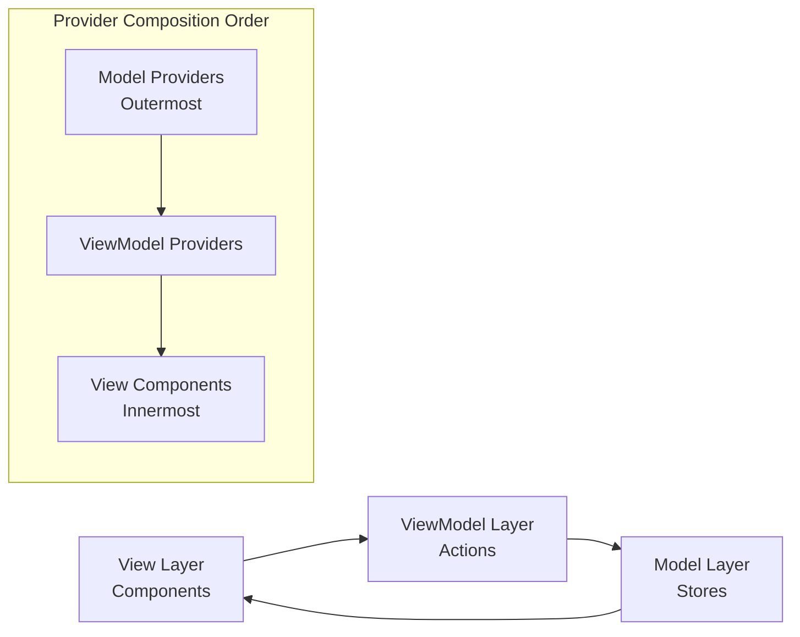

# Combined Documentation: conventions

Generated: 2025-08-28
Pattern: clean
Total References: 10

## Source Document

# Context-Action Framework Conventions

This document defines coding conventions and best practices when using the Context-Action framework with its three core patterns: Actions, Stores, and RefContext.

## 📋 Table of Contents

1. [MVVM Architecture Conventions](#mvvm-architecture-conventions)
2. [Naming Conventions](#naming-conventions)
3. [File Structure](#file-structure)
4. [Pattern Usage](#pattern-usage)
5. [Type Definitions](#type-definitions)
6. [Code Style](#code-style)
7. [Performance Guidelines](#performance-guidelines)
8. [Error Handling](#error-handling)
9. [RefContext Conventions](#refcontext-conventions)

---

## MVVM Architecture Conventions

### 🏗️ **Core Architecture Pattern**

Context-Action Framework follows **strict MVVM architecture** with clear layer separation:

- **Model Layer**: `create~Context` declarations (`src/models/`)
- **ViewModel Layer**: Custom hooks for behavior injection (`src/viewmodels/`)
- **Business Logic Layer**: Action handlers for domain rules (`src/business/`)
- **View Layer**: Pure components consuming ViewModels (`src/components/`, `src/pages/`)
- **Shared Layer**: Pure view components with explicit props (`src/shared/`)

### 📁 **Directory Structure Pattern**

```
src/
├── models/           # Model Layer - Context declarations
│   ├── UserModel.ts           # createStoreContext
│   ├── UserActionModel.ts     # createActionContext
│   └── UserRefModel.ts        # createRefContext
├── viewmodels/       # ViewModel Layer - Hook-based injection
│   ├── useUserProfile.ts      # Profile behavior injection
│   ├── useUserPreferences.ts  # Preferences behavior injection
│   └── useUserAuth.ts         # Auth behavior injection
├── business/         # Business Logic Layer - Action handlers
│   ├── UserBusinessLogic.tsx  # User domain business rules
│   └── AuthBusinessLogic.tsx  # Auth domain business rules
├── pages/            # View Layer - Page components
│   ├── UserProfilePage.tsx    # Profile page (ViewModel consumption)
│   └── SettingsPage.tsx       # Settings page (ViewModel consumption)
├── components/       # View Layer - Feature components
│   ├── UserProfile.tsx        # Profile component (ViewModel consumption)
│   └── UserSettings.tsx       # Settings component (ViewModel consumption)
└── shared/           # Shared Layer - Pure view components
    ├── Button.tsx             # Pure button with explicit props
    ├── Card.tsx               # Pure card with explicit props
    └── Form.tsx               # Pure form with explicit props
```

### 🎯 **Layer Responsibility Rules**

#### ✅ **Model Layer** - Context Declarations Only
```typescript
// ✅ MUST: Declare contexts with domain-specific naming
export const {
  Provider: UserStoreProvider,
  useStore: useUserStore,
  useStoreManager: useUserStoreManager
} = createStoreContext('User', userStoreConfig);

// ❌ FORBIDDEN: Business logic in models
// No useEffect, no API calls, no business rules
```

#### ✅ **ViewModel Layer** - Behavior Injection Only
```typescript
// ✅ MUST: Create hooks that inject state and behavior
export function useUserProfile() {
  const profileStore = useUserStore('profile');
  const dispatch = useUserDispatch();
  
  const profile = useStoreValue(profileStore);
  
  const updateProfile = useCallback((data) => {
    dispatch('updateProfile', data);
  }, [dispatch]);
  
  return { profile, updateProfile, displayName: profile.name || 'Guest' };
}

// ❌ FORBIDDEN: Direct API calls or business validation in ViewModels
// ❌ FORBIDDEN: JSX or component rendering
```

#### ✅ **Business Logic Layer** - Domain Rules Only  
```typescript
// ✅ MUST: Implement business logic through action handlers
export function UserBusinessLogic({ children }) {
  useUserActionHandler('updateProfile', useCallback(async (payload) => {
    // Business validation
    if (!payload.email.includes('@')) {
      throw new Error('Invalid email');
    }
    
    // Business logic implementation
    const updated = { ...current, ...payload };
    profileStore.setValue(updated);
    
    // Side effects
    await saveToAPI(updated);
  }, [profileStore]));
  
  return children;
}

// ❌ FORBIDDEN: JSX rendering (except children passthrough)
// ❌ FORBIDDEN: UI state management
```

#### ✅ **View Layer** - ViewModel Consumption Only
```typescript
// ✅ MUST: Consume ViewModels through hooks
export function UserProfile() {
  const { profile, updateProfile, displayName } = useUserProfile();
  const { theme, toggleTheme } = useUserPreferences();
  
  return (
    <div data-theme={theme}>
      <h1>{displayName}</h1>
      <button onClick={() => updateProfile({ name: 'New Name' })}>
        Update
      </button>
    </div>
  );
}

// ❌ FORBIDDEN: Direct context consumption (useUserStore, useUserDispatch)
// ❌ FORBIDDEN: Business logic or API calls
// ❌ FORBIDDEN: Complex internal state management
```

#### ✅ **Shared Layer** - Pure View Only
```typescript
// ✅ MUST: Pure components with explicit props
interface ButtonProps {
  variant: 'primary' | 'secondary';
  onClick?: () => void;
  children: ReactNode;
}

export function Button({ variant, onClick, children }: ButtonProps) {
  return (
    <button className={`btn btn-${variant}`} onClick={onClick}>
      {children}
    </button>
  );
}

// ❌ FORBIDDEN: Any hooks or context consumption
// ❌ FORBIDDEN: Internal state management
// ❌ FORBIDDEN: Business logic
```

---

## Naming Conventions

### 🏷️ Renaming Pattern

The core convention of the Context-Action framework is **domain-based renaming pattern** for all three patterns.

#### ✅ Store Pattern Renaming
```tsx
// ✅ Recommended: Domain-based renaming
const {
  Provider: UserStoreProvider,
  useStore: useUserStore,
  useStoreManager: useUserStoreManager
} = createStoreContext('User', {...});

// ❌ Avoid: Direct object access
const UserStores = createStoreContext('User', {...});
const userStore = UserStores.useStore('profile'); // Domain unclear
```

#### ✅ Action Pattern Renaming
```tsx
// ✅ Recommended: Domain-based renaming with generic type
const {
  Provider: UserActionProvider,
  useActionDispatch: useUserAction,
  useActionHandler: useUserActionHandler
} = createActionContext<UserActions>('UserActions');

// ❌ Avoid: Generic names
const {
  Provider,
  useActionDispatch,
  useActionHandler
} = createActionContext<UserActions>('UserActions');
```

#### ✅ RefContext Pattern Renaming
```tsx
// ✅ Recommended: Domain-based renaming with destructured API
const {
  Provider: MouseProvider,
  useRefHandler: useMouseRef
} = createRefContext<MouseRefs>('Mouse');

// ❌ Avoid: Generic names
const {
  Provider,
  useRefHandler
} = createRefContext<MouseRefs>('Mouse');
```

### 🎯 Context Naming Rules

#### Domain-Based Naming
```tsx
// ✅ Recommended: Clear domain separation
'UserProfile'     // User profile related
'ShoppingCart'    // Shopping cart related  
'ProductCatalog'  // Product catalog related
'OrderManagement' // Order management related
'AuthSystem'      // Authentication system related
'MouseEvents'     // Mouse interaction related
'AnimationStates' // Animation and performance related

// ❌ Avoid: Ambiguous names
'Data'           // Too broad
'State'          // Not specific
'App'            // Scope unclear (use only at root level)
'Manager'        // Role unclear
'Refs'           // Too generic
```

#### Action vs Store vs RefContext Distinction
```tsx
// Action Context (behavior/event focused)
'UserActions'         // User actions
'PaymentActions'      // Payment actions
'NavigationActions'   // Navigation actions

// Store Context (data/state focused)  
'UserData'           // User data
'ProductCatalog'     // Product catalog
'ShoppingCart'       // Shopping cart state
'AppSettings'        // App settings

// RefContext (performance/DOM focused)
'MouseInteractions'  // Mouse event handling
'AnimationRefs'      // Animation element references
'FormElements'       // Form DOM elements
'MediaControls'      // Media player controls
```

### 🔤 Hook Naming Patterns

#### Store Hook Naming
```tsx
// ✅ Recommended: use + Domain + Store pattern
const useUserStore = UserContext.useStore;
const useProductStore = ProductContext.useStore;
const useCartStore = CartContext.useStore;

// Usage
const profileStore = useUserStore('profile');
const wishlistStore = useUserStore('wishlist');
```

#### Action Hook Naming
```tsx
// ✅ Recommended: use + Domain + Action pattern
const useUserAction = UserContext.useActionDispatch;
const usePaymentAction = PaymentContext.useActionDispatch;
const useUserActionHandler = UserContext.useActionHandler;

// Usage
const dispatch = useUserAction();
useUserActionHandler('updateProfile', handler);
```

#### RefContext Hook Naming
```tsx
// ✅ Recommended: use + Domain + Ref pattern
const useMouseRef = MouseContext.useRefHandler;
const useAnimationRef = AnimationContext.useRefHandler;
const useFormRef = FormContext.useRefHandler;

// Usage
const cursor = useMouseRef('cursor');
const trail = useMouseRef('trail');
const container = useMouseRef('container');
```

---

## File Structure

### 📁 **MVVM Directory Structure** (Recommended)

```
src/
├── models/             # Model Layer - Context declarations
│   ├── UserModel.ts           # User domain contexts (Store, Action, Ref)
│   ├── ProductModel.ts        # Product domain contexts
│   ├── InteractionModel.ts    # UI interaction contexts (Mouse, Animation)
│   └── index.ts              # All model exports
├── viewmodels/         # ViewModel Layer - Behavior injection hooks
│   ├── user/
│   │   ├── useUserProfile.ts       # Profile behavior injection
│   │   ├── useUserPreferences.ts   # Preferences behavior injection
│   │   └── useUserAuth.ts          # Auth behavior injection
│   ├── product/
│   │   ├── useProductCatalog.ts    # Catalog behavior injection
│   │   └── useShoppingCart.ts      # Cart behavior injection
│   ├── interaction/
│   │   ├── useMouseTracking.ts     # Mouse behavior injection
│   │   └── useAnimationControl.ts  # Animation behavior injection
│   └── index.ts              # All ViewModel exports
├── business/           # Business Logic Layer - Action handlers
│   ├── UserBusinessLogic.tsx       # User domain business rules
│   ├── ProductBusinessLogic.tsx    # Product domain business rules
│   ├── AuthBusinessLogic.tsx       # Auth domain business rules
│   └── index.ts                   # All business logic exports
├── pages/              # View Layer - Page components
│   ├── user/
│   │   ├── UserProfilePage.tsx     # Profile page
│   │   └── UserSettingsPage.tsx    # Settings page
│   ├── product/
│   │   ├── ProductCatalogPage.tsx  # Catalog page
│   │   └── ShoppingCartPage.tsx    # Cart page
│   └── index.ts              # All page exports
├── components/         # View Layer - Feature components
│   ├── user/
│   │   ├── UserProfile.tsx         # Profile component
│   │   ├── UserSettings.tsx        # Settings component
│   │   └── UserAuth.tsx           # Auth component
│   ├── product/
│   │   ├── ProductList.tsx         # Product list
│   │   ├── ProductCard.tsx         # Product card
│   │   └── CartSummary.tsx         # Cart summary
│   └── index.ts              # All component exports
├── shared/             # Shared Layer - Pure view components
│   ├── Button.tsx              # Pure button component
│   ├── Card.tsx                # Pure card component
│   ├── Form.tsx                # Pure form component
│   ├── Modal.tsx               # Pure modal component
│   └── index.ts                # All shared component exports
├── types/              # Type definitions
│   ├── user.types.ts           # User domain types
│   ├── product.types.ts        # Product domain types
│   ├── ui.types.ts            # UI-specific types
│   └── index.ts               # All type exports
└── providers/          # Provider composition
    └── AppProvider.tsx         # Root provider composition
```

### 📁 **Legacy Directory Structure** (Migration Reference)

```
src/
├── contexts/           # Old structure - migrate to models/
│   ├── user/
│   │   ├── user.actions.ts     # → models/UserModel.ts
│   │   ├── user.stores.ts      # → models/UserModel.ts
│   │   ├── user.refs.ts        # → models/UserModel.ts
│   │   └── index.ts
│   └── index.ts
├── hooks/             # Old structure - migrate to viewmodels/
│   ├── user/
│   │   ├── useUserProfile.ts    # → viewmodels/user/useUserProfile.ts
│   │   └── index.ts
│   └── index.ts
└── components/        # Keep as View Layer
    └── ...
```

### 📄 **MVVM File Naming Conventions**

#### **Model Layer Files** (`src/models/`)
```typescript
// ✅ MVVM Recommended - Domain-based models
UserModel.ts          // User domain (Store + Action + Ref contexts)
ProductModel.ts       // Product domain contexts
InteractionModel.ts   // UI interaction contexts
AuthModel.ts          // Authentication contexts

// ❌ Avoid - Separate context files
user.actions.ts       // Split contexts reduce maintainability
user.stores.ts        // Prefer consolidated domain models
user.refs.ts          // Keep related contexts together
```

#### **ViewModel Layer Files** (`src/viewmodels/`)
```typescript
// ✅ MVVM Recommended - Hook-based behavior injection
useUserProfile.ts     // Profile behavior injection
useUserPreferences.ts // Preferences behavior injection  
useUserAuth.ts        // Auth behavior injection
useProductCatalog.ts  // Product catalog behavior
useShoppingCart.ts    // Shopping cart behavior

// ❌ Avoid - Generic or vague names
useUser.ts           // Too generic, unclear responsibility
userHooks.ts         // Not specific about injected behavior
profileManager.ts    // Not following hook convention
```

#### **Business Logic Layer Files** (`src/business/`)
```typescript
// ✅ MVVM Recommended - Business domain logic
UserBusinessLogic.tsx     // User domain business rules
ProductBusinessLogic.tsx  // Product domain business rules
AuthBusinessLogic.tsx     // Authentication business rules
PaymentBusinessLogic.tsx  // Payment domain business rules

// ❌ Avoid - Generic or unclear names
BusinessLogic.tsx    // Too generic, unclear domain
userHandlers.ts      // Not component-based business logic
UserManager.tsx      // Vague responsibility
```

#### **View Layer Files** (`src/components/`, `src/pages/`)
```typescript
// ✅ MVVM Recommended - ViewModel consumption
UserProfile.tsx      // Profile component (consumes useUserProfile)
UserSettings.tsx     // Settings component (consumes useUserPreferences)
ProductList.tsx      // Product list (consumes useProductCatalog)
ShoppingCart.tsx     // Cart component (consumes useShoppingCart)

// Pages
UserProfilePage.tsx  // Profile page
ProductCatalogPage.tsx // Catalog page

// ❌ Avoid - Direct context reference in names
UserStoreComponent.tsx   // Should not reference implementation detail
UserActionComponent.tsx  // Focus on business purpose, not technical detail
```

#### **Shared Layer Files** (`src/shared/`)
```typescript
// ✅ MVVM Recommended - Pure view components
Button.tsx           // Pure button with explicit props
Card.tsx             // Pure card with explicit props
Modal.tsx            // Pure modal with explicit props
Form.tsx             // Pure form with explicit props
Input.tsx            // Pure input with explicit props

// ❌ Avoid - Context consumption in shared
SmartButton.tsx      // Shared components should be "dumb"
ConnectedCard.tsx    // No context consumption in shared layer
```

---

## Pattern Usage

### 🎯 Pattern Selection Guide

#### Store Only Pattern
```tsx
// ✅ Use when: Pure state management needed
// - Form data management
// - Settings storage
// - Cached data management
// - UI state (modals, toggles, etc.)

// Method 1: Type inference (current approach)
const {
  Provider: SettingsStoreProvider,
  useStore: useSettingsStore,
  useStoreManager: useSettingsStoreManager
} = createStoreContext('Settings', {
  theme: 'light' as 'light' | 'dark',
  language: 'en',
  notifications: true
});

// Method 2: Explicit generic types (alternative approach)
interface SettingsStoreTypes {
  theme: 'light' | 'dark';
  language: string;
  notifications: boolean;
}

const {
  Provider: SettingsStoreProvider,
  useStore: useSettingsStore,
  useStoreManager: useSettingsStoreManager
} = createStoreContext<SettingsStoreTypes>('Settings', {
  theme: 'light',  // Type inferred from SettingsStoreTypes
  language: 'en',
  notifications: true
});
```

#### Action Only Pattern  
```tsx
// ✅ Use when: Pure action dispatching needed
// - Event tracking
// - Logging systems
// - Notification sending
// - API calls (without state changes)

const {
  Provider: AnalyticsActionProvider,
  useActionDispatch: useAnalyticsAction,
  useActionHandler: useAnalyticsActionHandler
} = createActionContext<AnalyticsActions>('Analytics');
```

#### RefContext Only Pattern
```tsx
// ✅ Use when: High-performance DOM manipulation needed
// - Real-time interactions (mouse tracking, drag & drop)
// - Animations requiring 60fps
// - Canvas operations
// - Media player controls

type MouseRefs = {
  cursor: HTMLDivElement;
  trail: HTMLDivElement;
  container: HTMLDivElement;
};

const {
  Provider: MouseProvider,
  useRefHandler: useMouseRef
} = createRefContext<MouseRefs>('Mouse');
```

#### Pattern Composition
```tsx
// ✅ Use when: Multiple pattern types needed  
// - Complex business logic with performance requirements
// - User profile management with real-time interactions
// - Shopping cart with drag & drop functionality
// - Game state management with animations

function App() {
  return (
    <UserActionProvider>
      <UserStoreProvider>
        <MouseProvider>
          <InteractiveUserProfile />
        </MouseProvider>
      </UserStoreProvider>
    </UserActionProvider>
  );
}
```

### 🔄 Provider Composition Patterns

#### ✅ **Context Separation Pattern** (MVVM Requirement)
```tsx
// ✅ REQUIRED: Separate Providers for different contexts to avoid hook conflicts
// Each context must have its own Provider to maintain proper isolation

// WRONG ❌ - Single Provider with multiple contexts causes conflicts
function WrongProvider({ children }: { children: React.ReactNode }) {
  return (
    <SharedContextProvider>  {/* This causes useActionDispatch conflicts */}
      <MemoizedWidget />
      <NonMemoizedWidget />
    </SharedContextProvider>
  );
}

// CORRECT ✅ - Separate Providers for isolated context usage
function CorrectProviders({ children }: { children: React.ReactNode }) {
  return (
    <ComparisonStoreProvider>           {/* Shared state layer */}
      <PerformanceControlProvider>      {/* Control state layer */}
        <PerformanceControlActionProvider>  {/* Control actions */}
          
          {/* Performance Control Widget - uses control contexts */}
          <PerformanceControlWidget />
          
          {/* Comparison Grid - each widget has its own action context */}
          <div className="grid grid-cols-2 gap-6">
            
            {/* Memoized Handler Widget with its own action context */}
            <MemoizedActionProvider>
              <MemoizedHandlerWidget />
            </MemoizedActionProvider>
            
            {/* Non-Memoized Handler Widget with its own action context */}
            <NonMemoizedActionProvider>
              <NonMemoizedHandlerWidget />
            </NonMemoizedActionProvider>
            
          </div>
          
        </PerformanceControlActionProvider>
      </PerformanceControlProvider>
    </ComparisonStoreProvider>
  );
}
```

#### 🎯 **Context Separation Rules**

##### **Rule 1: Provider Hierarchy for Context Isolation**
```tsx
// ✅ MUST: Use separate action contexts for different business domains
// This prevents useActionDispatch hook conflicts and maintains clean separation

// Model Definitions (separate contexts)
const {
  Provider: MemoizedActionProvider,
  useActionDispatch: useMemoizedActionDispatch,  // Different dispatch hook
  useActionHandler: useMemoizedActionHandler
} = createActionContext<ComparisonActions>('MemoizedComparison');

const {
  Provider: NonMemoizedActionProvider,
  useActionDispatch: useNonMemoizedActionDispatch,  // Different dispatch hook
  useActionHandler: useNonMemoizedActionHandler  
} = createActionContext<ComparisonActions>('NonMemoizedComparison');

// Provider Hierarchy
<SharedStoreProvider>               {/* Shared data layer */}
  <MemoizedActionProvider>          {/* Memoized business logic */}
    <MemoizedWidget />              {/* Uses useMemoizedActionDispatch */}
  </MemoizedActionProvider>
  
  <NonMemoizedActionProvider>       {/* Non-memoized business logic */}
    <NonMemoizedWidget />           {/* Uses useNonMemoizedActionDispatch */}
  </NonMemoizedActionProvider>
</SharedStoreProvider>
```

##### **Rule 2: Hook Isolation Pattern**
```tsx
// ✅ MUST: Create separate hooks for each context to avoid conflicts
// File: src/hooks/useComparisonActions.ts

export function useMemoizedActions() {
  const dispatch = useMemoizedActionDispatch();  // Specific to memoized context
  
  return {
    increment: () => dispatch('increment'),
    decrement: () => dispatch('decrement'),
    calculate: (multiplier: number) => dispatch('complexCalculation', { multiplier })
  };
}

export function useNonMemoizedActions() {
  const dispatch = useNonMemoizedActionDispatch();  // Specific to non-memoized context
  
  return {
    increment: () => dispatch('increment'),
    decrement: () => dispatch('decrement'),
    calculate: (multiplier: number) => dispatch('complexCalculation', { multiplier })
  };
}

// ❌ FORBIDDEN: Using same hook name that conflicts
function ConflictingHook() {
  const dispatch = useActionDispatch();  // Which context? Causes conflicts!
  return { actions };
}
```

##### **Rule 3: Business Logic Isolation**
```tsx
// ✅ MUST: Separate action handlers for different contexts
// File: src/hooks/useMemoizedHandlers.ts

export function useMemoizedHandlers() {
  const memoizedStore = useComparisonStore('memoized');
  
  // Memoized business logic - functions created once and reused
  const handleIncrement = useCallback(async () => {
    const current = memoizedStore.getValue();  // Lazy evaluation
    memoizedStore.setValue({ ...current, counter: current.counter + 1 });
  }, [memoizedStore]);  // Empty deps for memoization
  
  useMemoizedActionHandler('increment', handleIncrement);
  
  return { handlersRegistered: true };
}

// File: src/hooks/useNonMemoizedHandlers.ts
export function useNonMemoizedHandlers() {
  const nonMemoizedStore = useComparisonStore('nonMemoized');
  
  // Non-memoized business logic - functions recreated every render
  const handleIncrement = async () => {  // No useCallback
    const current = nonMemoizedStore.getValue();
    nonMemoizedStore.setValue({ ...current, counter: current.counter + 1 });
  };
  
  useNonMemoizedActionHandler('increment', handleIncrement);
  
  return { handlersRegistered: true };
}
```

#### composeProviders Utility (Recommended)
```tsx
// ✅ Recommended: Clean composition using composeProviders utility
import { composeProviders } from '@context-action/react';

const AllProviders = composeProviders([
  UserStoreProvider,
  UserActionProvider,
  ProductStoreProvider,
  ProductActionProvider,
  MouseProvider,
  UserAnalyticsProvider
]);

function App() {
  return (
    <AllProviders>
      <AppContent />
    </AllProviders>
  );
}

// Advanced: Build-time conditional composition (recommended)
const isProduction = process.env.NODE_ENV === 'production';
const hasAnalytics = process.env.REACT_APP_ANALYTICS === 'true';

function createAppProviders() {
  const providers = [
    // Model Layer - Core stores (MVVM compliant order)
    UIStoreProvider,
    UserStoreProvider,
    
    // Optional stores based on build config
    ...(hasAnalytics ? [AnalyticsStoreProvider] : []),
    ...(isProduction ? [ErrorTrackingStoreProvider] : [DebugStoreProvider]),
    
    // ViewModel Layer - Core actions
    UIActionProvider,
    UserActionProvider,
    
    // Optional actions based on build config
    ...(hasAnalytics ? [AnalyticsActionProvider] : []),
    ...(isProduction ? [ErrorTrackingActionProvider] : [DebugActionProvider])
  ];
  
  return composeProviders(providers);
}

// Static composition - evaluated once at app initialization
const AppProviders = createAppProviders();
```

#### withProvider HOC Pattern (Convenience)
```tsx
// ✅ Convenience: Automatic Provider wrapping with HOC (sugar syntax)
const { withProvider: withUserStoreProvider } = createStoreContext('User', {...});
const { withProvider: withUserActionProvider } = createActionContext<UserActions>('UserActions');
const { withProvider: withMouseProvider } = createRefContext<MouseRefs>('Mouse');

// Multiple Provider composition
const withUserProviders = (Component: React.ComponentType) => 
  withUserActionProvider(
    withUserStoreProvider(
      withMouseProvider(Component)
    )
  );

const InteractiveUserProfileWithProviders = withUserProviders(InteractiveUserProfile);

// Usage
function App() {
  return <InteractiveUserProfileWithProviders />;
}
```

#### Manual Provider Composition
```tsx
// ✅ MVVM-compliant manual composition (for complex dependencies)
function MVVMUserProvider({ children }: { children: React.ReactNode }) {
  return (
    {/* Model Layer - Outermost */}
    <UserStoreProvider>
      <ProductStoreProvider>
        <UIStoreProvider>
          
          {/* ViewModel Layer */}
          <UserActionProvider>
            <ProductActionProvider>
              <UIActionProvider>
                
                {/* View Layer - Innermost */}
                {children}
                
              </UIActionProvider>
            </ProductActionProvider>
          </UserActionProvider>
        </UIStoreProvider>
      </ProductStoreProvider>
    </UserStoreProvider>
  );
}
```

---

## Type Definitions

### 🏷️ Interface Naming

#### Action Payload Map
```tsx
// ✅ Recommended: Domain + Actions pattern (extending ActionPayloadMap)
interface UserActions extends ActionPayloadMap {
  updateProfile: { id: string; data: Partial<UserProfile> };
  deleteAccount: { id: string; reason?: string };
  refreshToken: void;
}

// ✅ Recommended: Domain + Actions pattern (simple interface - future approach)
interface UserActions {
  updateProfile: { id: string; data: Partial<UserProfile> };
  deleteAccount: { id: string; reason?: string };
  refreshToken: void;
}

interface PaymentActions {
  processPayment: { amount: number; method: string };
  refundPayment: { transactionId: string };
  validateCard: { cardNumber: string };
}

// ❌ Avoid
interface Actions { ... }           // Too broad
interface UserActionTypes { ... }   // Inconsistent naming
```

#### Store Data Interface
```tsx
// ✅ Recommended: Domain + Data pattern or intuitive names
interface UserData {
  profile: UserProfile;
  preferences: UserPreferences;
  session: UserSession;
}

interface ShoppingCartData {
  items: CartItem[];
  total: number;
  discounts: Discount[];
}

// Or intuitive names
interface UserState {
  profile: UserProfile;
  preferences: UserPreferences;
}

// ❌ Avoid
interface Data { ... }           // Too broad
interface UserStoreType { ... }  // Unnecessary Type suffix
```

#### RefContext Type Interface
```tsx
// ✅ Recommended: Domain + Refs pattern
interface MouseRefs {
  cursor: HTMLDivElement;
  trail: HTMLDivElement;
  container: HTMLDivElement;
}

interface AnimationRefs {
  target: HTMLElement;
  trigger: HTMLButtonElement;
  container: HTMLDivElement;
}

interface FormRefs {
  nameInput: HTMLInputElement;
  emailInput: HTMLInputElement;
  submitButton: HTMLButtonElement;
  form: HTMLFormElement;
}

// ❌ Avoid
interface Refs { ... }           // Too broad
interface Elements { ... }       // Not specific to RefContext
interface MouseElements { ... }  // Prefer "Refs" suffix
```

### 🎯 Generic Type Usage

```tsx
// ✅ Recommended: Clear generic type usage
interface BaseEntity {
  id: string;
  createdAt: Date;
  updatedAt: Date;
}

interface User extends BaseEntity {
  name: string;
  email: string;
}

interface Product extends BaseEntity {
  name: string;
  price: number;
  category: string;
}

// Store definition - Method 1: Type inference (recommended)
const {
  Provider: UserStoreProvider,
  useStore: useUserStore
} = createStoreContext('User', {
  users: { initialValue: [] as User[] },
  currentUser: { initialValue: null as User | null }
});

// Store definition - Method 2: Explicit generic
interface UserStoreTypes {
  users: User[];
  currentUser: User | null;
}

const {
  Provider: UserStoreProvider,
  useStore: useUserStore
} = createStoreContext<UserStoreTypes>('User', {
  users: [],  // Direct value or
  currentUser: {  // Configuration object
    initialValue: null,
    strategy: 'reference'
  }
});

// Action definition - New API (contextName priority)
interface UserActions {
  createUser: { userData: Omit<User, 'id' | 'createdAt' | 'updatedAt'> };
  updateUser: { id: string; updates: Partial<User> };
  deleteUser: { id: string };
}

const {
  Provider: UserActionProvider,
  useActionDispatch: useUserAction
} = createActionContext<UserActions>('UserActions', {
  registry: { debug: true, maxHandlers: 10 }
});

// RefContext definition
interface InteractiveRefs {
  cursor: HTMLDivElement;
  trail: HTMLDivElement;
  container: HTMLDivElement;
}

const {
  Provider: InteractiveProvider,
  useRefHandler: useInteractiveRef
} = createRefContext<InteractiveRefs>('Interactive');
```

---

## Code Style

### ✨ Component Patterns

#### Store Usage Pattern
```tsx
// ✅ Recommended: Clear variable names and destructuring
function UserProfile() {
  // Store access
  const profileStore = useUserStore('profile');
  const preferencesStore = useUserStore('preferences');
  
  // Value subscription
  const profile = useStoreValue(profileStore);
  const preferences = useStoreValue(preferencesStore);
  
  // Distinguish from local state
  const [isEditing, setIsEditing] = useState(false);
  
  return (
    <div>
      <ProfileView profile={profile} preferences={preferences} />
      {isEditing && <ProfileEditor />}
    </div>
  );
}

// ❌ Avoid: Confusing variable names
function UserProfile() {
  const store1 = useUserStore('profile');  // What is this?
  const data = useStoreValue(store1);      // Not specific
  const userState = useStoreValue(store2); // Can be confusing
}
```

#### Action Handler Pattern
```tsx
// ✅ Recommended: useCallback with clear handler names
function UserProfile() {
  const dispatch = useUserAction();
  
  // Handler registration (useCallback required)
  useUserActionHandler('updateProfile', useCallback(async (payload, controller) => {
    try {
      const profileStore = storeManager.getStore('profile');
      const currentProfile = profileStore.getValue();
      
      // Execute business logic
      const updatedProfile = await updateUserProfile(payload.data);
      
      // Update store
      profileStore.setValue({ ...currentProfile, ...updatedProfile });
      
      // Success notification
      dispatch('showNotification', { 
        type: 'success', 
        message: 'Profile updated successfully.' 
      });
    } catch (error) {
      controller.abort('Profile update failed', error);
    }
  }, [dispatch, storeManager]));
  
  const handleEditProfile = () => {
    dispatch('updateProfile', {
      data: { name: 'New Name' }
    });
  };
  
  return <button onClick={handleEditProfile}>Edit Profile</button>;
}
```

#### RefContext Usage Pattern
```tsx
// ✅ Recommended: Clear ref names and direct DOM manipulation
function InteractiveMouseTracker() {
  const cursor = useMouseRef('cursor');
  const trail = useMouseRef('trail');
  const container = useMouseRef('container');
  
  // Direct DOM manipulation with business logic
  const handleMouseMove = useCallback((e: React.MouseEvent) => {
    if (!cursor.target || !container.target) return;
    
    const rect = container.target.getBoundingClientRect();
    const x = e.clientX - rect.left;
    const y = e.clientY - rect.top;
    
    // Hardware accelerated transforms
    cursor.target.style.transform = `translate3d(${x}px, ${y}px, 0)`;
    
    // Trail effect with performance optimization
    if (trail.target) {
      trail.target.style.transform = `translate3d(${x-5}px, ${y-5}px, 0)`;
    }
  }, [cursor, trail, container]);
  
  return (
    <div 
      ref={container.setRef}
      onMouseMove={handleMouseMove}
      className="relative w-full h-96 bg-gray-100"
    >
      <div
        ref={cursor.setRef}
        className="absolute w-4 h-4 bg-blue-500 rounded-full pointer-events-none"
      />
      <div
        ref={trail.setRef}
        className="absolute w-3 h-3 bg-blue-300 rounded-full pointer-events-none"
      />
    </div>
  );
}

// ❌ Avoid: Confusing ref names
function MouseTracker() {
  const ref1 = useMouseRef('cursor');      // What is this?
  const element = useMouseRef('trail');    // Not specific
  const domRef = useMouseRef('container'); // Generic naming
}
```

### 🎨 Import Organization

```tsx
// ✅ Recommended: Group imports by category
// 1. React related
import React, { useCallback, useState, useEffect } from 'react';

// 2. Third-party libraries
import { toast } from 'react-hot-toast';

// 3. Context-Action framework
import { useStoreValue } from '@context-action/react';

// 4. Local contexts (renamed hooks)
import { 
  useUserStore, 
  useUserAction, 
  useUserActionHandler,
  useMouseRef
} from '@/contexts';

// 5. Components
import { ProfileForm } from './ProfileForm';
import { InteractiveMouseTracker } from './InteractiveMouseTracker';

// 6. Types
import type { UserProfile } from '@/types/user.types';
import type { MouseRefs } from '@/types/interaction.types';
```

---

## Performance Guidelines

### ⚡ Store Optimization

#### Comparison Strategy Selection
```tsx
// ✅ Recommended: Choose strategy based on data characteristics
const {
  Provider: DataStoreProvider,
  useStore: useDataStore
} = createStoreContext('Data', {
  // Primitive values: reference (default)
  counter: 0,
  isLoading: false,
  
  // Objects with property changes: shallow  
  userProfile: {
    initialValue: { name: '', email: '', age: 0 },
    strategy: 'shallow'
  },
  
  // Deeply nested objects with frequent changes: deep
  complexForm: {
    initialValue: { nested: { deep: { values: {} } } },
    strategy: 'deep'
  },
  
  // Large arrays or performance-critical cases: reference
  largeDataset: {
    initialValue: [] as DataItem[],
    strategy: 'reference',
    description: 'Use reference equality for performance'
  },
  
  // Advanced comparison options
  advancedData: {
    initialValue: { id: '', data: {}, lastUpdated: new Date() },
    comparisonOptions: {
      strategy: 'shallow',
      ignoreKeys: ['lastUpdated'], // Ignore specific keys
      maxDepth: 2,                 // Limit depth for performance
      enableCircularCheck: true    // Prevent circular references
    }
  },
  
  // Custom comparison logic
  versionedData: {
    initialValue: { version: 1, content: {} },
    comparisonOptions: {
      strategy: 'custom',
      customComparator: (oldVal, newVal) => {
        // Version-based comparison
        return oldVal.version === newVal.version;
      }
    }
  }
});
```

#### Memoization Patterns
```tsx
// ✅ Recommended: Handler memoization with useCallback
function UserComponent() {
  const profileStore = useUserStore('profile');
  const profile = useStoreValue(profileStore);
  
  // Handler memoization (careful with dependency array)
  const updateHandler = useCallback(async (payload) => {
    profileStore.setValue({ ...profile, ...payload.data });
  }, [profile, profileStore]);
  
  useUserActionHandler('updateProfile', updateHandler);
  
  // Computed value memoization
  const displayName = useMemo(() => {
    return profile.firstName + ' ' + profile.lastName;
  }, [profile.firstName, profile.lastName]);
  
  return <div>{displayName}</div>;
}
```

### 🔄 Action Optimization

#### Debounce/Throttle Configuration
```tsx
// ✅ Recommended: Appropriate debounce/throttle usage
useUserActionHandler('searchUsers', searchHandler, {
  debounce: 300,  // Search uses debounce
  id: 'search-handler'
});

useUserActionHandler('trackScroll', scrollHandler, {
  throttle: 100,  // Scroll uses throttle  
  id: 'scroll-handler'
});

useUserActionHandler('saveForm', saveHandler, {
  blocking: true,  // Critical actions are blocking
  once: false,
  id: 'save-handler'
});
```

### ⚡ RefContext Performance Optimization

#### Zero Re-render DOM Manipulation
```tsx
// ✅ Recommended: Direct DOM manipulation for performance
function HighPerformanceMouseTracker() {
  const cursor = useMouseRef('cursor');
  const container = useMouseRef('container');
  
  // Zero React re-renders - all DOM updates are direct
  const handleMouseMove = useCallback((e: React.MouseEvent) => {
    if (!cursor.target || !container.target) return;
    
    const rect = container.target.getBoundingClientRect();
    const x = e.clientX - rect.left;
    const y = e.clientY - rect.top;
    
    // Hardware accelerated transforms (GPU acceleration)
    cursor.target.style.transform = `translate3d(${x}px, ${y}px, 0)`;
    
    // Use will-change for complex animations
    if (!cursor.target.style.willChange) {
      cursor.target.style.willChange = 'transform';
    }
  }, [cursor, container]);
  
  // Cleanup will-change on unmount for memory optimization
  useEffect(() => {
    return () => {
      if (cursor.target) {
        cursor.target.style.willChange = '';
      }
    };
  }, [cursor]);
  
  return (
    <div ref={container.setRef} onMouseMove={handleMouseMove}>
      <div 
        ref={cursor.setRef}
        style={{ transform: 'translate3d(0, 0, 0)' }} // Initial GPU layer
      />
    </div>
  );
}

// ❌ Avoid: State-driven updates causing re-renders
function SlowMouseTracker() {
  const [position, setPosition] = useState({ x: 0, y: 0 });
  
  const handleMouseMove = (e: React.MouseEvent) => {
    // This causes re-renders on every mouse move
    setPosition({ x: e.clientX, y: e.clientY });
  };
  
  return (
    <div onMouseMove={handleMouseMove}>
      <div style={{ left: position.x, top: position.y }} />
    </div>
  );
}
```

#### Animation Performance
```tsx
// ✅ Recommended: requestAnimationFrame for smooth animations
function SmoothAnimationComponent() {
  const target = useAnimationRef('target');
  const animationRef = useRef<number>();
  
  const startAnimation = useCallback(() => {
    const animate = (timestamp: number) => {
      if (target.target) {
        // Smooth animation with hardware acceleration
        const progress = (timestamp % 2000) / 2000;
        const x = progress * 200;
        target.target.style.transform = `translate3d(${x}px, 0, 0)`;
      }
      animationRef.current = requestAnimationFrame(animate);
    };
    animationRef.current = requestAnimationFrame(animate);
  }, [target]);
  
  const stopAnimation = useCallback(() => {
    if (animationRef.current) {
      cancelAnimationFrame(animationRef.current);
    }
  }, []);
  
  useEffect(() => {
    return () => stopAnimation(); // Cleanup on unmount
  }, [stopAnimation]);
  
  return (
    <div>
      <div ref={target.setRef} style={{ transform: 'translate3d(0, 0, 0)' }} />
      <button onClick={startAnimation}>Start</button>
      <button onClick={stopAnimation}>Stop</button>
    </div>
  );
}
```

---

## RefContext Conventions

### 🔧 RefContext-Specific Guidelines

#### Ref Type Definitions
```tsx
// ✅ Recommended: Specific HTML element types
interface MouseRefs {
  cursor: HTMLDivElement;      // Specific element type
  trail: HTMLDivElement;
  container: HTMLDivElement;
}

interface FormRefs {
  nameInput: HTMLInputElement;  // Input-specific type
  emailInput: HTMLInputElement;
  submitButton: HTMLButtonElement; // Button-specific type
  form: HTMLFormElement;       // Form-specific type
}

// ❌ Avoid: Generic HTMLElement when specific type is known
interface BadRefs {
  cursor: HTMLElement;         // Too generic
  input: HTMLElement;          // Should be HTMLInputElement
}
```

#### Performance-Critical Patterns
```tsx
// ✅ Recommended: Separate business logic from DOM manipulation
function useMousePositionLogic() {
  const cursor = useMouseRef('cursor');
  const trail = useMouseRef('trail');
  
  const updatePosition = useCallback((x: number, y: number) => {
    // Direct DOM manipulation - zero re-renders
    if (cursor.target) {
      cursor.target.style.transform = `translate3d(${x}px, ${y}px, 0)`;
    }
    if (trail.target) {
      trail.target.style.transform = `translate3d(${x-5}px, ${y-5}px, 0)`;
    }
  }, [cursor, trail]);
  
  const getElementPosition = useCallback(() => {
    if (!cursor.target) return null;
    const rect = cursor.target.getBoundingClientRect();
    return { x: rect.left, y: rect.top };
  }, [cursor]);
  
  return { updatePosition, getElementPosition };
}

// Usage in component
function MouseComponent() {
  const { updatePosition } = useMousePositionLogic();
  
  const handleMouseMove = useCallback((e: React.MouseEvent) => {
    updatePosition(e.clientX, e.clientY);
  }, [updatePosition]);
  
  return <div onMouseMove={handleMouseMove}>...</div>;
}
```

#### RefContext Error Handling
```tsx
// ✅ Recommended: Null checks and error handling
function SafeRefComponent() {
  const element = useMouseRef('target');
  
  const safelyUpdateElement = useCallback((value: string) => {
    // Always check target existence
    if (!element.target) {
      console.warn('RefContext: Target element not yet mounted');
      return;
    }
    
    try {
      element.target.textContent = value;
    } catch (error) {
      console.error('RefContext: Failed to update element', error);
    }
  }, [element]);
  
  // Use useWaitForRefs for critical operations
  const { allRefsReady } = useWaitForRefs(['target']);
  
  useEffect(() => {
    if (allRefsReady) {
      safelyUpdateElement('Ready!');
    }
  }, [allRefsReady, safelyUpdateElement]);
  
  return <div ref={element.setRef}>Content</div>;
}
```

---

## Error Handling

### 🚨 Error Boundary Pattern

```tsx
// ✅ Recommended: Domain-specific Error Boundary
function UserErrorBoundary({ children }: { children: React.ReactNode }) {
  return (
    <ErrorBoundary
      fallback={<UserErrorFallback />}
      onError={(error, errorInfo) => {
        // User-related error logging
        console.error('User context error:', error, errorInfo);
      }}
    >
      {children}
    </ErrorBoundary>
  );
}

function UserProvider({ children }: { children: React.ReactNode }) {
  return (
    <UserActionProvider>
      <UserStoreProvider>
        <MouseProvider>
          <UserErrorBoundary>
            {children}
          </UserErrorBoundary>
        </MouseProvider>
      </UserStoreProvider>
    </UserActionProvider>
  );
}
```

### 🛡️ Action Error Handling

```tsx
// ✅ Recommended: Error handling with Pipeline Controller
useUserActionHandler('riskyOperation', useCallback(async (payload, controller) => {
  try {
    // 1. Input validation
    if (!payload.data || !payload.data.id) {
      controller.abort('Invalid input data');
      return;
    }
    
    // 2. Execute business logic
    const result = await performRiskyOperation(payload.data);
    
    // 3. Update state on success
    const store = storeManager.getStore('userData');
    store.setValue(result);
    
    // 4. Return result (if needed)
    controller.setResult(result);
    
  } catch (error) {
    // 5. Error handling
    if (error instanceof ValidationError) {
      controller.abort('Data validation failed', error);
    } else if (error instanceof NetworkError) {
      controller.abort('Network error', error);
    } else {
      controller.abort('Unknown error occurred', error);
    }
  }
}, [storeManager]));
```

### 🛡️ RefContext Error Handling

```tsx
// ✅ Recommended: Safe ref operations with error handling
function SafeRefOperations() {
  const element = useMouseRef('target');
  const { allRefsReady, waitForRefs } = useWaitForRefs(['target']);
  
  const safelyManipulateDOM = useCallback(async () => {
    try {
      // Wait for refs to be ready before operations
      await waitForRefs();
      
      if (!element.target) {
        throw new Error('RefContext: Target element not available');
      }
      
      // Safe DOM manipulation
      element.target.style.transform = 'translate3d(100px, 100px, 0)';
      
    } catch (error) {
      console.error('RefContext operation failed:', error);
      // Fallback behavior
      console.warn('Falling back to alternative approach');
    }
  }, [element, waitForRefs]);
  
  // Error boundary for RefContext-specific errors
  if (!allRefsReady) {
    return <div>Loading refs...</div>;
  }
  
  return (
    <div ref={element.setRef} onClick={safelyManipulateDOM}>
      Click me
    </div>
  );
}

// ❌ Avoid: Unsafe ref operations
function UnsafeRefOperations() {
  const element = useMouseRef('target');
  
  const unsafeOperation = () => {
    // This can fail if element is not mounted yet
    element.target.style.transform = 'translate3d(100px, 100px, 0)';
  };
  
  return <div ref={element.setRef} onClick={unsafeOperation}>Click me</div>;
}
```

---

## 📚 Additional Resources

### Related Documentation
- [Pattern Guide](./pattern-guide.md) - Detailed pattern usage guide
- [Full Architecture Guide](./architecture-guide.md) - Complete architecture guide
- [Hooks Reference](./hooks-reference.md) - Hooks reference documentation
- [API Reference](../../api/) - API documentation

### Example Projects
- [Basic Example](../../../example/) - Basic usage examples
- [Advanced Patterns](../../examples/) - Advanced pattern examples

### Migration Guide
- [Legacy Pattern Migration](./pattern-guide.md#migration-guide) - Migration from legacy patterns

---

## ❓ FAQ

### Q: When should I use Store Only vs Action Only vs RefContext vs Composition?
- **Store Only**: Pure state management (forms, settings, cache)
- **Action Only**: Pure event handling (logging, tracking, notifications)
- **RefContext Only**: High-performance DOM manipulation (animations, real-time interactions)
- **Composition**: Complex business logic requiring multiple patterns (user management, interactive shopping cart)

### Q: Is the renaming pattern mandatory?
Yes, the renaming pattern is a core convention of the Context-Action framework. It significantly improves type safety and developer experience.

### Q: How should I approach performance optimization?
1. Choose appropriate comparison strategy for stores
2. Memoize handlers with useCallback
3. Use reference strategy for large data
4. Apply debounce/throttle when needed
5. Use RefContext for performance-critical DOM operations

### Q: How should I handle errors?
1. Use Pipeline Controller's abort() method for actions
2. Set up domain-specific Error Boundaries
3. Handle different error types appropriately
4. Provide user-friendly error messages
5. Always check ref.target existence before DOM manipulation

### Q: Should I use explicit generics or type inference?
- **Type inference (recommended)**: For most cases, code is concise and type safety is guaranteed
- **Explicit generics**: For complex type structures or strict type constraints

### Q: When should I use comparisonOptions?
1. **ignoreKeys**: When you want to ignore specific field changes like timestamps
2. **customComparator**: When special comparison logic is needed for business requirements
3. **maxDepth**: To limit deep comparison depth for performance optimization
4. **enableCircularCheck**: When dealing with objects that might have circular references

### Q: How should I write type tests?
1. Test both explicit generics and type inference
2. Verify type safety at compile time
3. Document error cases with comments
4. Write test components that reflect actual usage patterns
5. Include RefContext type validation in component tests

### Q: When should I use RefContext over regular state?
- **Use RefContext when**: Direct DOM manipulation needed, 60fps performance required, zero re-renders critical
- **Use regular state when**: Data needs to be displayed in UI, component re-rendering is acceptable
- **Combine both when**: Performance-critical operations alongside data display (e.g., real-time charts)

### Q: How do I ensure RefContext safety?
1. **Always check `ref.target` existence before DOM operations**
   ```tsx
   const element = useMouseRef('cursor');
   
   // ✅ Correct - safe access
   if (element.target) {
     element.target.style.transform = 'scale(1.1)';
   }
   
   // ❌ Wrong - potential error
   element.target.style.transform = 'scale(1.1)';
   ```

2. **Use `useWaitForRefs` for operations requiring multiple refs**
   ```tsx
   const { allRefsReady, waitForRefs } = useWaitForRefs(['cursor', 'container']);
   
   const performOperation = async () => {
     await waitForRefs(); // Wait until all refs are ready
     // Perform safe DOM operations
   };
   ```

3. **Implement proper cleanup for animations and event listeners**
   ```tsx
   useEffect(() => {
     return () => {
       // Clean up animations
       if (animationFrame) {
         cancelAnimationFrame(animationFrame);
       }
       // Remove event listeners
       element.target?.removeEventListener('click', handler);
     };
   }, []);
   ```

4. **Error boundary handling and warning messages**
   ```tsx
   if (!element.target) {
     console.warn('RefContext: Target element not yet mounted');
     return;
   }
   ```

### Q: How do I optimize RefContext performance?
1. **Use `translate3d()` for hardware acceleration**
   ```tsx
   // ✅ Correct - GPU acceleration
   element.target.style.transform = `translate3d(${x}px, ${y}px, 0)`;
   
   // ❌ Wrong - CPU only
   element.target.style.left = `${x}px`;
   element.target.style.top = `${y}px`;
   ```

2. **Manage `will-change` property for animations**
   ```tsx
   // Before animation starts
   element.target.style.willChange = 'transform';
   
   // During animation
   element.target.style.transform = `translate3d(${x}px, ${y}px, 0)`;
   
   // After animation completes (prevent memory leaks)
   element.target.style.willChange = '';
   ```

3. **Use requestAnimationFrame for smooth animations**
   ```tsx
   const animate = () => {
     if (element.target) {
       const x = Math.sin(Date.now() * 0.001) * 100;
       element.target.style.transform = `translate3d(${x}px, 0, 0)`;
     }
     requestAnimationFrame(animate);
   };
   ```

---

## 📚 **Related Documentation**

### 🏗️ **Architecture Guides**
- **[MVVM Core Architecture](./mvvm-core-architecture.md)** - Complete MVVM implementation guide with practical examples
- **[Architecture Guide](./architecture-guide.md)** - Overall framework architecture concepts
- **[Pattern Guide](./pattern-guide.md)** - Comprehensive pattern usage guide

### 📋 **Setup & Implementation**
- **[Setup Patterns](../guide/patterns/setup/index.md)** - Context creation patterns and configurations
- **[Store Patterns](../guide/patterns/store/index.md)** - State management implementation patterns
- **[Action Patterns](../guide/patterns/action/index.md)** - Business logic implementation patterns
- **[RefContext Patterns](../guide/patterns/ref/index.md)** - DOM manipulation and performance patterns

### 🎯 **Best Practices**
- **[Documentation Rules](../../DOCUMENTATION_RULES.md)** - Framework documentation standards
- **[Getting Started](../guide/getting-started.md)** - Quick start guide for new users

---

## 🎯 **Quick Reference for MVVM Implementation**

### **Model Layer** → Context Declarations
```typescript
// src/models/UserModel.ts
export const { Provider, useStore, useActionDispatch } = create~Context();
```

### **ViewModel Layer** → Behavior Injection  
```typescript
// src/viewmodels/useUserProfile.ts
export function useUserProfile() {
  return { state, actions, computed };
}
```

### **Business Logic Layer** → Domain Rules
```typescript
// src/business/UserBusinessLogic.tsx
export function UserBusinessLogic({ children }) {
  useActionHandler('action', businessLogic);
  return children;
}
```

### **View Layer** → Pure Components
```typescript
// src/components/UserProfile.tsx
export function UserProfile() {
  const { state, actions } = useUserProfile();
  return <UI />;
}
```

### **Shared Layer** → Reusable Components
```typescript  
// src/shared/Button.tsx
export function Button({ variant, onClick, children }: ButtonProps) {
  return <button className={variant} onClick={onClick}>{children}</button>;
}
```

**Follow this architecture for scalable, maintainable, and type-safe applications with Context-Action Framework.**

## Referenced Documents

### 1. Pattern Guide

**Source**: `./pattern-guide.md`

# @context-action/react Pattern Guide

Complete guide to the three main patterns available in @context-action/react framework.

**Note**: This guide has been moved to the [Patterns section](../guide/patterns/index.md) for better organization.

## 📋 Quick Reference

Choose the right pattern for your use case:

| Pattern | Use Case | Import | Best For |
|---------|----------|--------|----------|
| **🎯 Action Only** | Action dispatching without stores | `createActionContext` | Event systems, command patterns |
| **🏪 Store Only** | State management without actions | `createStoreContext` | Pure state management, data layers |
| **🔧 Ref Context** | Direct DOM manipulation with zero re-renders | `createRefContext` | High-performance UI, animations, real-time interactions |

**For complex applications, compose patterns together for maximum flexibility and separation of concerns.**

## 📚 Detailed Documentation

### Core Framework Patterns
- **[🎯 Action Only Pattern](../guide/patterns/action-only-pattern.md)** - Pure action dispatching without state management
- **[🏪 Store Only Pattern](../guide/patterns/store-only-pattern.md)** - Type-safe state management without actions (Recommended)
- **[🔧 Ref Context Pattern](../guide/patterns/ref-context-pattern.md)** - Direct DOM manipulation with zero re-renders

### Advanced Patterns
- **[Pattern Composition](../guide/patterns/pattern-composition.md)** - Combining all three patterns for complex applications
- **[Domain Context Architecture](../guide/patterns/domain-context-architecture.md)** - Document-centric context separation
- **[MVVM Architecture](../guide/patterns/mvvm-architecture.md)** - Modern Model-View-ViewModel implementation

### Implementation Patterns
- **[Real-time State Access](../guide/patterns/real-time-state-access.md)** - Patterns for accessing real-time state
- **[Ref Context Setup](../guide/patterns/ref-context-setup.md)** - High-performance DOM manipulation setup
- **[Wait Then Execute](../guide/patterns/wait-then-execute.md)** - Waiting and execution patterns
- **[Conditional Await](../guide/patterns/conditional-await.md)** - Conditional waiting patterns
- **[Timeout Protection](../guide/patterns/timeout-protection.md)** - Timeout protection in async operations

## Migration Guide

### From Legacy Action Context Pattern

If you were using the removed `createActionContextPattern`, migrate to pattern composition:

```tsx
// ❌ Old (removed)
// const UserContext = createActionContextPattern<UserActions>('User');

// ✅ New (compose patterns with renaming)
const { 
  Provider: UserActionProvider, 
  useActionDispatch: useUserAction,
  useActionHandler: useUserActionHandler
} = createActionContext<UserActions>('UserActions');

const {
  Provider: UserStoreProvider,
  useStore: useUserStore,
  useStoreManager: useUserStoreManager
} = createStoreContext('UserStores', {
  profile: { id: '', name: '', email: '' },
  preferences: { theme: 'light' as const }
});

// Compose providers
function App() {
  return (
    <UserActionProvider>
      <UserStoreProvider>
        <UserComponent />
      </UserStoreProvider>
    </UserActionProvider>
  );
}
```

## 🔍 Examples

See the `examples/` directory for complete working examples of each pattern and the [Pattern Guide documentation](../guide/patterns/index.md) for comprehensive implementation details.

### 2. Full Architecture Guide

**Source**: `./architecture-guide.md`

# Context-Action Store Integration Architecture

## 1. Overview & Core Concepts

### What is Context-Action Architecture?

The Context-Action framework is a **revolutionary state management system** designed to overcome the fundamental limitations of existing libraries through document-centric context separation and effective artifact management.

#### Project Philosophy

The Context-Action framework addresses critical issues in modern state management:

**Problems with Existing Libraries:**
- **High React Coupling**: Tight integration makes component modularization and props handling difficult
- **Binary State Approach**: Simple global/local state dichotomy fails to handle specific scope-based separation  
- **Inadequate Handler/Trigger Management**: Poor support for complex interactions and business logic processing

**Context-Action's Solution:**
- **Document-Artifact Centered Design**: Context separation based on document themes and deliverable management
- **Perfect Separation of Concerns**: 
  - View design in isolation → Design Context
  - Development architecture in isolation → Architecture Context
  - Business logic in isolation → Business Context  
  - Data validation in isolation → Validation Context
- **Clear Boundaries**: Implementation results maintain distinct, well-defined domain boundaries
- **Effective Document-Artifact Management**: State management library that actively supports the relationship between documentation and deliverables

### Architecture Implementation

The framework implements a clean separation of concerns through an MVVM-inspired pattern with **three core patterns** for complete domain isolation:

- **Actions** handle business logic and coordination (ViewModel layer) via `createActionContext`
- **Declarative Store Pattern** manages state with domain isolation (Model layer) via `createStoreContext`
- **RefContext** provides direct DOM manipulation with zero re-renders (Performance layer) via `createRefContext`
- **Components** render UI (View layer)
- **Context Boundaries** isolate functional domains
- **Type-Safe Integration** through domain-specific hooks

### Core Architecture Flow

```
[Component] → dispatch → [Action Pipeline] → handlers → [Store] → subscribe → [Component]
```

### Context Separation Strategy

#### Domain-Based Context Architecture
- **Business Context**: Business logic, data processing, and domain rules (Actions + Stores)
- **UI Context**: Screen state, user interactions, and component behavior (Stores + RefContext)
- **Performance Context**: High-performance DOM manipulation and animations (RefContext)
- **Validation Context**: Data validation, form processing, and error handling (Actions + Stores)
- **Design Context**: Theme management, styling, layout, and visual states (Stores + RefContext)
- **Architecture Context**: System configuration, infrastructure, and technical decisions (Actions + Stores)

#### Document-Based Context Design
Each context is designed to manage its corresponding documentation and deliverables:
- **Design Documentation** → Design Context (themes, component specifications, style guides) → Stores + RefContext
- **Business Requirements** → Business Context (workflows, rules, domain logic) → Actions + Stores
- **Performance Specifications** → Performance Context (animations, interactions) → RefContext
- **Architecture Documents** → Architecture Context (system design, technical decisions) → Actions + Stores
- **Validation Specifications** → Validation Context (rules, schemas, error handling) → Actions + Stores
- **UI Specifications** → UI Context (interactions, state management, user flows) → All three patterns

### Advanced Handler & Trigger Management

Context-Action provides sophisticated handler and trigger management that existing libraries lack:

#### Priority-Based Handler Execution
- **Sequential Processing**: Handlers execute in priority order with proper async handling
- **Domain Isolation**: Each context maintains its own handler registry
- **Cross-Context Coordination**: Controlled communication between domain contexts
- **Result Collection**: Aggregate results from multiple handlers for complex workflows

#### Intelligent Trigger System
- **State-Change Triggers**: Automatic triggers based on store value changes
- **Cross-Context Triggers**: Domain boundaries can trigger actions in other contexts
- **Conditional Triggers**: Smart triggers based on business rules and conditions
- **Trigger Cleanup**: Automatic cleanup prevents memory leaks and stale references

### Key Benefits

1. **Document-Artifact Management**: Direct relationship between documentation and implementation
2. **Domain Isolation**: Each context maintains complete independence
3. **Type Safety**: Full TypeScript support with domain-specific hooks
4. **Performance**: Zero React re-renders with RefContext, selective updates with Stores
5. **Scalability**: Easy to add new domains without affecting existing ones
6. **Team Collaboration**: Different teams can work on different domains without conflicts
7. **Clear Boundaries**: Perfect separation of concerns based on document domains
8. **Hardware Acceleration**: Direct DOM manipulation with `translate3d()` for 60fps performance

## Implementation Documentation

**Note**: Detailed implementation patterns and examples have been moved to the [Patterns section](../guide/patterns/index.md) for better organization.

### Core Patterns
- **[🎯 Action Only Pattern](../guide/patterns/action/basic-usage.md)** - Pure action dispatching without state management
- **[🏪 Store Only Pattern](../guide/patterns/store/basic-usage.md)** - Type-safe state management without actions
- **[🔧 Ref Context Pattern](../guide/patterns/ref/basic-usage.md)** - Direct DOM manipulation with zero re-renders

### Architecture Patterns
- **[Pattern Composition](../guide/patterns/architecture/composition.md)** - Combining patterns for complex applications
- **[Domain Context Architecture](../guide/patterns/architecture/domain-context.md)** - Document-centric context separation
- **[MVVM Architecture](../guide/patterns/architecture/mvvm.md)** - Complete Model-View-ViewModel implementation

### Implementation Guides
- **[Real-time State Access](../guide/patterns/async/real-time-state-access.md)** - Avoiding closure traps in handlers
- **[Provider Composition Setup](../guide/patterns/setup/provider-composition-setup.md)** - Advanced provider composition patterns

## RefContext Performance Architecture

### Zero Re-render Philosophy

The RefContext pattern introduces a **performance-first layer** that bypasses React's rendering cycle entirely for DOM manipulation:

```
[User Interaction] → [Direct DOM Manipulation] → [Hardware Acceleration] → [60fps Updates]
                               ↓
                         [No React Re-renders]
```

#### Core Performance Principles

1. **Direct DOM Access**: Manipulate DOM elements directly without triggering React reconciliation
2. **Hardware Acceleration**: Use `transform3d()` for GPU-accelerated animations
3. **Separation of Concerns**: Visual updates separated from business logic updates
4. **Memory Efficiency**: Automatic cleanup and lifecycle management
5. **Type Safety**: Full TypeScript support for DOM element types

#### Performance Characteristics

RefContext is specifically designed for **high-performance scenarios** requiring direct DOM control:

| Approach | Use Case | React Re-renders | DOM Access |
|----------|----------|------------------|------------|
| **useState** | Standard UI interactions | Triggers reconciliation | React-managed |
| **useRef** | Basic DOM manipulation | Manual control required | Direct reference |
| **RefContext** | **High-performance graphics, animations** | Zero re-renders | Direct manipulation |

**RefContext advantages:**
- **Zero React Re-renders**: Direct DOM manipulation without reconciliation
- **Hardware Acceleration**: Enables GPU-optimized animations

**Primary targets for RefContext:**
- ✅ Canvas animations and Three.js graphics
- ✅ WebGL rendering and game engines
- ✅ High-frequency DOM updates

**Note**: For data management, use **Store contexts** instead of useState for better scalability and type safety.

## Best Practices Summary

### Architecture Design
1. **One domain = One context boundary**
2. **Separate business and UI concerns**
3. **Use document-driven context separation**
4. **Prefer domain isolation, use cross-domain communication when necessary**

### Pattern Selection
5. **Start with Store Only** for simple state management
6. **Add Action Only** when you need side effects or complex workflows
7. **Add RefContext** when you need high-performance DOM manipulation
8. **Compose all patterns** for full-featured applications

### Implementation
9. **Always use domain-specific hooks** for type safety and clarity
10. **Use lazy evaluation** in handlers to avoid stale state
11. **Follow provider composition** patterns for proper nesting
12. **Document domain boundaries** clearly for team collaboration

## Getting Started

For detailed implementation examples and step-by-step guides, see:

- **[Pattern Guide Index](../guide/patterns/index.md)** - Complete pattern documentation
- **[Action Only Pattern](../guide/patterns/action/basic-usage.md)** - Start with pure actions
- **[Store Only Pattern](../guide/patterns/store/basic-usage.md)** - Recommended starting point
- **[Pattern Composition](../guide/patterns/architecture/composition.md)** - Combining patterns

For more information and updates, visit the project repository.

### 3. Hooks Reference

**Source**: `./hooks-reference.md`

# Context-Action React Hooks Reference

This document is a **comprehensive catalog** of all available React hooks in the Context-Action framework, categorized by functionality and use cases. This serves as a reference manual for developers.

## Related Guides

- 🎯 **[React Hooks](/en/guide/hooks)** - How to use hooks (API examples and usage patterns)
- 🔄 **[Hooks Lifecycle](/en/guide/hooks-lifecycle)** - How hooks work internally (lifecycle, cleanup, performance)  
- ✅ **[Best Practices](/en/guide/best-practices)** - Coding patterns and conventions

---

## 📋 Table of Contents

1. [Essential Hooks](#essential-hooks)
2. [Utility Hooks](#utility-hooks)
3. [Hook Categories](#hook-categories)
4. [Usage Guidelines](#usage-guidelines)

---

## Essential Hooks

These hooks are fundamental to using the Context-Action framework. Most applications will need these.

### 🔧 RefContext Hooks (Performance)

#### `createRefContext<T>()`
**Factory function** that creates all ref-related hooks for high-performance DOM manipulation.
- **Purpose**: Creates type-safe direct DOM manipulation system with zero React re-renders
- **Returns**: `{ Provider, useRefHandler, useWaitForRefs, useGetAllRefs }`
- **Essential for**: Performance-critical UI, animations, real-time interactions

```tsx
const {
  Provider: MouseRefsProvider,
  useRefHandler: useMouseRef
} = createRefContext<{
  cursor: HTMLDivElement;
  container: HTMLDivElement;
}>('MouseRefs');
```

#### `useRefHandler()`
**Primary hook** for accessing typed ref handlers with direct DOM manipulation.
- **Purpose**: Get ref handler for specific DOM element with type safety
- **Essential for**: Direct DOM updates without React re-renders
- **Pattern**: Performance layer bypassing React reconciliation

```tsx
function MouseTracker() {
  const cursor = useMouseRef('cursor');
  
  const updatePosition = useCallback((x: number, y: number) => {
    if (cursor.target) {
      // Direct DOM manipulation - zero re-renders
      cursor.target.style.transform = `translate3d(${x}px, ${y}px, 0)`;
    }
  }, [cursor]);
  
  return <div ref={cursor.setRef} />;
}
```

#### `useWaitForRefs()`
**Utility hook** for waiting on multiple refs to mount before executing operations.
- **Purpose**: Coordinate operations requiring multiple DOM elements
- **Essential for**: Complex DOM initialization sequences
- **Pattern**: Async ref coordination

```tsx
function ComplexComponent() {
  const canvas = useMouseRef('canvas');
  const controls = useMouseRef('controls');
  const waitForRefs = useWaitForRefs();
  
  const initialize = useCallback(async () => {
    const refs = await waitForRefs('canvas', 'controls');
    // Both refs guaranteed to be available
    setupCanvasWithControls(refs.canvas, refs.controls);
  }, [waitForRefs]);
}
```

### 🎯 Action Hooks (Core)

#### `createActionContext<T>()`
**Factory function** that creates all action-related hooks for a specific action context.
- **Purpose**: Creates type-safe action dispatch and handler system
- **Returns**: `{ Provider, useActionDispatch, useActionHandler, useActionRegister }`
- **Essential for**: Any action-based logic

```tsx
const { 
  Provider: UserActionProvider,
  useActionDispatch: useUserAction,
  useActionHandler: useUserActionHandler
} = createActionContext<UserActions>('UserActions');
```

#### `useActionDispatch()`
**Primary hook** for dispatching actions to handlers.
- **Purpose**: Get dispatch function to trigger actions
- **Essential for**: Component interaction with business logic
- **Pattern**: ViewModel layer in MVVM architecture

#### `useActionHandler()`
**Primary hook** for registering action handlers.
- **Purpose**: Register business logic for specific actions
- **Essential for**: Implementing business logic
- **Best Practice**: Use with `useCallback` for optimization
- **Handler Updates**: Automatically updates when handler function changes
- **Internal Memoization**: Maintains stable reference while allowing handler updates

**Handler Update Patterns:**
```tsx
// ✅ State-based dynamic handler (recommended)
const [mode, setMode] = useState('create');
const handler = useCallback(async (payload) => {
  if (mode === 'create') return createUser(payload);
  return editUser(payload);
}, [mode]); // Handler updates when mode changes

useActionHandler('userAction', handler);

// ✅ Manual replacement using ActionRegister
const register = useActionRegister();
const replaceHandler = (newHandler) => {
  register.clearAction('myAction');
  register.register('myAction', newHandler);
};
```

📖 **See**: [Handler Runtime Updates](/en/guide/patterns/action/handler-updates) for comprehensive patterns

### 🏪 Store Hooks (Core)

#### `createStoreContext<T>()`
**Factory function** that creates all store-related hooks with type safety.
- **Purpose**: Creates type-safe store management system
- **Returns**: `{ Provider, useStore, useStoreManager, withProvider }`
- **Essential for**: Any state management

```tsx
const {
  Provider: UserStoreProvider,
  useStore: useUserStore,
  useStoreManager: useUserStoreManager
} = createStoreContext('User', {
  profile: { id: '', name: '' }
});
```

#### `useStoreValue<T>(store)`
**Primary hook** for subscribing to store changes.
- **Purpose**: Get reactive value from store
- **Essential for**: Reading state in components
- **Performance**: Only re-renders on actual value changes

```tsx
const userStore = useUserStore('profile');
const user = useStoreValue(userStore);
```

#### `useStore(name)` (from pattern)
**Primary hook** for accessing stores by name.
- **Purpose**: Get store instance from context
- **Essential for**: Accessing stores in components
- **Type-safe**: Returns properly typed store

---

## Utility Hooks

These hooks provide additional functionality, optimizations, and convenience features.

### 🎯 Action Utility Hooks

#### `useActionDispatchWithResult()`
**Utility hook** for actions that need to collect results.
- **Purpose**: Dispatch actions and collect handler results
- **Use Case**: When you need return values from handlers
- **Advanced**: For complex workflows requiring handler responses

```tsx
const { dispatchWithResult } = useActionDispatchWithResult();
const result = await dispatchWithResult('login', credentials);
```

#### `useActionRegister()`
**Utility hook** for direct access to ActionRegister instance.
- **Purpose**: Advanced control over action registry
- **Use Case**: Dynamic handler management, debugging
- **Advanced**: Rarely needed in typical applications

### 🏪 Store Utility Hooks

#### `useStoreSelector<T, R>(store, selector, equalityFn?)`
**Performance hook** for selective subscriptions.
- **Purpose**: Subscribe to specific parts of store
- **Optimization**: Prevents unnecessary re-renders
- **Use Case**: Large objects where only part changes

```tsx
const userName = useStoreSelector(userStore, user => user.name, shallowEqual);
```

#### `useComputedStore<T, R>(store, compute, config?)`
**Derived state hook** for computed values.
- **Purpose**: Create derived state from stores
- **Optimization**: Only recomputes when dependencies change
- **Use Case**: Calculated values, aggregations

```tsx
const fullName = useComputedStore(
  userStore,
  user => `${user.firstName} ${user.lastName}`
);
```

#### `useLocalStore<T>(initialValue, name?)`
**Component-local store** hook.
- **Purpose**: Create store scoped to component lifecycle
- **Use Case**: Complex component state
- **Benefit**: Store API without global state

```tsx
const { value, setValue, store } = useLocalStore({ count: 0 });
```

#### `usePersistedStore<T>(key, initialValue, options?)`
**Persistence hook** for browser storage.
- **Purpose**: Auto-sync store with localStorage/sessionStorage
- **Use Case**: Settings, user preferences, draft data
- **Feature**: Cross-tab synchronization

```tsx
const themeStore = usePersistedStore('theme', 'light', {
  storage: localStorage
});
```

#### `assertStoreValue<T>(value, storeName)`
**Type assertion utility** for store values.
- **Purpose**: Runtime assertion for non-undefined values
- **Type Safety**: Throws error if undefined
- **Use Case**: When store must have a value

```tsx
const user = useStoreValue(userStore);
const safeUser = assertStoreValue(user, 'userStore'); // never undefined
```

### 🔧 Performance Optimization Hooks

#### `useMultiStoreSelector(stores, selector, equalityFn?)`
**Multi-store selector** for combining stores.
- **Purpose**: Select from multiple stores efficiently
- **Optimization**: Single subscription for multiple stores
- **Use Case**: Cross-store computed values

#### `useStorePathSelector(store, path, equalityFn?)`
**Path-based selector** for nested objects.
- **Purpose**: Select nested values by path
- **Convenience**: Dot notation for deep selection
- **Use Case**: Complex nested state

#### `useAsyncComputedStore(asyncCompute, deps, config?)`
**Async computed values** hook.
- **Purpose**: Compute values asynchronously
- **Feature**: Loading states, error handling
- **Use Case**: API-derived state

---

## Hook Categories

### By Domain

#### State Management
- **Essential**: `useStoreValue`, `useStore` (from pattern)
- **Utility**: `useStoreSelector`, `useComputedStore`, `useLocalStore`

#### Action Handling
- **Essential**: `useActionDispatch`, `useActionHandler`
- **Utility**: `useActionDispatchWithResult`, `useActionRegister`

#### DOM Manipulation & Performance
- **Essential**: `useRefHandler` (from RefContext)
- **Utility**: `useWaitForRefs`, `useGetAllRefs`

#### Persistence
- **Utility**: `usePersistedStore`

#### Advanced/Meta
- **Utility**: `useActionRegister`

### By Usage Frequency

#### High Frequency (>80% of components)
- `useStoreValue`
- `useActionDispatch`
- `useStore` (from pattern)

#### Medium Frequency (20-80% of components)
- `useActionHandler`
- `useStoreSelector`
- `useLocalStore`

#### Low Frequency (<20% of components)
- `useComputedStore`
- `usePersistedStore`
- `useActionDispatchWithResult`

---

## Usage Guidelines

### When to Use Essential Hooks

1. **Starting a new feature**: Always start with essential hooks
2. **Basic CRUD operations**: Essential hooks are sufficient
3. **Simple state management**: `useStoreValue` + `useActionDispatch`
4. **Standard business logic**: `useActionHandler` for logic implementation

### When to Use Utility Hooks

1. **Performance issues**: Use selector hooks for optimization
2. **Complex state derivation**: Use `useComputedStore`
3. **Browser storage needs**: Use `usePersistedStore`
4. **Component-local complex state**: Use `useLocalStore`
5. **Advanced workflows**: Use result collection hooks
6. **Meta-programming**: Use registry hooks

### Best Practices

#### Essential Hook Patterns
```tsx
// Standard component pattern
function UserProfile() {
  // Essential: Get stores
  const profileStore = useUserStore('profile');
  const profile = useStoreValue(profileStore);
  
  // Essential: Get dispatch
  const dispatch = useUserAction();
  
  // Essential: Register handler
  useUserActionHandler('updateProfile', useCallback(async (payload) => {
    // Business logic here
  }, []));
  
  return <div>{profile.name}</div>;
}
```

#### Utility Hook Patterns
```tsx
// Optimized component with utilities
function OptimizedUserProfile() {
  // Utility: Selective subscription
  const userName = useStoreSelector(userStore, u => u.name);
  
  // Utility: Computed value
  const displayName = useComputedStore(userStore, u => 
    u.nickname || u.name || 'Anonymous'
  );
  
  // Utility: Persisted settings
  const settings = usePersistedStore('userSettings', {
    theme: 'light',
    notifications: true
  });
  
  // Utility: Result collection
  const { dispatchWithResult } = useActionDispatchWithResult();
  
  return <div>{displayName}</div>;
}
```

### Migration Path

For new projects:
1. Start with essential hooks only
2. Add utility hooks as needs arise
3. Refactor to utility hooks for optimization

For existing projects:
1. Keep existing patterns working
2. Gradually adopt utility hooks for new features
3. Refactor performance-critical areas with selector hooks

---

## Additional Hooks and Utilities

### 📊 Multiple Store Hooks

#### `useStoreValues<T, S>(store, selectors)`
**Multiple selector hook** for extracting multiple values at once.
- **Purpose**: Extract multiple values with single subscription
- **Performance**: More efficient than multiple `useStoreValue` calls
- **Use Case**: Components needing multiple derived values

```tsx
const { name, age, email } = useStoreValues(userStore, {
  name: user => user.name,
  age: user => user.age,
  email: user => user.email
});
```

#### `useMultiStoreSelector<R>(stores, selector, equalityFn?)`
**Cross-store selector** for combining multiple stores.
- **Purpose**: Compute value from multiple stores
- **Performance**: Single subscription for all stores
- **Use Case**: Cross-store computed values

```tsx
const summary = useMultiStoreSelector(
  [userStore, settingsStore],
  ([user, settings]) => ({
    displayName: user.name,
    theme: settings.theme
  }),
  shallowEqual
);
```

#### `useMultiComputedStore<R>(stores, compute, config?)`
**Multi-store computed hook** for complex derivations.
- **Purpose**: Compute values from multiple store dependencies
- **Memoization**: Only recomputes when dependencies change
- **Use Case**: Complex cross-store calculations

```tsx
const dashboard = useMultiComputedStore(
  [salesStore, inventoryStore, userStore],
  ([sales, inventory, users]) => ({
    totalRevenue: sales.reduce((sum, s) => sum + s.amount, 0),
    lowStock: inventory.filter(i => i.quantity < 10),
    activeUsers: users.filter(u => u.isActive)
  })
);
```

### 🎯 Specialized Selector Hooks

#### `useStorePathSelector<T>(store, path, equalityFn?)`
**Path-based selector** for nested values.
- **Purpose**: Select deeply nested values by path
- **Convenience**: Array or dot notation for paths
- **Use Case**: Complex nested state structures

```tsx
// Using array path
const city = useStorePathSelector(userStore, ['address', 'city']);

// Would also support dot notation if implemented
const city = useStorePathSelector(userStore, 'address.city');
```

#### `useAsyncComputedStore<R>(dependencies, compute, config?)`
**Async computation hook** for asynchronous derived state.
- **Purpose**: Compute values asynchronously from stores
- **Features**: Loading states, error handling, caching
- **Use Case**: API calls based on store values

```tsx
const enrichedUser = useAsyncComputedStore(
  [userStore],
  async ([user]) => {
    const profile = await fetchUserProfile(user.id);
    return { ...user, ...profile };
  },
  {
    initialValue: null,
    onError: (err) => console.error('Failed to fetch profile:', err)
  }
);
```

#### `useComputedStoreInstance<R>(dependencies, compute, config?)`
**Store instance creator** for computed stores.
- **Purpose**: Create a Store instance from computed values
- **Returns**: Actual `Store<R>` instance (not just value)
- **Use Case**: When you need a store interface for computed values

```tsx
const computedStore = useComputedStoreInstance(
  [priceStore, quantityStore],
  ([price, quantity]) => price * quantity,
  { name: 'totalPriceStore' }
);

// Use the computed store with useStoreValue in components
function PriceDisplay() {
  const totalPrice = useStoreValue(computedStore);
  return <div>Total: ${totalPrice}</div>;
}
```

### 🔧 Higher-Order Components (HOCs)

#### `withProvider(Component, config?)`
**HOC for automatic provider wrapping**.
- **Purpose**: Wrap components with their required providers
- **Convenience**: Eliminates manual provider nesting
- **Configuration**: Optional display name and registry ID

```tsx
// Basic usage
const UserProfileWithProvider = UserStores.withProvider(UserProfile);

// With configuration
const UserProfileWithProvider = UserStores.withProvider(UserProfile, {
  displayName: 'UserProfileWithStores',
  registryId: 'user-profile-stores'
});

// Usage - no manual provider needed
<UserProfileWithProvider />
```

### 🔧 Utility Functions

#### `shallowEqual<T>(a, b)`
**Shallow equality comparison** function.
- **Purpose**: Compare objects at first level only
- **Performance**: Faster than deep comparison
- **Use Case**: Object/array comparison in selectors

```tsx
const user = useStoreSelector(
  userStore,
  state => ({ name: state.name, age: state.age }),
  shallowEqual // Only re-render if name or age changes
);
```

#### `deepEqual<T>(a, b)`
**Deep equality comparison** function.
- **Purpose**: Recursively compare nested structures
- **Caution**: Performance cost for large objects
- **Use Case**: Complex nested object comparison

```tsx
const settings = useStoreSelector(
  settingsStore,
  state => state.preferences,
  deepEqual // Deep comparison of preferences object
);
```

#### `defaultEqualityFn<T>(a, b)`
**Default equality function** (Object.is).
- **Purpose**: Default comparison using Object.is
- **Behavior**: Same as `===` except for NaN and +0/-0
- **Use Case**: Primitive values, reference equality

#### `assertStoreValue<T>(value, storeName)`
**Runtime assertion** helper for store values.
- **Purpose**: Assert value is not undefined at runtime
- **Safety**: Throws descriptive error if undefined
- **Use Case**: Critical values that must exist

```tsx
function CriticalComponent() {
  const userStore = useUserStore('profile');
  const user = useStoreValue(userStore);
  
  // Ensure user exists before proceeding
  const safeUser = assertStoreValue(user, 'userProfile');
  
  return <div>Welcome {safeUser.name}</div>;
}
```

### 📦 Pattern-Specific Hooks

These hooks are created by factory functions:

#### From `createStoreContext()`
- `Provider` - Context provider component
- `useStore(name)` - Get store by name
- `useStoreManager()` - Get store manager instance
- `withProvider(Component, config?)` - HOC for auto-wrapping

#### From `createActionContext()`
- `Provider` - Action context provider
- `useActionContext()` - Get action context
- `useActionDispatch()` - Get dispatch function
- `useActionHandler(action, handler, config?)` - Register handler
- `useActionRegister()` - Get ActionRegister instance
- `useActionDispatchWithResult()` - Dispatch with result collection

---

## Complete Hook Categories

### By Functionality

#### Core State Management
- `useStoreValue` - Subscribe to store value
- `useStoreValues` - Subscribe to multiple values
- `useStore` - Get store instance

#### Performance Optimization
- `useStoreSelector` - Selective subscription
- `useMultiStoreSelector` - Multi-store selection
- `useStorePathSelector` - Path-based selection
- `useComputedStore` - Computed values
- `useMultiComputedStore` - Multi-store computation
- `useAsyncComputedStore` - Async computation

#### Store Creation & Management
- `useLocalStore` - Component-local store
- `usePersistedStore` - Persistent store
- `useComputedStoreInstance` - Computed store instance

#### Action System
- `useActionDispatch` - Dispatch actions
- `useActionHandler` - Register handlers
- `useActionDispatchWithResult` - Dispatch with results
- `useActionRegister` - Access register
- `useActionContext` - Access context

#### Utilities & Helpers
- `assertStoreValue` - Value assertion
- `shallowEqual` - Shallow comparison
- `deepEqual` - Deep comparison
- `defaultEqualityFn` - Default comparison

#### HOCs & Patterns
- `withProvider` - Auto-provider HOC

---

## Summary

### Essential Hooks (Must Learn)
- **Factory Functions**: `createActionContext`, `createStoreContext`
- **Core Hooks**: `useStoreValue`, `useActionDispatch`, `useActionHandler`, `useStore`

### Utility Hooks (Learn As Needed)
- **Performance**: `useStoreSelector`, `useComputedStore`
- **Convenience**: `useLocalStore`, `usePersistedStore`
- **Advanced**: `useActionDispatchWithResult`

### Specialized Hooks (For Specific Cases)
- **Multi-Store**: `useMultiStoreSelector`, `useMultiComputedStore`, `useStoreValues`
- **Async**: `useAsyncComputedStore`
- **Path Selection**: `useStorePathSelector`
- **Type Safety**: `assertStoreValue`
- **Low-Level**: `useActionContext`

### Helper Functions
- **Equality**: `shallowEqual`, `deepEqual`, `defaultEqualityFn`
- **HOCs**: `withProvider`

The framework provides **30+ hooks and utilities** total, but most applications only need the essential hooks. The focused utility hooks provide powerful optimizations and conveniences when specific needs arise.

### 4. MVVM Core Architecture

**Source**: `./mvvm-core-architecture.md`

# Context-Action MVVM Core Architecture

**Practical MVVM Implementation Guide for Prompt-Based Development**

## 🎯 Architecture Overview

Context-Action Framework implements a **pure MVVM architecture** where:
- **Model**: `create~Context` declarations (Store, Action, Ref)
- **ViewModel**: Custom hooks that inject state and behavior 
- **View**: Components consuming hooks with minimal internal state

### Core Principle
**"Declarative Context Definition + Hook-Based Injection = Pure MVVM"**

### MVVM Architecture Flow



**Provider Composition Order** (Outer → Inner):
1. **Model Layer**: Store Providers (Data management)
2. **ViewModel Layer**: Action Providers (Business logic) 
3. **View Layer**: Components (UI rendering)

```tsx
// MVVM Provider Structure
<ModelProviders>      {/* Stores - Outermost */}
  <ViewModelProviders> {/* Actions */}
    <ViewComponents /> {/* Components - Innermost */}
  </ViewModelProviders>
</ModelProviders>
```

---

## 📐 Three-Layer Architecture

### 🏗️ **Model Layer**: Context Declarations

**Role**: Pre-define business logic, state management, and DOM references declaratively

```typescript
// Model: Declarative context definitions
// File: src/models/UserModel.ts
export const {
  Provider: UserStoreProvider,
  useStore: useUserStore,
  useStoreManager: useUserStoreManager
} = createStoreContext('User', {
  profile: { id: '', name: '', email: '', role: 'guest' as const },
  preferences: { theme: 'light' as const, language: 'en', notifications: true },
  session: { isAuthenticated: false, permissions: [], lastActivity: 0 }
});

// File: src/models/UserActionModel.ts  
export const {
  Provider: UserActionProvider,
  useActionDispatch: useUserDispatch,
  useActionHandler: useUserActionHandler
} = createActionContext<UserActions>('UserActions');

// File: src/models/UserRefModel.ts
export const {
  Provider: UserRefProvider,
  useRefHandler: useUserRef
} = createRefContext<UserRefs>('UserRefs');
```

### 🔗 **ViewModel Layer**: Hook-Based Injection & Composition

**Role**: Create focused hooks for state and behavior, then compose them for complex page needs

```typescript
// ViewModel: State-only hook
// File: src/viewmodels/useUserState.ts
export function useUserState() {
  const profileStore = useUserStore('profile');
  const profile = useStoreValue(profileStore);
  
  return {
    profile,
    isLoggedIn: profile.id !== '',
    displayName: profile.name || 'Guest',
    canEdit: profile.role !== 'guest'
  };
}

// ViewModel: Actions-only hook  
// File: src/viewmodels/useUserActions.ts
export function useUserActions() {
  const dispatch = useUserDispatch();
  
  return {
    updateProfile: useCallback((data: Partial<UserProfile>) => {
      dispatch('updateProfile', data);
    }, [dispatch]),
    
    logout: useCallback(() => {
      dispatch('logout');
    }, [dispatch])
  };
}

// ViewModel: Page-specific composed hook
// File: src/viewmodels/useUserProfilePage.ts
export function useUserProfilePage() {
  const state = useUserState();
  const actions = useUserActions();
  
  // Page-specific effects and computed values (ALL logic in hook)
  useEffect(() => {
    // Load profile data on page mount
    if (state.isLoggedIn) {
      actions.loadProfile();
    }
  }, [state.isLoggedIn, actions.loadProfile]);
  
  const profileCompleteness = useMemo(() => {
    const fields = ['name', 'email', 'avatar'];
    const completed = fields.filter(field => state.profile[field as keyof typeof state.profile]);
    return (completed.length / fields.length) * 100;
  }, [state.profile]);
  
  return {
    ...state,
    ...actions,
    profileCompleteness
  };
}
```

### 🎨 **View Layer**: Pure Component Consumption with Hook Composition

**Role**: Components consume composed ViewModel hooks tailored for their specific needs

```typescript
// View: Page components using composed hooks
// File: src/pages/UserProfilePage.tsx
export function UserProfilePage() {
  // Page-specific composed hook - all logic comes from hook composition
  const {
    profile, isLoggedIn, displayName, canEditProfile, profileCompleteness,
    saveProfileChanges, logout
  } = useUserProfilePage();
  
  // View: Pure rendering with injected behavior from composed hook
  return (
    <div className="user-profile-page">
      <header>
        <h1>{displayName}</h1>
        <div className="profile-progress">
          Profile {profileCompleteness}% complete
        </div>
      </header>
      
      {isLoggedIn ? (
        <div>
          <ProfileCard 
            profile={profile}
            canEdit={canEditProfile}
            onSave={saveProfileChanges}
          />
          <button onClick={logout}>Logout</button>
        </div>
      ) : (
        <LoginPrompt />
      )}
    </div>
  );
}

// File: src/pages/UserSettingsPage.tsx  
export function UserSettingsPage() {
  // Settings-specific composed hook
  const {
    profile, preferences, isLoggedIn, hasUnsavedChanges,
    saveAllSettings, updatePreferences
  } = useUserSettingsPage();
  
  if (!isLoggedIn) {
    return <LoginRequired />;
  }
  
  // View: Pure UI logic with settings-specific composition
  return (
    <div className="settings-page">
      <h1>Settings</h1>
      
      <ProfileSettingsSection 
        profile={profile}
        onChange={(changes) => updatePreferences({ profile: changes })}
      />
      
      <PreferencesSection 
        preferences={preferences}
        onChange={updatePreferences}
      />
      
      <div className="settings-actions">
        <Button 
          variant="primary"
          disabled={!hasUnsavedChanges}
          onClick={() => saveAllSettings({ profile, preferences })}
        >
          Save All Changes
        </Button>
        {hasUnsavedChanges && <span>You have unsaved changes</span>}
      </div>
    </div>
  );
}

// File: src/components/ProfileCard.tsx - Component using focused hooks
export function ProfileCard({ 
  profile, 
  canEdit, 
  onSave 
}: { 
  profile: UserProfile; 
  canEdit: boolean; 
  onSave: (changes: Partial<UserProfile>) => void; 
}) {
  // Component can use focused hooks for specific needs
  const { theme } = useUserState(); // Only state needed here
  const [isEditing, setIsEditing] = useState(false);
  const [changes, setChanges] = useState<Partial<UserProfile>>({});
  
  const handleSave = () => {
    onSave(changes);
    setIsEditing(false);
    setChanges({});
  };
  
  return (
    <Card theme={theme}>
      {isEditing ? (
        <div>
          <Input 
            value={changes.name ?? profile.name}
            onChange={(name) => setChanges(prev => ({ ...prev, name }))}
          />
          <Button onClick={handleSave}>Save</Button>
          <Button onClick={() => setIsEditing(false)}>Cancel</Button>
        </div>
      ) : (
        <div>
          <h3>{profile.name}</h3>
          <p>{profile.email}</p>
          {canEdit && (
            <Button onClick={() => setIsEditing(true)}>Edit</Button>
          )}
        </div>
      )}
    </Card>
  );
}
```

---

## 🏢 **Business Logic Layer**: Action Handlers

**Role**: Implement business logic separately from UI through action handlers

```typescript
// Business Logic: Action handlers for business rules
// File: src/business/UserBusinessLogic.tsx
export function UserBusinessLogic({ children }: { children: ReactNode }) {
  const profileStore = useUserStore('profile');
  const sessionStore = useUserStore('session');
  
  // Business Logic: Update profile with validation
  useUserActionHandler('updateProfile', useCallback(async (payload) => {
    const current = profileStore.getValue();
    
    if (!payload.email.includes('@')) {
      throw new Error('Invalid email format');
    }
    
    const updated = { ...current, ...payload };
    profileStore.setValue(updated);
    await saveToAPI(updated);
  }, [profileStore]));
  
  // Business Logic: Logout
  useUserActionHandler('logout', useCallback(async () => {
    profileStore.setValue({ id: '', name: '', email: '' });
    await clearSession();
  }, [profileStore]));
  
  return <>{children}</>;
}
```

---

## 🎭 **Shared Components**: Smart Widget Pattern

**Role**: Handle complexity through Context-Action while maintaining reusability

### 📦 **Simple Shared Components**: Pure View
```typescript
// Simple shared: Pure view components with explicit props
// File: src/shared/Button.tsx
interface ButtonProps {
  variant: 'primary' | 'secondary' | 'danger';
  size: 'small' | 'medium' | 'large';
  disabled?: boolean;
  loading?: boolean;
  children: ReactNode;
  onClick?: () => void;
}

export function Button({ variant, size, disabled, loading, children, onClick }: ButtonProps) {
  // Pure View: No hooks, no internal state, maximum reusability
  return (
    <button 
      className={`btn btn-${variant} btn-${size}`}
      disabled={disabled || loading}
      onClick={onClick}
    >
      {loading ? <Spinner /> : children}
    </button>
  );
}
```

### 🧩 **Smart Widget Pattern**
```typescript
// Smart Widget Hook: All complexity in hook
function useDataTable(initialData: any[]) {
  const [data, setData] = useState(initialData);
  const [page, setPage] = useState(1);
  const [loading, setLoading] = useState(false);
  
  const changePage = useCallback((newPage: number) => {
    setLoading(true);
    setPage(newPage);
    // Load data logic here
    setLoading(false);
  }, []);
  
  return { data, page, loading, changePage };
}

// Smart Widget Component: Pure consumption
export function DataTable({ columns, data, onRowSelect }: {
  columns: Column[];
  data: any[];
  onRowSelect?: (row: any) => void;
}) {
  const table = useDataTable(data);
  
  return (
    <div>
      <table>
        <tbody>
          {table.data.map((row, i) => (
            <tr key={i} onClick={() => table.changePage(table.page + 1)}>
              {columns.map(col => <td key={col.key}>{row[col.key]}</td>)}
            </tr>
          ))}
        </tbody>
      </table>
      {table.loading && <div>Loading...</div>}
    </div>
  );
}

```

---

## 🏗️ **Provider Composition**: MVVM Architecture

**Role**: Compose contexts following MVVM layer order for optimal architecture

### 🎯 **Core Composition Methods**

#### 1. **composeProviders Utility** (Recommended)
```typescript
import { composeProviders } from '@context-action/react';

// MVVM-compliant provider composition
const AppProviders = composeProviders([
  // Model Layer (outermost) - Data management
  UserStoreProvider,
  ProductStoreProvider,
  UIStoreProvider,
  
  // ViewModel Layer - Business logic
  UserActionProvider,
  ProductActionProvider,
  UIActionProvider
]);

function App() {
  return (
    <AppProviders>
      {/* View Layer - Components */}
      <UserBusinessLogic>
        <Router>
          <Route path="/profile" element={<UserProfile />} />
          <Route path="/products" element={<ProductList />} />
        </Router>
      </UserBusinessLogic>
    </AppProviders>
  );
}
```

#### 2. **Manual MVVM Composition** (Advanced Control)
```typescript
// MVVM-compliant manual composition
function MVVMApp() {
  return (
    {/* Model Layer - Outermost */}
    <UserStoreProvider>
      <ProductStoreProvider>
        <UIStoreProvider>
          
          {/* ViewModel Layer */}
          <UserActionProvider>
            <ProductActionProvider>
              <UIActionProvider>
                
                {/* Business Logic Layer */}
                <UserBusinessLogic>
                  <ProductBusinessLogic>
                    
                    {/* View Layer - Innermost */}
                    <Router>
                      <Route path="/profile" element={<UserProfile />} />
                    </Router>
                    
                  </ProductBusinessLogic>
                </UserBusinessLogic>
              </UIActionProvider>
            </ProductActionProvider>
          </UserActionProvider>
        </UIStoreProvider>
      </ProductStoreProvider>
    </UserStoreProvider>
  );
}
```

#### 3. **Conditional MVVM Composition** (Build-time)
```typescript
// Build-time conditional composition (recommended over runtime)
const isProduction = process.env.NODE_ENV === 'production';
const hasAnalytics = process.env.REACT_APP_ANALYTICS === 'true';

function createMVVMProviders() {
  const providers = [
    // Model Layer - Core stores
    UserStoreProvider,
    UIStoreProvider,
    
    // Optional stores based on build config
    ...(hasAnalytics ? [AnalyticsStoreProvider] : []),
    ...(isProduction ? [ErrorTrackingStoreProvider] : [DebugStoreProvider]),
    
    // ViewModel Layer - Core actions
    UserActionProvider,
    UIActionProvider,
    
    // Optional actions based on build config
    ...(hasAnalytics ? [AnalyticsActionProvider] : []),
    ...(isProduction ? [ErrorTrackingActionProvider] : [DebugActionProvider])
  ];
  
  return composeProviders(providers);
}

// Static composition - evaluated once at app initialization
const MVVMProviders = createMVVMProviders();

function App() {
  return (
    <MVVMProviders>
      <UserBusinessLogic>
        <AppContent />
      </UserBusinessLogic>
    </MVVMProviders>
  );
}
```

### 🎗️ **Provider Composition Best Practices**

1. **Layer Order**: Model (Stores) → ViewModel (Actions) → View (Components)
2. **Static Composition**: Prefer build-time over runtime composition
3. **Domain Grouping**: Group related providers by business domain
4. **Avoid Deep Nesting**: Use `composeProviders` for cleaner composition

---

## 📋 **Implementation Checklist**

### ✅ **Model Layer** (`src/models/`)
- [ ] Create `~StoreContext` for state management
- [ ] Create `~ActionContext` for business actions  
- [ ] Create `~RefContext` for DOM manipulation
- [ ] Export providers and hooks with domain-specific naming

### ✅ **ViewModel Layer** (`src/viewmodels/`)
- [ ] Create focused hooks first:
  - [ ] State-only hooks (`useUserState`, `useProductData`)
  - [ ] Actions-only hooks (`useUserActions`, `useProductActions`)
  - [ ] Events-only hooks (`useUserEvents`, `useFormEvents`)
- [ ] Create composed hooks for pages:
  - [ ] Page-specific hooks (`useUserProfilePage`, `useSettingsPage`)
  - [ ] Feature-specific hooks (`useSearchFeature`, `useAdminFeature`)
- [ ] Keep hooks pure and focused on single responsibilities
- [ ] Enable hook composition for complex page requirements
- [ ] Return only what views need (no internal logic exposure)

### ✅ **Business Logic Layer** (`src/business/`)
- [ ] Implement `useActionHandler` for business rules
- [ ] Keep business logic separate from UI concerns
- [ ] Handle validation, API calls, and side effects
- [ ] Manage cross-store coordination

### ✅ **View Layer** (`src/components/`, `src/pages/`)
- [ ] Consume ViewModel hooks only
- [ ] Minimize internal state (prefer injected state)
- [ ] Focus on pure rendering and user interactions
- [ ] Delegate all logic to ViewModel layer

### ✅ **Shared Components** (`src/shared/`)
- [ ] Decide component complexity:
  - [ ] **Simple components**: Pure props, no hooks (Button, Input, Card)
  - [ ] **Smart widgets**: Context-Action for complexity (DataTable, RichTextEditor)
- [ ] For simple components:
  - [ ] Create pure components with explicit props
  - [ ] No hooks, no context consumption  
  - [ ] Maximum reusability through view state management
- [ ] For smart widgets:
  - [ ] Create dedicated Model, ViewModel, and Business Logic
  - [ ] Wrap in Provider for isolation
  - [ ] Handle complexity through Context-Action patterns

---

## 🎯 **Development Workflow**

### 1. **Define Domain** (Model)
```bash
# Create context declarations first
src/models/UserModel.ts       # Store contexts
src/models/UserActionModel.ts # Action contexts  
src/models/UserRefModel.ts    # Ref contexts
```

### 2. **Create ViewModels** (ViewModel)
```bash
# Create focused hooks first
src/viewmodels/useUserState.ts     # State-only hook
src/viewmodels/useUserActions.ts   # Actions-only hook  
src/viewmodels/useUserEvents.ts    # Events-only hook

# Then create composed hooks for specific pages
src/viewmodels/useUserProfilePage.ts  # Composed for profile page
src/viewmodels/useUserSettingsPage.ts # Composed for settings page
src/viewmodels/useUserDashboard.ts    # Composed for dashboard page
```

### 3. **Implement Business Logic** (Business)
```bash
# Create action handlers for business rules
src/business/UserBusinessLogic.tsx
src/business/AuthBusinessLogic.tsx
```

### 4. **Build Views** (View)
```bash
# Create components that consume ViewModels
src/pages/UserProfilePage.tsx
src/components/UserProfile.tsx
```

### 5. **Create Shared Components** (Shared)
```bash
# Build reusable pure components
src/shared/Button.tsx
src/shared/Card.tsx
src/shared/Form.tsx
```

---

## 🔧 **Advanced Patterns**

### 🎯 **Hook Composition Strategy**

The Context-Action MVVM architecture supports flexible hook composition:

#### **Focused Hook Pattern**
```typescript
// State-only hooks - Focus on data access
useUserState()     // Returns only state and computed values
useProductData()   // Returns only product-related data
useCartState()     // Returns only shopping cart state

// Actions-only hooks - Focus on behavior
useUserActions()   // Returns only action functions
useProductActions() // Returns only product-related actions
useCartActions()   // Returns only cart-related actions

// Event-only hooks - Focus on DOM event handlers
useUserEvents()    // Returns only event handlers for user interactions
useFormEvents()    // Returns only form-related event handlers
useKeyboardEvents() // Returns only keyboard event handlers
```

#### **Composed Hook Pattern**
```typescript
// Page-specific hooks - Combine focused hooks for specific pages
useUserProfilePage()  // Combines useUserState + useUserActions + page logic
useProductListPage()  // Combines useProductData + useProductActions + list logic
useCheckoutPage()     // Combines useCartState + useUserState + usePaymentActions

// Feature-specific hooks - Combine for specific features
useSearchFeature()    // Combines search state + search actions + search logic
useShoppingFeature()  // Combines cart + product + user logic
useAdminFeature()     // Combines admin state + admin actions + permission logic
```

### 🧩 **Smart Widget vs Simple Component Decision Tree**

```
Is the component complex with internal logic?
├─ YES → Smart Widget with Context-Action
│   ├─ Create dedicated Model (Context declarations)
│   ├─ Create dedicated ViewModel (Hook for behavior injection)
│   ├─ Create Business Logic (Action handlers)
│   └─ Wrap in Provider for isolation
│
└─ NO → Simple Shared Component
    ├─ Pure props interface
    ├─ No hooks or context consumption
    └─ Maximum reusability

Examples:
Smart Widgets: DataTable, RichTextEditor, MediaPlayer, Dashboard
Simple Components: Button, Input, Card, Modal, Icon
```

### 🎯 **Key Rules**

**Components Rules:**
- ❌ Never use `dispatch` or `useEffect` in components
- ❌ Never consume Context-Action directly in components  
- ✅ Only consume custom hooks
- ✅ Focus purely on rendering

**Hook Rules:**
- ✅ All logic, effects, and dispatch calls in hooks
- ✅ Compose hooks for complex requirements
- ✅ Return only what components need

---

## 💡 **Key Architecture Benefits**

### 🔄 **Perfect Separation of Concerns**
- **Model**: What data and capabilities exist
- **ViewModel**: How to use them in views
- **View**: What users see and interact with
- **Business**: Why and when things happen
- **Shared**: How to display information consistently

### 🚀 **Development Efficiency** 
- **Model-First**: Define capabilities before implementation
- **Hook-Injection**: Consistent behavior patterns across all views
- **Pure Views**: Components focus only on presentation
- **Reusable Shared**: Build once, use everywhere

### 🏗️ **Architecture Scalability**
- **Domain Isolation**: Add new features without touching existing code
- **Type Safety**: Full TypeScript support throughout all layers
- **Team Collaboration**: Different teams can work on different layers
- **Testing**: Each layer can be tested independently

---

## 📚 **Related Documentation**

- **[Setup Patterns](../guide/patterns/setup/index.md)** - Context creation patterns
- **[Store Patterns](../guide/patterns/store/index.md)** - State management patterns  
- **[Action Patterns](../guide/patterns/action/index.md)** - Business logic patterns
- **[Architecture Patterns](../guide/patterns/architecture/index.md)** - Complex architecture patterns
- **[Conventions](./conventions.md)** - Naming and coding conventions

This architecture provides a **prompt-ready foundation** for building scalable, maintainable applications with clear separation of concerns and maximum code reusability.

### 5. Setup Patterns

**Source**: `../guide/patterns/setup/index.md`

# Setup & Configuration

Shared setup patterns and configurations for the Context-Action framework.

## Overview

This section provides reusable setup patterns that can be referenced across all pattern documentation. Instead of duplicating setup code in every document, these shared configurations serve as the foundation for all Context-Action implementations.

## Available Setup Guides

### Core Setup Patterns

- **[Basic Action Setup](./basic-action-setup.md)** - Action context setup patterns and type definitions
- **[Basic Store Setup](./basic-store-setup.md)** - Store context setup patterns and configurations  
- **[Multi-Context Setup](./multi-context-setup.md)** - Complex architecture setup for large applications

### Setup Guide Usage

Each setup guide provides:

1. **Type Definitions** - Reusable interface definitions for common patterns
2. **Context Creation** - Standard context creation patterns with naming conventions
3. **Provider Setup** - Provider composition and organization patterns
4. **Export Patterns** - Best practices for exporting contexts and hooks
5. **Configuration Options** - Advanced configuration for different scenarios

## How to Use Setup Guides

### 1. Reference in Pattern Documents
Pattern documents reference these setup guides instead of duplicating configuration code:

```markdown
## Prerequisites
See [Basic Action Setup](../setup/basic-action-setup.md) for action context configuration.
```

### 2. Copy and Customize
Use the provided patterns as starting points and customize for your specific domain:

```typescript
// From Basic Action Setup - customize for your domain
interface MyDomainActions {
  // Copy base pattern and modify
  createItem: { data: MyDomainData };
  updateItem: { id: string; data: Partial<MyDomainData> };
  deleteItem: { id: string };
}
```

### 3. Import Shared Types
Import and extend shared type definitions:

```typescript
import { CRUDActions, UserActions } from '../setup/basic-action-setup';

interface MyAppActions extends CRUDActions, UserActions {
  customAction: { payload: any };
}
```

## Setup Pattern Categories

### Single Context Patterns
For applications using one context type:
- Simple action dispatching → **[Basic Action Setup](./basic-action-setup.md)**
- Basic state management → **[Basic Store Setup](./basic-store-setup.md)**

### Multi-Context Patterns  
For applications using multiple contexts:
- MVVM architecture → **[Multi-Context Setup](./multi-context-setup.md#mvvm-architecture-setup)**
- Domain-driven design → **[Multi-Context Setup](./multi-context-setup.md#domain-context-architecture-setup)**
- Enterprise applications → **[Multi-Context Setup](./multi-context-setup.md#conditional-multi-context-setup)**

### Advanced Patterns
For complex applications:
- Cross-context communication → **[Multi-Context Setup](./multi-context-setup.md#cross-context-communication-setup)**
- Performance optimization → **[Multi-Context Setup](./multi-context-setup.md#mvvm-architecture-setup)** (RefContext)
- Provider composition → All setup guides include composition patterns

## Configuration Best Practices

### Type Organization
1. **Domain-Driven**: Organize types by business domain
2. **Reusability**: Create reusable type patterns for common operations
3. **Consistency**: Use consistent naming conventions across domains
4. **Extensibility**: Design types for future extension and modification

### Context Management
1. **Clear Naming**: Use descriptive names for contexts and hooks
2. **Domain Separation**: Separate contexts by business or technical domains  
3. **Provider Composition**: Use utilities for clean provider organization
4. **Performance**: Consider re-render implications of context structure

### Setup Documentation
1. **Reference First**: Always reference setup guides before duplicating code
2. **Customize Appropriately**: Modify patterns to fit your specific needs
3. **Maintain Consistency**: Follow established patterns across your application
4. **Update Centrally**: Update setup guides when patterns evolve

## Quick Reference Matrix

| Use Case | Action Context | Store Context | Ref Context | Setup Guide |
|----------|----------------|---------------|-------------|-------------|
| Simple UI events | ✅ | ❌ | ❌ | [Basic Action](./basic-action-setup.md) |
| Basic state management | ❌ | ✅ | ❌ | [Basic Store](./basic-store-setup.md) |
| Form handling | ✅ | ✅ | ❌ | Both Basic guides |
| Performance optimization | ✅ | ✅ | ✅ | [Multi-Context](./multi-context-setup.md) |
| MVVM architecture | ✅ | ✅ | ✅ | [Multi-Context MVVM](./multi-context-setup.md#mvvm-architecture-setup) |
| Domain separation | ✅ | ✅ | Optional | [Multi-Context Domain](./multi-context-setup.md#domain-context-architecture-setup) |
| Enterprise applications | ✅ | ✅ | ✅ | [Multi-Context Enterprise](./multi-context-setup.md#conditional-multi-context-setup) |

## Integration with Pattern Documentation

These setup guides integrate with pattern documentation as follows:

### Action Patterns
- **[Action Basic Usage](../action/basic-usage.md)** → Uses [Basic Action Setup](./basic-action-setup.md)
- **[Dispatch Access Patterns](../action/dispatch-access.md)** → Uses [Basic Action Setup](./basic-action-setup.md)
- **[Advanced Action Patterns](../action/advanced-patterns.md)** → Uses [Multi-Context Setup](./multi-context-setup.md)

### Store Patterns
- **[Store Basic Usage](../store/basic-usage.md)** → Uses [Basic Store Setup](./basic-store-setup.md)
- **[Store Performance Patterns](../store/performance-patterns.md)** → Uses [Basic Store Setup](./basic-store-setup.md)
- **[Store Manager API](../store/useStoreManager-api.md)** → Uses [Basic Store Setup](./basic-store-setup.md)

### Architecture Patterns
- **[MVVM Architecture](../architecture/mvvm.md)** → Uses [Multi-Context Setup](./multi-context-setup.md#mvvm-architecture-setup)
- **[Domain Context Architecture](../architecture/domain-context.md)** → Uses [Multi-Context Setup](./multi-context-setup.md#domain-context-architecture-setup)
- **[Context Splitting Patterns](../architecture/context-splitting.md)** → Uses [Multi-Context Setup](./multi-context-setup.md)

### Ref Patterns
- **[Ref Basic Usage](../ref/basic-usage.md)** → Uses [RefContext Setup](./ref-context-setup.md)
- **[Canvas Optimization](../ref/canvas-optimization.md)** → Uses [RefContext Setup](./ref-context-setup.md)
- **[Memory Optimization](../ref/memory-optimization.md)** → Uses [RefContext Setup](./ref-context-setup.md)

### Performance Patterns
- **[Optimization Techniques](../performance/optimization-techniques.md)** → Uses all setup guides

### Provider Management
- **[withProvider Pattern](../store/withProvider-pattern.md)** → Uses [Provider Composition Setup](./provider-composition-setup.md)

## Related Guides

- **[Pattern Selection Guide](../index.md)** - Choose the right patterns for your use case
- **[Best Practices](../../conventions.md)** - General framework best practices
- **[Architecture Guide](../../concept/architecture-guide.md)** - Overall architecture concepts

### 6. Store Patterns

**Source**: `../guide/patterns/store/index.md`

# Store Patterns

Type-safe state management patterns without action dispatching overhead.

## Prerequisites

For complete setup instructions including store definitions, context creation, and provider configuration, see **[Basic Store Setup](../setup/basic-store-setup.md)**.

All store pattern examples reference the shared setup guide for:
- Store type definitions and configurations
- Context creation patterns and naming conventions  
- Provider composition and organization
- Export patterns and integration strategies

## Overview

Store patterns provide excellent type inference and simplified API for pure state management scenarios.

### Available Store Patterns

#### Core Patterns
- **[Basic Usage](./basic-usage.md)** - Fundamental Store Only pattern with type inference
- **[useStoreValue Patterns](./useStoreValue-patterns.md)** - Core `useStoreValue` subscription patterns
- **[useStoreSelector Patterns](./useStoreSelector-patterns.md)** - Multiple store selection with `useStoreSelector`
- **[useStoreManager API](./useStoreManager-api.md)** - Low-level store access with `useStoreManager` hook

#### Computed Value Patterns
- **[Basic Computed Patterns](./useComputedStore-basic.md)** - Getting started with computed values
- **[useComputedStore Overview](./useComputedStore-overview.md)** - Comprehensive computed pattern guide
- **[useComputedStore Patterns](./useComputedStore-patterns.md)** - Complete reference (all patterns)

#### Performance & Optimization
- **[Store Performance Overview](./performance-patterns.md)** - Performance optimization guide
- **[Immutability & Comparison Integration](./immutability-comparison-integration.md)** - **Key integration guide**
- **[Memoization Patterns](./memoization-patterns.md)** - Prevent unnecessary re-renders
- **[Batching Patterns](./batching-patterns.md)** - Batch multiple updates
- **[Subscription Optimization](./subscription-optimization.md)** - Optimize subscriptions
- **[Comparison Strategies](./comparison-strategies.md)** - Choose the right comparison method
- **[Lazy Evaluation Patterns](./lazy-evaluation-patterns.md)** - Defer expensive operations
- **[Memory Management](./memory-management.md)** - Prevent memory leaks
- **[Debugging & Development](./debugging-development.md)** - Development tools and debugging
- **[Error Handling & Recovery](./error-handling-recovery.md)** - Robust error handling

#### Advanced Patterns
- **[withProvider Pattern](./withProvider-pattern.md)** - Higher-Order Component pattern for automatic Provider wrapping
- **[Store Configuration](./store-configuration.md)** - Store configuration and comparison strategies

## Quick Reference

| Pattern Category | Purpose | Best For |
|-----------------|---------|----------|
| **Core Patterns** | Basic store operations | Data layers, subscriptions, multi-store access |
| **Computed Values** | Derived state calculations | Reactive calculations, data transformations |
| **Performance & Optimization** | Performance optimization | Memory management, batching, memoization |
| **Advanced Patterns** | Complex scenarios | Provider composition, custom configurations |

### Detailed Pattern Reference

| Specific Pattern | Purpose | Use When |
|-----------------|---------|----------|
| **Basic Usage** | Type-safe state management | Starting with stores |
| **useStoreValue** | Core store subscriptions | Selective updates, conditional subscriptions |
| **useComputedStore** | Derived state calculations | Computed values, multi-store calculations |
| **Memoization** | Prevent re-renders | Performance optimization needed |
| **Memory Management** | Resource efficiency | Memory leaks detected |
| **Error Handling** | Robust operations | Production applications |

## When to Use Store Patterns

- **Pure State Management**: No complex business logic needed
- **Data Layers**: Managing application data without side effects
- **Configuration State**: User preferences, app settings
- **UI State**: View state, form state, component state
- **Reactive Data**: Data that needs reactive subscriptions

## Key Features

- ✅ Excellent type inference without manual type annotations
- ✅ Simplified API focused on store management
- ✅ Direct value or configuration object support
- ✅ No need for separate `createStore` calls
- ✅ Multiple comparison strategies for performance
- ✅ HOC pattern for automatic Provider wrapping

## Integration

Store patterns work best when combined with:
- **[Action Patterns](../action/)** for business logic
- **[Ref Patterns](../ref/)** for DOM manipulation
- **[Async Patterns](../async/)** for safe async operations

## Architecture & Troubleshooting

### Technical Architecture
- **[Immutability Architecture](../architecture/immutability-architecture.md)** - Deep technical dive into Immer and comparison system integration

### Common Issues
- **[Immer & Comparison Misconceptions](../troubleshooting/immer-comparison-misconceptions.md)** - Common misconceptions and solutions

### Key Learning Path
1. **Start with**: [Basic Usage](./basic-usage.md) and [useStoreValue Patterns](./useStoreValue-patterns.md)
2. **Understand integration**: [Immutability & Comparison Integration](./immutability-comparison-integration.md)
3. **Optimize performance**: [Store Performance Overview](./performance-patterns.md)
4. **Troubleshoot issues**: [Common Misconceptions](../troubleshooting/immer-comparison-misconceptions.md)

### 7. Action Patterns

**Source**: `../guide/patterns/action/index.md`

# Action Patterns

Pure action dispatching patterns without state management overhead.

## Overview

Action patterns are perfect for event systems, command patterns, and side effects handling. All Action patterns are built on the standardized setup specifications from the **[Basic Action Setup](../setup/basic-action-setup.md)** guide.

## Prerequisites

Before implementing any Action pattern, complete the setup process:

1. **Type Definitions** → [Common Action Patterns](../setup/basic-action-setup.md#common-action-patterns)
2. **Context Creation** → [Context Creation Patterns](../setup/basic-action-setup.md#context-creation-patterns)  
3. **Provider Setup** → [Provider Setup Patterns](../setup/basic-action-setup.md#provider-setup-patterns)

All examples in Action pattern documents use the standardized setup patterns, particularly:
- **EventActions** type pattern for basic examples
- **Single Domain Context** creation pattern
- **Single Provider Setup** for component integration

## Available Action Patterns

### Core Patterns
- **[Basic Usage](./basic-usage.md)** - Fundamental Action Only pattern with type-safe dispatching
  - *Uses EventActions setup pattern from Basic Action Setup*
- **[Type System](./type-system.md)** - TypeScript integration and type safety
  - *Built on ActionPayloadMap extension pattern from setup guide*
- **[Register Delegation](./register-delegation.md)** - Modular handler organization for large applications
  - *Uses Multi-Domain Context Setup pattern*

### Advanced Patterns
- **[Advanced Patterns](./advanced-patterns.md)** - Overview of all advanced action patterns
  - *Showcases multiple setup patterns for complex architectures*
- **[Dispatch Patterns](./dispatch-patterns.md)** - Execution modes, filtering, and performance
  - *Uses AppActions extended interface pattern from setup*
- **[Advanced Filtering](./advanced-filtering.md)** - Sophisticated handler filtering strategies
  - *Handler ID, priority ranges, custom logic, and combined filtering patterns*
- **[Dispatch with Result](./dispatch-with-result.md)** - Result collection and processing
  - *Built on setup patterns with result handling extensions*
- **[Register Patterns](./register-patterns.md)** - Advanced handler registration and memory management
  - *Uses conditional provider setup patterns for complex scenarios*
  - *Includes memory management and handler limit configuration*
- **[Dispatch Access](./dispatch-access.md)** - Hook-based vs register-based access
  - *Demonstrates setup pattern variations for different access strategies*
- **[Handler State Access](./handler-state-access.md)** - ⚠️ **Critical**: Avoiding closure traps in handlers
  - *Essential patterns for proper setup and handler lifecycle management*

## Quick Reference

All examples use the standardized **[Basic Action Setup](../setup/basic-action-setup.md)** specifications.

### Setup-Based Quick Start

```typescript
// 1. Use EventActions type pattern (from setup guide)
interface EventActions {
  userClick: { x: number; y: number };
  analytics: { event: string; data: any };
}

// 2. Use Single Domain Context pattern (from setup guide)
const {
  Provider: EventActionProvider,
  useActionDispatch: useEventDispatch,
  useActionHandler: useEventHandler
} = createActionContext<EventActions>('Events');

// 3. Use Single Provider Setup pattern (from setup guide)
function App() {
  return (
    <EventActionProvider>
      <InteractiveComponent />
    </EventActionProvider>
  );
}

// 4. Component implementation using setup patterns
function InteractiveComponent() {
  const dispatch = useEventDispatch();
  
  const clickHandler = useCallback((payload) => {
    console.log('Click at:', payload.x, payload.y);
  }, []);
  
  useEventHandler('userClick', clickHandler);
  
  return <button onClick={(e) => 
    dispatch('userClick', { x: e.clientX, y: e.clientY })
  }>
    Click Me
  </button>;
}
```

### Pattern Reference

| Pattern | Setup Foundation | Best For |
|---------|------------------|----------|
| **Basic Usage** | EventActions + Single Domain | Event systems, analytics, API calls |
| **Advanced Patterns** | Multi-Domain Setup | Complex applications, domain separation |
| **Advanced Filtering** | ProcessActions + Handler Registry | Conditional execution, workflow control, performance optimization |
| **Register Delegation** | Multi-Context Setup | Large apps, team separation, modular architecture |

## When to Use Action Patterns

Choose Action patterns (built on standardized setup) for:

- **Pure Side Effects**: Analytics, logging, notifications
- **Command Patterns**: User actions, system commands  
- **Event Systems**: Cross-component communication
- **API Integration**: External service calls
- **Modular Architecture**: Team-based handler separation

All implementations follow the setup specifications for consistency and maintainability.

## Key Features

Action patterns provide these capabilities through standardized setup:

- ✅ Type-safe action dispatching (via ActionPayloadMap extension)
- ✅ Priority-based handler execution (through proper context creation)
- ✅ Abort support and error handling (built into setup patterns)
- ✅ Result handling with async support (via useActionDispatchWithResult)
- ✅ Memory management and handler limits (configurable limits and monitoring)
- ✅ Lightweight (no store overhead, setup-optimized)
- ✅ Modular handler organization (through multi-domain setup patterns)

## Setup-Based Architecture Integration

Action patterns integrate seamlessly with other patterns through shared setup foundations:

- **[Store Patterns](../store/)** - Combine with Store setup for state management
- **[Setup Patterns](../setup/)** - Foundation for all Action implementations
- **[Architecture Patterns](../architecture/)** - MVVM and Domain Context integration
- **Multi-Context Setup** - Complex application architectures

### Setup Integration Flow

1. **Start with Setup** → [Basic Action Setup](../setup/basic-action-setup.md)
2. **Choose Pattern** → Select appropriate Action pattern from this guide
3. **Implement Components** → Use setup-based examples in each pattern
4. **Scale Architecture** → Extend with Multi-Context Setup for complex apps

## Next Steps

1. **Complete Setup**: Follow [Basic Action Setup](../setup/basic-action-setup.md) first
2. **Start with Basics**: Begin with [Basic Usage](./basic-usage.md) 
3. **Explore Advanced**: Move to [Advanced Patterns](./advanced-patterns.md) when ready
4. **Scale Up**: Use [Register Delegation](./register-delegation.md) for complex applications

### 8. RefContext Patterns

**Source**: `../guide/patterns/ref/index.md`

# Ref Patterns

Direct DOM manipulation patterns with zero React re-renders for high-performance UI.

## Overview

Ref patterns provide hardware-accelerated DOM manipulation without triggering React re-renders, perfect for animations, real-time interactions, and singleton object management.

**🚀 Quick Start**: Begin with **[RefContext Setup](../setup/ref-context-setup.md)** for complete setup patterns and type definitions.

### Prerequisites

**Essential Setup Guide**: **[RefContext Setup](../setup/ref-context-setup.md)** provides:
- **Type Definitions**: DOM elements, services, workers, and WASM modules
- **Context Creation**: Basic and advanced RefContext patterns
- **Provider Setup**: Single, multiple, and conditional provider patterns
- **Initialization**: Lazy loading and service initialization strategies

### Available Ref Patterns

All patterns use types and setups from **[RefContext Setup](../setup/ref-context-setup.md)**:

- **[Basic Usage](./basic-usage.md)** - Fundamental RefContext pattern with **UIRefs** setup
- **[Context Singleton Handling](./singleton-handling.md)** - **ServiceRefs** and **DatabaseRefs** management
- **[Multi-Context](./multi-context.md)** - **Multi-Domain RefContext** composition patterns
- **[Performance](./performance.md)** - **WorkerRefs** and **WASMRefs** optimization overview

### Performance Optimization Guides

Advanced patterns building on **[RefContext Setup](../setup/ref-context-setup.md)**:

- **[Canvas Optimization](./canvas-optimization.md)** - **CanvasRefs** performance with **WorkerRefs** integration
- **[Hardware Acceleration](./hardware-acceleration.md)** - GPU-accelerated **DOM Element Refs**
- **[Memory Optimization](./memory-optimization.md)** - **Service and Library Refs** cleanup patterns

## Setup-Based Quick Reference

| Pattern | Setup Types Used | Provider Pattern | Best For |
|---------|------------------|-----------------|----------|
| **[Basic Usage](./basic-usage.md)** | `UIRefs`, `FormRefs` | [Single RefContext Provider](../setup/ref-context-setup.md#single-refcontext-provider) | Mouse tracking, simple animations |
| **[Context Singleton Handling](./singleton-handling.md)** | `ServiceRefs`, `DatabaseRefs`, `AnalyticsRefs` | [Service Initialization](../setup/ref-context-setup.md#service-initialization) | User databases, external services, testing mocks |
| **[Multi-Context](./multi-context.md)** | `PerformanceRefs`, `MediaRefs`, `ExternalRefs` | [Multi-Domain RefContext Setup](../setup/ref-context-setup.md#multi-domain-refcontext-setup) | Complex UI, separation of concerns |
| **[Canvas Optimization](./canvas-optimization.md)** | `CanvasRefs`, `WorkerRefs` | [Worker Initialization](../setup/ref-context-setup.md#worker-initialization) | Drawing apps, real-time graphics |
| **[Hardware Acceleration](./hardware-acceleration.md)** | `UIRefs`, `MediaRefs` | [DOM Element Refs](../setup/ref-context-setup.md#dom-element-refs) | Smooth animations, high-frequency updates |
| **[Memory Optimization](./memory-optimization.md)** | `ServiceRefs`, `WASMRefs` | [Lazy Initialization](../setup/ref-context-setup.md#lazy-initialization) | Large apps, leak prevention |

## When to Use Ref Patterns

Ref patterns are ideal for scenarios defined in **[RefContext Setup](../setup/ref-context-setup.md)**:

- **High-Performance UI**: 60fps animations using **[DOM Element Refs](../setup/ref-context-setup.md#dom-element-refs)**
- **Direct DOM Manipulation**: **CanvasRefs**, **MediaRefs** bypass React rendering
- **Hardware Acceleration**: GPU-accelerated transforms with **UIRefs** patterns
- **Real-time Interactions**: Mouse tracking, gesture recognition via **FormRefs**
- **Canvas/SVG Operations**: Direct manipulation using **[Canvas and Graphics Refs](../setup/ref-context-setup.md#dom-element-refs)**
- **Context Singleton Management**: **[Service and Library Refs](../setup/ref-context-setup.md#service-and-library-refs)** for user-specific connections, testing isolation
- **Heavy Computation**: **[Web Workers](../setup/ref-context-setup.md#heavy-computation-refs)** and **WebAssembly** integration

## Key Features

RefContext provides all features through **[RefContext Setup](../setup/ref-context-setup.md)** patterns:

- ✅ **Zero React re-renders** for DOM manipulation via direct ref access
- ✅ **Hardware-accelerated transforms** using GPU-optimized **DOM Element Refs**
- ✅ **Type-safe ref management** with comprehensive type definitions
- ✅ **Automatic lifecycle management** through **[Provider Setup Patterns](../setup/ref-context-setup.md#provider-setup-patterns)**
- ✅ **Perfect separation of concerns** via **[Multi-Domain RefContext](../setup/ref-context-setup.md#multi-domain-refcontext-setup)**
- ✅ **Memory efficient** with **[Lazy Initialization](../setup/ref-context-setup.md#lazy-initialization)** and automatic cleanup

## Performance Comparison

| Approach | React Re-renders | Performance | Memory | Setup Complexity |
|----------|------------------|-------------|---------|------------------|
| **useState** | Every update | ~30fps | High GC | Simple |
| **useRef** | Manual checks | ~45fps | Medium | Medium |
| **RefContext** | Zero | 60fps+ | Low | **[Setup Guide](../setup/ref-context-setup.md)** |

## Integration with Other Patterns

Ref patterns integrate seamlessly using **[RefContext Setup](../setup/ref-context-setup.md)** provider composition:

- **[Store Patterns](../store/)** for state management via **[Integrated MVVM Setup](../setup/ref-context-setup.md#integrated-with-store-and-action-contexts)**
- **[Action Patterns](../action/)** for business logic through **[Provider Composition](../setup/ref-context-setup.md#multiple-refcontext-providers)**
- **[Async Patterns](../async/)** for safe async operations with **[Service Initialization](../setup/ref-context-setup.md#service-initialization)**

## Setup Integration Examples

All integration patterns are detailed in **[RefContext Setup](../setup/ref-context-setup.md)**:

- **[Single Provider Setup](../setup/ref-context-setup.md#single-refcontext-provider)** - Basic integration
- **[Multiple Providers](../setup/ref-context-setup.md#multiple-refcontext-providers)** - Complex applications
- **[Conditional Setup](../setup/ref-context-setup.md#conditional-refcontext-setup)** - Feature-based loading
- **[MVVM Integration](../setup/ref-context-setup.md#integrated-with-store-and-action-contexts)** - Full architecture

### 9. Documentation Rules

**Source**: `../../DOCUMENTATION_RULES.md`

# Documentation Management Rules

Context-Action 프레임워크 문서 관리를 위한 종합적인 규칙과 가이드라인입니다.

## 🎯 핵심 철학: **Setup 스펙 재사용 중심 문서화**

**"Setup 가이드의 스펙을 정의하고, 모든 패턴 문서에서 재사용한다"**

### 🌟 핵심 가치

- **통합된 이해**: 모든 문서가 동일한 스펙 사용으로 일관된 학습 경험
- **개발 생산성**: Setup 스펙 기반 예제로 Copy-paste 시 바로 동작하는 코드
- **유지보수 효율성**: Setup 가이드 한 곳만 수정하면 모든 관련 문서 자동 일관성 유지
- **Zero Duplication**: 단일 정보원으로 문서 간 불일치 완전 제거

## 📋 목차

1. [Setup 스펙 정의 시스템](#setup-스펙-정의-시스템)
2. [스펙 재사용 패턴 문서](#스펙-재사용-패턴-문서)
3. [스펙 기반 코드 예제](#스펙-기반-코드-예제)
4. [스펙 재사용 Import 규칙](#스펙-재사용-import-규칙)
5. [스펙 참조 시스템](#스펙-참조-시스템)
6. [스펙 기반 유지보수](#스펙-기반-유지보수)

---

## Setup 스펙 정의 시스템

### 🏗️ Setup = 스펙 정의소 (Specification Definition)

Setup 가이드는 **재사용 가능한 표준 스펙**을 정의하는 핵심 문서입니다.

#### 스펙 정의 원칙
- **표준 스펙 정의**: 모든 타입, 네이밍, 패턴의 **공식 스펙** 정의
- **재사용 중심 설계**: 패턴 문서에서 **바로 사용 가능한** 스펙 제공
- **단일 정보원**: 하나의 개념은 **오직 한 곳**에서만 정의
- **스펙 완결성**: 실제 프로젝트에서 **바로 적용 가능한** 완전한 스펙

#### 스펙 재사용 플로우
```
Setup 가이드 (스펙 정의)  →  패턴 문서 (스펙 재사용)  →  실제 프로젝트 (스펙 적용)

1. Setup에서 표준 스펙 정의
   ↓
2. 패턴 문서에서 스펙 참조 및 재사용
   ↓  
3. 개발자가 스펙 기반으로 구현
```

### 📁 Setup 스펙 디렉토리 구조
```
docs/en/guide/patterns/setup/          # 🏗️ 스펙 정의소
├── index.md                          # 스펙 가이드 개요 및 재사용 매뉴얼
├── basic-action-setup.md            # Action Context 표준 스펙
├── basic-store-setup.md             # Store Context 표준 스펙  
├── ref-context-setup.md             # RefContext 표준 스펙
├── provider-composition-setup.md    # Provider 조합 표준 스펙
└── multi-context-setup.md           # 복합 아키텍처 표준 스펙

docs/en/guide/patterns/store/         # 📚 스펙 재사용소
├── basic-usage.md                   # ← basic-store-setup.md 스펙 재사용
├── store-configuration.md           # ← basic-store-setup.md 스펙 재사용
└── useStoreManager-api.md           # ← basic-store-setup.md 스펙 재사용

docs/en/guide/patterns/action/        # 📚 스펙 재사용소  
├── basic-usage.md                   # ← basic-action-setup.md 스펙 재사용
├── dispatch-access.md               # ← basic-action-setup.md 스펙 재사용
└── type-system.md                   # ← basic-action-setup.md 스펙 재사용
```

### 스펙 정의 작성 규칙

#### 스펙 정의 핵심 규칙

```typescript
// ✅ Setup 스펙 정의 → 모든 패턴 문서에서 재사용
interface UserStores {
  profile: { id: string; name: string; email: string; role: 'admin' | 'user' | 'guest' };
  preferences: { theme: 'light' | 'dark'; language: string; notifications: boolean };
}

// ✅ 표준 리네이밍 패턴
const {
  Provider: UserStoreProvider,      // {Domain}StoreProvider
  useStore: useUserStore,          // use{Domain}Store
  useStoreManager: useUserStoreManager  // use{Domain}StoreManager
} = createStoreContext('User', userStoreConfig);

// ❌ 패턴 문서에서 새로운 타입 정의 금지
// basic-usage.md: interface MyStores { ... }  ← 금지
// store-config.md: interface AppStores { ... } ← 금지
```

---

## 스펙 재사용 패턴 문서

### 📚 **스펙 재사용소** 표준 문서 구조

패턴 문서는 Setup 가이드의 **표준 스펙을 재사용**하여 사용법을 설명합니다.

```markdown
# Pattern Name

Brief description using setup spec terminology.

## Import
```typescript
// Framework import
import { useStoreValue } from '@context-action/react';
// 🎯 Setup 스펙 재사용: 가상의 setup 참조로 스펙 통일성 보장
import { useUserStore, UserStoreProvider } from '../setup/stores';
```

## Key Features  
- ✅ Features explained using setup spec concepts

## Prerequisites  
🔗 **스펙 재사용 참조**: Setup 가이드에서 정의한 스펙 참조

## Usage Patterns
🎯 **스펙 기반 예제**: Setup 스펙을 재사용한 실제 사용 예제들

## Best Practices
💡 **스펙 일관된** 권장 사항들

## Real-World Examples  
🌐 실제 코드베이스 링크 (스펙 기반)
```

#### 🎯 **스펙 재사용 원칙**
- **No New Specs**: 패턴 문서에서 새로운 타입이나 네이밍 정의 **절대 금지**
- **Reference Only**: Setup 가이드에서 정의한 스펙만 **참조하여 재사용**
- **Consistent Usage**: 모든 예제는 Setup 스펙과 **100% 일치**

#### 🔄 **새로운 스펙이 필요한 경우: 제안 → 검토 → 마이그레이션**

기존 Setup 스펙으로 설명하기 어려운 기능이 있을 때의 체계적 접근법:

##### 1️⃣ **제안 문서 생성** (`docs/en/guide/patterns/proposals/` 디렉토리)
```markdown
# 새로운 기능 설명을 위한 임시 타입 정의

## 제안 배경
기존 UserStores 스펙으로는 [특정 기능]을 명확히 설명하기 어려워 새로운 타입 제안

## 임시 타입 정의 (제안용)
```typescript
// 🚧 임시 제안 타입 - 향후 setup 가이드로 마이그레이션 예정
interface ProposedAdvancedStores {
  realTimeData: {
    stream: EventSource;
    buffer: DataBuffer;
    connectionState: 'connected' | 'disconnecting' | 'reconnecting';
  };
  // ... 새로운 기능 설명용 타입들
}
```

## 사용 예제
[새로운 기능을 설명하는 예제들]

## 마이그레이션 계획
- [ ] Setup 가이드 리뷰 및 승인
- [ ] basic-store-setup.md에 새 타입 추가
- [ ] 관련 패턴 문서들 업데이트
- [ ] 제안 문서 아카이브
```

##### 2️⃣ **마이그레이션 프로세스**
```
1. proposals/new-feature-types.md 생성
   ↓
2. 임시 타입으로 기능 설명
   ↓  
3. 리뷰 및 승인 과정
   ↓
4. setup/basic-store-setup.md에 공식 스펙 추가
   ↓
5. 관련 패턴 문서들에서 새 스펙 참조
   ↓
6. proposals/ 문서 아카이브
```

##### 3️⃣ **제안 문서 템플릿**
```markdown
# [Feature] Type Proposal

## 🎯 제안 목적
현재 Setup 스펙으로 설명 불가능한 [구체적 기능] 설명을 위한 임시 타입 제안

## 🚧 임시 타입 정의
```typescript
// ⚠️ 임시 제안 타입 - 공식 스펙 아님
// 향후 setup/[target-setup].md로 마이그레이션 예정
interface Proposed[Domain]Types {
  // 새로운 기능 설명용 타입들
}
```

## 📝 기능 설명 예제
// 임시 타입을 사용한 기능 설명

## 🔄 마이그레이션 체크리스트
- [ ] Setup 가이드 리뷰
- [ ] 공식 스펙 추가: setup/[target].md
- [ ] 패턴 문서 업데이트
- [ ] 제안 문서 아카이브

## ⚠️ 주의사항
이 문서의 타입은 **임시 제안용**이며, 실제 프로젝트에서는 공식 Setup 스펙 사용을 권장합니다.
```

##### 4️⃣ **디렉토리 구조** 
```
docs/en/guide/patterns/
├── setup/                    # 🏗️ 공식 스펙 정의소
│   ├── basic-store-setup.md
│   ├── basic-action-setup.md
│   ├── ref-context-setup.md
│   └── multi-context-setup.md
├── proposals/                # 🚧 임시 제안 문서 (현재 존재)
│   └── debug-store-types.md  # 실제 예시
├── store/                    # 📚 Store 패턴들 (스펙 재사용)
│   ├── basic-usage.md        # ← basic-store-setup 스펙 재사용 ✅
│   ├── store-configuration.md
│   └── useStoreManager-api.md
├── action/                   # 📚 Action 패턴들 (스펙 재사용)
│   ├── basic-usage.md        # ← basic-action-setup 스펙 재사용 필요
│   ├── dispatch-access.md
│   └── type-system.md
└── archived-proposals/       # 📦 마이그레이션 완료된 제안들
    └── ...
```

### 🔗 **스펙 재사용 참조** Prerequisites 섹션 규칙
```markdown
## Prerequisites

🎯 **스펙 재사용**: For complete setup instructions including [specific setup aspects], see **[Setup Guide Name](../setup/setup-file.md)**.

This document demonstrates usage patterns using the [domain] setup:
- Type definitions → [Specific Section](../setup/setup-file.md#section-anchor)
- Context creation → [Specific Section](../setup/setup-file.md#section-anchor)  
- Provider setup → [Specific Section](../setup/setup-file.md#section-anchor)
```

#### 📚 **통합된 이해를 위한** Prerequisites 작성법
```markdown
## Prerequisites

🏗️ **Setup 스펙 재사용**: For complete store setup patterns, see **[Basic Store Setup](../setup/basic-store-setup.md)**.

📖 **이 문서의 모든 예제**는 아래 setup 스펙을 재사용합니다:
- 🎯 Store types → [UserStores Interface](../setup/basic-store-setup.md#user-domain-stores)
- 🎯 Hook naming → [useUserStore Pattern](../setup/basic-store-setup.md#single-domain-store-context)
- 🎯 Provider setup → [UserStoreProvider Usage](../setup/basic-store-setup.md#single-provider-setup)

💡 **일관된 학습**: Setup 가이드를 먼저 읽으면 이 문서의 모든 예제를 **즉시 이해**할 수 있습니다.
```

---

## 스펙 기반 코드 예제

### 핵심 원칙
- **필수**: 모든 예제는 Setup 스펙만 사용
- **금지**: 패턴 문서에서 새로운 타입 정의 절대 금지
- **완전한 예제**: Import부터 사용까지 모든 구문 포함

### 예제 패턴
```typescript
// ✅ Setup 스펙 재사용
import { useStoreValue } from '@context-action/react';
import { useUserStore } from '../setup/stores';

function UserProfile() {
  const profileStore = useUserStore('profile');  // Setup 스펙 사용
  const profile: UserStores['profile'] = useStoreValue(profileStore);
  return <div>{profile.name}</div>;
}

// ❌ 금지 패턴
const store = useAppStore('user');  // 비표준 네이밍
const profile: any = { name: 'John' };  // any 타입 사용
```

---

## 네이밍 규칙

### Import 패턴
```typescript
// Framework imports
import { useStoreValue } from '@context-action/react';
// Setup imports
import { useUserStore, UserStoreProvider } from '../setup/stores';
```

### 도메인 네이밍 컨벤션
- **Store**: `{Domain}Stores`, `use{Domain}Store`, `{Domain}StoreProvider`
- **Action**: `{Domain}Actions`, `use{Domain}Action`, `{Domain}ActionProvider`
- **RefContext**: `{Domain}Refs`, `use{Domain}Ref`, `{Domain}RefProvider`

### 변수명 규칙
```typescript
// ✅ 명확한 네이밍
const profileStore = useUserStore('profile');
const userPreferences = useStoreValue(preferencesStore);

// ❌ 모호한 네이밍  
const store = useStore('data');
const value = useStoreValue(store);
```

---

## 상호 참조 시스템

### Setup 가이드 참조 패턴
```markdown
For complete setup instructions, see **[Basic Store Setup](../setup/basic-store-setup.md)**.

This document uses the following setup specs:
- Store types → [UserStores Interface](../setup/basic-store-setup.md#user-domain-stores)
- Hook naming → [useUserStore Pattern](../setup/basic-store-setup.md#context-creation)
```

### 관련 문서 참조
- **Related Patterns**: 다른 패턴 문서 링크
- **Real-World Examples**: GitHub 코드베이스 실제 사용 예제 링크
- **앵커 링크**: kebab-case 사용, 의미 명확한 이름

---

## 유지보수 가이드라인

### 문서 업데이트 프로세스

#### Setup 스펙 변경 시
1. Setup 가이드 수정
2. 참조하는 모든 패턴 문서 식별 및 업데이트
3. 모든 예제가 새 스펙과 일치하는지 검증

#### 패턴 문서 변경 시  
1. Setup 스펙 준수 확인
2. 타입 및 Import 구문 검증
3. 새로운 타입 정의 금지 확인

#### 새로운 기능 설명 시 (제안-마이그레이션)
```
proposals/[feature].md 생성 → 임시 타입 정의 → 리뷰 → Setup에 공식 추가 → 패턴 문서 업데이트 → 아카이브
```

### 품질 체크리스트

#### Setup 가이드 (공식 스펙)
- [ ] 타입 정의 명확하고 구체적
- [ ] 리네이밍 패턴 일관성
- [ ] 다른 문서에서 재사용 적합

#### 패턴 문서 (스펙 재사용)  
- [ ] Setup 가이드 올바른 참조
- [ ] Setup 스펙만 사용 (새 타입 정의 금지)
- [ ] Import 구문 완전하고 정확
- [ ] Prerequisites 섹션 정확

#### 제안 문서 (임시 타입)
- [ ] 🚧 임시 타입 표시
- [ ] 마이그레이션 계획 구체적
- [ ] 공식 스펙 사용 권장 포함

### 자동화 검증
- **링크 검증**: Setup 참조 링크, 앵커 링크, GitHub 링크 유효성
- **타입 일관성**: 패턴 문서가 Setup 스펙과 일치하는지 확인
- **네이밍 검증**: 컨벤션 일관성 확인

### 문서 작성 워크플로우

#### 패턴 문서 작성
1. Setup 가이드 검토 및 스펙 적합성 평가
2. Setup 스펙 재사용하여 패턴 문서 작성  
3. 상호 참조 링크 업데이트

#### 새로운 기능 설명 시
1. `proposals/[feature].md` 생성하여 임시 타입 정의
2. 리뷰 및 승인 후 Setup 가이드에 공식 추가
3. 패턴 문서 업데이트 후 제안 문서 아카이브

#### 제안-마이그레이션 플로우
```
기능 설명 필요 → Setup 스펙으로 가능? → (No) → proposals/ 생성 → 리뷰 → Setup 추가 → 아카이브
```

---

## 템플릿

### Setup 가이드 템플릿
```markdown
# [Domain] Setup

## Type Definitions
interface [Domain]Stores { ... }

## Context Creation  
const { Provider, useStore, useStoreManager } = createStoreContext('[Domain]', config);
```

### 패턴 문서 템플릿
```markdown
# Pattern Name

## Import
import { useStoreValue } from '@context-action/react';
import { use[Domain]Store } from '../setup/[setup-file]';

## Prerequisites
For complete setup, see **[Setup Guide](../setup/[setup-file].md)**.

## Usage Patterns
// Setup 스펙 기반 예제들
```

### 제안 문서 템플릿
```markdown
# [Feature] Type Proposal

🚧 **임시 제안** - 현재 Setup 스펙으로 설명 불가능한 [기능명] 설명용

## 임시 타입 정의
```typescript
// ⚠️ 임시 제안 타입 - 공식 스펙 아님
interface Proposed[Domain]Types { [newFeature]: { ... }; }
```

## 마이그레이션 계획
- [ ] 리뷰 및 검증
- [ ] setup/[target].md에 공식 스펙 추가  
- [ ] 패턴 문서 업데이트 후 아카이브

⚠️ **주의**: 실제 프로젝트에서는 공식 Setup 스펙 사용 권장
```

---

## 🎯 **성공 사례 검증**

### ✅ **현재 구현 성공 사례**
1. **[Store Basic Usage](../docs/en/guide/patterns/store/basic-usage.md)**: 완벽한 스펙 재사용 구현
   - Setup 스펙 정확한 Import: `import { useUserStore } from '../setup/stores'`
   - Prerequisites 섹션: Setup 가이드 올바른 참조
   - 예제 일관성: UserStores 타입만 사용, 새 타입 정의 없음

### 🔄 **개선 중인 사례**
2. **Action 패턴 문서들**: Setup 스펙 재사용으로 마이그레이션 중
   - `action/basic-usage.md` → `basic-action-setup.md` 스펙 재사용 적용
   - `action/dispatch-access.md` → 일관된 EventActions 패턴 사용

### 📊 **스펙 재사용 효과**
- **학습 효율성**: Setup 1번 학습 → 모든 패턴 문서 즉시 이해
- **개발 생산성**: Copy-paste 시 바로 동작하는 코드 예제
- **유지보수성**: Setup 가이드 1곳 수정 → 전체 문서 자동 일관성 유지

---

## 결론

이 **Setup 스펙 재사용 중심 문서화**를 통해 Context-Action 프레임워크는:

- **학습자 중심**: 최소 노력으로 최대 이해를 얻는 문서 구조
- **개발자 친화적**: 문서 예제를 바로 프로젝트에 적용 가능
- **장기적 지속성**: 유지보수 부담 최소화와 품질 지속성 보장

업계 최고 수준의 **통합되고 일관된** 문서화 경험을 제공합니다.

### 10. Getting Started

**Source**: `../guide/getting-started.md`

# Getting Started

Context-Action provides three main patterns for building scalable React applications with perfect separation of concerns.

## Quick Start

Choose the right pattern for your use case:

| Pattern | Use Case | Import | Best For |
|---------|----------|--------|----------|
| **🎯 Action Only** | Action dispatching without stores | `createActionContext` | Event systems, command patterns |
| **🏪 Store Only** | State management without actions | `createStoreContext` | Pure state management, data layers |
| **🔧 Ref Context** | Direct DOM manipulation with zero re-renders | `createRefContext` | High-performance UI, animations, real-time interactions |

## 🎯 Action Only Pattern

Pure action dispatching without state management.

### Basic Usage
```tsx
import { createActionContext } from '@context-action/react';

// 1. Define Actions
interface EventActions {
  userClick: { x: number; y: number };
  analytics: { event: string; data: any };
}

// 2. Create Context
const {
  Provider: EventActionProvider,
  useActionDispatch: useEventAction,
  useActionHandler: useEventActionHandler
} = createActionContext<EventActions>('Events');

// 3. Provider Setup
function App() {
  return (
    <EventActionProvider>
      <InteractiveComponent />
    </EventActionProvider>
  );
}

// 4. Component Usage
function InteractiveComponent() {
  const dispatch = useEventAction();
  
  useEventActionHandler('userClick', (payload) => {
    console.log('User clicked at:', payload.x, payload.y);
  });
  
  const handleClick = (e: MouseEvent) => {
    dispatch('userClick', { x: e.clientX, y: e.clientY });
  };
  
  return <button onClick={handleClick}>Click Me</button>;
}
```

## 🏪 Store Only Pattern

Type-safe state management without action dispatching.

### Basic Usage
```tsx
import { createStoreContext } from '@context-action/react';

// 1. Create Pattern
const {
  Provider: AppStoreProvider,
  useStore: useAppStore,
  useStoreManager: useAppStoreManager
} = createStoreContext('App', {
  user: { initialValue: { name: '', email: '' } },
  settings: { initialValue: { theme: 'light' } }
});

// 2. Provider Setup
function App() {
  return (
    <AppStoreProvider>
      <UserComponent />
    </AppStoreProvider>
  );
}

// 3. Component Usage
function UserComponent() {
  const userStore = useAppStore('user');
  const user = useStoreValue(userStore);
  const { updateStore } = useAppStoreManager();
  
  const updateUser = (newUser: any) => {
    updateStore('user', newUser);
  };
  
  return (
    <div>
      <p>User: {user.name}</p>
      <button onClick={() => updateUser({ name: 'John', email: 'john@example.com' })}>
        Update User
      </button>
    </div>
  );
}
```

## 🔧 Ref Context Pattern

High-performance direct DOM manipulation with zero React re-renders.

### Basic Usage
```tsx
import React, { useCallback } from 'react';
import { createRefContext } from '@context-action/react';

// 1. Define Ref Structure
type MouseRefs = {
  cursor: HTMLDivElement;
  trail: HTMLDivElement;
  container: HTMLDivElement;
};

// 2. Create RefContext
const {
  Provider: MouseProvider,
  useRefHandler: useMouseRef
} = createRefContext<MouseRefs>('Mouse');

// 3. Provider Setup
function App() {
  return (
    <MouseProvider>
      <MouseTracker />
    </MouseProvider>
  );
}

// 4. Component with Direct DOM Manipulation
function MouseTracker() {
  const cursor = useMouseRef('cursor');
  const trail = useMouseRef('trail');
  const container = useMouseRef('container');
  
  // Direct DOM manipulation - zero React re-renders
  const handleMouseMove = useCallback((e: React.MouseEvent) => {
    if (!cursor.target || !container.target) return;
    
    const rect = container.target.getBoundingClientRect();
    const x = e.clientX - rect.left;
    const y = e.clientY - rect.top;
    
    // Hardware accelerated transforms
    cursor.target.style.transform = `translate3d(${x}px, ${y}px, 0)`;
    
    // Add trail effect with DOM manipulation
    if (trail.target) {
      trail.target.style.transform = `translate3d(${x-5}px, ${y-5}px, 0)`;
      trail.target.style.opacity = '0.7';
    }
  }, [cursor, trail, container]);
  
  return (
    <div 
      ref={container.setRef}
      onMouseMove={handleMouseMove}
      className="relative w-full h-96 bg-gray-100"
    >
      {/* Cursor element */}
      <div
        ref={cursor.setRef}
        className="absolute w-4 h-4 bg-blue-500 rounded-full pointer-events-none"
        style={{ transform: 'translate3d(0, 0, 0)' }}
      />
      
      {/* Trail element */}
      <div
        ref={trail.setRef}
        className="absolute w-3 h-3 bg-blue-300 rounded-full pointer-events-none"
        style={{ transform: 'translate3d(0, 0, 0)', opacity: 0 }}
      />
    </div>
  );
}
```

### Advanced RefContext with Business Logic
```tsx
// Custom hook for mouse position management
function useMousePositionUpdater() {
  const cursor = useMouseRef('cursor');
  const positionHistory = useRef<Array<{ x: number; y: number; timestamp: number }>>([]);
  
  const updatePosition = useCallback((x: number, y: number) => {
    // Direct DOM manipulation
    if (cursor.target) {
      cursor.target.style.transform = `translate3d(${x}px, ${y}px, 0)`;
    }
    
    // Business logic - track position history
    positionHistory.current.push({ x, y, timestamp: Date.now() });
    
    // Keep only last 50 positions
    if (positionHistory.current.length > 50) {
      positionHistory.current.shift();
    }
  }, [cursor]);
  
  const getVelocity = useCallback(() => {
    const history = positionHistory.current;
    if (history.length < 2) return 0;
    
    const latest = history[history.length - 1];
    const previous = history[history.length - 2];
    
    const distance = Math.sqrt(
      (latest.x - previous.x) ** 2 + (latest.y - previous.y) ** 2
    );
    const timeDiff = latest.timestamp - previous.timestamp;
    
    return distance / timeDiff;
  }, []);
  
  return { updatePosition, getVelocity };
}
```

## Pattern Composition

For complex applications, combine all three patterns:

```tsx
function ComplexApp() {
  return (
    <AppStoreProvider>
      <EventActionProvider>
        <MouseProvider>
          <MyComponent />
        </MouseProvider>
      </EventActionProvider>
    </AppStoreProvider>
  );
}
```

## Next Steps

- [React Refs Guide](../concept/react-refs-guide.md) - Deep dive into RefContext patterns
- [Pattern Guide](../concept/pattern-guide.md) - Compare all three patterns with examples
- [Pipeline System](./pipeline/) - Learn about action processing
- [MVVM Architecture](./patterns/architecture/mvvm.md) - Understand the overall architecture
- [Hook Lifecycle](./lifecycle/) - Explore available React hooks
- [Best Practices](./best-practices.md) - Follow recommended patterns

## Real-World Examples

- **Mouse Events with RefContext**: See the RefContext mouse events demo in our example app
- **Store Integration**: Learn how to combine stores with action handlers
- **Performance Optimization**: Discover zero re-render patterns with direct DOM manipulation

---

*Combined automatically on 2025-08-28 by LLMS Generator*
