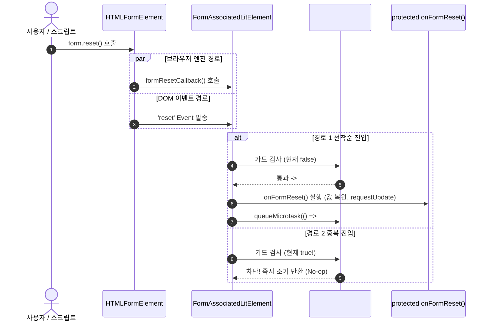
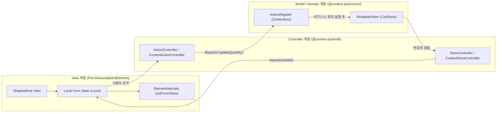

# Form-Associated Custom Elements (FACE) 및 폼 수명주기 아키텍처

이 문서는 `@context-action/lit-ui`에서 제공하는 **`FormAssociatedLitElement`**를 기반으로, 웹 표준 Form-Associated Custom Elements (FACE) 규격을 준수하여 네이티브 `<form>`, `FormData`, Constraint Validation 및 폼 수명주기를 완벽하게 통합하는 아키텍처 및 구현 표준을 정의합니다.

---

## 1. 아키텍처 개요 및 설계 철학

### 1.1 배경 및 문제의식
과거의 웹 컴포넌트(Custom Elements)는 기본적으로 `<span>`이나 `<div>`와 같은 일반 인라인/블록 요소로 취급되어 다음과 같은 근본적 한계를 지녔습니다:
1. **폼 제출 배제**: `<form>` 내부에 배치되어도 `form.submit()` 또는 `new FormData(form)` 실행 시 내부 상태가 자동으로 수집되지 않아, Light DOM에 숨김 `<input type="hidden">`을 주입하는 불안정한 편법(Hacks)에 의존해야 했습니다.
2. **제약 검증(Constraint Validation) 단절**: 브라우저 네이티브 검증 시스템(`checkValidity()`, `reportValidity()`, `:valid`/`:invalid` 가상 클래스)과 단절되어 커스텀 폼 유효성 검사를 외부 라이브러리에 전적으로 위임해야 했습니다.
3. **폼 수명주기 동기화 부재**: `<button type="reset">` 또는 `form.reset()` 호출 시 내부 컴포넌트 상태가 초기화되지 않고 방치되는 불일치가 발생했습니다.
4. **프레임워크 종속성**: React Hook Form, Formik 등 특정 프레임워크 런타임에 강결합된 폼 컴포넌트는 마이크로 프론트엔드(MFE)나 다중 프레임워크 환경에서 재사용할 수 없었습니다.

### 1.2 Form-Associated Custom Elements (FACE)의 해결책
HTML Living Standard에 정의된 **FACE 규격**은 커스텀 엘리먼트가 표준 폼 컨트롤(`<input>`, `<select>`, `<textarea>`)과 완전히 동등한 자격으로 폼에 참여할 수 있는 브라우저 표준 인터페이스를 제공합니다:
- `static readonly formAssociated = true`: 브라우저 렌더링 엔진에 해당 커스텀 엘리먼트가 폼 컨트롤임을 선언합니다.
- `ElementInternals`: `attachInternals()`를 통해 획득하는 호스트 내부 제어 객체로, Shadow DOM 캡슐화를 깨뜨리지 않고 폼 제출 값(`setFormValue`), 제약 검증 플래그(`setValidity`), 접근성 역할(ARIA)을 브라우저 폼 엔진에 직접 등록합니다.
- 폼 수명주기 콜백: 브라우저 엔진이 직접 `formResetCallback()`, `formDisabledCallback()`, `formStateRestoreCallback()`, `formAssociatedCallback()`을 호출합니다.

### 1.3 `FormAssociatedLitElement` 아키텍처 다이어그램

```mermaid
flowchart TB
    subgraph BrowserEngine ["브라우저 네이티브 엔진 (Browser HTML Form Engine)"]
        NativeForm["<form id='order-form'>"]
        FormDataApi["new FormData(form)"]
        FormReset["form.reset() / <button type='reset'>"]
    end

    subgraph FormAssociatedLitElement ["FormAssociatedLitElement (Base Class)"]
        Internals["ElementInternals\n(attachInternals)"]
        FallbackStore["Synthetic Fallback State\n(JSDOM/SSR 안전망)"]
        ResetGuard["Re-entrancy Guard\n(#isResetting + queueMicrotask)"]
        EventListenerSync["Form Event Listener Sync\n(Zero Memory Leak #syncFormListener)"]
    end

    subgraph ConcreteCustomElement ["구현 컴포넌트 (예: <lit-quantity-stepper>)"]
        LitProperties["@property() value, min, max, name"]
        HookReset["protected onFormReset()"]
        HookDisabled["protected onFormDisabled()"]
        ShadowView["ShadowRoot (html`...` + css`...`)"]
    end

    NativeForm -- "폼 제출 시 자동 수집" --> FormDataApi
    FormDataApi -. "엔진 레벨 쿼리" .-> Internals
    Internals -. "동기화" .-> FallbackStore

    FormReset -- "1. 브라우저 엔진 콜백" --> Internals
    FormReset -- "2. DOM 이벤트 브릿지" --> EventListenerSync

    Internals --> ResetGuard
    EventListenerSync --> ResetGuard
    ResetGuard --> HookReset

    LitProperties -- "setFormValue(val)" --> Internals
    LitProperties -- "setValidity(flags, msg)" --> Internals
    HookReset -- "상태 복원 & setFormValue" --> LitProperties
    ShadowView -- "사용자 인터랙션" --> LitProperties
```



---

## 2. ElementInternals 수명주기 및 Defensive Fallback

### 2.1 `ElementInternals` 초기화 및 불변성
`FormAssociatedLitElement`는 생성자(Constructor)에서 `this.attachInternals()`를 안전하게 호출하여 `internals` 프로퍼티에 할당합니다:

```typescript
export class FormAssociatedLitElement extends LitElement {
  static readonly formAssociated = true;
  public readonly internals?: ElementInternals;

  constructor() {
    super();
    if (typeof this.attachInternals === 'function') {
      try {
        this.internals = this.attachInternals();
      } catch {
        // Defensive fallback: 이미 attachInternals가 호출되었거나 JSDOM/SSR 환경인 경우 안전하게 포획
      }
    }
  }
}
```

### 2.2 SSR 및 Headless (JSDOM) Defensive Fallback
단위 테스트(Vitest/Jest)나 SSR(Server-Side Rendering) 환경에서는 `ElementInternals` API가 미구현 상태이거나 불완전할 수 있습니다. `FormAssociatedLitElement`는 완벽한 **Synthetic Fallback State Engine**을 내장하여 브라우저 외부 환경에서도 100% 동일한 동작을 보장합니다:

1. **상태 격리 필드**:
   - `#formValue`: 제출 값 (`File | string | FormData | null`)
   - `#formState`: 세션 복원 및 자동완성 상태
   - `#validityFlags`: 활성화된 유효성 플래그 맵
   - `#validationMessage`: 사용자 안내 오류 메시지
   - `#customError`: `setCustomValidity` 설정 여부
2. **합성 `createSyntheticValidityState`**:
   `ElementInternals.validity`가 제공되지 않을 경우, HTML5 규격에 명시된 10대 제약 검증 플래그(`badInput`, `customError`, `patternMismatch`, `rangeOverflow`, `rangeUnderflow`, `stepMismatch`, `tooLong`, `tooShort`, `typeMismatch`, `valueMissing`)를 집계하여 불변 `ValidityState` 객체를 즉석에서 합성합니다.

```typescript
function createSyntheticValidityState(flags: ValidityStateFlags): ValidityState {
  const badInput = !!flags.badInput;
  const customError = !!flags.customError;
  const patternMismatch = !!flags.patternMismatch;
  const rangeOverflow = !!flags.rangeOverflow;
  const rangeUnderflow = !!flags.rangeUnderflow;
  const stepMismatch = !!flags.stepMismatch;
  const tooLong = !!flags.tooLong;
  const tooShort = !!flags.tooShort;
  const typeMismatch = !!flags.typeMismatch;
  const valueMissing = !!flags.valueMissing;

  const valid = !(
    badInput || customError || patternMismatch || rangeOverflow ||
    rangeUnderflow || stepMismatch || tooLong || tooShort || typeMismatch || valueMissing
  );

  return {
    badInput, customError, patternMismatch, rangeOverflow, rangeUnderflow,
    stepMismatch, tooLong, tooShort, typeMismatch, valid, valueMissing,
  };
}
```

---

## 3. 계층적 폼 연결(Form Association) 결정 전략

커스텀 엘리먼트는 `<form>`의 직계 자식으로 배치될 수도 있지만, HTML5 `form` 속성을 통해 폼 외부에 독립적으로 배치될 수도 있습니다.

`FormAssociatedLitElement.prototype.form` getter는 다음의 **3단계 계층적 폴백 전략**으로 소유 폼을 정확히 판별합니다:

1. **`ElementInternals.form`**: 브라우저 엔진이 인식한 공식 `HTMLFormElement`를 우선 반환합니다.
2. **`form` 속성 ID 조회 (`this.getAttribute('form')`)**: 엘리먼트에 `form="order-form"` 속성이 지정된 경우, `ownerDocument.getElementById('order-form')`을 검색하여 해당 폼 인스턴스를 반환합니다.
3. **조상 트리 탐색 (`this.closest('form')`)**: 엘리먼트 상위 DOM 트리를 순회하여 가장 가까운 `<form>`을 탐색합니다.

```typescript
get form(): HTMLFormElement | null {
  if (this.internals && 'form' in this.internals && this.internals.form !== undefined) {
    return this.internals.form;
  }

  const formAttr = this.getAttribute('form');
  if (formAttr && this.ownerDocument) {
    const el = this.ownerDocument.getElementById(formAttr);
    if (el instanceof HTMLFormElement) return el;
  }

  return this.closest('form');
}
```

---

## 4. 폼 값 관리 (Form Value APIs)

### 4.1 기본 단일 값 제출
`setFormValue(value, state?)`를 통해 폼에 제출할 값을 설정합니다.
- `value`: `string`, `File`, `FormData`, 또는 제출에서 제외할 경우 `null`.
- `state`: 뒤로 가기/앞으로 가기 캐시 또는 자동 완성 복원에 사용될 임의의 직렬화 가능 객체.

```typescript
// 단일 문자열 값 등록
this.setFormValue(String(this.count));

// 폼 제출에서 임시 제외 (예: 비활성화 또는 조건부 필드)
this.setFormValue(null);
```

### 4.2 복합 `FormData` 제출 패턴
단일 커스텀 엘리먼트(예: 주소 입력기, 날짜 범위 선택기, 신용카드 결제 블록)가 여러 개의 필드 데이터를 동시에 제출해야 하는 경우, 내부 `FormData`를 생성하여 전달할 수 있습니다:

```typescript
const compoundData = new FormData();
compoundData.append(`${this.name}_startDate`, this.startDate);
compoundData.append(`${this.name}_endDate`, this.endDate);
this.setFormValue(compoundData);
```
브라우저 엔진과 상위 `new FormData(parentForm)`는 내부 `FormData`의 모든 엔트리를 상위 폼 데이터에 자동으로 병합합니다.

---

## 5. 제약 검증(Constraint Validation) 엔진

### 5.1 10대 표준 유효성 플래그 (`ValidityStateFlags`)
`setValidity(flags, message?, anchor?)`는 W3C/HTML 표준 플래그 맵을 수신합니다:

| 플래그 명칭 | 표준 조건 및 발생 상황 |
|---|---|
| `valueMissing` | `required` 속성이 지정되었으나 값이 비어있는 경우 |
| `rangeUnderflow` | 숫자가 `min` 속성보다 작은 경우 |
| `rangeOverflow` | 숫자가 `max` 속성보다 큰 경우 |
| `patternMismatch` | 문자열이 정규표현식 `pattern`과 불일치하는 경우 |
| `tooShort` | 문자열 길이가 `minlength`보다 짧은 경우 |
| `tooLong` | 문자열 길이가 `maxlength`를 초과하는 경우 |
| `stepMismatch` | 숫자가 지정된 `step` 배수와 불일치하는 경우 |
| `typeMismatch` | 입력값이 `email`, `url` 등의 형식과 불일치하는 경우 |
| `badInput` | 브라우저가 사용자 입력을 유효한 데이터 타입으로 변환할 수 없는 경우 |
| `customError` | `setCustomValidity()` 또는 비즈니스 로직에 의해 커스텀 오류 메시지가 등록된 경우 |

### 5.2 툴팁 앵커(`anchor`) 지정
Shadow DOM 내부의 특정 인풋이나 버튼 요소(`HTMLElement`)를 3번째 인자로 전달하면, 브라우저의 기본 툴팁(말풍선)이 Shadow DOM 내부의 해당 요소를 정확히 가리키도록 지정할 수 있습니다:

```typescript
const inputElement = this.renderRoot.querySelector('input');
this.setValidity({ rangeUnderflow: true }, '최소 수량 미만입니다.', inputElement ?? undefined);
```

### 5.3 `checkValidity()` vs `reportValidity()`
- **`checkValidity()`**: 엘리먼트의 유효성을 검사합니다.
  - `willValidate`가 `false`(예: `disabled = true`)이면 항상 `true`를 반환합니다.
  - 유효하지 않으면 `invalid` DOM 이벤트를 엘리먼트 자신에게 디스패치하고 `false`를 반환합니다.
  - **이벤트 전파 제약**: HTML 규격에 따라 `invalid` 이벤트는 **버블링되지 않으며(`bubbles: false`) 취소 가능(`cancelable: true`)**합니다. 상위 `<form>`으로 버블링되지 않으므로 캡처 리스너나 직접 바인딩을 통해서만 관측할 수 있습니다.
- **`reportValidity()`**: 유효하지 않은 경우 브라우저 네이티브 오류 팝업 툴팁을 사용자 화면에 직접 노출하고 포커스를 이동합니다.

### 5.4 `setCustomValidity(message)` 편의 메서드
네이티브 `<input>`과 동일하게 단일 문자열로 커스텀 에러를 설정하거나 해제합니다:
- `this.setCustomValidity('아이디가 이미 사용 중입니다.')`: `{ customError: true }` 설정 및 유효성 실패 처리.
- `this.setCustomValidity('')`: 커스텀 에러 해제 및 정상 유효 상태 복원.

---

## 6. 폼 리셋 수명주기 및 재진입 방지 아키텍처

### 6.1 폼 리셋의 이중 경로 (Dual Reset Dispatch)
웹 폼 환경에서 리셋 이벤트는 두 가지 경로로 전달됩니다:
1. **브라우저 엔진 직접 호출**: 사용자가 `<button type="reset">`을 클릭하거나 스크립트가 `form.reset()`을 실행할 때 브라우저 엔진이 엘리먼트의 `formResetCallback()`을 직접 호출합니다.
2. **DOM 이벤트 리스너**: 엔진 레벨 FACE 콜백이 누락된 구형/가상 환경이나 외부 프레임워크 래퍼에서는 `form.addEventListener('reset', ...)` DOM 이벤트를 통해 리셋을 전달받아야 합니다.

### 6.2 재진입 방지 가드 (`#isResetting`) 및 Microtask Settling
만약 개발자의 `onFormReset()` 훅 내부에서 `this.form.reset()`을 다시 호출하거나, 엔진 콜백과 DOM 이벤트가 동일 틱에 연속으로 호출되면 무한 루프(스택 오버플로우)가 발생할 수 있습니다.

`FormAssociatedLitElement`는 **`#isResetting` 가드**와 **`queueMicrotask`** 스케줄러를 결합하여 완벽한 재진입 차단 메커니즘을 제공합니다:

```typescript
public formResetCallback(): void {
  // 이미 리셋 처리 중이면 즉시 반환하여 무한 루프 및 중복 연산 방지
  if (this.#isResetting) return;
  this.#isResetting = true;
  try {
    this.onFormReset();
  } finally {
    // 현재 동기 실행 틱 및 마이크로태스크가 모두 완료된 후에 가드를 해제
    queueMicrotask(() => {
      this.#isResetting = false;
    });
  }
}
```



### 6.3 리셋 취소 (`event.defaultPrevented`) 지원
폼 리셋 이벤트가 캡처 단계에서 `e.preventDefault()`로 취소된 경우(예: 확인 대화상자에서 "취소" 선택), 커스텀 엘리먼트는 리셋을 수행하지 않고 기존 수정 상태를 유지해야 합니다:

```typescript
#handleFormReset = (event: Event): void => {
  if (this.#isResetting || event.defaultPrevented) return;
  this.formResetCallback();
};
```

### 6.4 리스너 자동 동기화 및 메모리 누수 방지 (Zero Memory Leak)
커스텀 엘리먼트가 DOM에서 분리(`disconnectedCallback`)되거나 소유 폼이 동적으로 변경될 때, 이전 폼에 바인딩된 리스너를 즉시 해제하여 완벽한 가비지 컬렉션을 보장합니다:

```typescript
#syncFormListener(newForm: HTMLFormElement | null): void {
  if (this.#associatedForm === newForm) return;

  if (this.#associatedForm) {
    this.#associatedForm.removeEventListener('reset', this.#handleFormReset);
  }

  this.#associatedForm = newForm;

  if (this.#associatedForm) {
    this.#associatedForm.addEventListener('reset', this.#handleFormReset);
  }
}

override connectedCallback(): void {
  super.connectedCallback();
  this.#syncFormListener(this.form);
}

override disconnectedCallback(): void {
  this.#syncFormListener(null); // 완전 unbind 보장
  super.disconnectedCallback();
}
```

---

## 7. 수명주기 훅 (Subclassing Lifecycle Hooks)

서브클래스는 네이티브 FACE 콜백 대신 정형화된 `protected on*` 수명주기 훅을 오버라이드하여 비즈니스 로직을 작성합니다:

| 오버라이드 훅 | 호출 시점 | 서브클래스 권장 작업 |
|---|---|---|
| `protected onFormReset(): void` | 상위 폼이 초기화될 때 | 초기값 복원, `setFormValue()` 갱신, `setValidity({})` 초기화, `requestUpdate()` 호출 |
| `protected onFormDisabled(disabled: boolean): void` | 상위 `<fieldset>` 또는 엘리먼트가 비활성화/활성화될 때 | 내부 UI 컨트롤 비활성화 스타일 반영 (기본 클래스가 `this.disabled` 갱신 및 `requestUpdate()` 자동 수행) |
| `protected onFormStateRestore(state: unknown, mode: 'restore' \| 'autocomplete'): void` | 브라우저가 히스토리 탐색 또는 자동완성 상태를 복원할 때 | 복원된 상태 객체를 파싱하여 내부 UI 상태 복원 |
| `protected onFormAssociated(form: HTMLFormElement \| null): void` | 엘리먼트가 폼과 연결되거나 해제될 때 | 외부 폼 참조 갱신 또는 커스텀 폼 유효성 파이프라인 연계 |

---

## 8. 실전 구현 레시피: `<lit-quantity-stepper>`

다음은 `FormAssociatedLitElement`를 상속하여 완벽한 폼 참여, 제약 검증, 리셋 연동, 스타일 캡슐화를 구현한 수량 조절 컴포넌트의 표준 레시피입니다:

```typescript
import { html, css } from 'lit';
import { customElement, property, state } from 'lit/decorators.js';
import { FormAssociatedLitElement } from '@context-action/lit-ui';

@customElement('lit-quantity-stepper')
export class LitQuantityStepper extends FormAssociatedLitElement {
  static override styles = css`
    :host {
      display: inline-flex;
      align-items: center;
      font-family: system-ui, -apple-system, sans-serif;
    }
    :host([disabled]) {
      opacity: 0.5;
      pointer-events: none;
    }
    .stepper {
      display: inline-flex;
      align-items: center;
      border: 1px solid #cbd5e1;
      border-radius: 8px;
      background: #ffffff;
      overflow: hidden;
    }
    :host(:invalid) .stepper {
      border-color: #ef4444;
    }
    button {
      background: #f8fafc;
      border: none;
      padding: 8px 14px;
      font-size: 16px;
      font-weight: 600;
      cursor: pointer;
      color: #334155;
    }
    button:hover:not(:disabled) {
      background: #e2e8f0;
    }
    button:disabled {
      cursor: not-allowed;
      opacity: 0.4;
    }
    .value-display {
      min-width: 44px;
      text-align: center;
      font-size: 15px;
      font-weight: 700;
      color: #0f172a;
      padding: 0 8px;
    }
  `;

  @property({ type: Number })
  min = 1;

  @property({ type: Number })
  max = 99;

  @property({ type: Number })
  initialValue = 1;

  @state()
  private count = 1;

  override connectedCallback(): void {
    super.connectedCallback();
    this.count = this.initialValue;
    this.#syncFormState();
  }

  #syncFormState(): void {
    // 1. 네이티브 폼 제출 값 등록
    this.setFormValue(String(this.count));

    // 2. 제약 검증 평가
    if (this.count < this.min) {
      this.setValidity({ rangeUnderflow: true }, `최소 수량은 ${this.min}개입니다.`);
    } else if (this.count > this.max) {
      this.setValidity({ rangeOverflow: true }, `최대 수량은 ${this.max}개입니다.`);
    } else {
      this.setValidity({});
    }

    // 3. 커스텀 변경 이벤트 전파
    this.dispatchEvent(
      new CustomEvent('quantity-change', {
        detail: { value: this.count },
        bubbles: true,
        composed: true,
      })
    );
  }

  public increment(): void {
    if (this.disabled || this.count >= this.max) return;
    this.count += 1;
    this.#syncFormState();
    this.requestUpdate();
  }

  public decrement(): void {
    if (this.disabled || this.count <= this.min) return;
    this.count -= 1;
    this.#syncFormState();
    this.requestUpdate();
  }

  /**
   * 폼 리셋 시 브라우저가 호출하는 훅 오버라이드
   */
  protected override onFormReset(): void {
    this.count = this.initialValue;
    this.#syncFormState();
    this.requestUpdate();
  }

  override render() {
    return html`
      <div class="stepper" role="group" aria-label="수량 선택기">
        <button
          type="button"
          ?disabled=${this.disabled || this.count <= this.min}
          @click=${this.decrement}
          aria-label="수량 감소"
        >−</button>
        <span class="value-display" aria-live="polite">${this.count}</span>
        <button
          type="button"
          ?disabled=${this.disabled || this.count >= this.max}
          @click=${this.increment}
          aria-label="수량 증가"
        >+</button>
      </div>
    `;
  }
}
```

---

## 9. Context-Action 3계층 아키텍처와의 조화

FACE 컴포넌트는 단독 독립형 폼 요소로도 동작하지만, Context-Action 아키텍처와 결합하여 전역 상태 저장소 및 액션 파이프라인과 완벽히 동기화될 수 있습니다.



1. **View 계층**: `FormAssociatedLitElement`는 사용자 이벤트(클릭/입력)를 수신하고, 브라우저 표준 폼 엔진(`ElementInternals`)에 상태를 동기화합니다.
2. **Controller 계층**: `StoreController`와 `ActionController`는 Lit의 `ReactiveController` 규격에 따라 컴포넌트의 수명주기(`hostConnected`, `hostDisconnected`)와 결합되어 메모리 누수 없이 구독을 유지/해제합니다.
3. **Model 계층**: 비즈니스 규칙(재고 한도, 장바구니 총액 계산)은 순수한 `ActionRegister` 파이프라인 핸들러에서 수행되며, UI 렌더링에 종속되지 않습니다.

---

## 10. React 상호운용성 연동 (`createLitElementBridge`)

외부 React 애플리케이션에서 `FormAssociatedLitElement` 커스텀 엘리먼트를 사용할 때는 `@context-action/lit-ui`의 `createLitElementBridge`를 사용합니다:

```tsx
import React, { useRef } from 'react';
import { createLitElementBridge } from '@context-action/lit-ui';
import type { LitQuantityStepper } from './lit-quantity-stepper.js';

interface QuantityStepperBridgeProps {
  name: string;
  min?: number;
  max?: number;
  initialValue?: number;
  disabled?: boolean;
  onQuantityChange?: (e: CustomEvent<{ value: number }>) => void;
}

export const ReactQuantityStepper = createLitElementBridge<
  QuantityStepperBridgeProps,
  LitQuantityStepper
>({
  tagName: 'lit-quantity-stepper',
  properties: ['min', 'max', 'initialValue', 'disabled'],
  events: {
    onQuantityChange: 'quantity-change',
  },
});

// React 폼 내부 사용
export function CheckoutForm() {
  const stepperRef = useRef<LitQuantityStepper>(null);

  const handleSubmit = (e: React.FormEvent<HTMLFormElement>) => {
    e.preventDefault();
    const formData = new FormData(e.currentTarget);
    console.log('선택된 수량:', formData.get('itemQuantity')); // FACE가 네이티브로 자동 포함!
  };

  return (
    <form onSubmit={handleSubmit}>
      <label>주문 수량:</label>
      <ReactQuantityStepper
        ref={stepperRef}
        name="itemQuantity"
        min={1}
        max={10}
        initialValue={2}
      />
      <button type="submit">주문하기</button>
      <button type="reset">초기화</button>
    </form>
  );
}
```

### React 브릿지의 세 가지 핵심 보장
1. **프로퍼티 문자열화 방지**: React 18에서 객체/숫자 프로퍼티를 DOM 어트리뷰트 문자열로 변환하지 않고 DOM 인스턴스에 직접 할당합니다.
2. **커스텀 이벤트 생명주기 관리**: `onQuantityChange`를 네이티브 `addEventListener('quantity-change')`로 안전하게 바인딩하고 언마운트 시 자동 해제합니다.
3. **네이티브 DOM Ref 접근**: `stepperRef.current.checkValidity()` 또는 `stepperRef.current.formValue`에 직접 접근할 수 있도록 완전한 `forwardRef`를 지원합니다.

---

## 11. 체크리스트 및 베스트 프랙티스

| 점검 항목 | 권장 지침 | 위반 시 문제점 |
|---|---|---|
| **정적 플래그 선언** | 클래스 상단에 `static readonly formAssociated = true;` 필수 선언 | 브라우저 엔진이 `attachInternals`를 거부하거나 폼 제출에서 제외됨 |
| **`setFormValue` 동기화** | 내부 상태가 변경될 때마다 지체 없이 `this.setFormValue(...)` 호출 | 폼 제출(`FormData`) 시 이전 값이나 빈 값이 제출되는 불일치 발생 |
| **`onFormReset` 구현** | 초기값으로 복원하고 `setFormValue`, `setValidity({})`, `requestUpdate()` 필수 호출 | 사용자가 폼을 리셋해도 커스텀 컴포넌트만 수정된 상태로 남아있게 됨 |
| **재진입 방지 가드 준수** | `formResetCallback`을 오버라이드하지 말고 항상 `protected onFormReset`을 오버라이드 | `#isResetting` 가드가 우회되어 무한 재귀 호출 및 스택 오버플로우 위험 발생 |
| **네이티브 `disabled` 동기화** | `this.disabled = true` 시 `willValidate`가 `false`로 자동 전환됨을 이해하고 UI 반영 | 비활성화된 필드 때문에 폼 제출이 차단되는 치명적 UX 결함 발생 |
| **`invalid` 이벤트 전파 제약** | `invalid` 이벤트는 버블링되지 않으므로 폼 레벨에서 관측하려면 캡처 단계 사용 | 상위 폼 레벨의 일반 버블링 리스너에서 유효성 실패를 감지하지 못함 |
| **Shadow DOM 툴팁 앵커** | `setValidity(flags, msg, anchorElement)`로 포커스 가능한 내부 요소 지정 | 브라우저 네이티브 툴팁이 컴포넌트 엉뚱한 위치를 가리키거나 포커스가 유실됨 |
