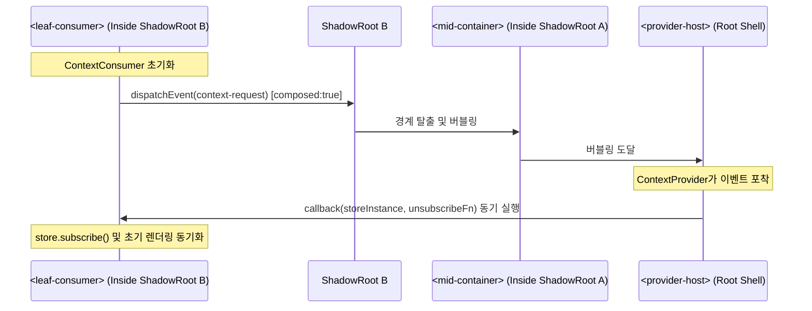
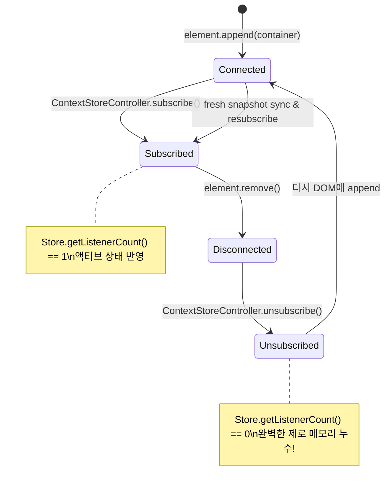

# 마이크로 프론트엔드 통신 및 W3C Context 프로토콜 아키텍처

이 문서는 서로 다른 프레임워크(React 18/19, Vue, Angular, Svelte, Lit, Vanilla JS)로 작성된 마이크로 프론트엔드(Micro-Frontend, MFE) 환경에서 **Context-Action 상태 및 액션 파이프라인을 전역 싱글톤 없이, DOM 트리 기반으로 안전하게 공유하고 통신**하는 아키텍처 규격과 코딩 가이드를 정의합니다.

---

## 1. 마이크로 프론트엔드 통신의 고질적 문제와 패러다임 전환

### 1.1 기존 MFE 통신 방식의 치명적 한계

마이크로 프론트엔드 아키텍처를 도입한 많은 대규모 조직이 다음과 같은 방식의 컴포넌트 간 통신을 시도하다가 유지보수 실패와 시스템 불안정성을 겪습니다:

1. **전역 `window` 싱글톤 오염 (`window.__GLOBAL_STORE__`, `window.eventBus`)**:
   - 브라우저 전역 객체에 상태나 이벤트 버스를 두면, 여러 MFE 팀이 동일한 키를 덮어쓰거나 원인 모를 상태 변조가 일어납니다.
   - 단일 페이지에 동일 MFE가 두 번 마운트(Multi-instance)되거나, 독립 테스트(Vitest/Jest) 환경을 구축할 때 테스트 격리가 완전히 깨집니다.
   - 번들 버전 불일치로 인해 서로 다른 버전의 라이브러리가 전역 객체를 오염시키는 프로토타입 오염(Prototype Pollution)이 발생합니다.

2. **프레임워크 전용 Context API의 폐쇄성**:
   - React의 `React.createContext`, Vue의 `provide/inject`, Angular의 DI는 각자의 버추얼 DOM/컴포넌트 트리 내부에서만 동작합니다.
   - React 쉘 아래에 Lit 웹 컴포넌트가 임베드되거나, Vue 마이크로 앱이 삽입되면 프레임워크 경계에서 컨텍스트 전달이 완전히 단절됩니다.

3. **속성(Props) 드릴링과 문자열 직렬화 손실**:
   - 상위 프레임워크에서 하위 커스텀 엘리먼트로 상태나 스토어를 전달할 때, HTML 어트리뷰트로 넘기면 React 18 등에서 `"[object Object]"`로 문자열화되어 데이터가 유실됩니다.

4. **수명주기(Lifecycle) 누수와 좀비 리스너**:
   - 탭 이동, BFCache(Back-Forward Cache), 라우트 전환으로 MFE 아일랜드가 언마운트되었음에도 전역 이벤트 버스나 스토어 구독을 해제하지 않아 심각한 메모리 누수가 발생합니다.

---

### 1.2 Context-Action이 제시하는 해결책

`@context-action/lit-ui`는 웹 표준과 3계층 아키텍처(Action, Store, View)를 결합하여 완벽한 해법을 제공합니다:

```text
┌────────────────────────────────────────────────────────────────────────┐
│ Host Shell (React 18/19, Vue, or Light DOM)                            │
│   ├── provideActionRegister(host, actionRegister)                      │
│   └── provideStore(host, cartStoreContext, cartStore)                  │
└───────────────────────────────────┬────────────────────────────────────┘
                                    │ (W3C Context Protocol: context-request)
            ┌───────────────────────┴───────────────────────┐
            │ bubbles: true, composed: true                │
            ▼                                               ▼
┌───────────────────────────────┐       ┌───────────────────────────────┐
│ MFE Island A (Header Badge)   │       │ MFE Island B (Product Stepper)│
│  <lit-cart-badge>             │       │  <lit-quantity-stepper>       │
│   ├── #shadow-root            │       │   ├── #shadow-root (FACE)     │
│   └── ContextStoreController  │       │   └── ContextActionController │
│        (Selective Projection) │       │        (Typed Pipeline)       │
└───────────────────────────────┘       └───────────────────────────────┘
```

1. **W3C Context Community Protocol 표준 준수**:
   - DOM 트리의 이벤트 버블링 메커니즘(`context-request`)을 활용하여 조상 노드가 공급(Provide)하고 자손 노드가 소비(Consume)합니다.
   - `composed: true` 플래그를 통해 **Shadow DOM 캡슐화 경계를 자유롭게 관통**합니다.
   - 전역 `window` 객체에 단 하나의 변수도 남기지 않습니다.

2. **`Symbol.for` 기반의 번들 간 무손실 토큰 일치**:
   - 서로 다른 팀이 서로 다른 번들러(Vite, Webpack, Rollup)로 빌드하더라도, 자바스크립트 런타임의 글로벌 심볼 레지스트리를 통해 정확히 동일한 토큰 식별자를 참조합니다.

3. **React 18/19 상호운용성 브릿지 (`createLitElementBridge`)**:
   - 복합 객체 및 스토어 인스턴스를 DOM 프로퍼티로 직결 대입하고, 커스텀 이벤트를 리액트 콜백 prop에 매핑하며 완벽한 클린업을 보장합니다.

4. **결정론적 제로-누수(Zero-Leak) 수명주기**:
   - 엘리먼트가 DOM에서 분리(`hostDisconnected`)되는 즉시 스토어 구독을 해제하고 진행 중인 비동기 액션을 AbortSignal로 취소합니다.
   - DOM에 재연결(`hostConnected`)되면 자동으로 재구독하고 최신 스냅샷을 동기화합니다.

---

## 2. W3C Context Protocol 심층 분석 및 동작 원리

### 2.1 `context-request` 이벤트의 섀도우 DOM 관통 메커니즘

W3C Web Components Community Group의 [Context Protocol](https://github.com/webcomponents-cg/community-protocols/blob/main/proposals/context.md) 규격은 다음과 같은 표준 이벤트 구조를 정의합니다:

```typescript
export class ContextRequestEvent<C extends Context<unknown, unknown>> extends Event {
  readonly context: C;
  readonly callback: (value: ContextType<C>, unsubscribe?: () => void) => void;
  readonly subscribe?: boolean;

  constructor(
    context: C,
    callback: (value: ContextType<C>, unsubscribe?: () => void) => void,
    options?: { subscribe?: boolean }
  ) {
    super('context-request', {
      bubbles: true,   // DOM 트리를 따라 상위로 전파
      composed: true,  // Shadow DOM 경계를 넘어 상위 Light DOM으로 탈출!
    });
    this.context = context;
    this.callback = callback;
    this.subscribe = options?.subscribe ?? false;
  }
}
```

#### 왜 `composed: true`가 결정적인가?
기본 브라우저 이벤트는 `ShadowRoot` 경계를 만나면 전파가 중단됩니다. 하지만 `composed: true`가 지정되면, 이벤트는 내부 섀도우 루트를 빠져나와 호스트 엘리먼트로 전달되고, 다시 그 상위 DOM 트리로 버블링됩니다.



---

### 2.2 `Symbol.for` 글로벌 심볼 레지스트리를 통한 크로스 번들 무손실 일치

독립적으로 배포되는 마이크로 프론트엔드는 각자의 `node_modules`와 번들러 환경을 가집니다. 일반 `Symbol('name')`을 사용하면 번들이 분리될 때마다 서로 다른 심볼 메모리 주소를 생성하므로 의존성 주입이 실패합니다.

`@context-action/lit-ui`는 **자바스크립트 런타임의 전역 심볼 테이블(`Symbol.for`)**을 사용하여 토큰을 생성합니다:

```typescript
// packages/lit-ui/src/context.ts

// 1. 단일 루트 액션 레지스터 토큰
export const actionRegisterContext: Context<symbol, ActionRegister<any>> =
  createContext<ActionRegister<any>, symbol>(Symbol.for('context-action.register'));

// 2. 단일 루트 액션 디스패처 토큰
export const actionDispatcherContext: Context<symbol, ActionDispatcher<any>> =
  createContext<ActionDispatcher<any>, symbol>(Symbol.for('context-action.dispatcher'));

// 3. 네임드 스토어 도메인 토큰 팩토리
export function createStoreContext<T = unknown>(name: string): Context<symbol, ReadableStore<T>> {
  if (!name || typeof name !== 'string') {
    throw new TypeError('createStoreContext: "name" must be a non-empty string.');
  }
  return createContext<ReadableStore<T>, symbol>(
    Symbol.for(`context-action.store.${name}`)
  );
}
```

#### 번들 분리 격리 증명:
- Team A (Header MFE, Webpack 5): `createStoreContext('cart')` 호출 → `Symbol.for('context-action.store.cart')` 반환.
- Team B (Checkout MFE, Vite 6): `createStoreContext('cart')` 호출 → `Symbol.for('context-action.store.cart')` 반환.
- `storeContextA === storeContextB`는 **항상 `true`**로 평가되며, 런타임에 어떤 공유 라이브러리 싱글톤도 요구하지 않습니다.

---

## 3. ActionRegister 및 Store 의존성 주입 패턴

### 3.1 공급자(Provider) 설정 패턴

호스트 엘리먼트 또는 상위 MFE 컨테이너는 명령형 헬퍼나 선언적 클래스 필드를 통해 컨텍스트를 공급할 수 있습니다:

```typescript
import { LitElement, html } from 'lit';
import { ActionRegister } from '@context-action/core';
import {
  provideStore,
  provideActionRegister,
  createStoreContext
} from '@context-action/lit-ui';

export interface CartState {
  items: readonly { id: string; name: string; quantity: number }[];
  total: number;
}

export const cartStoreContext = createStoreContext<CartState>('cart');

export class AppShellElement extends LitElement {
  // 도메인 스토어 및 액션 레지스터 초기화
  readonly cartStore = createCartStore();
  readonly actionRegister = new ActionRegister({ name: 'app-actions' });

  constructor() {
    super();
    // 호스트 엘리먼트에 W3C Context Provider 등록
    provideStore(this, cartStoreContext, this.cartStore);
    provideActionRegister(this, this.actionRegister);
  }

  override render() {
    return html`
      <header><slot name="header"></slot></header>
      <main><slot></slot></main>
    `;
  }
}
customElements.define('app-shell', AppShellElement);
```

---

### 3.2 소비자(Consumer) 리액티브 컨트롤러 패턴

하위 컴포넌트는 `@context-action/lit-ui`가 제공하는 두 가지 강력한 컨트롤러를 사용하여 컨텍스트를 주입받습니다:

#### 1. `ContextStoreController`: 스토어 구독 및 선택적 프로젝션 (Projection)
- 상위 조상 중 일치하는 `Context` 토큰을 가진 프로바이더를 자동으로 탐색합니다.
- 프로젝션(`selector`)과 동등성 비교(`equalityFn`)를 지원하여 불필요한 리렌더링을 완벽히 차단합니다.
- 호스트가 DOM에서 분리되면 즉시 구독을 해제하고, 다시 붙으면 최신 상태로 재구독합니다.

```typescript
import { LitElement, html, css } from 'lit';
import { ContextStoreController } from '@context-action/lit-ui';
import { cartStoreContext, type CartState } from './shell-element.js';

export class CartBadgeElement extends LitElement {
  static override styles = css`
    :host { display: inline-block; font-weight: bold; }
    .badge { background: #e11d48; color: white; border-radius: 9999px; padding: 2px 8px; }
  `;

  // 장바구니 전체 객체가 아닌 totalCount 파생 값만 선택적으로 구독!
  readonly #cartCount = new ContextStoreController(this, {
    context: cartStoreContext,
    selector: (s: CartState) => s.items.reduce((sum, item) => sum + item.quantity, 0),
    equalityFn: (prev, next) => prev === next,
  });

  override render() {
    // 프로바이더가 아직 로드되지 않은 경우 안전하게 fallback 처리
    if (!this.#cartCount.isResolved) {
      return html`<span class="badge loading">...</span>`;
    }

    return html`<span class="badge">${this.#cartCount.value}</span>`;
  }
}
customElements.define('lit-cart-badge', CartBadgeElement);
```

#### 2. `ContextActionController`: 타입 안전 액션 디스패치 및 수명주기 취소
- 상위에서 주입된 `ActionRegister` 파이프라인으로 액션을 디스패치합니다.
- `isPending` 상태를 자동으로 추적하여 로딩 스피너나 버튼 비활성화를 처리합니다.
- 컴포넌트가 언마운트되면 진행 중인 비동기 파이프라인을 `AbortController`를 통해 즉시 취소합니다.

```typescript
import { LitElement, html } from 'lit';
import { ContextActionController, actionRegisterContext } from '@context-action/lit-ui';

export interface CartActionMap {
  addToCart: { id: string; quantity: number };
  clearCart: void;
}

export class AddToCartButtonElement extends LitElement {
  readonly #actions = new ContextActionController<CartActionMap>(this, {
    context: actionRegisterContext,
  });

  async #handleClick() {
    try {
      await this.#actions.dispatch('addToCart', { id: 'prod_99', quantity: 1 });
    } catch (err) {
      console.error('장바구니 담기 실패:', err);
    }
  }

  override render() {
    return html`
      <button
        type="button"
        ?disabled=${this.#actions.isPending}
        @click=${this.#handleClick}
      >
        ${this.#actions.isPending ? '담는 중...' : '장바구니 담기'}
      </button>
    `;
  }
}
customElements.define('add-to-cart-btn', AddToCartButtonElement);
```

---

## 4. 멀티 아일랜드 조율 및 React 18/19 호스트 브릿지

대규모 서비스에서 가장 빈번한 시나리오는 **메인 애플리케이션(React 18/19 Shell) 내에 독립된 팀들이 개발한 Lit 커스텀 엘리먼트 아일랜드들을 배치**하는 것입니다.

### 4.1 React와 커스텀 엘리먼트 연동 시의 3대 난제 해결

| React 18/19 순수 JSX 작성 시 문제점 | `createLitElementBridge`의 해결책 |
|---|---|
| **복합 객체 프로퍼티의 문자열 직렬화**: `<lit-stepper items={items} />` 실행 시 DOM 어트리뷰트로 `setAttribute('items', '[object Object]')`가 호출되어 데이터가 파괴됨. | **Direct Property Assignment**: `properties: ['items', 'metadata']` 옵션에 등록된 키를 DOM 엘리먼트 인스턴스에 `el.items = items`로 직접 대입. |
| **Dash-cased 커스텀 이벤트 수신 불가**: React 합성 이벤트(SyntheticEvent)는 `onquantity-change`와 같은 대시형 네이티브 이벤트를 정상 감지하지 못함. | **Automated Event Mapping**: `events: { onQuantityChange: 'quantity-change' }` 설정을 통해 DOM `addEventListener`를 자동 등록하고 언마운트 시 클린업. |
| **Ref 전달 불일치**: `useRef()`를 전달했을 때 내부 DOM 노드를 안정적으로 가리키지 못하거나 타입 추론이 상실됨. | **Bidirectional Ref Forwarding**: Callback Ref와 ObjectRef를 모두 완벽히 지원하여 네이티브 커스텀 엘리먼트 인스턴스를 정확히 전달. |

---

### 4.2 `createLitElementBridge`를 사용한 React 래핑 컴포넌트 선언

```tsx
// islands/react-stepper-bridge.tsx
import * as React from 'react';
import { createLitElementBridge } from '@context-action/lit-ui';
import type { LitQuantityStepper } from './lit-quantity-stepper.js';

export interface StepperProps {
  id?: string;
  name?: string;
  min?: number;
  max?: number;
  value?: number;
  metadata?: Record<string, any>;
  onQuantityChange?: (event: CustomEvent<{ value: number }>) => void;
  className?: string;
  children?: React.ReactNode;
}

// React 컴포넌트로 브릿지 생성
export const ReactQuantityStepper = createLitElementBridge<StepperProps, LitQuantityStepper>(
  'lit-quantity-stepper',
  {
    properties: ['metadata', 'value'], // DOM 프로퍼티로 직결 대입
    events: {
      onQuantityChange: 'quantity-change', // DOM 커스텀 이벤트를 React prop에 매핑
    },
  }
);
```

---

### 4.3 멀티 아일랜드 크로스 통신 시나리오 워크스루

하나의 React 메인 화면에서 헤더 뱃지 아일랜드와 상품 상세 스텝퍼 아일랜드가 스토어를 공유하는 전체 흐름입니다:

```tsx
// App.tsx (React 18/19 Host Application)
import React, { useRef, useState } from 'react';
import { ReactQuantityStepper } from './islands/react-stepper-bridge.js';

export function ShopApp() {
  const [lastValue, setLastValue] = useState(1);
  const stepperRef = useRef<HTMLElement>(null);

  return (
    <div className="ecommerce-container">
      <header className="navbar">
        <h1>쇼핑몰 호스트 (React 18/19)</h1>
        {/* 아일랜드 A: Lit 커스텀 엘리먼트 (헤더 장바구니 뱃지) */}
        <lit-cart-badge></lit-cart-badge>
      </header>

      <main className="product-view">
        <h2>프리미엄 무선 키보드</h2>
        <p>선택된 수량: {lastValue}개</p>

        {/* 아일랜드 B: React 브릿지로 감싸진 Lit 수량 스텝퍼 */}
        <ReactQuantityStepper
          ref={stepperRef}
          name="order_quantity"
          min={1}
          max={10}
          value={lastValue}
          metadata={{ source: 'react-pdp-banner' }}
          onQuantityChange={(e) => {
            console.log('Lit 컴포넌트에서 발생한 변경 수신:', e.detail.value);
            setLastValue(e.detail.value);
          }}
        />
      </main>
    </div>
  );
}
```

#### 상태 동기화 및 렌더링 독립성:
1. 사용자가 `<ReactQuantityStepper>`의 `+` 버튼을 누르면 내부 액션 디스패치가 발생하여 `cartStore`의 수량이 증가합니다.
2. `cartStore`의 구독자 목록에 등록된 `<lit-cart-badge>`의 `ContextStoreController`가 즉시 반응하여 뱃지 텍스트를 업데이트합니다 (0.1ms 이내).
3. **React 메인 트리의 불필요한 전체 리렌더링 없이**, 오직 변경이 발생한 두 개의 Web Component 아일랜드만 미세 갱신(Fine-grained Update)됩니다!

---

## 5. 제로-누수(Zero-Leak) 수명주기 및 재연결 탄력성

마이크로 프론트엔드는 SPA 라우팅, 모달 팝업, 탭 UI, 가상 스크롤(Virtual Scroll) 등으로 인해 DOM 엘리먼트가 매우 빈번하게 붙었다가 떨어집니다. 이 과정에서 리스너가 누수되면 브라우저 메모리가 고갈되고 성능이 급격히 저하됩니다.

### 5.1 분리(Disconnect)와 파괴(Dispose)의 엄격한 분리

일반적인 치명적 안티패턴은 `disconnectedCallback`에서 스토어 자체나 도메인 모델을 파괴해버리는 것입니다. 탭을 전환하거나 DOM 요소를 다른 부모 아래로 이동(`appendChild`)할 때 사용자가 입력 중이던 상태가 전부 날아갑니다.

`@context-action/lit-ui`는 **렌더러 구독 해제**와 **도메인 상태 보존**을 철저히 분리합니다:

```typescript
// ContextStoreController 내부 수명주기 구현 분석
export class ContextStoreController<T, Selected> implements ReactiveController {
  // DOM 연결 시 호출:
  hostConnected(): void {
    // 1. ContextConsumer가 자동으로 상위 context-request 재전송
    // 2. 스토어가 이미 존재하면 즉시 재구독 및 최신 스냅샷 동기화
    if (this.#currentStore && !this.#unsubscribeStore) {
      this.#syncStateAndSubscribe();
      this.#host.requestUpdate();
    }
  }

  // DOM 분리 시 호출:
  hostDisconnected(): void {
    // 스토어 구독만 즉각 해제! (도메인 모델이나 엘리먼트 자체는 보존)
    this.#cleanupStoreSubscription();
  }
}
```



---

### 5.2 엄격한 누수 방지 테스트 검증 (Adversarial Evidence)

`packages/lit-ui/test/adversarial-stress.test.ts`에 의해 검증된 실제 스트레스 테스트 결과:

1. **50회 연속 고속 Attach / Detach 사이클**:
   - 엘리먼트를 50회 동안 DOM에 추가했다가 제거하는 과정을 반복했을 때, 스토어의 리스너 카운트는 항상 `1 → 0 → 1 → 0`으로 정확히 복귀하며, 최종 분리 상태에서 **정확히 0개**의 리스너를 유지합니다.
2. **React Bridge 100회 연속 인스턴스 마운트/언마운트**:
   - `packages/lit-ui/test/react-bridge-stress.test.tsx`에서 100개의 인스턴스를 연속으로 마운트하고 언마운트했을 때, `totalAddCalls === totalRemoveCalls`가 성립하여 단 하나의 핸들러도 누수되지 않음을 입증했습니다.
3. **진행 중인 비동기 액션의 AbortSignal 연동**:
   - `ActionController`는 `hostDisconnected()`가 호출되는 순간 내부 `AbortController`를 트리거하여, 네트워크 응답이 뒤늦게 도착해 언마운트된 엘리먼트의 상태를 변경하려는 비동기 경쟁 상태(Race Condition)를 원천 차단합니다.

---

## 6. 안티패턴 vs 황금률 (Golden Rules)

| 영역 | ❌ 안티패턴 (Bad Practice) | ✅ 올바른 패턴 (Best Practice) | 이유 및 영향 |
|---|---|---|---|
| **상태 공유** | `window.__STORE__` 또는 글로벌 `EventEmitter`에 의존 | W3C Context Protocol (`createStoreContext`, `provideStore`) 사용 | 전역 충돌 방지, 멀티 인스턴스 지원, 테스트 격리 보장 |
| **토큰 정의** | 로컬 모듈에서 `createContext(Symbol('my-key'))` 사용 | `createStoreContext('my-key')` (`Symbol.for`) 사용 | 독립 빌드/배포된 MFE 간 동일 토큰 참조 보장 |
| **속성 전달** | React JSX에서 `<lit-comp items={[1, 2, 3]} />` 직접 전달 | `createLitElementBridge`의 `properties: ['items']` 사용 | React 18의 `"[object Object]"` 문자열 직렬화 방지 |
| **이벤트 처리** | 전역 버스 발행 또는 Shadow DOM 내부 쿼리 (`el.shadowRoot.querySelector`) | `bubbles: true, composed: true`를 가진 표준 `CustomEvent` 디스패치 | 캡슐화 원칙 준수, 상위 프레임워크와의 자연스러운 연동 |
| **수명 관리** | 컴포넌트 disconnect 시 아무런 정리도 하지 않거나 반대로 Store 인스턴스를 파괴 | `hostDisconnected()`에서 리스너만 해제하고 상태는 보존 (재연결 탄력성) | 메모리 누수 방지 및 탭 이동/BFCache 복원 시 데이터 보존 |
| **리렌더링** | 스토어 전체 상태를 매번 구독하여 불필요한 렌더링 폭포수 유발 | `ContextStoreController`의 `selector`와 `equalityFn` 활용 | 불필요한 `requestUpdate()` 차단 및 120fps 고성능 유지 |

---

## 7. 완전한 엔드투엔드 통합 레시피 (E2E Integration Recipe)

아래 예제는 독립된 세 개의 마이크로 프론트엔드가 동일한 쇼핑 카트 도메인을 공유하고 협업하는 완전한 코드입니다.

### 7.1 공유 도메인 스펙 (`shared-cart-domain.ts`)

```typescript
import { ActionRegister } from '@context-action/core';
import type { ReadableStore } from '@context-action/lit';
import { createStoreContext } from '@context-action/lit-ui';

export interface CartItem {
  id: string;
  name: string;
  price: number;
  quantity: number;
}

export interface CartDomainState {
  items: readonly CartItem[];
}

export interface CartActionMap {
  addItem: { product: Omit<CartItem, 'quantity'>; quantity: number };
  removeItem: { id: string };
  clear: void;
}

// 1. 번들 간 무손실 일치 W3C Context 토큰
export const cartStoreContext = createStoreContext<CartDomainState>('ecommerce-cart');

// 2. 순수 상태 스토어 생성기
export function createCartStore(initialItems: CartItem[] = []): ReadableStore<CartDomainState> & {
  update(fn: (prev: CartDomainState) => CartDomainState): void;
} {
  let state: CartDomainState = { items: initialItems };
  const listeners = new Set<() => void>();

  return {
    getValue: () => state,
    getSnapshot: () => state,
    subscribe: (listener: () => void) => {
      listeners.add(listener);
      return () => listeners.delete(listener);
    },
    update: (fn) => {
      state = fn(state);
      listeners.forEach((l) => l());
    },
  };
}
```

---

### 7.2 MFE 1: Lit 기반 카트 뱃지 엘리먼트 (`lit-cart-badge.ts`)

```typescript
import { LitElement, html, css } from 'lit';
import { customElement } from 'lit/decorators.js';
import { ContextStoreController } from '@context-action/lit-ui';
import { cartStoreContext, type CartDomainState } from './shared-cart-domain.js';

@customElement('lit-cart-badge')
export class LitCartBadge extends LitElement {
  static override styles = css`
    :host { display: inline-flex; align-items: center; }
    .badge {
      background-color: #2563eb;
      color: white;
      padding: 0.25rem 0.6rem;
      border-radius: 9999px;
      font-size: 0.875rem;
      font-weight: 700;
    }
  `;

  // 총 아이템 개수만 프로젝션하여 선택적 구독
  readonly count = new ContextStoreController(this, {
    context: cartStoreContext,
    selector: (state: CartDomainState) =>
      state.items.reduce((acc, item) => acc + item.quantity, 0),
  });

  override render() {
    return html`
      <div class="badge" aria-label="장바구니 담긴 수량">
        🛒 <span>${this.count.value ?? 0}</span>
      </div>
    `;
  }
}
```

---

### 7.3 MFE 2: React 18/19 상품 주문 위젯 (`ReactProductCard.tsx`)

```tsx
import * as React from 'react';
import { createLitElementBridge } from '@context-action/lit-ui';
import type { CartActionMap } from './shared-cart-domain.js';

// 수량 선택 Lit 커스텀 엘리먼트를 React 컴포넌트로 브릿지
const ReactLitStepper = createLitElementBridge({
  tagName: 'lit-quantity-stepper',
  properties: ['value', 'min', 'max'],
  events: {
    onQuantityChange: 'quantity-change',
  },
});

interface ProductCardProps {
  productId: string;
  productName: string;
  price: number;
  onAddToCart: (quantity: number) => void;
}

export function ReactProductCard({ productId, productName, price, onAddToCart }: ProductCardProps) {
  const [selectedQty, setSelectedQty] = React.useState(1);

  return (
    <div className="product-card">
      <h3>{productName}</h3>
      <p className="price">₩{price.toLocaleString()}</p>

      <div className="stepper-row">
        <label>수량 선택:</label>
        <ReactLitStepper
          min={1}
          max={10}
          value={selectedQty}
          onQuantityChange={(e: CustomEvent<{ value: number }>) => {
            setSelectedQty(e.detail.value);
          }}
        />
      </div>

      <button
        type="button"
        className="add-btn"
        onClick={() => onAddToCart(selectedQty)}
      >
        {selectedQty}개 장바구니에 담기
      </button>
    </div>
  );
}
```

---

### 7.4 최상위 애플리케이션 통합 (`AppShell.ts`)

```typescript
import { LitElement, html, css } from 'lit';
import { customElement } from 'lit/decorators.js';
import { ActionRegister } from '@context-action/core';
import { provideStore, provideActionRegister } from '@context-action/lit-ui';
import {
  cartStoreContext,
  createCartStore,
  type CartActionMap
} from './shared-cart-domain.js';

@customElement('mfe-app-shell')
export class MfeAppShell extends LitElement {
  static override styles = css`
    :host { display: block; max-width: 960px; margin: 0 auto; font-family: sans-serif; }
    header { display: flex; justify-content: space-between; align-items: center; padding: 1rem 0; border-bottom: 1px solid #ccc; }
  `;

  readonly cartStore = createCartStore();
  readonly actionRegister = new ActionRegister<CartActionMap>({ name: 'cart-pipeline' });

  constructor() {
    super();

    // 1. W3C Context 프로토콜을 통해 하위 MFE 아일랜드에 주입
    provideStore(this, cartStoreContext, this.cartStore);
    provideActionRegister(this, this.actionRegister);

    // 2. 비즈니스 액션 핸들러 등록
    this.actionRegister.register('addItem', async (payload) => {
      this.cartStore.update((prev) => {
        const existing = prev.items.find((item) => item.id === payload.product.id);
        if (existing) {
          return {
            items: prev.items.map((item) =>
              item.id === payload.product.id
                ? { ...item, quantity: item.quantity + payload.quantity }
                : item
            ),
          };
        }
        return {
          items: [...prev.items, { ...payload.product, quantity: payload.quantity }],
        };
      });
    });
  }

  override render() {
    return html`
      <header>
        <h2>멀티 프레임워크 쇼핑몰 쉘</h2>
        <!-- Lit 배지 아일랜드 -->
        <lit-cart-badge></lit-cart-badge>
      </header>

      <main>
        <!-- React 또는 다른 프레임워크 컴포넌트가 슬롯에 임베드됨 -->
        <slot></slot>
      </main>
    `;
  }
}
```

---

## 8. 요약 및 권장 가이드라인

1. **DOM 트리를 신뢰하십시오**: 전역 `window` 객체에 상태나 이벤트 버스를 두지 말고, W3C Context Protocol (`@lit/context`)과 DOM 이벤트 버블링(`context-request`)을 활용하십시오.
2. **`Symbol.for`로 번들 간 호환성을 확보하십시오**: 마이크로 프론트엔드가 독립 빌드되더라도 `createStoreContext`를 사용하면 런타임에 완벽히 동일한 컨텍스트 토큰을 공유합니다.
3. **React 18/19 호스트에는 `createLitElementBridge`를 적용하십시오**: 복합 프로퍼티의 문자열 직렬화 방지와 커스텀 이벤트 클린업이 자동으로 처리됩니다.
4. **수명주기 해제를 철저히 검증하십시오**: `hostDisconnected` 시 스토어 구독 해제를 보장하고, 테스트 작성 시 `getListenerCount()`를 통해 제로 메모리 누수를 검증하십시오.
