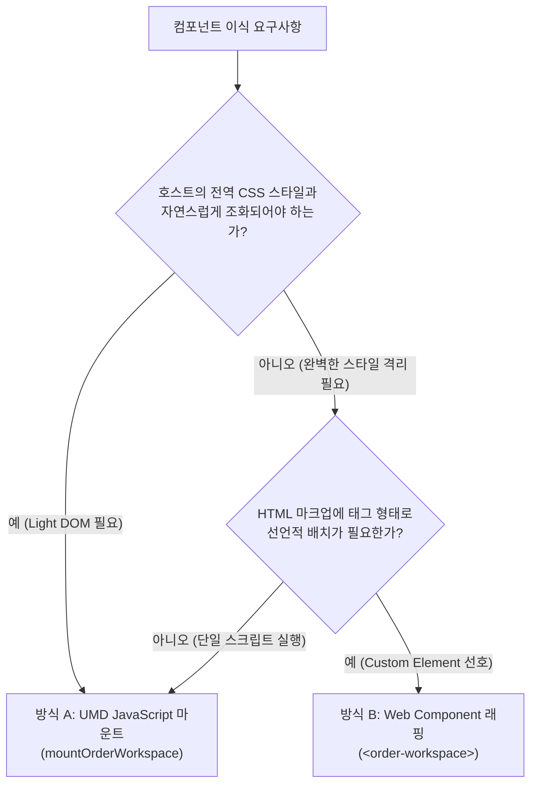

# Standalone UMD 마운트와 Web Component 이식 방식 아키텍처 리뷰

이 문서는 두 배포 방식의 비교 자료다. 공통 구현 표준은 [범용 공개 계약](09-public-component-contract.md)과 [작성 가이드](10-component-authoring-guide.md)를 따른다. 아래 `definePreactElement` 사용은 선택적인 reference 경로이며, 업무별 계약을 factory에 위임하지 않는다.

이 문서는 Preact + Signals 기반으로 구축된 도메인 뷰(예: `projected-order`)를 **순수 HTML, 레거시 시스템, 마이크로 프론트엔드(MFE)** 환경에 이식할 때 사용되는 두 가지 핵심 배포 방식(**UMD 스크립트 마운트** vs **Web Component 래핑**)의 기술적 특성, 장단점, 라이프사이클, 스타일 격리, 상태 동기화 계약을 심층 비교·리뷰합니다.

---

## 1. 두 가지 이식 방식 비교 개요

| 비교 축 | 방식 A: UMD JavaScript 마운트 | 방식 B: Web Component (Custom Element) |
|---|---|---|
| **소비 형태** | 명령형 (Imperative JS API) | **선언적 (Declarative HTML 태그)** |
| **코드 예시** | `mountOrderWorkspace(container, model)` | `<order-workspace customer-name="..."></order-workspace>` |
| **DOM 영역** | Host가 제공한 Light DOM Root | **Shadow DOM (`mode: 'open'`) 격리** |
| **스타일 격리** | 호스트 글로벌 CSS와 공유/상속 | **Shadow boundary로 외부 CSS 완전 차단** (`:part` 지원) |
| **수명 관리** | 호스트가 `mount.destroy()` 명시적 호출 | **`connectedCallback` / `disconnectedCallback` 자동 연동** |
| **재연결 탄력성** | 호스트 스크립트가 수동으로 다시 마운트 | **DOM detach/reattach 시 내부 상태 자동 보존** |
| **외부 통신** | Model의 `dispatch()` 및 `source.subscribe()` | **DOM 표준 Property, Attribute, CustomEvent** |
| **최적 활용처** | CMS, 백오피스 단일 화면, 정적 사이트 스크립트 임베드 | **다중 프레임워크(React/Vue/Angular) 공유 컴포넌트, MFE** |

---

## 2. 세부 아키텍처 및 구현 리뷰

### 방식 A: UMD JavaScript 마운트 (`mountOrderWorkspace`)

#### 동작 원리
1. Standalone UMD 번들(`order-workspace.umd.js`)을 `<script>`로 로드하면 브라우저 전역에 `window.ContextActionOrderWorkspace` 네임스페이스가 등록됩니다.
2. 호스트 코드가 빈 컨테이너 엘리먼트(`div#root`)를 지정하고 `mountOrderWorkspace(root, model)`를 실행합니다.
3. `@context-action/preact-ui`의 `claimMountRoot(root)`가 동작하여 **중복 마운트 차단, 기존 children 덮어쓰기 방지, 상위 Light-DOM 중첩 방지** 등의 방어 규칙을 실행합니다.

#### 장점
- **유연한 모델 공유**: 하나의 `OrderModel`을 생성하여 화면 내 여러 독립된 UI Island에 동시에 연결할 수 있습니다.
- **호스트 CSS와의 자연스러운 조화**: Light DOM에 마운트되므로 호스트 사이트의 테마, 폰트, 글로벌 유틸리티 클래스(Tailwind, Bootstrap 등)를 그대로 상속받을 수 있습니다.
- **최소 추상화 오버헤드**: Custom Elements 등록 과정 없이 순수 DOM 노드 조작만으로 동작합니다.

#### 주의점 및 관리 책임
- **수명 누수(Leak) 위험**: SPA 라우터 이동이나 모달 닫힘 시 호스트 코드가 `mount.destroy()` 및 `model.destroy()`를 명시적으로 호출하지 않으면 메모리 누수와 고아(Orphan) 이벤트 리스너가 남을 수 있습니다.
- **CSS 충돌 위험**: 호스트의 전역 태그 셀렉터(예: `button { ... }`, `input { ... }`)가 컴포넌트 내부 스타일에 영향을 줄 수 있습니다.

---

### 방식 B: Web Component 래핑 (`<order-workspace>`)

#### 동작 원리
1. 번들 로드 시 `customElements.define('order-workspace', OrderWorkspaceElement)`가 브라우저에 등록됩니다.
2. HTML 마크업에 `<order-workspace>` 태그를 선언하는 즉시 브라우저 엔진이 엘리먼트를 인스턴스화합니다.
3. `definePreactElement`가 생성 시 `attachShadow({ mode: 'open' })`와 renderer root를 준비하고, `setup(element, context)`가 업무별 owner adapter를 구성합니다.
4. factory가 관리하는 `connectedCallback`/`disconnectedCallback`에서 connection session을 만들고 닫습니다. `setup`의 `onConnect`/`onDisconnect`에는 source 연결·구독·DOM listener 같은 연결 자원만 둡니다.

#### 핵심 구현 패턴: DOM 재연결 탄력성 (Reconnection Resilience)
일반적인 실수 중 하나는 `disconnectedCallback`에서 도메인 모델까지 완전히 파괴해버리는 것입니다. 탭 UI 전환, 가상 리스트 스크롤, DOM 트리 재정렬(sort) 시 엘리먼트가 잠시 DOM에서 빠졌다가 다시 들어올 수 있습니다:

```ts
definePreactElement({
  tagName: 'order-workspace',
  observedAttributes: ['customer-name', 'shipping-address'],
  upgradeProperties: ['customerName', 'shippingAddress'],
  setup(element, context) {
    // Domain model belongs to this element instance, not to a renderer mount.
    const model = createOrderModel();
    let session;
    installOrderProperties(element, model);
    return {
      view: OrderWorkspaceElementView,
      getInput: () => session?.getInput() ?? failDisconnected(),
      onConnect() {
        session = createOrderWorkspaceOwnerSession(model, element, context);
      },
      onDisconnect() {
        session?.destroy();
        session = undefined;
      },
      onDestroy: () => model.destroy(),
    };
  },
});
```

`definePreactElement`가 property-before-upgrade 재생과 Shadow DOM mount를
담당하고, 업무 adapter는 의미 있는 property/method/event만 정의합니다. 모델은
element를 명시적으로 `dispose()`할 때까지 보존하고, source signal·DOM event
구독·renderer는 연결 session이 끝날 때만 정리합니다. Projected Order의 실제
adapter는 이 패턴을 사용해 `customerName`, `shippingAddress`, `items`,
`addItem`, `removeItem`, `submit`, `reset`, `order-change`,
`order-submit-success` 계약을 유지합니다.

이 패턴 덕분에 **DOM에서 요소를 제거했다가 다시 추가해도 입력 중이던 장바구니나 폼 데이터가 날아가지 않고 유지**됩니다. 영구적인 정리가 필요할 때만 명시적 `element.dispose()`를 호출합니다.

#### 상태 동기화 계약 (Standard DOM API)
- **Attribute (`observedAttributes`)**: `customer-name`, `shipping-address` 등 원시 문자열 속성을 감지하여 내부 ActionRegister로 디스패치합니다.
- **Property (Getter/Setter)**: `element.customerName = '...'` 처럼 스크립트에서 직접 조작할 수 있으며, programmatic 입력 시에는 불필요한 이벤트 에코(`order-change`)를 발행하지 않습니다.
- **CustomEvent**: 주문 성공 시 `order-submit-success`, 변경 시 `order-change`를 `bubbles: true, composed: true`로 발행하여 Shadow DOM 경계를 넘어 호스트의 일반 `addEventListener`로 수신할 수 있습니다.

---

## 3. 번들 크기 및 풋프린트 (Footprint) 분석

Vite의 Terser Minification을 적용한 실제 독립 번들 빌드 결과:

```text
dist-standalone/
├── order-workspace.umd.js   108.51 kB (gzip: 31.05 kB)
├── order-workspace.iife.js  108.32 kB (gzip: 30.98 kB)
└── order-workspace.es.js   110.21 kB (gzip: 31.05 kB)
```

### 포함된 의존성 및 컴포넌트 목록:
- **Preact 10.27.3**: 초경량 Virtual DOM 엔진
- **@preact/signals 2.11.2**: Fine-grained 반응형 시그널 런타임
- **@context-action/core 1.2.6**: 우선순위 기반 ActionRegister 파이프라인
- **@context-action/preact**: Dispatch & Source Context 어댑터
- **@context-action/preact-ui**: DOM 소유권 & 마운트 프리미티브 및 `definePreactElement`
- **Projected Order 도메인 & Custom Element**: `<order-workspace>`
- **Modular Signals 도메인 & Custom Elements**: `<cart-badge>` 및 `<cart-drawer>`

**총 gzip 28.6KB**에 반응형 런타임과 전체 업무 로직 및 3종의 Web Components가 자체 포함(Self-contained)되어 있으므로, React/ReactDOM(약 45~50KB gzip)을 외부에서 로드할 필요 없이 완전한 독립 실행형 위젯 생태계로 동작합니다.

---

## 4. 실전 도입 가이드라인 및 선택 기준



### UMD 마운트를 선택해야 하는 경우:
1. **기존 서버 템플릿(JSP, Thymeleaf, Django, Rails) 또는 CMS**: 특정 레이아웃 블록 안에 위젯을 마운트하고, 사이트의 글로벌 폰트와 스타일을 그대로 적용하고 싶을 때.
2. **동일 모델을 공유하는 멀티 Island**: 하나의 헤더 장바구니 아이콘과 본문 주문 양식이 동일한 `OrderModel` 인스턴스를 공유해야 할 때.

### Web Component를 선택해야 하는 경우:
1. **마이크로 프론트엔드 (MFE)**: Vue, Angular, React, 순수 HTML 등 서로 다른 기술 스택을 사용하는 팀들이 공통 위젯을 공유할 때.
2. **엄격한 스타일 격리가 필요한 SaaS 위젯 / SDK**: 호스트 웹사이트의 어떤 CSS 규칙도 위젯 디자인을 깨뜨리지 못하도록 Shadow DOM 캡슐화가 필수적인 서드파티 임베드.
3. **선언적 CMS 마크업**: 콘텐츠 관리자나 마크업 작성자가 자바스크립트 코드 없이 순수 HTML 태그(`<order-workspace>`)로 컴포넌트를 배치하고자 할 때.
