```mermaid
flowchart LR
    subgraph Preact Shadow DOM
        Signal["countSignal (Preact Signal)"] --> View["QuantityStepperView (Preact)"]
        View -- "사용자 클릭 (+ / -)" --> Signal
    end

    Signal -- "동기화" --> Context["PreactElementContext"]
    Context -- "setFormValue()" --> Internals["ElementInternals"]
    Context -- "setValidity()" --> Internals

    subgraph Host Native Form
        Internals --> Form["<form id='order-form'>"]
        Form -- "form.reset()" --> Reset["formResetCallback()"]
    end

    Reset -- "초기화" --> Signal
```

# Form-Associated Custom Elements (FACE) 및 React 상호운용성 브릿지 가이드

> FACE와 React bridge는 선택 기능이다. 이 문서는 `@context-action/preact-ui`의 공통 구현 컨벤션을 대체하지 않으며, 컴포넌트별 계약에서 필요한 경우에만 적용한다. 공개 의미와 수명은 [공개 계약](09-public-component-contract.md) 및 [생명주기 규칙](11-lifecycle-and-resources.md)에 먼저 기록한다.

이 문서는 Preact + Signals 기반 Custom Elements를 브라우저 **웹 표준 폼(HTMLFormElement, FormData, Constraint Validation)** 및 **외부 대규모 React 애플리케이션**과 완벽하게 연동하기 위한 두 가지 핵심 확장 아키텍처 패턴을 설명합니다.

---

## 1. Form-Associated Custom Elements (FACE) 아키텍처

### 1.1 배경 및 문제의식
기존의 프레임워크 기반 폼 컴포넌트(React Hook Form, Formik 등)는 프레임워크 런타임에 강하게 결합되어 있어, 순수 HTML 서버 렌더링 폼이나 마이크로 프론트엔드 환경에서 독립적으로 사용하기 어렵습니다.

웹 표준 **FACE (Form-Associated Custom Elements)** 규격을 준수하면:
1. **표준 `<form>` 태그 자동 수집**: `new FormData(form)` 실행 시 커스텀 엘리먼트의 내부 값이 네이티브 인풋 필드처럼 자동으로 포함됩니다.
2. **브라우저 기본 제약 검증(Constraint Validation)**: `element.checkValidity()`, `element.reportValidity()` 및 툴팁 UI를 브라우저 네이티브로 활용할 수 있습니다.
3. **폼 리셋 및 수명주기 연동**: `<button type="reset">` 또는 `form.reset()` 호출 시 내부 Preact Signal이 초기 상태로 자동 복원됩니다.

---

### 1.2 `definePreactElement`의 FACE 지원 구조

`definePreactElement`는 `formAssociated: true` 옵션을 제공하며, `ElementInternals` 인터페이스를 안전하게 캡슐화합니다:

```typescript
export interface PreactElementContext {
  /** 브라우저 네이티브 ElementInternals 인스턴스 */
  internals?: ElementInternals;
  /** 폼 제출 값 및 복원 상태 설정 */
  setFormValue(value: File | string | FormData | null, state?: unknown): void;
  /** 유효성 플래그 및 커스텀 오류 메시지 설정 */
  setValidity(flags: ValidityStateFlags, message?: string, anchor?: HTMLElement): void;
}
```



---

### 1.3 FACE 참조 구현: `<quantity-stepper>`

[`packages/preact-ui/examples/modular-signals-wc/quantity-stepper-element.tsx`](file:///Users/junwoobang/workflow/context-action/packages/preact-ui/examples/modular-signals-wc/quantity-stepper-element.tsx)에 구현된 완전한 예제:

```tsx
import { signal } from '@preact/signals';
import { definePreactElement } from '@context-action/preact-ui';

export const QuantityStepperElement = definePreactElement({
  tagName: 'quantity-stepper',
  formAssociated: true,
  observedAttributes: ['min', 'max', 'name', 'value'],
  setup(element, context) {
    const initial = parseInt(element.getAttribute('value') ?? '1', 10);
    const count = signal(initial);

    function updateForm(val: number) {
      const min = parseInt(element.getAttribute('min') ?? '1', 10);
      context.setFormValue(String(val));

      if (val < min) {
        context.setValidity({ rangeUnderflow: true }, `최소 ${min}개 이상이어야 합니다.`);
      } else {
        context.setValidity({});
      }
    }

    // 초기값 등록
    updateForm(count.value);

    return {
      view: () => (
        <div class="stepper">
          <button type="button" onClick={() => { count.value--; updateForm(count.value); }}>−</button>
          <span>{count}</span>
          <button type="button" onClick={() => { count.value++; updateForm(count.value); }}>+</button>
        </div>
      ),
      getInput: () => count.value,
      onFormReset() {
        count.value = initial;
        updateForm(initial);
      },
      onFormDisabled(disabled) {
        // fieldset disabled 연동
      },
    };
  },
});
```

---

## 2. React ↔ Custom Element 상호운용성 브릿지 (`createCustomElementBridge`)

### 2.1 React와 Web Component 결합 시의 고질적 한계

React 18 및 React 19 환경에서 Custom Element를 직접 JSX로 작성할 때(` <cart-badge oncart-badge-click={...} /> `) 다음과 같은 문제가 발생합니다:
1. **커스텀 이벤트 청취 실패**: React의 합성 이벤트(SyntheticEvent) 시스템은 `dash-cased` 커스텀 이벤트(예: `cart-badge-click`)를 정상적으로 위임 처리하지 못합니다.
2. **복합 객체 프로퍼티의 문자열 직렬화**: 배열이나 모델 객체(`items={[...]}`)를 JSX props로 전달하면 `setAttribute('items', '[object Object]')`로 처리되어 데이터가 유실됩니다.
3. **Ref 접근 및 DOM 제어**: 컴포넌트의 내부 메서드(`element.addItem(...)`) 호출 시 ref 타입 추론이 번거롭습니다.

---

### 2.2 `createCustomElementBridge` 헬퍼

`@context-action/preact-ui`는 React 상호운용성을 위한 경량 브릿지 팩토리를 제공합니다:

```typescript
import { createCustomElementBridge } from '@context-action/preact-ui/react-bridge';

interface CartBadgeProps {
  customerName?: string;
  items?: readonly CartItem[];
  onCartChange?: (event: CustomEvent<{ total: number }>) => void;
}

// React 컴포넌트로 래핑
export const ReactCartBadge = createCustomElementBridge<CartBadgeProps, HTMLElement>({
  tagName: 'cart-badge',
  properties: ['items'], // DOM property로 직접 할당
  events: {
    onCartChange: 'cart-change', // DOM CustomEvent 매핑 및 자동 cleanup
  },
});
```

### 2.3 React 애플리케이션 내 사용 예시

```tsx
import React, { useRef } from 'react';
import { ReactCartBadge } from './bridge.js';

export function ReactHeader() {
  const badgeRef = useRef<HTMLElement>(null);

  return (
    <header>
      <h1>나의 React 쇼핑몰</h1>
      <ReactCartBadge
        ref={badgeRef}
        customerName="김철수"
        items={[{ id: '1', name: '상품', price: 10 }]}
        onCartChange={(e) => {
          console.log('React에서 수신한 커스텀 이벤트:', e.detail.total);
        }}
      />
    </header>
  );
}
```

---

## 3. 핵심 가치 요약

1. **표준 준수 (Standard First)**: 별도의 프레임워크 폼 라이브러리 없이 브라우저 네이티브 `<form>` 및 `FormData`와 완벽 통합.
2. **다중 환경 무손실 배포 (Zero Friction Interop)**:
   - 순수 HTML 페이지: `<quantity-stepper>`, `<cart-badge>` 태그로 직접 사용.
   - React 애플리케이션: `createCustomElementBridge`를 통해 네이티브 React 컴포넌트처럼 사용.
3. **가상 DOM 경계 분리 보장**: React의 VDOM과 Preact의 VDOM/Signals가 서로 간섭하지 않고 독립적으로 최고 효율의 렌더링을 수행.
