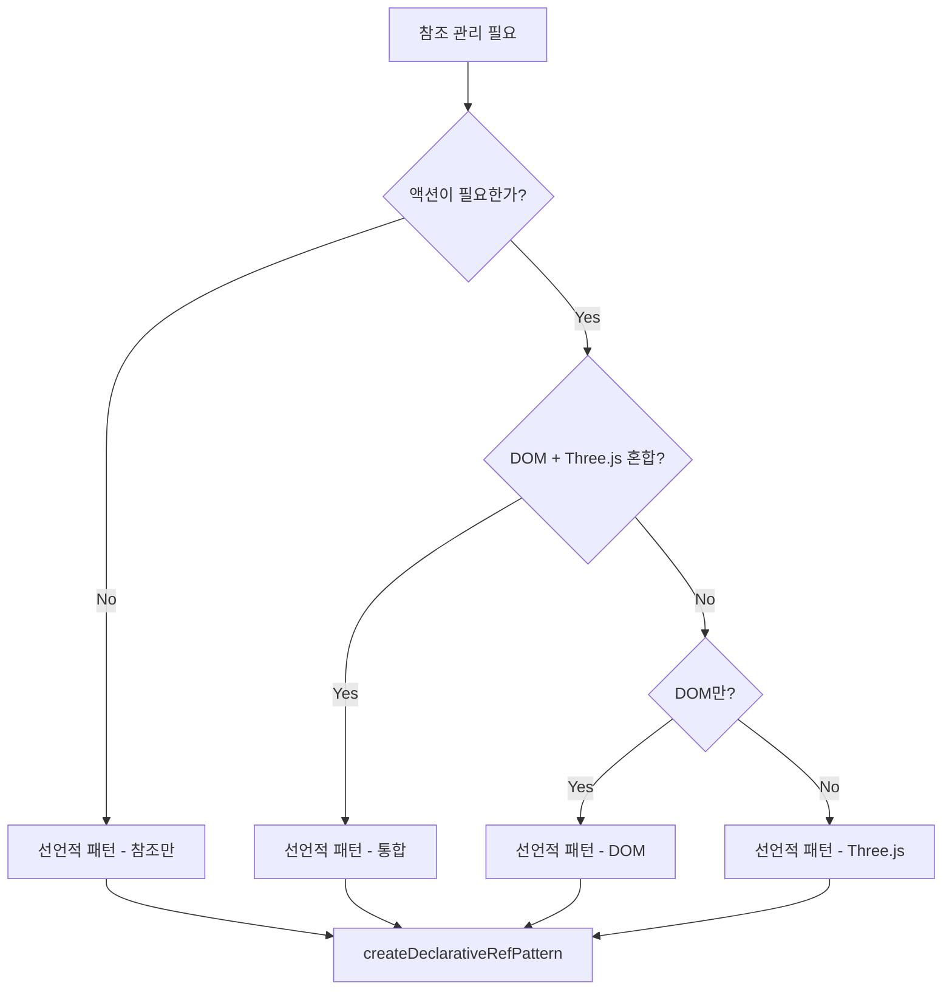

# 패턴 가이드 - Universal Reference Management

Context-Action 참조 관리 시스템의 실용적인 사용 패턴과 예시 모음입니다.

## 🎯 선택 가이드

### 언제 어떤 패턴을 사용할까?



## 📚 패턴별 완전한 예시

### 1. 🎨 기본 DOM 참조 패턴

**사용 사례**: 폼 요소, UI 컴포넌트, 기본 DOM 조작

```typescript
import { createDeclarativeRefPattern, domRef } from '@context-action/react/refs';

// 선언적 정의 - 우수한 타입 추론
const {
  Provider: ContactFormRefProvider,
  useRef: useContactFormRef,
  useRefValue: useContactFormRefValue,
  useRefs: useContactFormRefs,
  useRefManager: useContactFormRefManager
} = createDeclarativeRefPattern('ContactForm', {
  nameInput: domRef<HTMLInputElement>({ 
    mountTimeout: 3000,
    autoCleanup: true 
  }),
  emailInput: domRef<HTMLInputElement>({ 
    name: 'email-field',
    validator: (target): target is HTMLInputElement => 
      target instanceof HTMLInputElement && target.type === 'email'
  }),
  submitButton: domRef<HTMLButtonElement>(),
  statusDiv: domRef<HTMLDivElement>(),
  errorDisplay: domRef<HTMLParagraphElement>()
});

function ContactForm() {
  const nameInput = useContactFormRef('nameInput');
  const emailInput = useContactFormRef('emailInput');
  const submitButton = useContactFormRef('submitButton');
  const statusDiv = useContactFormRef('statusDiv');
  const errorDisplay = useContactFormRef('errorDisplay');
  const refManager = useContactFormRefManager();

  // 폼 검증 로직
  const validateForm = async (): Promise<boolean> => {
    try {
      const [nameEl, emailEl] = await refManager.waitForRefs('nameInput', 'emailInput');
      
      return await refManager.withRefs(
        ['nameInput', 'emailInput'],
        (refs) => {
          const nameValid = refs.nameInput!.value.trim().length > 0;
          const emailValid = refs.emailInput!.value.includes('@');
          return nameValid && emailValid;
        }
      ).then(result => result.success ? result.result! : false);
    } catch (error) {
      console.error('Form validation failed:', error);
      return false;
    }
  };

  // 폼 제출 처리
  const handleSubmit = async (e: React.FormEvent) => {
    e.preventDefault();
    
    // 버튼 비활성화
    await submitButton.withTarget((btn) => {
      btn.disabled = true;
      btn.textContent = 'Submitting...';
    });

    // 상태 메시지 표시
    await statusDiv.withTarget((div) => {
      div.textContent = 'Processing...';
      div.className = 'status processing';
    });

    try {
      const isValid = await validateForm();
      
      if (!isValid) {
        throw new Error('Form validation failed');
      }

      // 실제 제출 로직
      const formData = await refManager.withRefs(
        ['nameInput', 'emailInput'],
        (refs) => ({
          name: refs.nameInput!.value,
          email: refs.emailInput!.value
        }),
        { timeout: 5000 }
      );

      if (formData.success) {
        await submitAPI(formData.result!);
        
        // 성공 메시지
        await statusDiv.withTarget((div) => {
          div.textContent = 'Success!';
          div.className = 'status success';
        });
      }

    } catch (error) {
      // 에러 처리
      await statusDiv.withTarget((div) => {
        div.textContent = 'Error occurred';
        div.className = 'status error';
      });
    } finally {
      // 버튼 재활성화
      await submitButton.withTarget((btn) => {
        btn.disabled = false;
        btn.textContent = 'Submit';
      });
    }
  };

  // 입력 필드 포커스 관리
  const handleInputFocus = async (inputType: 'name' | 'email') => {
    const refName = inputType === 'name' ? 'nameInput' : 'emailInput';
    const inputRef = useContactFormRef(refName);
    
    await inputRef.withTarget((input) => {
      input.focus();
      input.select();
    }, { priority: 10 }); // 높은 우선순위
  };

  return (
    <ContactFormRefProvider>
      <form onSubmit={handleSubmit}>
        <div>
          <label htmlFor="name">Name:</label>
          <input 
            ref={nameInput.ref}
            type="text" 
            id="name"
            onFocus={() => handleInputFocus('name')}
          />
        </div>
        
        <div>
          <label htmlFor="email">Email:</label>
          <input 
            ref={emailInput.ref}
            type="email" 
            id="email"
            onFocus={() => handleInputFocus('email')}
          />
        </div>
        
        <button ref={submitButton.ref} type="submit">
          Submit
        </button>
        
        <div ref={statusDiv.ref} className="status" />
        <p ref={errorDisplay.ref} className="error" />
      </form>
    </ContactFormRefProvider>
  );
}

async function submitAPI(data: { name: string; email: string }) {
  // API 호출 시뮬레이션
  await new Promise(resolve => setTimeout(resolve, 1000));
  console.log('Form submitted:', data);
}
```

### 2. 🎮 Three.js 게임 패턴

**사용 사례**: 3D 그래픽스, 게임, 인터랙티브 시각화

```typescript
import { createDeclarativeRefPattern, domRef, threeRef } from '@context-action/react/refs';
import * as THREE from 'three';

// Three.js 객체 타입 확장
interface GameScene extends THREE.Scene {
  gameObjects: THREE.Object3D[];
  addGameObject: (obj: THREE.Object3D) => void;
  removeGameObject: (obj: THREE.Object3D) => void;
}

const {
  Provider: GameEngineRefProvider,
  useRef: useGameEngineRef,
  useRefs: useGameEngineRefs,
  useRefManager: useGameEngineRefManager
} = createDeclarativeRefPattern('GameEngine', {
  // DOM 요소
  canvas: domRef<HTMLCanvasElement>({
    mountTimeout: 5000,
    validator: (target): target is HTMLCanvasElement => 
      target instanceof HTMLCanvasElement
  }),
  
  // Three.js 객체들
  scene: threeRef<GameScene>({
    autoCleanup: true,
    cleanup: async (scene) => {
      // 모든 게임 객체 정리
      scene.gameObjects?.forEach(obj => {
        if (obj.geometry) obj.geometry.dispose();
        if (obj.material) {
          if (Array.isArray(obj.material)) {
            obj.material.forEach(mat => mat.dispose());
          } else {
            obj.material.dispose();
          }
        }
      });
      scene.clear();
    }
  }),
  
  camera: threeRef<THREE.PerspectiveCamera>({
    autoCleanup: true
  }),
  
  renderer: threeRef<THREE.WebGLRenderer>({
    autoCleanup: true,
    cleanup: async (renderer) => {
      renderer.dispose();
      renderer.forceContextLoss();
    }
  }),
  
  // 추가 게임 객체들
  player: threeRef<THREE.Mesh>(),
  enemies: threeRef<THREE.Group>(),
  ui: threeRef<THREE.Group>()
});

function GameEngine() {
  const canvas = useGameEngineRef('canvas');
  const [scene, camera, renderer] = useGameEngineRefs('scene', 'camera', 'renderer');
  const refManager = useGameEngineRefManager();

  // 게임 초기화
  const initializeGame = async () => {
    try {
      // 모든 핵심 객체 대기
      const gameRefs = await refManager.waitForRefs(
        'canvas', 'scene', 'camera', 'renderer'
      );

      // 캔버스 설정
      await canvas.withTarget((canvasEl) => {
        canvasEl.width = 800;
        canvasEl.height = 600;
        canvasEl.style.border = '1px solid #ccc';
      });

      // 렌더러 초기화
      await renderer.withTarget((rendererObj) => {
        rendererObj.setSize(800, 600);
        rendererObj.setClearColor(0x000011);
        gameRefs.canvas.appendChild(rendererObj.domElement);
      });

      // 카메라 설정
      await camera.withTarget((cameraObj) => {
        cameraObj.position.set(0, 5, 10);
        cameraObj.lookAt(0, 0, 0);
      });

      // 초기 게임 객체 생성
      await createInitialGameObjects();
      
      console.log('Game initialized successfully');
    } catch (error) {
      console.error('Game initialization failed:', error);
    }
  };

  // 게임 객체 생성
  const createInitialGameObjects = async () => {
    await scene.withTarget((sceneObj) => {
      // 플레이어 생성
      const playerGeometry = new THREE.BoxGeometry(1, 1, 1);
      const playerMaterial = new THREE.MeshBasicMaterial({ color: 0x00ff00 });
      const playerMesh = new THREE.Mesh(playerGeometry, playerMaterial);
      playerMesh.position.set(0, 0, 0);
      sceneObj.add(playerMesh);

      // 조명 추가
      const ambientLight = new THREE.AmbientLight(0x404040, 0.4);
      const directionalLight = new THREE.DirectionalLight(0xffffff, 0.8);
      directionalLight.position.set(1, 1, 1);
      
      sceneObj.add(ambientLight);
      sceneObj.add(directionalLight);
    });
  };

  // 게임 루프
  const startGameLoop = async () => {
    const gameRefs = await refManager.waitForRefs('scene', 'camera', 'renderer');
    
    const animate = () => {
      requestAnimationFrame(animate);
      gameRefs.renderer.render(gameRefs.scene, gameRefs.camera);
    };
    
    animate();
  };

  // 플레이어 이동
  const movePlayer = async (direction: 'left' | 'right' | 'up' | 'down') => {
    await scene.withTarget((sceneObj) => {
      const player = sceneObj.children.find(child => 
        child instanceof THREE.Mesh && child.material instanceof THREE.MeshBasicMaterial
      );
      
      if (player) {
        switch (direction) {
          case 'left': player.position.x -= 0.5; break;
          case 'right': player.position.x += 0.5; break;
          case 'up': player.position.z -= 0.5; break;
          case 'down': player.position.z += 0.5; break;
        }
      }
    }, { priority: 8 });
  };

  // 적 스폰
  const spawnEnemy = async () => {
    await scene.withTarget((sceneObj) => {
      const enemyGeometry = new THREE.SphereGeometry(0.5);
      const enemyMaterial = new THREE.MeshBasicMaterial({ color: 0xff0000 });
      const enemy = new THREE.Mesh(enemyGeometry, enemyMaterial);
      
      // 랜덤 위치
      enemy.position.set(
        (Math.random() - 0.5) * 10,
        0,
        (Math.random() - 0.5) * 10
      );
      
      sceneObj.add(enemy);
    }, { priority: 5 });
  };

  return (
    <GameEngineRefProvider>
      <div className="game-container">
        <canvas ref={canvas.ref} />
        
        <div className="game-controls">
          <button onClick={initializeGame}>Initialize Game</button>
          <button onClick={startGameLoop}>Start Game</button>
          <button onClick={() => movePlayer('left')}>Move Left</button>
          <button onClick={() => movePlayer('right')}>Move Right</button>
          <button onClick={() => movePlayer('up')}>Move Up</button>
          <button onClick={() => movePlayer('down')}>Move Down</button>
          <button onClick={spawnEnemy}>Spawn Enemy</button>
        </div>
        
        <div className="game-info">
          <p>Canvas Ready: {canvas.isReady ? '✅' : '❌'}</p>
          <p>Scene Ready: {scene.isReady ? '✅' : '❌'}</p>
          <p>Camera Ready: {camera.isReady ? '✅' : '❌'}</p>
          <p>Renderer Ready: {renderer.isReady ? '✅' : '❌'}</p>
        </div>
      </div>
    </GameEngineRefProvider>
  );
}
```

### 3. 🎯 액션 통합 패턴 (DOM + Three.js + Actions)

**사용 사례**: 복잡한 상호작용, 비즈니스 로직 분리, 이벤트 처리

```typescript
import { createDeclarativeRefPattern, domRef, threeRef } from '@context-action/react/refs';
import type { RefActionPayloadMap } from '@context-action/react/refs';

// 게임 액션 정의
interface GameActions extends RefActionPayloadMap {
  initializeGame: void;
  updateScore: { score: number; multiplier?: number };
  movePlayer: { direction: 'left' | 'right' | 'up' | 'down'; distance?: number };
  spawnEnemy: { type: 'basic' | 'fast' | 'boss'; position?: THREE.Vector3 };
  gameOver: { finalScore: number; reason: string };
  resetGame: void;
}

// 통합 게임 시스템
const {
  Provider: GameSystemRefProvider,
  useRef: useGameSystemRef,
  useAction: useGameSystemAction,
  useActionHandler: useGameSystemActionHandler,
  useRefManager: useGameSystemRefManager
} = createDeclarativeRefPattern('GameSystem', {
  refs: {
    // UI 요소들
    canvas: domRef<HTMLCanvasElement>(),
    scoreDisplay: domRef<HTMLSpanElement>(),
    gameOverModal: domRef<HTMLDivElement>(),
    controlPanel: domRef<HTMLDivElement>(),
    
    // Three.js 게임 객체들
    gameScene: threeRef<THREE.Scene>(),
    gameCamera: threeRef<THREE.PerspectiveCamera>(),
    gameRenderer: threeRef<THREE.WebGLRenderer>(),
    playerMesh: threeRef<THREE.Mesh>(),
    enemyGroup: threeRef<THREE.Group>(),
    uiGroup: threeRef<THREE.Group>()
  },
  actions: {
    initializeGame: undefined,
    updateScore: undefined,
    movePlayer: undefined,
    spawnEnemy: undefined,
    gameOver: undefined,
    resetGame: undefined
  } as GameActions
});

function GameSystem() {
  const canvas = useGameSystemRef('canvas');
  const scoreDisplay = useGameSystemRef('scoreDisplay');
  const gameOverModal = useGameSystemRef('gameOverModal');
  const controlPanel = useGameSystemRef('controlPanel');
  const dispatch = useGameSystemAction();
  const refManager = useGameSystemRefManager();
  
  // 게임 상태
  const [gameState, setGameState] = React.useState({
    score: 0,
    isPlaying: false,
    level: 1
  });

  // 게임 초기화 액션
  useGameSystemActionHandler('initializeGame', async (_, controller) => {
    try {
      // 모든 필수 객체 대기
      const refs = await refManager.waitForRefs(
        'canvas', 'gameScene', 'gameCamera', 'gameRenderer'
      );

      // 캔버스 설정
      await controller.withRef('canvas', (canvasEl) => {
        canvasEl.width = 800;
        canvasEl.height = 600;
      });

      // 렌더러 초기화
      await controller.withRef('gameRenderer', (renderer) => {
        renderer.setSize(800, 600);
        renderer.setClearColor(0x001122);
        refs.canvas.appendChild(renderer.domElement);
      });

      // 카메라 설정
      await controller.withRef('gameCamera', (camera) => {
        camera.position.set(0, 10, 15);
        camera.lookAt(0, 0, 0);
      });

      // 초기 플레이어 생성
      await controller.withRef('gameScene', (scene) => {
        const playerGeometry = new THREE.BoxGeometry(1, 1, 1);
        const playerMaterial = new THREE.MeshLambertMaterial({ color: 0x00ff00 });
        const player = new THREE.Mesh(playerGeometry, playerMaterial);
        scene.add(player);
      });

      setGameState(prev => ({ ...prev, isPlaying: true }));
      
    } catch (error) {
      controller.abort('Game initialization failed', error);
    }
  });

  // 점수 업데이트 액션
  useGameSystemActionHandler('updateScore', async ({ score, multiplier = 1 }) => {
    const newScore = score * multiplier;
    setGameState(prev => ({ ...prev, score: newScore }));
    
    await scoreDisplay.withTarget((display) => {
      display.textContent = `Score: ${newScore}`;
      display.style.color = multiplier > 1 ? '#ff6b35' : '#333';
    });
  });

  // 플레이어 이동 액션
  useGameSystemActionHandler('movePlayer', async ({ direction, distance = 1 }) => {
    await refManager.withRef('playerMesh', (player) => {
      switch (direction) {
        case 'left': player.position.x -= distance; break;
        case 'right': player.position.x += distance; break;
        case 'up': player.position.z -= distance; break;
        case 'down': player.position.z += distance; break;
      }
    }, { priority: 9 });
  });

  // 적 스폰 액션
  useGameSystemActionHandler('spawnEnemy', async ({ type, position }) => {
    await refManager.withRef('gameScene', (scene) => {
      const enemyGeometry = new THREE.SphereGeometry(
        type === 'boss' ? 1.5 : type === 'fast' ? 0.3 : 0.5
      );
      const enemyMaterial = new THREE.MeshLambertMaterial({ 
        color: type === 'boss' ? 0x800080 : type === 'fast' ? 0xffff00 : 0xff0000 
      });
      const enemy = new THREE.Mesh(enemyGeometry, enemyMaterial);
      
      if (position) {
        enemy.position.copy(position);
      } else {
        enemy.position.set(
          (Math.random() - 0.5) * 20,
          0,
          (Math.random() - 0.5) * 20
        );
      }
      
      scene.add(enemy);
    });
  });

  // 게임 오버 액션
  useGameSystemActionHandler('gameOver', async ({ finalScore, reason }) => {
    setGameState(prev => ({ ...prev, isPlaying: false }));
    
    await gameOverModal.withTarget((modal) => {
      modal.innerHTML = `
        <h2>Game Over</h2>
        <p>Final Score: ${finalScore}</p>
        <p>Reason: ${reason}</p>
        <button onclick="location.reload()">Play Again</button>
      `;
      modal.style.display = 'block';
    });
  });

  // 게임 리셋 액션
  useGameSystemActionHandler('resetGame', async () => {
    // 씬 리셋
    await refManager.withRef('gameScene', (scene) => {
      // 플레이어와 UI 그룹 제외하고 모든 객체 제거
      const toRemove = scene.children.filter(child => 
        child !== scene.getObjectByName('player') &&
        child !== scene.getObjectByName('ui')
      );
      
      toRemove.forEach(obj => scene.remove(obj));
    });
    
    setGameState({ score: 0, isPlaying: false, level: 1 });
    
    await scoreDisplay.withTarget((display) => {
      display.textContent = 'Score: 0';
    });
  });

  // 게임 루프
  React.useEffect(() => {
    if (!gameState.isPlaying) return;

    let animationId: number;
    
    const gameLoop = async () => {
      try {
        await refManager.withRefs(
          ['gameScene', 'gameCamera', 'gameRenderer'],
          (refs) => {
            refs.gameRenderer!.render(refs.gameScene!, refs.gameCamera!);
          }
        );
        
        animationId = requestAnimationFrame(gameLoop);
      } catch (error) {
        console.error('Game loop error:', error);
      }
    };

    gameLoop();
    
    return () => {
      if (animationId) {
        cancelAnimationFrame(animationId);
      }
    };
  }, [gameState.isPlaying, refManager]);

  // 키보드 입력 처리
  React.useEffect(() => {
    const handleKeyPress = (e: KeyboardEvent) => {
      if (!gameState.isPlaying) return;
      
      switch (e.key) {
        case 'ArrowLeft':
        case 'a':
          dispatch('movePlayer', { direction: 'left' });
          break;
        case 'ArrowRight':
        case 'd':
          dispatch('movePlayer', { direction: 'right' });
          break;
        case 'ArrowUp':
        case 'w':
          dispatch('movePlayer', { direction: 'up' });
          break;
        case 'ArrowDown':
        case 's':
          dispatch('movePlayer', { direction: 'down' });
          break;
        case ' ':
          e.preventDefault();
          dispatch('spawnEnemy', { type: 'basic' });
          break;
      }
    };

    window.addEventListener('keydown', handleKeyPress);
    return () => window.removeEventListener('keydown', handleKeyPress);
  }, [gameState.isPlaying, dispatch]);

  return (
    <GameSystemRefProvider>
      <div className="game-wrapper">
        <div className="game-header">
          <span ref={scoreDisplay.ref}>Score: {gameState.score}</span>
          <div>Level: {gameState.level}</div>
        </div>
        
        <canvas ref={canvas.ref} />
        
        <div ref={controlPanel.ref} className="controls">
          <button 
            onClick={() => dispatch('initializeGame')}
            disabled={gameState.isPlaying}
          >
            {gameState.isPlaying ? 'Game Running' : 'Start Game'}
          </button>
          
          <button 
            onClick={() => dispatch('spawnEnemy', { type: 'basic' })}
            disabled={!gameState.isPlaying}
          >
            Spawn Enemy
          </button>
          
          <button 
            onClick={() => dispatch('spawnEnemy', { type: 'boss' })}
            disabled={!gameState.isPlaying}
          >
            Spawn Boss
          </button>
          
          <button 
            onClick={() => dispatch('resetGame')}
          >
            Reset Game
          </button>
        </div>
        
        <div 
          ref={gameOverModal.ref} 
          className="game-over-modal" 
          style={{ display: 'none' }}
        />
        
        <div className="game-instructions">
          <p>Use WASD or Arrow keys to move</p>
          <p>Press Space to spawn enemies</p>
        </div>
      </div>
    </GameSystemRefProvider>
  );
}
```

### 4. 📊 데이터 시각화 패턴

**사용 사례**: 차트, 그래프, 실시간 데이터 시각화

```typescript
import { createDeclarativeRefPattern, domRef, customRef } from '@context-action/react/refs';

// D3.js 차트 객체 타입
interface D3ChartObject {
  svg: d3.Selection<SVGSVGElement, unknown, null, undefined>;
  updateData: (data: any[]) => void;
  resize: (width: number, height: number) => void;
  destroy: () => void;
}

const {
  Provider: DataVizRefProvider,
  useRef: useDataVizRef,
  useRefs: useDataVizRefs,
  useRefManager: useDataVizRefManager
} = createDeclarativeRefPattern('DataVisualization', {
  // 차트 컨테이너들
  chartContainer: domRef<HTMLDivElement>(),
  legendContainer: domRef<HTMLDivElement>(),
  tooltipContainer: domRef<HTMLDivElement>(),
  
  // D3.js 차트 객체들
  barChart: customRef<D3ChartObject>({
    name: 'barChart',
    cleanup: async (chart) => {
      chart.destroy();
    }
  }),
  
  lineChart: customRef<D3ChartObject>({
    name: 'lineChart', 
    cleanup: async (chart) => {
      chart.destroy();
    }
  }),
  
  // 캔버스 기반 고성능 차트
  performanceChart: domRef<HTMLCanvasElement>()
});

function DataVisualization() {
  const chartContainer = useDataVizRef('chartContainer');
  const [barChart, lineChart] = useDataVizRefs('barChart', 'lineChart');
  const performanceChart = useDataVizRef('performanceChart');
  const legendContainer = useDataVizRef('legendContainer');
  const tooltipContainer = useDataVizRef('tooltipContainer');
  const refManager = useDataVizRefManager();
  
  const [chartData, setChartData] = React.useState([
    { name: 'A', value: 10 },
    { name: 'B', value: 20 },
    { name: 'C', value: 15 }
  ]);

  // 차트 초기화
  const initializeCharts = async () => {
    try {
      // D3 바 차트 생성
      await chartContainer.withTarget(async (container) => {
        const svg = d3.select(container)
          .append('svg')
          .attr('width', 400)
          .attr('height', 300);
          
        const chartObj: D3ChartObject = {
          svg,
          updateData: (data) => {
            // D3 업데이트 로직
            svg.selectAll('.bar')
              .data(data)
              .enter()
              .append('rect')
              .attr('class', 'bar')
              .attr('x', (d, i) => i * 50)
              .attr('y', d => 300 - d.value * 10)
              .attr('width', 40)
              .attr('height', d => d.value * 10);
          },
          resize: (width, height) => {
            svg.attr('width', width).attr('height', height);
          },
          destroy: () => {
            svg.remove();
          }
        };
        
        // 커스텀 ref에 차트 객체 설정
        barChart.setRef(chartObj);
      });

      // 캔버스 차트 초기화
      await performanceChart.withTarget((canvas) => {
        const ctx = canvas.getContext('2d')!;
        canvas.width = 600;
        canvas.height = 200;
        
        // 초기 차트 그리기
        ctx.fillStyle = '#f0f0f0';
        ctx.fillRect(0, 0, 600, 200);
        ctx.fillStyle = '#333';
        ctx.font = '16px Arial';
        ctx.fillText('Performance Chart Ready', 10, 30);
      });

    } catch (error) {
      console.error('Chart initialization failed:', error);
    }
  };

  // 데이터 업데이트
  const updateChartData = async (newData: typeof chartData) => {
    setChartData(newData);
    
    // D3 차트 업데이트
    await barChart.withTarget((chart) => {
      chart.updateData(newData);
    });
    
    // 캔버스 차트 업데이트
    await performanceChart.withTarget((canvas) => {
      const ctx = canvas.getContext('2d')!;
      ctx.clearRect(0, 0, canvas.width, canvas.height);
      
      // 새로운 데이터로 차트 그리기
      newData.forEach((item, index) => {
        const barHeight = item.value * 5;
        const barWidth = 50;
        const x = index * 60 + 10;
        const y = canvas.height - barHeight - 20;
        
        ctx.fillStyle = '#4CAF50';
        ctx.fillRect(x, y, barWidth, barHeight);
        
        ctx.fillStyle = '#333';
        ctx.fillText(item.name, x + 15, y - 5);
        ctx.fillText(item.value.toString(), x + 15, canvas.height - 5);
      });
    });
  };

  // 반응형 차트 크기 조정
  const handleResize = async () => {
    const containerWidth = await chartContainer.withTarget((container) => {
      return container.clientWidth;
    });

    if (containerWidth.success) {
      await barChart.withTarget((chart) => {
        chart.resize(containerWidth.result!, 300);
      });
    }
  };

  // 실시간 데이터 시뮬레이션
  React.useEffect(() => {
    const interval = setInterval(() => {
      const newData = chartData.map(item => ({
        ...item,
        value: Math.max(1, item.value + (Math.random() - 0.5) * 10)
      }));
      updateChartData(newData);
    }, 2000);

    return () => clearInterval(interval);
  }, [chartData]);

  // 윈도우 리사이즈 처리
  React.useEffect(() => {
    window.addEventListener('resize', handleResize);
    return () => window.removeEventListener('resize', handleResize);
  }, []);

  return (
    <DataVizRefProvider>
      <div className="data-viz-container">
        <h2>Data Visualization Dashboard</h2>
        
        <div className="chart-controls">
          <button onClick={initializeCharts}>Initialize Charts</button>
          <button onClick={() => updateChartData([
            { name: 'X', value: Math.random() * 30 },
            { name: 'Y', value: Math.random() * 30 },
            { name: 'Z', value: Math.random() * 30 }
          ])}>
            Random Data
          </button>
        </div>
        
        <div className="charts-layout">
          <div ref={chartContainer.ref} className="d3-chart-container" />
          <canvas ref={performanceChart.ref} className="performance-chart" />
        </div>
        
        <div ref={legendContainer.ref} className="legend" />
        <div ref={tooltipContainer.ref} className="tooltip" />
      </div>
    </DataVizRefProvider>
  );
}
```

## 🔧 고급 패턴

### 에러 복구 패턴

```typescript
const robustRef = refs.useRef('element', {
  errorRecovery: {
    strategy: 'retry',
    maxRetries: 3,
    retryDelay: 1000,
    fallbackValue: () => document.createElement('div'),
    onError: (error) => {
      console.error('Ref operation failed:', error.toJSON());
      analytics.track('ref_error', { 
        refName: error.refName,
        operation: error.operation,
        code: error.code 
      });
    }
  },
  validateOnSet: true
});
```

### 배치 처리 패턴

```typescript
// 여러 DOM 요소에 동시 스타일 적용
const applyTheme = async (theme: 'light' | 'dark') => {
  const elements = await refManager.waitForRefs(
    'header', 'sidebar', 'content', 'footer'
  );
  
  const results = await refManager.withRefs(
    ['header', 'sidebar', 'content', 'footer'],
    (refs) => {
      Object.values(refs).forEach(element => {
        if (element) {
          element.className = `${element.className} theme-${theme}`;
        }
      });
      return `Applied ${theme} theme to ${Object.keys(refs).length} elements`;
    },
    { priority: 7 }
  );
  
  console.log('Theme application result:', results.result);
};
```

### 조건부 참조 패턴

```typescript
// 조건에 따라 다른 참조 사용
const useConditionalRef = (condition: boolean) => {
  const primaryRef = refs.useRef('primary');
  const fallbackRef = refs.useRef('fallback');
  
  return React.useMemo(() => {
    return condition ? primaryRef : fallbackRef;
  }, [condition, primaryRef, fallbackRef]);
};
```

## 🎯 Best Practices

### 1. 네이밍 컨벤션
- 도메인별 리네이밍 필수: `useMyDomainRef`, `MyDomainRefProvider`
- 참조 이름은 명확하고 일관성 있게: `primaryButton`, `headerNav`
- 액션은 동사로: `updateScore`, `movePlayer`

### 2. 에러 처리
- 중요한 작업에는 항상 `errorRecovery` 설정
- 타임아웃과 재시도 로직 활용
- 사용자에게 의미 있는 에러 메시지 제공

### 3. 성능 최적화
- 불필요한 참조 생성 지양
- 배치 처리로 여러 작업 최적화
- 적절한 우선순위 설정

### 4. 메모리 관리
- `autoCleanup: true` 항상 활성화
- 커스텀 cleanup 함수로 특화 정리
- 컴포넌트 언마운트 시 적절한 정리