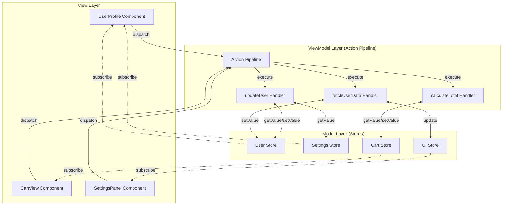
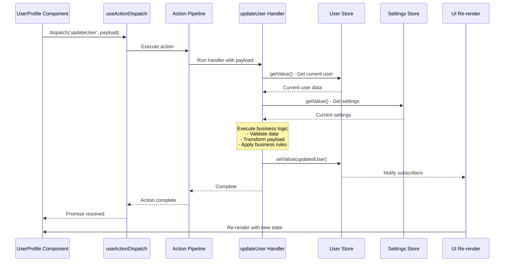
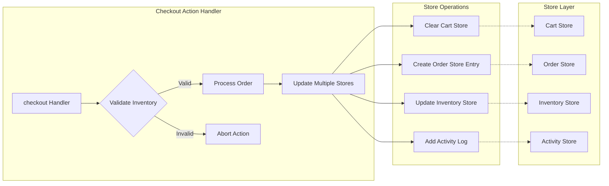
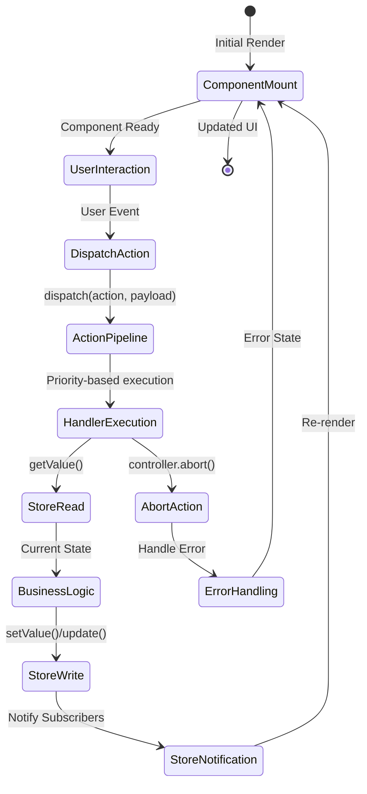
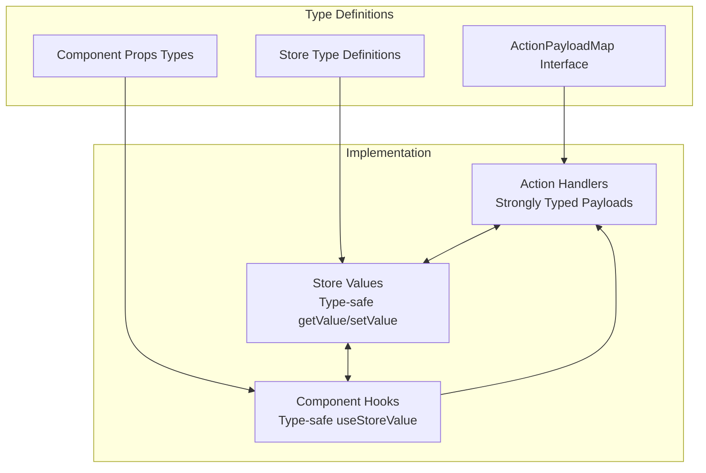
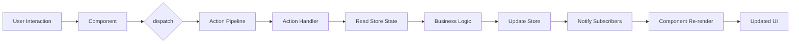

# Context-Action Store Integration Architecture

## Overview

The Context-Action framework implements a clean separation of concerns through an MVVM-inspired pattern where:
- **Actions** handle business logic (ViewModel layer)
- **Stores** manage state (Model layer)  
- **Components** render UI (View layer)

## Core Architecture

### 1. Action Pipeline System

Actions are registered to a central pipeline that processes dispatched events:

```typescript
// Action definition
interface AppActions extends ActionPayloadMap {
  updateUser: { id: string; name: string };
  calculateTotal: { items: CartItem[] };
}

// Register action handler
actionRegister.register('updateUser', async (payload, controller) => {
  // Business logic here
});
```

### 2. Store Integration Pattern

Action handlers receive payload and use store getters/setters to:
1. Read current state values via getters
2. Execute business logic with payload + current state
3. Update stores via setters

```typescript
// Action handler with store integration
actionRegister.register('updateUser', async (payload, controller) => {
  // Get current state
  const currentUser = userStore.getValue();
  const settings = settingsStore.getValue();
  
  // Business logic
  const updatedUser = {
    ...currentUser,
    ...payload,
    lastModified: Date.now(),
    theme: settings.theme // Cross-store logic
  };
  
  // Update stores
  userStore.setValue(updatedUser);
  activityStore.update(activities => [...activities, {
    type: 'user_updated',
    timestamp: Date.now(),
    userId: payload.id
  }]);
});
```

## Data Flow

```
┌──────────────┐     dispatch      ┌──────────────┐
│              │ -----------------> │              │
│   Component  │                    │    Action    │
│              │ <----------------- │   Pipeline   │
└──────────────┘     subscribe      └──────────────┘
       │                                    │
       │ useStore                          │ get/set
       ▼                                    ▼
┌──────────────┐                    ┌──────────────┐
│              │                    │              │
│ Store Hooks  │ <----------------- │    Stores    │
│              │      observe       │              │
└──────────────┘                    └──────────────┘
```

### Execution Flow:

1. **Component Dispatch**: Component calls `dispatch('actionName', payload)`
2. **Pipeline Processing**: Action pipeline executes registered handlers in priority order
3. **Store Access**: Handlers use store getters to read current state
4. **Business Logic**: Handlers process payload with current state values
5. **Store Updates**: Handlers call store setters to update state
6. **Component Re-render**: Components subscribed to updated stores automatically re-render

## Key Design Principles

### 1. Lazy Evaluation
- Store getters are called at execution time, ensuring fresh values
- No stale closure issues - handlers always get current state

### 2. Decoupled Architecture
- Actions don't know about components
- Stores don't know about actions
- Components only know action names and payloads

### 3. Type Safety
- Full TypeScript support throughout
- Actions and payloads are strongly typed
- Store values maintain type integrity

### 4. Testability
- Actions can be tested independently with mock stores
- Stores can be tested without action pipeline
- Components can be tested with mock dispatch

### 5. Single Responsibility
- **Components**: Only render UI and dispatch actions
- **Actions**: Handle all business logic and data processing
- **Stores**: Pure state containers with no computation logic

### 6. Data Flow Clarity
- Unidirectional data flow: Component → Action → Store → Component
- No computed stores - all data integration happens in action handlers
- Stores contain final, processed data ready for display

## Integration with React

### StoreProvider Setup
```typescript
function App() {
  return (
    <StoreProvider>
      <ActionProvider>
        <Application />
      </ActionProvider>
    </StoreProvider>
  );
}
```

### Component Usage
```typescript
function UserProfile() {
  const dispatch = useActionDispatch();
  const user = useStoreValue(userStore);
  
  const updateName = (name: string) => {
    dispatch('updateUser', { id: user.id, name });
  };
  
  return (
    <div>
      <h1>{user.name}</h1>
      <button onClick={() => updateName('New Name')}>
        Update Name
      </button>
    </div>
  );
}
```

### Action Handler Registration
```typescript
function useUserActions() {
  const dispatch = useActionDispatch();
  const registry = useStoreRegistry();
  
  useEffect(() => {
    const userStore = registry.getStore('user');
    const settingsStore = registry.getStore('settings');
    
    const unregister = actionRegister.register('updateUser', 
      async (payload, controller) => {
        const user = userStore.getValue();
        const settings = settingsStore.getValue();
        
        // Complex business logic
        if (settings.validateNames && !isValidName(payload.name)) {
          controller.abort('Invalid name');
          return;
        }
        
        userStore.setValue({
          ...user,
          ...payload,
          updatedAt: Date.now()
        });
      },
      { priority: 10, blocking: true }
    );
    
    return unregister;
  }, [registry]);
}
```

## Advanced Patterns

### 1. Cross-Store Coordination
```typescript
actionRegister.register('checkout', async (payload, controller) => {
  const cart = cartStore.getValue();
  const user = userStore.getValue();
  const inventory = inventoryStore.getValue();
  
  // Validate inventory
  const unavailable = cart.items.filter(item => 
    inventory[item.id] < item.quantity
  );
  
  if (unavailable.length > 0) {
    controller.abort('Items unavailable');
    return;
  }
  
  // Update multiple stores atomically
  orderStore.setValue({ ...payload, status: 'processing' });
  cartStore.setValue({ items: [] });
  inventoryStore.update(inv => updateInventory(inv, cart.items));
});
```

### 2. Data Integration Pattern (Recommended over Computed Stores)

Instead of computed stores, use action handlers to integrate data from multiple stores:

```typescript
actionRegister.register('calculateTotals', async (payload, controller) => {
  const cart = cartStore.getValue();
  const user = userStore.getValue();
  const promos = promoStore.getValue();
  
  // Complex calculation with multiple store values
  const subtotal = calculateSubtotal(cart.items);
  const discount = calculateDiscount(user, promos, subtotal);
  const tax = calculateTax(user.location, subtotal - discount);
  
  // Store computed result in dedicated store
  totalsStore.setValue({
    subtotal,
    discount,
    tax,
    total: subtotal - discount + tax
  });
});

// Trigger calculation when dependencies change
actionRegister.register('updateCart', async (payload, controller) => {
  cartStore.setValue(payload.cart);
  
  // Automatically recalculate totals
  dispatch('calculateTotals', {});
});
```

### 3. Async Operations with State Updates
```typescript
actionRegister.register('fetchUserData', async (payload, controller) => {
  // Set loading state
  uiStore.update(ui => ({ ...ui, loading: true }));
  
  try {
    const response = await api.getUser(payload.userId);
    
    // Update user store
    userStore.setValue(response.user);
    
    // Update related stores
    if (response.preferences) {
      preferencesStore.setValue(response.preferences);
    }
    
  } catch (error) {
    errorStore.setValue({ 
      message: 'Failed to fetch user',
      error 
    });
    controller.abort('API error');
  } finally {
    uiStore.update(ui => ({ ...ui, loading: false }));
  }
});
```

## Architectural Diagrams

### 1. Overall Architecture Overview



### 2. Action Execution Flow Sequence



### 3. Cross-Store Coordination Pattern



### 4. Component-Store-Action Lifecycle



### 5. Type Safety Flow



### 6. Data Flow Pattern



## Benefits

1. **Clear Separation**: Business logic in actions, state in stores, UI in components
2. **Reusability**: Actions can be reused across components
3. **Testability**: Each layer can be tested independently
4. **Type Safety**: Full TypeScript support with compile-time checking
5. **Performance**: Only components using changed stores re-render
6. **Debugging**: Clear action flow with pipeline tracing
7. **Scalability**: Easy to add new actions and stores as app grows
8. **Simplified Components**: Components focus solely on UI rendering and user interaction
9. **Centralized Logic**: All data processing and business rules concentrated in action handlers
10. **Predictable State**: Stores contain only final, processed data - no intermediate computations

## Best Practices

1. **Keep Actions Focused**: One action should do one thing well
2. **Use Priority**: Higher priority handlers run first for dependent operations
3. **Handle Errors**: Use try-catch in async handlers and controller.abort()
4. **Avoid Side Effects**: Keep store updates predictable and traceable
5. **Type Everything**: Leverage TypeScript for safety and documentation
6. **Test Handlers**: Write unit tests for action handlers with mock stores
7. **Data Integration in Actions**: Instead of computed stores, process and combine data in action handlers, then store results in dedicated stores
8. **Component Simplicity**: Components should only subscribe to stores and dispatch actions - no business logic in components