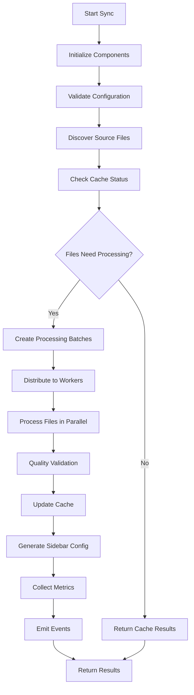

# Architecture Guide

Detailed architecture documentation for TypeDoc VitePress Sync.

## Table of Contents

- [System Overview](#system-overview)
- [Core Components](#core-components)
- [Data Flow](#data-flow)
- [Cache Architecture](#cache-architecture)
- [Parallel Processing Model](#parallel-processing-model)
- [Quality Validation Pipeline](#quality-validation-pipeline)
- [Event System](#event-system)
- [Error Handling Strategy](#error-handling-strategy)
- [Performance Optimizations](#performance-optimizations)

---

## System Overview

TypeDoc VitePress Sync is designed as a modular, event-driven system that transforms TypeDoc JSON output into VitePress-compatible markdown files with advanced caching and quality assurance.

### Design Principles

1. **Modularity**: Each component has a single responsibility
2. **Performance**: Intelligent caching and parallel processing
3. **Reliability**: Comprehensive error handling and recovery
4. **Extensibility**: Plugin-based architecture for custom rules
5. **Observability**: Detailed metrics and event tracking

### High-Level Architecture

```
┌─────────────────┐    ┌─────────────────┐    ┌─────────────────┐
│  TypeDoc JSON   │    │   VitePress     │    │   Sidebar       │
│     Input       │    │   Markdown      │    │   Config        │
└─────────┬───────┘    └─────────┬───────┘    └─────────┬───────┘
          │                      │                      │
          ▼                      ▲                      ▲
┌─────────────────────────────────────────────────────────────────┐
│                TypeDocVitePressSync                             │
├─────────────────────────────────────────────────────────────────┤
│  ┌─────────────┐  ┌─────────────┐  ┌─────────────┐  ┌─────────┐ │
│  │    Cache    │  │    File     │  │   Quality   │  │ Metrics │ │
│  │   Manager   │  │  Processor  │  │ Validator   │  │Collector│ │
│  └─────────────┘  └─────────────┘  └─────────────┘  └─────────┘ │
│  ┌─────────────┐  ┌─────────────┐  ┌─────────────┐  ┌─────────┐ │
│  │   Error     │  │  Markdown   │  │   Sidebar   │  │ Console │ │
│  │  Handler    │  │  Processor  │  │ Generator   │  │ Logger  │ │
│  └─────────────┘  └─────────────┘  └─────────────┘  └─────────┘ │
└─────────────────────────────────────────────────────────────────┘
```

---

## Core Components

### TypeDocVitePressSync (Main Orchestrator)

The central coordinator that manages all other components and orchestrates the sync process.

```typescript
export class TypeDocVitePressSync {
  private config: Required<SyncConfig>
  private cache: CacheManager
  private errorHandler: ErrorHandler
  private validator: QualityValidator
  private metrics: MetricsCollector
  private processor: FileProcessor
  private sidebarGenerator: SidebarGenerator
  private logger: Logger
  private events: Partial<SyncEvents> = {}

  constructor(config: SyncConfig, logger?: Logger) {
    // Initialize all components with dependency injection
    this.initializeComponents()
  }
}
```

**Responsibilities:**
- Component initialization and dependency injection
- Configuration validation and normalization
- Event coordination between components
- High-level sync orchestration
- Auto-optimization based on system resources

### CacheManager (Intelligent Caching)

Manages file-level caching with SHA256 hash-based change detection.

```typescript
export class CacheManager {
  private manifest: CacheManifest = { entries: {}, metadata: {} }
  private stats: CacheStats
  
  constructor(
    private config: Required<CacheConfig>,
    private logger: Logger
  ) {}
}
```

**Architecture:**
```
┌─────────────────────────────────────────────────────────────┐
│                    CacheManager                             │
├─────────────────────────────────────────────────────────────┤
│  Hash Calculator    │  Manifest Manager  │  TTL Controller  │
│  ┌─────────────┐   │  ┌─────────────┐   │  ┌─────────────┐  │
│  │   SHA256    │   │  │    JSON     │   │  │  Expiry     │  │
│  │ Computation │   │  │ Persistence │   │  │  Tracking   │  │
│  └─────────────┘   │  └─────────────┘   │  └─────────────┘  │
├─────────────────────────────────────────────────────────────┤
│           Cache Entry: { hash, timestamp, size }             │
└─────────────────────────────────────────────────────────────┘
```

**Features:**
- File-level granular caching
- SHA256 hash collision detection
- TTL-based automatic expiration
- Cache statistics and hit rate tracking
- Atomic cache updates

### FileProcessor (Parallel Processing Engine)

Handles parallel file processing with intelligent batching and worker management.

```typescript
export class FileProcessor {
  private workerPool: Worker[]
  private taskQueue: ProcessingTask[]
  private batchManager: BatchManager
  
  constructor(
    private config: Required<ParallelConfig>,
    private cache: CacheManager,
    private validator: QualityValidator,
    private metrics: MetricsCollector,
    private errorHandler: ErrorHandler,
    private logger: Logger
  ) {}
}
```

**Processing Pipeline:**
```
File List → Batch Creation → Worker Distribution → Result Aggregation

┌─────────────┐    ┌─────────────┐    ┌─────────────┐    ┌─────────────┐
│   File 1    │    │   Batch 1   │    │  Worker 1   │    │   Result    │
│   File 2    │ ─► │ (Files 1-5) │ ─► │  Worker 2   │ ─► │ Aggregation │
│   File 3    │    │   Batch 2   │    │  Worker 3   │    │             │
│    ...      │    │ (Files 6-10)│    │  Worker 4   │    │             │
│   File N    │    │    ...      │    │             │    │             │
└─────────────┘    └─────────────┘    └─────────────┘    └─────────────┘
```

### QualityValidator (Multi-layered Validation)

Provides comprehensive quality validation with pluggable rules.

```typescript
export class QualityValidator {
  private rules: ValidationRule[]
  private processors: ValidationProcessor[]
  
  constructor(
    private config: Required<QualityConfig>,
    private logger: Logger
  ) {}
}
```

**Validation Layers:**
```
┌─────────────────────────────────────────────────────────────────┐
│                     QualityValidator                            │
├─────────────────┬─────────────────┬─────────────────────────────┤
│  Markdown Layer │   Link Layer    │     Accessibility Layer     │
│  ┌─────────────┐│  ┌─────────────┐│  ┌─────────────────────────┐ │
│  │ Syntax      ││  │ Internal    ││  │ Alt Text               │ │
│  │ Code Blocks ││  │ Relative    ││  │ Heading Hierarchy      │ │
│  │ Tables      ││  │ Absolute    ││  │ List Structure         │ │
│  │ Templates   ││  │ References  ││  │ Table Accessibility    │ │
│  └─────────────┘│  └─────────────┘│  └─────────────────────────┘ │
└─────────────────┴─────────────────┴─────────────────────────────┘
```

**Rule Engine:**
- Plugin-based custom rules
- Severity levels (error, warning, info)
- File-level and content-level validation
- Configurable rule sets per project

---

## Data Flow

### Sync Operation Flow



### File Processing Pipeline

```
Source File → Hash Check → Cache Decision → Processing → Validation → Output

┌─────────────┐    ┌──────────┐    ┌─────────────┐    ┌─────────────┐
│ TypeDoc     │    │   SHA256 │    │   Cache     │    │ Markdown    │
│ JSON Input  │ ─► │   Hash   │ ─► │  Decision   │ ─► │ Processing  │
└─────────────┘    └──────────┘    └─────────────┘    └─────────────┘
                                           │                    │
                                           ▼                    ▼
                                   ┌─────────────┐    ┌─────────────┐
                                   │   Cached    │    │   Quality   │
                                   │   Result    │    │ Validation  │
                                   └─────────────┘    └─────────────┘
                                           │                    │
                                           ▼                    ▼
                                   ┌─────────────────────────────────┐
                                   │         Final Output            │
                                   └─────────────────────────────────┘
```

---

## Cache Architecture

### Cache Structure

```typescript
interface CacheManifest {
  entries: Record<string, CacheEntry>
  metadata: CacheMetadata
}

interface CacheEntry {
  sourceHash: string      // SHA256 of source file
  targetHash: string      // SHA256 of target file
  timestamp: number       // Creation timestamp
  size: number           // File size in bytes
  processingTime: number  // Time taken to process
}
```

### Cache Decision Tree

```
File Change Detection:
┌─────────────┐
│Source File  │
└─────┬───────┘
      │
      ▼
┌─────────────┐    No     ┌─────────────┐
│Cache Entry  │ ────────► │   Process   │
│   Exists?   │           │    File     │
└─────┬───────┘           └─────────────┘
      │ Yes
      ▼
┌─────────────┐    Yes    ┌─────────────┐
│   Cache     │ ────────► │   Use       │
│  Expired?   │           │   Cache     │
└─────┬───────┘           └─────────────┘
      │ No
      ▼
┌─────────────┐    No     ┌─────────────┐
│Source Hash  │ ────────► │   Use       │
│  Changed?   │           │   Cache     │
└─────┬───────┘           └─────────────┘
      │ Yes
      ▼
┌─────────────┐
│   Process   │
│    File     │
└─────────────┘
```

### Cache Performance Model

**Hit Rate Calculation:**
```typescript
hitRate = (cacheHits / (cacheHits + cacheMisses)) * 100
```

**Performance Metrics:**
- Target hit rate: >90%
- Average file processing time: <20ms
- Cache lookup time: <5ms
- Memory usage: <100MB for 1000 files

---

## Parallel Processing Model

### Worker Pool Architecture

```
Main Thread                    Worker Threads
┌─────────────────┐           ┌─────────────────┐
│  FileProcessor  │           │    Worker 1     │
│                 │           │  ┌─────────────┐│
│  ┌─────────────┐│           │  │ Markdown    ││
│  │ Task Queue  ││  ────────►│  │ Processor   ││
│  └─────────────┘│           │  └─────────────┘│
│  ┌─────────────┐│           └─────────────────┘
│  │Batch Manager││           ┌─────────────────┐
│  └─────────────┘│           │    Worker 2     │
│  ┌─────────────┐│           │  ┌─────────────┐│
│  │Result Pool  ││  ◄────────│  │ Markdown    ││
│  └─────────────┘│           │  │ Processor   ││
└─────────────────┘           │  └─────────────┘│
                              └─────────────────┘
```

### Batch Optimization Strategy

**Dynamic Batch Sizing:**
```typescript
function calculateOptimalBatchSize(
  fileCount: number,
  workerCount: number,
  systemMemory: number
): number {
  const baseSize = Math.ceil(fileCount / workerCount)
  const memoryFactor = systemMemory > 8_000_000_000 ? 2 : 1
  return Math.min(baseSize * memoryFactor, 50) // Cap at 50 files
}
```

**Load Balancing:**
- Round-robin task distribution
- Worker utilization monitoring
- Dynamic worker scaling
- Queue overflow protection

---

## Quality Validation Pipeline

### Multi-Stage Validation

```
Stage 1: Syntax         Stage 2: Semantic      Stage 3: Accessibility
┌─────────────────┐    ┌─────────────────┐    ┌─────────────────────┐
│ Markdown Syntax │    │ Link Validation │    │ Alt Text Required   │
│ Code Block      │ ─► │ Reference Check │ ─► │ Heading Hierarchy   │
│ Table Format    │    │ File Existence  │    │ List Structure      │
└─────────────────┘    └─────────────────┘    └─────────────────────┘
         │                       │                        │
         ▼                       ▼                        ▼
┌─────────────────┐    ┌─────────────────┐    ┌─────────────────────┐
│   Issues Found  │    │   Issues Found  │    │   Issues Found      │
│   • Unclosed    │    │   • Broken Link │    │   • Missing Alt     │
│   • Template    │    │   • Empty Text  │    │   • Skip Heading    │
└─────────────────┘    └─────────────────┘    └─────────────────────┘
```

### Rule Engine Architecture

```typescript
interface ValidationRule {
  name: string
  severity: 'error' | 'warning' | 'info'
  category: 'markdown' | 'link' | 'accessibility' | 'custom'
  validate(content: string, filePath: string): ValidationIssue[]
}

class ValidationEngine {
  private rules: Map<string, ValidationRule> = new Map()
  
  addRule(rule: ValidationRule): void {
    this.rules.set(rule.name, rule)
  }
  
  async validateFile(filePath: string): Promise<ValidationResult> {
    const content = await fs.readFile(filePath, 'utf-8')
    const issues: ValidationIssue[] = []
    
    for (const rule of this.rules.values()) {
      issues.push(...rule.validate(content, filePath))
    }
    
    return { filePath, issues }
  }
}
```

---

## Event System

### Event-Driven Architecture

The system uses an event-driven model for loose coupling and extensibility.

```typescript
interface SyncEvents {
  start: (config: SyncConfig) => void
  fileStart: (filePath: string) => void
  fileComplete: (filePath: string, result: FileResult) => void
  batchComplete: (batchId: string, results: FileResult[]) => void
  qualityIssue: (filePath: string, issue: QualityIssue) => void
  cacheHit: (filePath: string) => void
  cacheMiss: (filePath: string) => void
  error: (error: Error, context?: string) => void
  complete: (result: SyncResult) => void
}
```

### Event Flow

```
User Action → Event Emission → Component Reaction → Side Effects

sync.sync()
    │
    ▼
emit('start') ──────────► Logger.info('Starting sync...')
    │                    ├► Metrics.startTiming()
    │                    └► UI.showProgress()
    ▼
process file
    │
    ▼
emit('fileComplete') ──► Logger.debug('File processed')
    │                    ├► Metrics.recordFile()
    │                    └► UI.updateProgress()
    ▼
emit('complete') ────────► Logger.info('Sync complete')
                         ├► Metrics.saveReport()
                         └► UI.showSummary()
```

---

## Error Handling Strategy

### Error Classification

```typescript
enum ErrorCategory {
  CONFIGURATION = 'configuration',
  FILE_SYSTEM = 'filesystem', 
  PROCESSING = 'processing',
  VALIDATION = 'validation',
  CACHE = 'cache',
  NETWORK = 'network',
  SYSTEM = 'system'
}

enum ErrorSeverity {
  FATAL = 'fatal',        // Stop execution
  ERROR = 'error',        // Skip file, continue
  WARNING = 'warning',    // Log, continue
  INFO = 'info'          // Information only
}
```

### Error Recovery Strategies

```
Error Type → Recovery Strategy → User Impact

Configuration Error:
├─ Invalid path → Suggest corrections → Fatal error
├─ Missing config → Create default → Continue with defaults
└─ Invalid option → Use default value → Warning message

File System Error:
├─ Permission denied → Skip file → Error logged
├─ File not found → Skip file → Warning logged
└─ Disk full → Graceful exit → Fatal error

Processing Error:
├─ Syntax error → Skip file → Error logged
├─ Memory error → Reduce batch size → Automatic retry
└─ Timeout → Extend timeout → Automatic retry
```

### Error Context Preservation

```typescript
class ContextualError extends Error {
  constructor(
    message: string,
    public readonly category: ErrorCategory,
    public readonly severity: ErrorSeverity,
    public readonly context: ErrorContext,
    public readonly cause?: Error
  ) {
    super(message)
    this.name = 'ContextualError'
  }
}

interface ErrorContext {
  filePath?: string
  operation?: string
  timestamp: Date
  systemState: {
    memoryUsage: number
    cpuUsage: number
    diskSpace: number
  }
}
```

---

## Performance Optimizations

### Multi-Level Optimization

**1. Algorithm Level:**
- Efficient hash computation (streaming SHA256)
- Parallel processing with optimal batching
- Lazy evaluation of expensive operations
- Memory-mapped file access for large files

**2. I/O Level:**
- Batch file system operations
- Async I/O with proper backpressure
- Stream processing for large files
- Intelligent file watching

**3. Memory Level:**
- Object pooling for frequent allocations
- Weak references for caches
- Garbage collection optimization
- Memory usage monitoring

**4. Cache Level:**
- Multi-tier caching (memory + disk)
- Cache warming strategies
- Intelligent cache eviction
- Cache compression

### Performance Monitoring

```typescript
class PerformanceMonitor {
  private metrics: Map<string, PerformanceMetric> = new Map()
  
  startOperation(name: string): void {
    this.metrics.set(name, {
      startTime: performance.now(),
      memoryBefore: process.memoryUsage()
    })
  }
  
  endOperation(name: string): PerformanceReport {
    const metric = this.metrics.get(name)
    return {
      duration: performance.now() - metric.startTime,
      memoryDelta: this.calculateMemoryDelta(metric.memoryBefore),
      cpuUsage: process.cpuUsage()
    }
  }
}
```

### Resource Management

**Memory Management:**
- Streaming for large files (>10MB)
- Buffer pooling for frequent operations
- Automatic garbage collection triggers
- Memory pressure monitoring

**CPU Management:**
- Worker thread utilization optimization
- CPU-intensive operation batching
- Adaptive worker scaling
- CPU usage throttling

**Disk I/O Management:**
- Batch write operations
- Temporary file cleanup
- Disk space monitoring
- I/O error recovery

This architecture provides a robust, scalable, and maintainable foundation for TypeDoc VitePress synchronization with advanced performance and quality features.