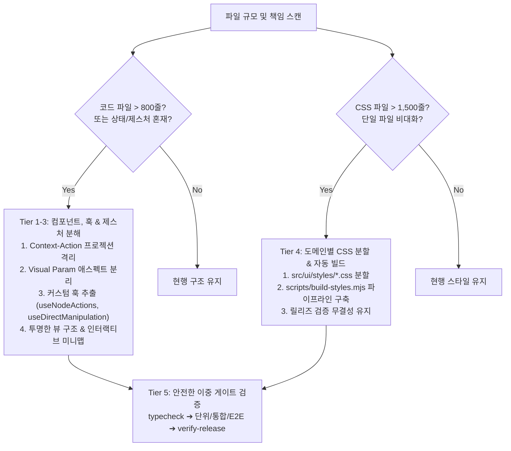

# Context-Action Architectural Modularization & Component Decomposition Guide

스토리보드/와이어프레임 툴킷, 웹 스튜디오, 대규모 프론트엔드 애플리케이션에서 **단일 거대 코드 파일(God-Component, 1,000~2,500+ 라인)** 및 **거대 단일 스타일시트(Monolithic CSS, 2,000+ 라인)**가 발생했을 때, Context-Action 아키텍처와 분리 관점(Aspect Decomposition), 제스처/드래프트 훅 격리 원칙에 따라 안전하고 체계적으로 모듈화하는 표준 운영 절차(SOP)입니다.

---

## 1. 모듈화 진단 및 트리거 기준 (Modularization Triggers & Thresholds)

코드 작성이나 리팩토링 중 다음 임계값을 초과하거나 코드 스멜이 감지되면 즉시 이 스킬을 활성화하여 모듈화를 수행합니다:



### 1.1 코드 파일 임계값 (Code File Thresholds)
- **Warning (500 ~ 800 라인)**: 단일 컴포넌트 내에 3개 이상의 상이한 사용자 조작 도메인(정렬, 그림자, 그래디언트, 레이어 트리 등) 또는 복합 드래그 제스처가 혼재하기 시작하는 시점. 모듈 분리 계획 수립.
- **Critical Trigger (800 ~ 1,000+ 라인)**: 강제 모듈화 트리거. `InspectorPanel.tsx`(1,500~2,800+ 라인), `ArtboardCanvas.tsx`(1,000~1,500+ 라인)와 같은 거대 컴포넌트는 유지보수성 저하, 병합 충돌, 인지 부하의 주원인이므로 즉시 분해.
- **Anti-God-Component 불변식 (`AGENTS.md` Sec 9.1 준용)**:
  - 하나의 컴포넌트가 구독 상태 프로젝션, 캔버스 직접 조작(드래그/회전/스냅), 복합 위젯 렌더링, 계층 트리 인라인 편집, 반응형 드래프트 동기화를 모두 독점해서는 안 됨.

### 1.2 스타일시트(CSS) 임계값 (Stylesheet Thresholds)
- **Warning (1,000 ~ 1,500 라인)**: 레이아웃, 에디터, 모달, 개별 위젯 스타일이 뒤섞여 클래스 충돌 및 우선순위 오염 발생 위험.
- **Critical Trigger (2,000 ~ 5,000+ 라인)**: 단일 `styles.css` 비대화로 인한 가독성 마비. 도메인 단위 분할 및 빌드 타임 자동 결합 파이프라인 필수 도입.

---

## 2. 5계층 아키텍처 모듈화 단위 (The 5-Tier Modularization Units)

### Tier 1: Context-Action Protocol & Projection Isolation (프로젝션과 의도 분리)
- **원칙**: 뷰/패널 컴포넌트는 **순수 읽기 전용 프로젝션(Read-only Projection)**이어야 하며, 변경은 **타입 안전한 의도(Action Intent)**로 격리되어 디스패치되어야 함.
- **규약**:
  1. 패널은 `useSyncExternalStore` 또는 게이트웨이 리더를 통해 불변 상태 스냅샷(`statusProjection`)만 읽음.
  2. 노드 속성 변경, 삭제, 순서 변경 등은 직접 가변 객체를 수정하지 않고 `ActionRuntime.dispatch({ type, payload })`를 통해서만 단일 트랜잭션으로 커밋.
  3. 하위 제어 컴포넌트에는 가변 Document 전체를 넘기지 않고, **원자적 콜백 함수(`onRotationChange`, `onShadowChange`)**만 Props로 주입.

```tsx
// Bad: 거대 패널에서 가변 모델을 직접 수정하거나 임의 클로저를 깊게 전달
<div onClick={() => { node.appearance.rotation = deg; store.save(); }} />

// Good: 읽기 전용 프로젝션 + 타입 안전한 의도 디스패치
<RotationPivotControl
  draftRotation={draftRotation}
  draftPivot={draftPivot}
  onRotationChange={(deg) => handleRotationChange(deg)}
  onPivotChange={(pivot) => handlePivotChange(pivot)}
/>
```

---

### Tier 2: Aspect Decomposition (애스펙트 분해: Visual Param Modular 위젯)
엔티티의 시각적 속성(Aspect)별로 제어 컴포넌트를 완전히 독립된 모듈로 분리합니다:

| 분리 컴포넌트 | 담당 도메인 & 자체 인터랙션 | Props 인터페이스 핵심 |
| :--- | :--- | :--- |
| **`AlignmentControl`** | 퀵 정렬 바 (|←, →|←, →|, ¯↑¯, ↓|↑, _↓_) + 3×3 정렬 매트릭스 보드 | `activeAlignCell`, `onAlign(type)` |
| **`CornerRadiusControl`** | 모서리 둥글기 연결(Linked) vs 개별(Split) 모드 + 4코너 독립 수치 | `radiusMode`, `draftRadius`, `radiusCorners`, `onRadiusModeChange`, `onLinkedRadiusChange`, `onCornerRadiusChange` |
| **`ConstraintsControl`** | 화면 크기 변경 대비 4방향 고정 핀 (Top/Bottom/Left/Right) + AUTO/PIN 상태 | `activePins`, `onTogglePin(edge)` |
| **`RotationPivotControl`** | 자체 원형 SVG 다이얼 포인터 드래그 인터랙션 (`Math.atan2` 계산) + 3×3 변형 중심축 피벗 매트릭스 | `draftRotation`, `draftPivot`, `onRotationChange(deg)`, `onPivotChange(pivot)` |
| **`BoxShadowControl`** | 실시간 네온 글로우 미리보기 + 3×3 방향 패드 + X/Y/B/S 미니 그리드 + Opacity 슬라이더 | `shadowX`, `shadowY`, `shadowBlur`, `shadowSpread`, `shadowOpacity`, `onShadowChange(patch)` |
| **`GradientControl`** | 단색(Solid) vs 선형(Linear) 전환 + 4방향 각도 프리셋 + 실시간 회전선 가이드 + 시작/끝 컬러 피커 | `gradientMode`, `gradientAngle`, `gradientStartColor`, `gradientEndColor`, `onGradientModeChange`, `onGradientAngleChange`, `onGradientColorChange` |
| **`BoxModelControl`** | Margin 4방향 + Padding 4방향 수치 다이어그램 + `border-box`/`content-box` 사이징 | `boxMargin*`, `boxPadding*`, `boxSizing`, `onBoxModelChange(patch)` |

- **자체 인터랙션 캡슐화 규칙**: 회전 다이얼의 포인터 캡처, 각도 삼각함수 연산(`Math.atan2`), 이벤트 리스너 등록/해제 등은 `RotationPivotControl` 내부에 완벽히 격리하여 부모 패널의 코드를 수백 줄 절감함.

---

### Tier 3: Hook & Direct Manipulation Decoupling (커스텀 훅 및 제스처 분리)

거대 컴포넌트 비대화의 핵심 원인은 UI 마크업 자체가 아니라 **복잡한 드래프트 상태 동기화**, **디바운스 트랜잭션 커밋**, **캔버스 포인터 제스처 추적**이 인라인으로 누적되는 것입니다. 이를 전용 커스텀 훅으로 완전 분리합니다.

#### 3.1 인스펙터 액션 및 드래프트 분리 (`useInspectorNodeActions`)
- **역할**: 수십 개의 폼 입력 필드(`x`, `y`, `w`, `h`, `fill`, `stroke`, `opacity`, `shadow`, `gradient`, `boxModel`, `video`)의 실시간 드래프트 상태 관리 및 원자적 트랜잭션 커밋 캡슐화.
- **인풋 포커스 보존 규칙**: 외부 상태 동기화 시 `document.activeElement.getAttribute("name")`를 확인하여, 사용자가 타이핑 중인 필드가 덮어써지지 않도록 보호.
- **디바운스 트랜잭션**: 연속 입력(슬라이더, 숫자 키패드)은 `setTimeout` ref를 이용해 60~250ms 디바운스 커밋 처리하고, 컴포넌트 언마운트 시 클린업.

```tsx
// InspectorPanel.tsx (순수 선언적 뷰, < 250 라인)
export function InspectorPanel(props: InspectorPanelProps) {
  const actions = useInspectorNodeActions(props);
  return (
    <aside aria-label="Inspector and status">
      <SlidePropertiesSection {...actions} />
      <LayersSection {...actions} />
      {actions.isMultiSelected ? (
        <MultiSelectSection {...actions} />
      ) : actions.selectedNode ? (
        <form onSubmit={actions.handleApply}>
          <NodeTransformSection {...actions} />
          <AlignmentControl {...actions} />
          <BoxShadowControl {...actions} />
          <NodeAppearanceSection {...actions} />
          <NodeDeleteButton {...actions} />
        </form>
      ) : <EmptySelectionCard />}
    </aside>
  );
}
```

#### 3.2 캔버스 직접 조작 및 제스처 분리 (`useCanvasDirectManipulation`)
- **역할**: 마우스/포인터 드래그, 다중 노드 5px 자석 스마트 스냅, 4코너 핸들 리사이징, 회전 각도 삼각함수, 러버밴드 마퀴 다중 선택, 파일 드롭 업로드, 인라인 텍스트 편집 격리.
- **스마트 스냅(Smart Magnet Snapping)**: 드래그 중인 노드와 비선택 정적 노드 간 5px 오차 범위 내 경계(좌, 우, 중앙) 일치 시 자동 스냅 및 시안색 가이드 라인(`CanvasSnapGuides`) 방출.

```tsx
// ArtboardCanvas.tsx (순수 선언적 스테이지, < 250 라인)
export function ArtboardCanvas(props: ArtboardCanvasProps) {
  const manipulation = useCanvasDirectManipulation(props);
  return (
    <div className="canvas-stage">
      <CanvasRulers {...props} />
      <div ref={manipulation.artboardRef} className="slide-artboard" onPointerDown={manipulation.handlePointerDownArtboard}>
        {props.currentSlide?.nodes.map((node, i) => (
          <CanvasNodeRenderer key={node.id} node={node} index={i} {...manipulation} />
        ))}
        <CanvasSnapGuides snapGuides={manipulation.snapGuides} zoomLevel={props.zoomLevel} />
        <CanvasMarquee marqueeState={manipulation.marqueeState} zoomLevel={props.zoomLevel} />
        <CanvasPresenceOverlay peerList={props.peerList} />
      </div>
      <CanvasSpecHud {...props} />
    </div>
  );
}
```

---

### Tier 4: Transparent View Structure & Visual Minimap (투명한 뷰 구조 및 미니맵)

화면 모드나 서브모드(Layout vs Structure & Flow) 분리 시, 캔버스 시각 정보가 가려지면 사용자의 인지 연속성이 단절됩니다. 따라서 **구조적/시각적 투명성**을 보장해야 합니다:

1. **화면 구도 반응형 미니맵 (`ssf-preview-box`)**:
   - 트리 뷰 및 플로우 목록 상단에 16:9 비율의 인터랙티브 미니맵 탑재.
   - 실제 캔버스 상의 모든 요소 노드를 비례 축소된 사각형으로 실시간 투영.
   - 선택된 노드는 즉시 시안 블루(`#38bdf8`)로 강조되며, 미니맵 블록 클릭 시 양방향 선택 동기화.
2. **반투명 글래스모피즘(Glassmorphism) 오버레이**:
   - 캔버스 위를 떠다니는 퀵 에디터, Spec HUD, 툴바 패널에 `backdrop-filter: blur(12px)` 및 `rgba(15, 23, 42, 0.85)`를 적용하여 하위 아트보드가 자연스럽게 투과되도록 설계.

---

### Tier 5: Hierarchical Group Deletion Safety (`resolveSafeDeleteCommands`)

복합 컨테이너(Group)와 자식 요소(Children)가 혼재된 환경에서 무분별한 삭제는 고아 참조(Orphan Reference)나 트랜잭션 불일치를 유발합니다:

1. **위상 정렬 기반 순차 삭제**:
   - 자식 노드(`parentId === groupId`)를 먼저 삭제 명령에 배치.
   - 삭제 대상 노드에 바인딩된 모든 전이 액션(`SlideAction.trigger.nodeId`)을 함께 해제 또는 제거.
   - 최후에 부모 그룹 컨테이너 노드를 삭제하여 트랜잭션 롤백 및 참조 깨짐 원천 차단.

---

### Tier 6: Domain-Scoped Stylesheet Architecture (도메인별 CSS 분할 & 자동 빌드)

배포 패키지 무결성 검증(`verify-release.mjs`)이나 단일 HTML 파일 인라인 번들링 제약이 있을 때, **개발 편의성(모듈화)**과 **배포 계약(단일 파일 SSOT)**을 동시에 만족하는 파이프라인을 구축합니다:

1. **도메인 단위 분할 (`src/ui/styles/`)**:
   - `base-legacy.css`: 기본 폰트, 리셋, 스크롤바, 레거시 에디터
   - `layout.css`: 셸, 헤더, 탭 바, 스플리터, 상태바
   - `inspector-base.css`: 인스펙터 서브카드, 속성 행, 라벨, 빈 상태 힌트
   - `modals-and-views.css`: 모달 오버레이, 점진 로딩, 협업 아바타, Mode 2/3 뷰, 미니맵
   - `design-system.css`: 버튼(`btn-*`), 배지(`badge-*`), 폼 인풋(`prop-input`)
   - `layers.css`: 계층 트리, 인라인 인풋, 행 액션 버튼, 들여쓰기 가이드
   - `visual-param.css`: Visual Param Modular v5 전용 위젯 (`.vpc-*`)
   - `artboard.css`: 캔버스 뷰포트, 노드 바운딩 박스, 회전 노브, 스냅 가이드 라인
2. **자동 결합 스크립트 (`scripts/build-styles.mjs`)**:
   ```javascript
   import { readFileSync, writeFileSync } from 'node:fs';
   import { join } from 'node:path';

   const ROOT = process.cwd();
   const STYLES_DIR = join(ROOT, 'src/ui/styles');
   const TARGET_CSS = join(ROOT, 'src/ui/styles.css');

   const FILES = [
     'base-legacy.css',
     'layout.css',
     'inspector-base.css',
     'modals-and-views.css',
     'design-system.css',
     'layers.css',
     'visual-param.css',
     'artboard.css',
   ];

   const combined = FILES.map((f) => readFileSync(join(STYLES_DIR, f), 'utf8')).join('\n\n');
   writeFileSync(TARGET_CSS, combined, 'utf8');
   ```
3. **빌드 파이프라인 통합 (`scripts/build.mjs`)**:
   - 컴파일 전 `node scripts/build-styles.mjs`를 선행 실행하여 항상 `src/ui/styles.css`와 `dist/index.html`이 완벽히 동기화되도록 보장 (`verify-release.mjs` 통과).

---

### Tier 7: Safe Refactoring & Zero-Regression Dual-Gate Verification (이중 게이트 검증)

대규모 리팩토링 시 기능 결함이나 타입 깨짐을 방지하기 위해 엄격한 순서로 검증합니다:

1. **컴파일러 타입 정합성 검증 (`typecheck`)**:
   - `effectiveSelectedIds`와 같은 불변 배열은 `readonly string[]`로 Props 타입을 일치시켜 TS4104 에러 방지.
   - 핸들러 패치 객체는 인덱스 시그니처 `[key: string]: unknown`을 허용하여 기존 유연한 핸들러와의 TS2322 호환성 보장.
2. **단위 및 셸 컴포넌트 테스트**:
   - `npm run test:react-shell`: 추출된 모든 서브 컴포넌트와 훅이 격리된 상태에서 렌더링되고 의도한 DOM/이벤트를 방출하는지 검증 (68/68 PASS).
3. **전체 워크스페이스 회귀 테스트**:
   - `npm test`: 코어 스키마, CRDT, 트랜잭션 게이트웨이, 릴리즈 인벤토리 전수 검증 (334/334 PASS).
4. **실제 브라우저 E2E 인터랙션 검증 (Playwright)**:
   - `python3 tests/browser-group-shadow-flow.py` & `browser-visual-param.py`:
     - 박스 그림자 패널 스크롤, 서브모드 전환, 그룹 안전 삭제, SVG 회전 다이얼이 실제 트랜잭션으로 커밋되는지 E2E 검증.
     - 시각적 아티팩트 스크린샷 캡처 확인.
5. **릴리즈 매니페스트 및 인벤토리 잠금**:
   - 새 파일 추가 후 `node scripts/make-manifest.mjs`로 파일 해시 갱신 ➔ `npm run test:package` 및 `node scripts/verify-release.mjs` 무결성 검증 (0 Errors).

---

## 3. 리팩토링 실행 체크리스트 (Step-by-Step Execution Checklist)

- [ ] **1단계: 진단**: 파일 라인 수 확인 (코드 > 800줄, CSS > 1,500줄 시 분해 결정).
- [ ] **2단계: CSS 분할**: `src/ui/styles/` 도메인별 8개 파일 분할 및 `build-styles.mjs` 파이프라인 연동.
- [ ] **3단계: 단말 컨트롤 위젯 분리**: Visual Param Modular 컨트롤러(`AlignmentControl`, `CornerRadiusControl`, `BoxShadowControl` 등) 추출.
- [ ] **4단계: 제스처 & 드래프트 훅 추출**:
  - 패널 상태/트랜잭션 ➔ `useInspectorNodeActions.ts` 추출
  - 캔버스 제스처/스냅/리사이즈/마퀴 ➔ `useCanvasDirectManipulation.ts` 추출
- [ ] **5단계: 뷰 투명성 강화**: 구조/플로우 뷰에 16:9 반응형 인터랙티브 미니맵 탑재 및 글래스모피즘 오버레이 적용.
- [ ] **6단계: 안전한 삭제 보장**: `resolveSafeDeleteCommands`로 계층 그룹 및 바인딩 액션 위상 정렬 순차 삭제.
- [ ] **7단계: 부모 컴포넌트 경량화**: 패널 및 캔버스를 200~300줄 내외의 순수 선언적 프레젠테이션 뷰로 정돈.
- [ ] **8단계: 타입 체크**: `npm run typecheck` 실행하여 `readonly` 및 Props 시그니처 불일치 해소.
- [ ] **9단계: 빌드 및 패키징**: `npm run build` 실행하여 CSS 결합 및 번들 산출물 동기화.
- [ ] **10단계: 이중 게이트 전수 검증**:
  - `npm run test:react-shell` 100% PASS
  - `npm test` 100% PASS
  - `python3 tests/browser-*.py` Playwright E2E 100% PASS
- [ ] **11단계: 릴리즈 매니페스트 갱신 & 무결성 잠금**:
  - `node scripts/make-manifest.mjs`
  - `npm run test:package` (Exact Inventory Match)
  - `node scripts/verify-release.mjs` (0 errors)
