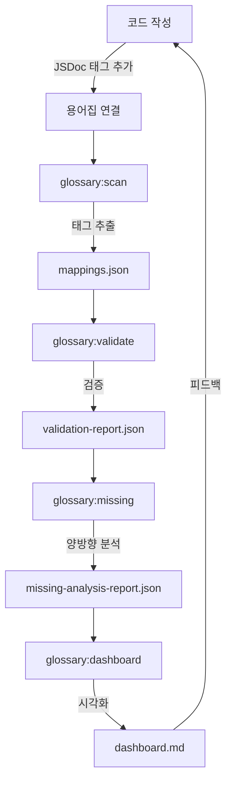

# 용어집 시스템 가이드

이 문서는 용어집 시스템의 사용법, JSDoc 태그 작성법, 그리고 관련 도구 사용법을 안내합니다.

> **핵심 목적**: 코드와 문서의 일관성을 유지하고, 용어의 실제 구현 상태를 자동으로 추적하여 
> 프로젝트의 개념적 무결성을 보장합니다.

## 🚀 빠른 시작: 시스템 사용법

### 1. 시스템 확인
용어집 관련 패키지가 빌드되었는지 확인합니다.
```bash
# 패키지 빌드
# 이 단계는 TypeScript로 작성된 용어집 도구들을 실행 가능한 JavaScript로 변환합니다
pnpm --filter @context-action/glossary build
```

### 2. 전체 분석 및 업데이트 (권장)
가장 간단한 방법은 모든 도구를 순차적으로 실행하는 통합 명령어를 사용하는 것입니다.
```bash
# 모든 도구를 순서대로 실행
# 이 명령어는 코드베이스 전체를 분석하여 용어집과의 일치성을 검증합니다
pnpm glossary:update

# 실행 순서:
# 1. glossary:scan - 코드 스캔 (JSDoc 태그에서 @implements, @memberof 추출)
# 2. glossary:validate - 매핑 검증 (추출된 태그가 실제 용어집에 존재하는지 확인)
# 3. glossary:missing - 미구현 분석 (용어집에는 있지만 코드에 없는 항목 탐지)
# 4. glossary:dashboard - 대시보드 생성 (전체 구현 현황을 시각적으로 표현)
```

### 3. 개별 명령어 실행 (필요시)
특정 작업만 수행하고 싶을 때 사용합니다.
```bash
# 코드 스캔
# 모든 소스 파일에서 JSDoc 태그를 추출하여 mappings.json 생성
# 정규식 패턴: /@(implements|memberof)\s+([^\s*]+)/
pnpm glossary:scan

# 매핑 검증
# mappings.json의 각 태그가 용어집에 실제로 존재하는지 검증
# 오탈자나 잘못된 참조를 찾아냅니다
pnpm glossary:validate

# 미구현 항목 양방향 분석
# 1) 코드에서 참조하지만 용어집에 없는 용어 (미정의 용어)
# 2) 용어집에는 있지만 코드에서 구현하지 않은 용어 (미구현 용어)
pnpm glossary:missing

# 전체 구현 현황 대시보드 생성
# 카테고리별 구현률, 미구현 목록, 검증 오류 등을 
# 읽기 쉬운 마크다운 형식으로 생성
pnpm glossary:dashboard
```

### 4. 결과 확인
분석이 끝나면 생성된 결과 파일들을 확인할 수 있습니다.
```bash
# 매핑 결과
# 코드에서 추출된 모든 JSDoc 태그와 해당 위치 정보
# 형식: { implements: [...], memberof: [...] }
cat docs/implementations/_data/mappings.json

# 검증 리포트
# 유효하지 않은 태그, 오류, 경고 등의 상세 정보
# 형식: { errors: [...], warnings: [...], summary: {...} }
cat docs/implementations/_data/validation-report.json

# 마크다운 대시보드
# 인간이 읽기 쉬운 구현 현황 요약
# 카테고리별 진행률, 미구현 목록, TODO 항목 등 포함
cat docs/implementations/dashboard.md
```

---

## 🏷️ JSDoc 태그 작성법

용어집과 코드를 연결하기 위해 표준 JSDoc 태그를 사용합니다.

> **핵심 원리**: JSDoc 주석은 코드의 "의도"를 선언하고, 용어집 시스템은 이 의도가 
> 실제로 구현되었는지 자동으로 검증합니다.

### 기본 태그 구조
```typescript
/**
 * 함수 또는 컴포넌트에 대한 설명
 * 
 * @implements action-handler
 * @memberof core-concepts
 * @since 1.0.0
 * @example
 * ```typescript
 * const result = useMyHook();
 * ```
 */
export function useMyHook() { ... }
```

### 필수 태그

#### `@implements` (필수)
구현하는 용어집의 용어를 명시합니다. 용어 이름은 kebab-case로 작성합니다.
```typescript
// 단일 용어 구현
// 이 코드가 'action-handler' 용어의 실제 구현체임을 선언
/** @implements action-handler */

// 여러 용어 동시 구현
// 하나의 코드가 여러 개념을 구현할 때 사용
/** @implements action-handler, pipeline-controller */
```

#### `@memberof` (필수)  
해당 용어가 속한 용어집 카테고리를 명시합니다.
```typescript
// 이 용어가 'core-concepts' 카테고리에 속함을 명시
// 시스템은 이를 통해 용어를 올바른 카테고리에서 찾습니다
/** @memberof core-concepts */
```

### 📚 용어집 카테고리

| 카테고리 | 설명 | 예시 용어 |
|---|---|---|
| `core-concepts` | 프레임워크의 핵심 개념 및 시스템 | action-pipeline-system, store-integration-pattern |
| `architecture-terms` | 아키텍처 패턴 및 설계 원칙 | mvvm-pattern, unidirectional-data-flow |
| `api-terms` | API 및 구체적인 구현과 관련된 용어 | action-handler, store-hooks |
| `naming-conventions` | 코딩 및 네이밍 규칙 | kebab-case, camelCase |

---

## 🎨 적용 예시

### React 훅
```typescript
/**
 * 액션 스로틀링 훅
 * 지정된 간격으로만 액션 실행을 허용하여 고빈도 호출을 제어합니다.
 * 
 * @implements action-handler
 * @memberof core-concepts
 * @since 1.0.0
 * @example
 * ```typescript
 * const throttle = useActionThrottle({ interval: 500 });
 * ```
 */
export function useActionThrottle() { ... }
```

### 클래스
```typescript
/**
 * 액션 등록 및 디스패치를 관리하는 중앙 클래스
 * @implements actionregister
 * @memberof api-terms
 */
export class ActionRegister { ... }
```

### 타입/인터페이스
```typescript
/**
 * 액션과 페이로드 타입을 정의하는 매핑 인터페이스
 * @implements action-payload-map
 * @memberof api-terms
 */
export interface ActionPayloadMap { ... }
```

---

## 📊 결과 파일들

시스템 실행 후 생성되는 주요 파일들은 다음과 같습니다.

```
docs/implementations/
├── dashboard.md              # (Markdown) 구현 현황 대시보드
                             # 전체 프로젝트의 용어 구현 상태를 한눈에 볼 수 있는 리포트

docs/implementations/_data/
├── mappings.json              # (JSON) 스캔된 모든 태그와 코드 위치 정보
│                             # 구조: { implements: [{term, file, line}], memberof: [...] }
│
├── validation-report.json     # (JSON) 검증 결과 리포트 (오류, 경고 등)
│                             # 잘못된 태그 참조, 카테고리 불일치 등을 포함
│
├── missing-analysis-report.json  # (JSON) 미구현/미정의 용어 분석 결과
│                                # 양방향 분석: 코드↔용어집 간 누락 항목
│
└── dashboard.json            # (JSON) 대시보드 생성에 사용되는 데이터
                             # 카테고리별 통계, 구현률 등 계산된 메트릭스
```

## 🔄 작업 흐름 (Workflow)



## 💡 Best Practices

1. **일관성 유지**: 용어는 항상 kebab-case로, 카테고리는 정확히 4개 중 하나를 사용
2. **즉시 태그 추가**: 새 코드 작성 시 바로 JSDoc 태그를 추가하여 추후 누락 방지
3. **정기적 검증**: CI/CD 파이프라인에 `glossary:validate`를 추가하여 자동 검증
4. **팀 공유**: dashboard.md를 정기적으로 팀과 공유하여 구현 현황 동기화
